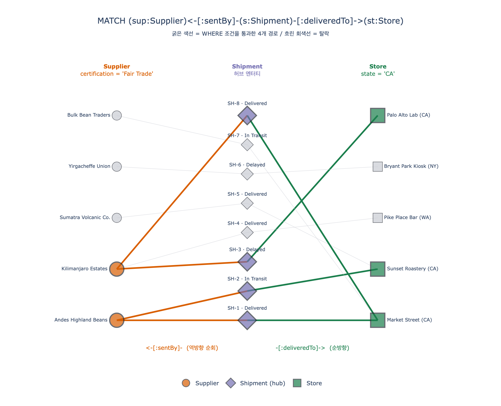

# Fair Trade 공급업체 → 캘리포니아 매장 배송 GQL 질의

## 정답 질의

```gql
MATCH (sup:Supplier)<-[:sentBy]-(s:Shipment)-[:deliveredTo]->(st:Store)
WHERE sup.certification = 'Fair Trade' AND st.state = 'CA'
RETURN sup.name, st.name, s.status
```

한 문장으로 읽으면: **"Fair Trade 인증을 받은 공급업체가 보낸 배송 중, 캘리포니아(CA)에 있는 매장으로 도착한 건을 찾아 공급업체명·매장명·배송상태를 보여줘."**

---

## 1. 질의를 절(clause) 단위로 분해

GQL(ISO/IEC 39075 Graph Query Language)은 Cypher 계열 문법을 표준화한 것으로, 그래프 질의는 보통 세 개의 절로 구성된다.

| 절 | 내용 | 역할 |
|---|---|---|
| `MATCH` | `(sup:Supplier)<-[:sentBy]-(s:Shipment)-[:deliveredTo]->(st:Store)` | **패턴 매칭** — 그래프에서 찾을 "모양"을 그린다 |
| `WHERE` | `sup.certification = 'Fair Trade' AND st.state = 'CA'` | **술어 필터** — 매칭된 후보 중 조건을 만족하는 것만 남긴다 |
| `RETURN` | `sup.name, st.name, s.status` | **투영(projection)** — 결과 테이블의 컬럼을 정한다 |

### 1-1. MATCH — 패턴

```
(sup:Supplier) <-[:sentBy]- (s:Shipment) -[:deliveredTo]-> (st:Store)
   노드 변수+라벨      관계 타입        노드 변수+라벨      관계 타입      노드 변수+라벨
```

문법 요소를 하나씩 보면:

- `( ... )` — 둥근 괄호는 **노드(node)**. `sup`, `s`, `st`는 이후 `WHERE`/`RETURN`에서 참조할 **변수명**이고, `:Supplier`처럼 콜론 뒤가 **라벨(엔터티 타입)**이다.
- `-[ ... ]-` — 대괄호는 **관계(relationship/edge)**. `:sentBy`는 관계 타입 이름이다. 관계에 변수를 붙일 필요가 없으면(여기서는 관계 속성을 쓰지 않으므로) `[:sentBy]`처럼 타입만 적는다.
- `<-` / `->` — 화살표는 **관계의 방향**. 이 질의의 핵심 포인트다(아래 3장).

패턴 하나가 매칭될 때마다 `(sup, s, st)` 세 값이 한 세트로 바인딩된다. 즉 결과의 한 행 = 그래프에서 찾아낸 하나의 경로.

### 1-2. WHERE — 두 개의 술어

```gql
WHERE sup.certification = 'Fair Trade'   -- 공급업체 쪽 필터
  AND st.state = 'CA'                    -- 매장 쪽 필터
```

- `sup.certification`은 Supplier의 **enum 속성**이다. 온톨로지에서 허용값은 `Fair Trade`, `Rainforest Alliance`, `Organic`, `Direct Trade`, `None` 다섯 가지. enum이므로 오타·표기 흔들림(`fair trade`, `FairTrade`) 없이 정확히 `'Fair Trade'`로 비교할 수 있다는 것이 enum 모델링의 실익이다.
- `st.state`는 Store의 문자열 속성이다. 온톨로지는 `city`/`state`만 두고 전체 주소 계층을 만들지 않았으므로, "캘리포니아"는 `st.state = 'CA'`로 표현된다.
- 두 술어는 **서로 다른 노드**에 걸린다. 하나는 경로의 왼쪽 끝(Supplier), 하나는 오른쪽 끝(Store)이다. 그래서 이 질의는 "양쪽 끝을 고정하고 가운데 연결이 존재하는지 확인"하는 형태다.

### 1-3. RETURN — 투영

`RETURN sup.name, st.name, s.status` → 결과는 3열 테이블.

| sup.name | st.name | s.status |
|---|---|---|
| (Fair Trade 공급업체명) | (CA 매장명) | (배송 상태: In Transit / Delivered / Delayed) |

노드 전체(`RETURN sup`)가 아니라 **속성만** 뽑았기 때문에 결과가 관계형 테이블처럼 떨어진다. BI 도구나 Data Agent에 그대로 넘길 때 유리하다.

> 주의: `RETURN`에 `s.status`가 들어 있으므로 배송 건마다 한 행이 나온다. 같은 (공급업체, 매장) 쌍에 배송이 3건 있으면 3행이 된다. 쌍 단위로 중복을 없애고 싶으면 `RETURN DISTINCT sup.name, st.name`.

---

## 2. 패턴에 등장하는 엔터티와 관계 (Fourth Coffee 온톨로지)

Fourth Coffee 온톨로지는 **엔터티 6개, 관계 7개**로 구성된다. 이 질의는 그중 3개 엔터티, 2개 관계만 사용한다.

### Supplier (공급업체)

| 속성 | 타입 | 식별자 |
|---|---|---|
| `supplierId` | string | ✓ |
| `name` | string | |
| `country` | string | |
| `certification` | enum (Fair Trade, Rainforest Alliance, Organic, Direct Trade, None) | |
| `rating` | decimal (1–5) | |

원두와 물품을 공급하는 주체. `certification`이 지속가능성 자격을 담고, `rating`은 품질 점수.

### Shipment (배송)

| 속성 | 타입 | 식별자 |
|---|---|---|
| `shipmentId` | string | ✓ |
| `dispatchDate` | date | |
| `arrivalDate` | date | |
| `status` | enum (In Transit, Delivered, Delayed) | |
| `weight` | decimal (kg) | |

공급업체에서 매장으로 물건을 옮기는 물류 단위. 이 온톨로지의 **허브 엔터티**.

### Store (매장)

| 속성 | 타입 | 식별자 |
|---|---|---|
| `storeId` | string | ✓ |
| `name` | string | |
| `city` | string | |
| `state` | string | |
| `openDate` | date | |
| `capacity` | integer | |

### 관계

| 관계 | 방향(선언) | 카디널리티 | 의미 |
|---|---|---|---|
| `sentBy` | `Shipment` → `Supplier` | many-to-one | 각 배송은 한 공급업체에서 출발 |
| `deliveredTo` | `Shipment` → `Store` | many-to-one | 각 배송은 한 매장에 도착 |
| `carries` | `Shipment` → `Product` | many-to-many | 한 배송이 여러 제품을 실음 |
| `sourcedFrom` | `Product` → `Supplier` | many-to-one | 제품 원두의 출처 공급업체 |
| `places` | `Customer` → `Order` | one-to-many | |
| `contains` | `Order` → `Product` | many-to-many | |
| `processedAt` | `Order` → `Store` | many-to-one | |

---

## 3. 왜 첫 번째 화살표가 뒤집혀 있나 (`<-[:sentBy]-`)

가장 자주 틀리는 지점이다. 핵심은 **온톨로지에 선언된 관계 방향은 하나뿐이고, 질의는 그 방향을 존중해야 한다**는 것.

`sentBy`는 온톨로지에서 이렇게 선언되어 있다.

```
Shipment --[:sentBy]--> Supplier      "이 배송은 저 공급업체가 보냈다"
```

즉 화살표의 **꼬리(source)가 Shipment, 머리(target)가 Supplier**다. 관계 이름 자체가 그 방향을 말해준다 — "sent **by**"는 배송을 주어로 읽는 수동형이다("shipment was sent by supplier").

그런데 이 질의는 패턴을 **Supplier에서 시작해서** 적는다. 문장 순서를 사람이 읽기 좋은 "공급업체 → 배송 → 매장"으로 두고 싶어서다. Supplier를 왼쪽에 두면 Supplier 입장에서 Shipment를 향해 가는 것이 되고, 이것은 선언된 방향을 **거슬러 올라가는(traverse against)** 이동이다. 그래서 화살표를 뒤집어 `<-`로 적는다.

```gql
-- (A) 선언 방향대로: Shipment 부터 시작
MATCH (s:Shipment)-[:sentBy]->(sup:Supplier)

-- (B) 뒤집어서: Supplier 부터 시작   ← 정답 질의가 쓰는 형태
MATCH (sup:Supplier)<-[:sentBy]-(s:Shipment)
```

(A)와 (B)는 **완전히 동일한 관계 집합**을 가리킨다. 화살표를 뒤집는 것은 데이터를 바꾸는 게 아니라, 같은 엣지를 어느 쪽 끝에서 바라보며 쓰는지의 표기 차이다.

반면 두 번째 화살표는 뒤집히지 않는다.

```
Shipment --[:deliveredTo]--> Store    "이 배송은 저 매장으로 배달됐다"
```

패턴에서도 Shipment가 왼쪽, Store가 오른쪽이므로 선언 방향과 일치 → `-[:deliveredTo]->` 그대로.

정리하면 화살표 방향은 이렇게 결정된다.

| 패턴에서 왼쪽 노드 | 관계 선언 | 패턴 표기 |
|---|---|---|
| Supplier | Shipment → Supplier | `<-[:sentBy]-` (역방향) |
| Shipment | Shipment → Store | `-[:deliveredTo]->` (순방향) |

> **틀린 예**: `MATCH (sup:Supplier)-[:sentBy]->(s:Shipment)` — Supplier에서 Shipment로 나가는 `sentBy` 엣지는 온톨로지에 존재하지 않으므로 결과가 **0행**이다. 문법 오류가 아니라 조용히 빈 결과가 나오기 때문에 디버깅이 까다롭다.
>
> **참고**: 방향을 아예 지정하지 않는 `-[:sentBy]-` (양방향/무방향) 표기도 문법적으로는 가능하지만, 의미가 흐려지고 최적화에도 불리해 실무에서는 방향을 명시하는 편이 좋다.

---

## 4. 왜 Shipment가 가운데에 오나 (허브 엔터티)

Supplier와 Store 사이에는 **직접 연결된 관계가 없다**. 온톨로지 7개 관계 중 Supplier와 Store를 잇는 엣지는 존재하지 않는다.

```
Supplier   ✗ (직접 엣지 없음) ✗   Store
```

두 엔터티를 잇는 유일한 길이 Shipment를 경유하는 2-hop 경로다.

```
Supplier <--sentBy-- Shipment --deliveredTo--> Store
```

이것이 **허브 엔터티(hub entity)** 패턴이다. Shipment는 세 방향으로 관계를 갖는다.

```
                Supplier
                   ▲
                   │ sentBy
                   │
   Product ◄─────Shipment─────► Store
          carries          deliveredTo
```

- `sentBy` → Supplier (소싱 도메인)
- `deliveredTo` → Store (리테일 도메인)
- `carries` → Product (제품 도메인)

허브 엔터티가 강력한 이유는 **서로 단절된 도메인을 이어주기** 때문이다. Shipment 없이는 "어느 공급업체가 어느 매장에 물건을 보내는가"라는 질문 자체가 그래프에서 표현되지 않는다.

또 하나: Shipment가 가운데 있기 때문에 **경로 자체가 데이터를 갖는다**. `s.status`, `s.weight`, `s.arrivalDate`처럼 "관계에 대한 사실"을 노드 속성으로 조회할 수 있다. 만약 Supplier와 Store를 단순 엣지로 직접 연결했다면 배송 상태나 무게를 어디에 둘지 곤란해진다. 이렇게 관계를 노드로 승격시켜 속성을 붙이는 것을 **reification(관계의 실체화)** 이라 부른다. `RETURN`에 `s.status`가 들어갈 수 있는 것이 바로 이 설계의 배당금이다.

---

## 5. 질의는 선언적이다 — 실행 순서는 엔진이 정한다

`MATCH ... WHERE ...`는 "이런 모양의 경로를 찾아라"라는 **선언**이지, 실행 절차가 아니다. 실제 엔진은 통계(카디널리티, 인덱스)를 보고 다음 중 유리한 쪽을 고른다.

- **Supplier부터**: Fair Trade 공급업체를 먼저 찾고 → 그들의 배송을 따라가고 → 매장 state를 확인
- **Store부터**: CA 매장을 먼저 찾고 → 그 매장에 도착한 배송을 거슬러 올라가고 → 공급업체 인증을 확인
- **Shipment부터**: 모든 배송을 순회하며 양쪽 끝을 확인

세 방식의 **결과 집합은 동일**하다. 만약 CA 매장이 2개뿐이고 Fair Trade 공급업체가 500개라면 Store부터 시작하는 편이 훨씬 적은 노드를 훑는다. 질의 작성자는 이 순서를 고민할 필요가 없다 — 이것이 SQL의 옵티마이저와 같은 선언형 언어의 장점이다. `expy.py`에서 이 세 순서를 직접 구현해 결과가 같은지 확인한다.

---

## 6. 써볼 수 있어야 하는 변형들

### (a) 지연된 배송만 — Shipment 속성 필터 추가

```gql
MATCH (sup:Supplier)<-[:sentBy]-(s:Shipment)-[:deliveredTo]->(st:Store)
WHERE sup.certification = 'Fair Trade' AND st.state = 'CA' AND s.status = 'Delayed'
RETURN sup.name, st.name, s.dispatchDate, s.arrivalDate
```
경로 가운데 노드에도 술어를 걸 수 있다. "CA 매장에 지연 배송을 보낸 Fair Trade 공급업체"

### (b) 인라인 속성 표기 — WHERE 없이 패턴 안에서 필터

```gql
MATCH (sup:Supplier {certification: 'Fair Trade'})<-[:sentBy]-(s:Shipment)-[:deliveredTo]->(st:Store {state: 'CA'})
RETURN sup.name, st.name, s.status
```
등호 비교만 쓸 때는 노드 괄호 안에 `{key: value}`로 넣어도 동일하다. 범위 비교(`>`, `<`)나 `OR`는 `WHERE`가 필요하다.

### (c) Product를 `carries`로 붙이기 — 3-hop 확장

```gql
MATCH (sup:Supplier)<-[:sentBy]-(s:Shipment)-[:deliveredTo]->(st:Store),
      (s)-[:carries]->(p:Product)
WHERE sup.certification = 'Fair Trade' AND st.state = 'CA' AND p.isOrganic = true
RETURN sup.name, st.name, p.name, p.category
```
콤마로 패턴을 이어 붙이면 이미 바인딩된 변수 `s`를 재사용해 분기(branch)를 만들 수 있다. `carries`가 many-to-many이므로 배송 1건이 제품 3개를 실으면 3행으로 늘어난다(fan-out).

### (d) 매장 규모순 정렬 — 원문 표의 "certified suppliers ship to our largest stores"

```gql
MATCH (sup:Supplier)<-[:sentBy]-(s:Shipment)-[:deliveredTo]->(st:Store)
WHERE sup.certification <> 'None'
RETURN sup.name, st.name, st.capacity, sup.rating
ORDER BY st.capacity DESC
LIMIT 10
```
`ORDER BY` + `LIMIT`으로 상위 N을 뽑는다. `<> 'None'`은 "인증이 있는 모든 공급업체".

### (e) 집계 — 공급업체별 CA 배송 건수

```gql
MATCH (sup:Supplier)<-[:sentBy]-(s:Shipment)-[:deliveredTo]->(st:Store)
WHERE st.state = 'CA'
RETURN sup.name, sup.certification, count(s) AS shipments, sum(s.weight) AS totalKg
ORDER BY shipments DESC
```
`RETURN`에 집계 함수를 쓰면 비집계 컬럼(`sup.name`, `sup.certification`)이 자동으로 그룹 키가 된다.

### (f) 다른 경로로 유기농 원두 찾기 — `sourcedFrom` 사용

```gql
MATCH (p:Product)-[:sourcedFrom]->(sup:Supplier)
WHERE p.isOrganic = true AND sup.certification = 'Fair Trade'
RETURN sup.name, sup.country, p.name
```
`carries`(배송이 실은 제품)와 `sourcedFrom`(제품의 원산 공급업체)은 **다른 관계**다. 물류 사실 vs 소싱 사실을 구분해서 써야 한다.

### (g) 여러 주(state)를 대상으로 — 리스트 술어

```gql
MATCH (sup:Supplier)<-[:sentBy]-(s:Shipment)-[:deliveredTo]->(st:Store)
WHERE sup.certification = 'Fair Trade' AND st.state IN ['CA', 'WA']
RETURN st.state, sup.name, count(s) AS shipments
ORDER BY st.state, shipments DESC
```

---

## 7. 암기 체크리스트

1. 노드는 `()`, 관계는 `-[]-`, 라벨/타입은 콜론 뒤에.
2. `sentBy`는 **Shipment → Supplier** 선언 → Supplier에서 시작하면 `<-[:sentBy]-`.
3. `deliveredTo`는 **Shipment → Store** 선언 → Shipment에서 시작하면 `-[:deliveredTo]->`.
4. Supplier–Store 직접 엣지는 없다 → **Shipment가 반드시 가운데** (허브).
5. `WHERE`는 양쪽 끝 노드에 술어를 각각 걸어 경로를 좁힌다.
6. `RETURN`은 노드가 아니라 속성을 투영해 테이블을 만든다.

---

## 시각화


