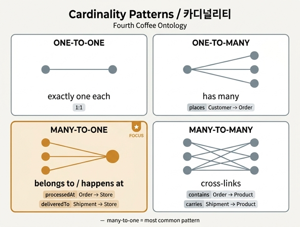

# many-to-one cardinality가 모델링하는 의미 패턴

## 한 줄 요약

many-to-one은 **"~에 속한다(belongs to)"** 또는 **"~에서 일어난다(happens at / located at)"** 라는 자연어 문장을 그래프 구조로 옮긴 것이다. Fourth Coffee 온톨로지의 7개 관계 중 4개가 many-to-one인데, 이는 우연이 아니라 실무 도메인 모델에서 **가장 흔한 cardinality**이기 때문이다.

> **Design note (원문):** This is a many-to-one relationship. Many orders map to one store. This is the most common cardinality pattern for "belongs to" or "happens at" relationships.

## many-to-one이 표현하는 네 가지 의미 패턴

`A → B (many-to-one)`은 "A 여러 개가 B 하나에 붙는다"는 뜻이고, **화살표 방향(A 쪽 관점)**에서 읽으면 항상 아래 네 가지 중 하나로 번역된다.

| 의미 패턴 | 자연어 | Fourth Coffee 예시 |
|---|---|---|
| **소속 (belongs to)** | "A는 B에 속한다" | Order는 한 Customer에 속한다 (역방향 `places`) |
| **발생 장소 (happens at / located at)** | "A는 B에서 일어난다" | Order는 한 Store에서 처리된다 (`processedAt`) |
| **출처 / 기원 (origin, sourced from)** | "A는 B에서 왔다" | Product는 한 Supplier에서 조달된다 (`sourcedFrom`), Shipment는 한 Supplier가 보냈다 (`sentBy`) |
| **도착지 (destination, delivered to)** | "A는 B로 간다" | Shipment는 한 Store로 배송된다 (`deliveredTo`) |

공통점은 **"A 하나에 대해 B는 반드시 정확히 하나"** 라는 점이다. 소속처가 둘일 수 없고, 발생 장소가 둘일 수 없고, 출처나 도착지가 둘일 수 없다. 이 "정확히 하나"가 many-to-one의 본질이다.

## 이 온톨로지의 모든 many-to-one 관계

Fourth Coffee 온톨로지(6 entity / 7 relationship)에서 many-to-one은 다음 4개다.

| 관계 | 방향 | 인코딩된 자연어 문장 | 의미 패턴 |
|---|---|---|---|
| `processedAt` | Order → Store | "각 주문은 **정확히 한 매장에서** 처리된다. 한 매장은 하루에 많은 주문을 처리한다." | happens at (발생 장소) |
| `sourcedFrom` | Product → Supplier | "각 제품의 원두는 **한 공급업체에서** 온다." | origin (출처) |
| `sentBy` | Shipment → Supplier | "각 배송은 **한 공급업체에서** 출발한다." | origin (기원) |
| `deliveredTo` | Shipment → Store | "각 배송은 **한 매장에** 도착한다." | destination (도착지) |

나머지 3개 관계와 대비하면 패턴이 선명해진다.

| 관계 | 방향 | cardinality | 왜 many-to-one이 아닌가 |
|---|---|---|---|
| `places` | Customer → Order | one-to-many | Customer 관점에서 시작하므로 "하나 → 여러 개". 같은 간선을 Order 쪽에서 읽으면 many-to-one이 된다 |
| `contains` | Order → Product | many-to-many | 주문 하나에 여러 제품, 제품 하나가 여러 주문에 등장 — 양방향 다중성 |
| `carries` | Shipment → Product | many-to-many | 배송 하나가 여러 제품, 제품 하나가 여러 배송에 실림 |

## one-to-many와의 거울상 관계: 같은 간선, 반대 독법

many-to-one과 one-to-many는 **서로 다른 관계가 아니다.** 동일한 하나의 간선을 어느 쪽 끝에서 읽느냐의 차이일 뿐이다.

```
Customer  ──────── places (one-to-many) ────────▶  Order
Customer  ◀─────── (같은 간선, 반대 독법) ───────  Order
                    "Order belongs to Customer" = many-to-one
```

- **one-to-many로 읽기** (Customer 관점): "한 고객이 여러 주문을 낸다" → 소유·포함의 시선
- **many-to-one으로 읽기** (Order 관점): "각 주문은 한 고객에 속한다" → 소속의 시선

`processedAt`도 마찬가지다. Order → Store는 many-to-one이지만, Store → Order 방향으로 이름을 붙이면(`processes`) 그대로 one-to-many가 된다. 원문 퀴즈 답이 **"From Order's perspective, this is many-to-one"** 이라고 관점을 명시한 이유가 여기 있다.

따라서 실무에서 카드 이름을 정할 때는 **관계 이름의 주체(source entity)** 를 먼저 정하고, 그 관점에서 cardinality를 읽어야 한다. `processedAt`은 주문이 주체이므로 many-to-one, `places`는 고객이 주체이므로 one-to-many다.

## many-to-one vs many-to-many: "몇 개?" 를 양방향으로 물어라

헷갈릴 때는 기계적으로 **양쪽 방향에서 각각 "하나에 대해 상대는 몇 개?"** 를 묻는다. 답이 한쪽만 "여러 개"면 many-to-one, 양쪽 다 "여러 개"면 many-to-many다.

| 관계 | A 하나 → B 몇 개? | B 하나 → A 몇 개? | 결론 |
|---|---|---|---|
| `processedAt` (Order/Store) | 주문 1개 → 매장 **1개** | 매장 1개 → 주문 **여러 개** | **many-to-one** |
| `sourcedFrom` (Product/Supplier) | 제품 1개 → 공급업체 **1개** | 공급업체 1개 → 제품 **여러 개** | **many-to-one** |
| `contains` (Order/Product) | 주문 1개 → 제품 **여러 개** (라떼, 머핀, 원두) | 제품 1개 → 주문 **여러 개** | **many-to-many** |
| `carries` (Shipment/Product) | 배송 1개 → 제품 **여러 개** | 제품 1개 → 배송 **여러 개** | **many-to-many** |

체크리스트:

1. "정확히 하나(exactly one)"라는 말이 자연스럽게 나오는 방향이 있는가? → 있으면 그쪽이 "one" 끝이다.
2. 양쪽 모두 "여러 개"라면 many-to-many이고, 보통 **연결 자체에 속성이 필요**해진다(수량, 단가 등). 이때 hub entity로 승격하는 것을 고려한다 — Shipment가 Supplier·Store·Product를 잇는 hub entity가 된 것이 그 예다.
3. 도메인 규칙이 바뀌면 cardinality도 바뀐다. "한 제품을 여러 공급업체에서 조달한다"는 정책이 생기면 `sourcedFrom`은 many-to-many가 되어야 한다. cardinality는 수학이 아니라 **비즈니스 규칙의 선언**이다.

## 실무적 파급 효과

### 1. many 쪽에 단일 FK 하나만 있으면 된다

"one" 끝이 정확히 하나이므로, 물리 구현에서는 **many 쪽 테이블에 외래키 컬럼 하나**만 추가하면 끝난다. 조인 테이블이 필요 없다.

```
Order 테이블:  orderId | timestamp | total | status | paymentMethod | storeId ◀── FK 하나
Product 테이블: productId | name | ... | supplierId ◀── FK 하나
Shipment 테이블: shipmentId | ... | supplierId | storeId ◀── FK 두 개 (sentBy, deliveredTo)
```

반면 many-to-many(`contains`, `carries`)는 **별도 연결 테이블**(order_product, shipment_product)이 필요하다. 즉 many-to-one을 정확히 식별하는 것은 곧 "조인 테이블을 만들지 않아도 되는지"를 판정하는 일이다.

### 2. 집계가 "one" 쪽으로 자연스럽게 롤업된다

many-to-one은 **집계 축(aggregation axis)** 을 공짜로 제공한다. many 쪽 행들이 one 쪽 인스턴스별로 중복 없이 깔끔하게 그룹핑되기 때문이다.

- `processedAt` → **매장별 주문 합계 / 평균 주문 금액 / 도시별 매출**
  원문이 Store를 추가하자마자 "Which store has the most orders?", "What's the average order value per city?" 같은 질문이 열린다고 한 것이 바로 이 효과다.
- `sourcedFrom` → 공급업체별 제품 수, 공급업체별 유기농 비율
- `deliveredTo` → 매장별 수령 배송 건수, 지연 배송 건수

중요한 점: many-to-many를 축으로 집계하면 **한 행이 여러 그룹에 중복 계산**되어 합계가 부풀려진다(같은 제품이 여러 주문에 속하므로). many-to-one에서는 각 many 인스턴스가 one 인스턴스 하나에만 귀속되므로 **합계가 전체와 일치**한다. 그래서 대시보드의 "…별 합계" 지표는 거의 항상 many-to-one 간선을 타고 만들어진다.

### 3. 그래프 순회가 결정적(deterministic)이 된다

many-to-one 방향으로 이동하면 결과가 항상 노드 하나이므로 경로가 갈라지지 않는다. 원문 GQL 예시에서 `(sup:Supplier)<-[:sentBy]-(s:Shipment)-[:deliveredTo]->(st:Store)`가 배송 한 건당 공급업체 하나·매장 하나로 정확히 확정되는 이유다. 반대로 one-to-many/many-to-many 방향으로 가면 결과가 팬아웃된다.

## 암기 포인트

- many-to-one = **"belongs to" / "happens at(located at)"** 패턴. 여기에 출처(origin)와 도착지(destination)까지 같은 계열.
- **"이 관계에서 가장 흔한 cardinality"** — 실무 온톨로지 관계 대부분이 여기 해당.
- 판별법: 양방향으로 "몇 개?" 묻기 → 한쪽만 "여러 개"면 many-to-one.
- one-to-many와는 **같은 간선의 반대 독법**. 관계 이름의 주체가 어느 쪽인지가 명칭을 결정.
- 결과: many 쪽 **FK 한 개**, one 쪽으로 **집계 롤업**(예: 매장별 주문 합계).

## 인포그래픽


