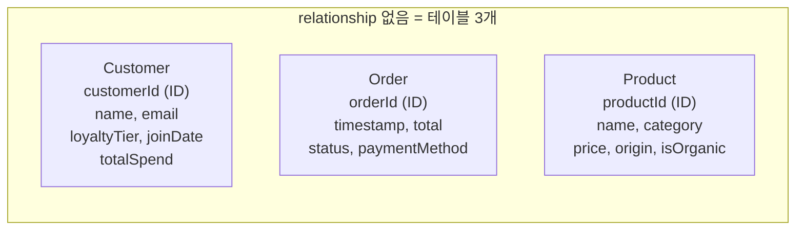
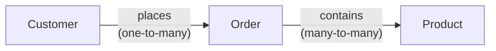
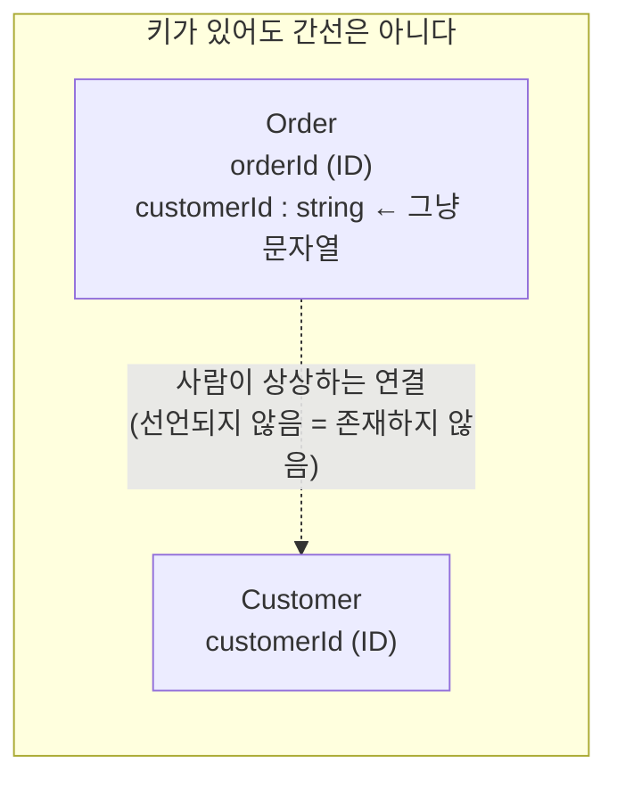
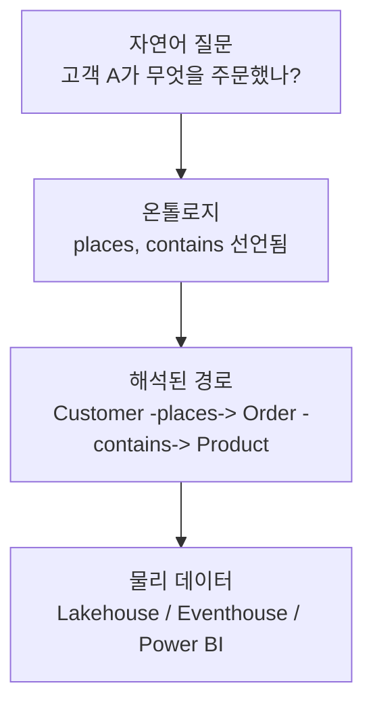
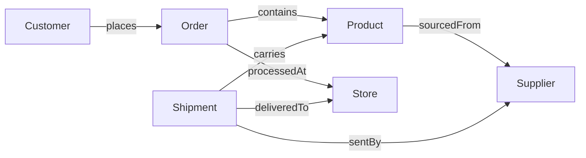

# 엔티티만 있고 relationship이 없으면?

> **Q.** 엔티티만 있고 relationship이 없으면 어떤 상태인가?
>
> **A.** 서로 고립된 테이블 집합에 불과하다. relationship이 추가될 때 비로소 그래프가 되어 순회 질의가 가능해진다.

원문의 한 문장이 이 카드의 핵심이다.

> *"Entities alone are just isolated tables. **Relationships** turn them into a graph."*

---

## 1. 두 상태를 나란히 보기 (Fourth Coffee)

Step 1에서 정의한 세 엔티티는 `Customer`, `Order`, `Product`다. 프로퍼티와 식별자까지 완벽하게 정의해도, relationship을 선언하지 않으면 이렇게 생겼다.

### (A) relationship 없음 — 고립된 테이블 3개



간선이 하나도 없다. 세 개의 섬(island)이고, 그림에서 서로를 잇는 선이 없다는 사실이 곧 질의 능력의 한계선이다.

### (B) relationship 2개 추가 — 그래프



동일한 엔티티, 동일한 프로퍼티다. 달라진 것은 **모델에 선언된 간선 2개**뿐인데, 이제 `Customer → Order → Product`라는 길이 2의 경로가 존재한다. 이 순간부터 "순회(traversal)"라는 행위가 성립한다.

---

## 2. relationship 없이도 되는 질문 / 안 되는 질문

카드의 요지를 가장 선명하게 보여주는 것은 "무엇이 여전히 가능한가"를 함께 보는 것이다. relationship이 없어도 **단일 엔티티 내부에서 끝나는 질의**는 전부 동작한다.

### 여전히 가능 (단일 엔티티 집계/필터/정렬)

| 질문 | 이유 |
|---|---|
| 고객 수는 몇 명인가? | `Customer` 한 테이블의 `COUNT` |
| 가장 비싼 제품은? | `Product.price` 정렬 — 한 엔티티 내부 |
| Gold 등급 고객 목록? | `Customer.loyaltyTier` 필터 |
| 유기농 제품은 몇 종인가? | `Product.isOrganic = true` 필터 |
| 취소된 주문의 총액 합계? | `Order.status`, `Order.total` — 둘 다 `Order` 소속 |
| 카테고리별 평균 가격? | `Product` 내부 group-by |

즉 relationship 없는 온톨로지는 "쓸모없다"가 아니라 **정확히 SQL 테이블 몇 개 수준의 능력**을 가진다. 그 이상이 아니라는 것이 문제다.

### 불가능 (경로가 필요한 모든 것)

| 질문 | 필요한 경로 | relationship 없을 때 |
|---|---|---|
| 고객 A가 무엇을 주문했나? | `Customer -places-> Order -contains-> Product` | 경로 없음 → 답할 수 없다 |
| 주문 하나에 담긴 제품 목록? | `Order -contains-> Product` | 간선 없음 |
| Gold 고객이 가장 많이 산 제품? | 길이 2 경로 + 집계 | 조인 경로 부재 |
| 유기농 제품만 산 고객은? | 역방향 순회 | 방향성 있는 간선 부재 |
| 재구매율이 높은 제품군? | 경로 위의 그래프 패턴 | 패턴 매칭 대상 없음 |

불가능해지는 것을 유형으로 정리하면 세 가지다.

1. **조인 경로(join path)가 필요한 질의** — 두 엔티티를 잇는 선언된 길이 없으므로 엔진이 어떤 키로 이어야 할지 알 수 없다.
2. **경로 길이 > 1인 질의** — "고객이 주문한 제품"은 `Customer → Order → Product`로 두 홉이다. 홉 하나조차 없는 모델에서 두 홉은 애초에 불가능하다.
3. **그래프 알고리즘** — 최단 경로, 연결 요소, 중심성(centrality), 커뮤니티 탐지, 추천(공동 구매 기반). 이들은 간선 집합 자체를 입력으로 받는다. 간선이 공집합이면 알고리즘은 "정점 N개, 간선 0개" 즉 N개의 고립 성분만 보고한다.

---

## 3. 함정: 식별자 프로퍼티는 간선이 아니다

가장 흔한 오해가 여기다. Step 1에서 각 엔티티는 식별자 프로퍼티를 갖는다.

- `Customer.customerId` (identifier)
- `Order.orderId` (identifier)
- `Product.productId` (identifier)

여기에 `Order`가 `customerId`라는 값을 프로퍼티로 들고 있다고 상상해 보자. 사람 눈에는 "아, 이게 고객을 가리키는 외래키구나" 하고 읽힌다. **하지만 모델에게는 그저 문자열 프로퍼티다.**



- 식별자는 **엔티티 인스턴스의 유일성**을 보장할 뿐, 다른 엔티티로 향하는 방향성이나 카디널리티를 담지 않는다.
- `places`처럼 **이름·방향·카디널리티(one-to-many)를 갖춘 relationship으로 선언**해야 비로소 순회 가능한 간선(navigable edge)이 된다.
- 원문이 Step 1의 학습 목표에 `identifiers`와 `cardinality`를 나란히 둔 이유가 이것이다. 둘은 서로를 대체하지 못한다.

정리하면: **키는 "누가 누구인지"를 말하고, relationship은 "누가 누구와 어떻게 이어지는지"를 말한다.** 후자가 없으면 그래프가 아니다.

---

## 4. 왜 질의 시점이 아니라 *모델*에 선언해야 하는가

"어차피 질의할 때 조인 조건을 쓰면 되지 않나?"에 대한 답이 온톨로지의 존재 이유다.

원문의 문제 제기를 다시 보자.

> 온톨로지가 없으면 *"Which suppliers provide organic beans to our highest-capacity stores?"* 같은 질문에 답하려면 **어떤 테이블이 어떤 시스템에 있는지, 어떻게 조인되는지, 컬럼 이름이 무슨 뜻인지**를 모두 알아야 한다.

Fourth Coffee의 데이터는 한 곳에 없다. 고객 프로필은 lakehouse, 주문 트랜잭션은 실시간 Eventhouse, 제품 분석은 Power BI 시맨틱 모델에 있다. 질의 시점에 조인을 발명하려면 질문하는 사람이 이 세 시스템의 물리 스키마를 전부 알고 있어야 한다.

relationship을 모델에 선언해 두면 그 지식이 **한 번, 한 곳에** 자리 잡는다.



- **GQL**: 선언된 relationship 이름이 그대로 패턴이 된다. 원문의 예시가 이를 보여준다.

  ```gql
  MATCH (sup:Supplier)<-[:sentBy]-(s:Shipment)-[:deliveredTo]->(st:Store)
  WHERE sup.certification = 'Fair Trade' AND st.state = 'CA'
  RETURN sup.name, st.name, s.status
  ```

  `sentBy`, `deliveredTo`가 모델에 없으면 이 쿼리는 문법조차 성립하지 않는다. 원문의 표현대로 *"GQL queries map directly to ontology structure — no impedance mismatch"*다.

- **자연어 Data Agent**: 에이전트는 테이블 이름을 추측하지 않는다. 온톨로지의 간선을 읽어 "무엇을 주문했나" → `Customer → Order → Product` 경로로 **해석(resolve)** 한다. 질문자는 테이블 이름을 몰라도 된다. 이 능력의 전제가 "경로가 모델에 미리 존재한다"는 것이다.

- **재사용과 일관성**: 질의 시점 조인은 작성자마다 다르게 쓰이고, 틀린 조인이 조용히 틀린 숫자를 낸다. 모델에 선언된 relationship은 카디널리티까지 못 박아 두므로(예: `processedAt`은 many-to-one) 모든 소비자가 같은 의미로 순회한다.

---

## 5. 간선이 늘어날 때마다 질의 능력이 열린다

원문의 3단계는 "그래프는 점증적으로 자란다"는 걸 보여주는 실습이다. 엔티티 수보다 **간선이 무엇을 열어주는지**를 보라.



| 단계 | 누적 엔티티 | 누적 relationship | 새로 열린 질의 |
|---|---|---|---|
| 1 | 3 | 2 (`places`, `contains`) | 누가 무엇을 주문했나 |
| 2 | 4 | 3 (+`processedAt`) | 어디서 주문이 처리됐나, 도시별 평균 주문액 |
| 3 | 6 | 7 (+`sourcedFrom`, `sentBy`, `deliveredTo`, `carries`) | 공급망 전체 순회 |

특히 `Shipment`는 **hub entity**로서 `Supplier`, `Store`, `Product` 세 방향의 간선을 갖는다. 원문이 지적한 대로 hub는 *"otherwise disconnected parts of the graph"*를 잇는다 — 즉 간선의 부재가 곧 단절이라는 사실을 뒤집어 보여주는 패턴이다.

최종 모델에서 `Supplier → Shipment → Store`로 "인증받은 공급자가 어느 대형 매장에 납품하는가"를 답할 수 있는 이유는 엔티티가 6개라서가 아니라 **간선 7개가 선언되어 있어서**다.

---

## 6. 한 줄 요약

- 엔티티만 있는 온톨로지 = **정점만 있고 간선이 없는 그래프** = 고립된 테이블 집합. 단일 엔티티 집계·필터·정렬은 되지만, 조인 경로·다중 홉·그래프 알고리즘은 전부 불가.
- 식별자 프로퍼티는 간선이 아니다. 선언되지 않은 키는 순회 불가능한 값일 뿐.
- relationship은 질의 시점이 아니라 **모델에 선언**해야 한다. 그래야 GQL과 자연어 Data Agent가 테이블 이름 없이도 질문을 경로로 풀어낼 수 있다.
