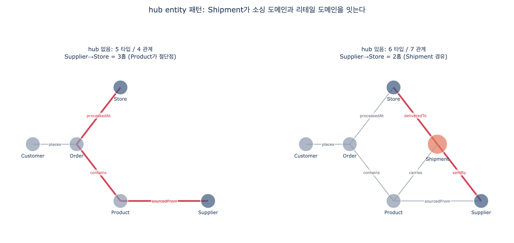

# hub entity pattern이 강력한 이유

> **Q.** hub entity pattern이 강력한 이유는 무엇인가?
>
> **A.** 원래는 서로 연결되지 않던 그래프의 부분들을 이어 주기 때문이다. 그 결과 도메인을 넘나드는 순회 질의가 가능해진다.

---

## 1. Shipment 이전의 Fourth Coffee 그래프는 두 덩어리였다

Fourth Coffee 온톨로지는 3단계로 자란다. Step 3에서 `Supplier`와 `Shipment`를 넣기 직전 상태는 이렇다.

| 관계 | 방향 | 카디널리티 | 소속 도메인 |
|---|---|---|---|
| `places` | Customer → Order | 1:N | 리테일 |
| `contains` | Order → Product | N:M | 리테일 |
| `processedAt` | Order → Store | N:1 | 리테일 |
| `sourcedFrom` | Product → Supplier | N:1 | 소싱 |

여기서 그래프는 사실상 **두 세계**로 갈린다.

- **리테일 쪽**: `Customer – Order – Product – Store`
- **소싱 쪽**: `Product – Supplier`

두 세계가 만나는 지점은 **`Product` 단 하나**다. 그래프 이론 용어로 `Product`는 **절단점(cut vertex, articulation point)** 이다. `Product` 노드를 지우면 `Supplier`가 그래프에서 완전히 떨어져 나간다.

```
Product 제거 (Shipment 없음)
  -> 2개 컴포넌트: [Customer, Order, Store] / [Supplier]
```

이게 "원래는 서로 연결되지 않던 부분"의 정확한 의미다. 형식적으로는 이어져 있지만, **하나의 병목을 통과하는 좁은 통로 하나**밖에 없는 상태다.

### 좁은 통로 하나로 버티면 생기는 두 가지 문제

**(1) 경로가 길다.** `Supplier → Store`를 물으려면 `Supplier ← Product ← Order → Store`, 즉 **3홉**을 걸어야 한다. 그리고 그 중간에 `contains`(N:M)라는 가장 폭발적인 관계가 끼어 있다.

**(2) 더 심각한 건, 그 3홉이 다른 질문에 답한다는 것이다.**

- `Supplier ← Product ← Order → Store` = "그 공급업체의 상품이 **팔린** 매장"
- `Supplier ← Shipment → Store` = "그 공급업체가 **배송한** 매장"

이 둘은 같은 집합이 아니다. 예제 데이터(공급업체 3, 매장 3, 배송 4건)로 실제로 돌려 보면:

| 구분 | 결과 |
|---|---|
| 2홉 직행 (실제 배송 관계) | 4쌍 |
| 3홉 우회 (상품이 팔린 매장) | 5쌍 |
| 우회로가 **잘못 이어 준** 쌍 | `(SUP-3, STR-1)` — 배송한 적 없음 |

우회로는 "Mekong Foods의 머핀이 Pike Place에서 팔렸다"는 사실만 보고 "Mekong Foods가 Pike Place에 배송한다"고 답해 버린다. **hub가 없으면 그 질문은 답할 수 없거나, 틀린 답을 그럴듯하게 내놓는다.**

또 hub 없는 그래프에서 `SUP-1 → STR-1`의 최단거리는 무려 **7홉**이다. 다른 매장과 주문을 헤집고 돌아가는, 의미도 없는 경로다.

---

## 2. Shipment가 들어오면 무엇이 바뀌는가

`Shipment`는 관계 3개를 한꺼번에 들고 온다.

| 관계 | 방향 | 카디널리티 |
|---|---|---|
| `sentBy` | Shipment → Supplier | N:1 |
| `deliveredTo` | Shipment → Store | N:1 |
| `carries` | Shipment → Product | N:M |

이 3개가 동시에 붙는 순간, **이전에는 존재하지 않던 `Supplier ↔ Store` 직통로**가 생긴다.

```
before:  Supplier -sourcedFrom- Product -contains- Order -processedAt- Store   (3홉, 의미 불일치)
after :  Supplier -sentBy-      Shipment          -deliveredTo-        Store   (2홉, 의미 정확)
```

측정 결과:

| 지표 | hub 없음 | hub 있음 |
|---|---|---|
| 엔티티 타입 / 관계 | 5 / 4 | 6 / 7 |
| `Supplier–Store` 최단 홉 | 3 | **2** |
| 2홉 이내 타입쌍 비율 | 8/10 (80%) | 13/15 (87%) |
| 절단점(cut vertex) | `{Order, Product}` | **`{Order}`** |
| `Product` 제거 시 컴포넌트 수 | 2 (분리) | **1 (여전히 연결)** |

핵심은 마지막 두 줄이다. `Shipment`가 들어오면서 `Product`는 **더 이상 절단점이 아니다**. `Supplier – Shipment – Store – Order` 라는 우회로가 생겼기 때문이다. 그래프가 "하나의 다리로 이어진 두 섬"에서 "순환을 가진 하나의 대륙"으로 바뀐다.

---

## 3. 새로 열리는 질의 클래스

hub가 강력하다는 말은 곧 **이전에는 표현조차 못 했던 질문들이 한 문장 순회로 떨어진다**는 뜻이다.

### (1) 지연 배송을 받은 매장

`Shipment.status = 'Delayed'` → `Store`

```gql
MATCH (s:Shipment)-[:deliveredTo]->(st:Store)
WHERE s.status = 'Delayed'
RETURN st.name, s.shipmentId, s.arrivalDate
```

`Delayed`라는 상태는 `Supplier`도 `Store`도 `Product`도 가질 수 없는 속성이다. **배송 사건 자체가 엔티티여야만** 물을 수 있다.

### (2) 인증 공급업체가 공급하는 대형 매장

`Supplier.certification` → `Shipment` → `Store.capacity`

```gql
MATCH (sup:Supplier)<-[:sentBy]-(s:Shipment)-[:deliveredTo]->(st:Store)
WHERE sup.certification = 'Fair Trade' AND st.capacity >= 100
RETURN sup.name, st.name, s.status
```

시나리오 도입부의 질문 — *"Which suppliers provide organic beans to our highest-capacity stores?"* — 이 바로 이것이다. **소싱 도메인의 속성(`certification`)과 리테일 도메인의 속성(`capacity`)을 한 WHERE 절에서 함께 필터링**한다. hub 없이는 두 속성이 같은 경로 위에 놓이지 않는다.

### (3) 배송 중량 기준 매장별 부담

`Shipment.weight`를 `Store`로 집계

```gql
MATCH (s:Shipment)-[:deliveredTo]->(st:Store)
RETURN st.name, sum(s.weight) AS totalKg ORDER BY totalKg DESC
```

예제 결과: `Mission 280kg / Pike Place 120kg / Pearl 45kg`. 물류 인력 배치, 하역장 규모 산정에 바로 쓰이는 숫자다. `weight`는 hub의 자기 속성이므로 hub 없이는 집계할 대상이 아예 없다.

---

## 4. 비용: hub는 fan-out을 키운다

hub가 공짜는 아니다. **연결성을 사는 값이 fan-out이다.**

hub 노드의 차수(degree)는 구조적으로 크다. `Shipment` 하나는 항상 `1(supplier) + 1(store) + k(products)` 개의 엣지를 갖고, 반대로 `Supplier`·`Store` 쪽에서 보면 자기에게 붙는 배송 건수만큼 분기가 늘어난다. 예제에서 `Store` 차수는 `STR-2`가 2 → 4로 두 배가 됐다.

길이 $\le L$ 인 단순 경로 수는 대략 $\prod_i \deg(v_i)$ 로 자라므로, 홉 수를 제한하지 않은 순회는 hub를 지나면서 급격히 비싸진다. 실측:

| 경로 길이 | hub 없음 | hub 있음 | 배율 |
|---|---|---|---|
| ≤ 1 | 18 | 31 | ×1.7 |
| ≤ 2 | 47 | 103 | ×2.2 |
| ≤ 3 | 88 | 258 | ×2.9 |
| ≤ 4 | 139 | 560 | ×4.0 |

노드는 17 → 21개(**+24%**)인데 길이 ≤ 4 경로는 139 → 560개(**약 4배**)로 늘었다. 그래서 hub를 지나는 질의에는 반드시 다음을 걸어야 한다.

- **홉 수 상한** — 무한 깊이 `-[*]->` 순회는 hub에서 터진다
- **관계 타입 명시** — `-[:sentBy]-` 처럼 이름을 박아 hub의 다른 방향으로 새지 않게 한다
- **속성 필터를 먼저** — `status = 'Delayed'`, `state = 'CA'` 로 hub 인스턴스를 먼저 줄인다

---

## 5. hub가 값을 하는 조건: 자기 식별자 + 자기 속성

이게 hub entity pattern의 진짜 판별 기준이다.

`Shipment`는 단순히 세 개를 잇는 링크가 아니다. **자기 식별자와 자기 속성을 가진다.**

| 속성 | 타입 | 역할 |
|---|---|---|
| `shipmentId` | string (identifier) | 배송 건 하나를 고유하게 지칭 |
| `dispatchDate` / `arrivalDate` | date | 리드타임 계산 |
| `status` | enum (In Transit, Delivered, Delayed) | 질의 (1) |
| `weight` | decimal (kg) | 질의 (3) |

**자기 속성이 없으면 hub가 아니라 링크 테이블이다.** 그런 경우 `Shipment`는 `Supplier ↔ Store` 다대다 관계 하나로 그냥 대체 가능하고, 엔티티를 하나 늘려 fan-out 비용만 지불한 셈이 된다. 위의 세 질의는 모두 hub의 **자기 속성**에 의존한다 — 그래서 `Shipment`는 엔티티일 자격이 있다.

정리하면, hub entity가 정당화되는 조건은 이렇다.

1. **3개 이상의 엔티티**에 관계를 갖는다 (`Supplier`, `Store`, `Product`)
2. 그 결과 **이전에 없던 경로**가 생긴다 (`Supplier ↔ Store`)
3. 자기만의 **식별자와 속성**을 가진다 (`shipmentId`, `status`, `weight`)
4. 새로 생긴 경로가 **실제 업무 질문**에 대응한다 (지연 배송, 인증 공급업체, 중량 부담)

Fourth Coffee 온톨로지는 최종적으로 **6 엔티티 / 7 관계**다. 그 7개 중 3개가 hub 하나에 붙어 있다는 사실이, hub가 그래프의 연결 구조를 얼마나 바꾸는지를 그대로 보여 준다.

---

## 6. 함께 기억할 것

- **일반화**: 관계에 속성이 필요해지면(시점, 상태, 수량) 그 관계는 엔티티로 승격되는 게 맞다. 여기서 `Shipment`가 그 예다. 관계형 모델의 연관 테이블(associative entity), 데이터 웨어하우스의 팩트 테이블, Data Vault의 Hub/Link와 같은 발상이다.
- **주의**: hub를 남발하면 모든 순회가 hub를 지나는 별 모양(star) 그래프가 되고, 질의 플래너가 선택할 수 있는 경로가 오히려 줄어든다. hub는 "실제로 도메인을 가로지르는 사건"에만 쓴다.

---

## 시각화



왼쪽이 hub 없는 그래프, 오른쪽이 `Shipment`(주황)를 넣은 그래프다. 붉은 경로가 `Supplier → Store` 최단 순회다. 왼쪽은 `Product`와 `Order`를 억지로 경유하는 3홉, 오른쪽은 hub를 지나는 2홉이다.
