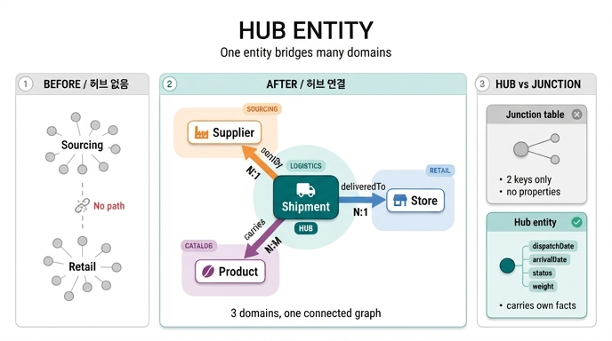

# Hub entity란 무엇인가?

> **정답**: 여러 도메인을 동시에 연결하는 엔티티다. Fourth Coffee에서는 Shipment가 Supplier·Store·Product를 잇는 hub 역할을 한다.

---

## 1. Hub entity의 정의

**Hub entity(허브 엔티티)** 는 그래프 안에서 **세 개 이상의 서로 다른 엔티티 타입과 관계를 맺으면서, 원래는 끊어져 있던 도메인들을 하나로 이어주는 엔티티**다.

원문의 정의는 이렇다.

> **Hub entities** — entities like Shipment that connect multiple domains
>
> **Hub entity pattern:** Shipment connects three different entities (Supplier, Store, Product). Hub entities are powerful because they bridge otherwise disconnected parts of the graph.

핵심 특징 3가지:

| 특징 | 설명 |
|---|---|
| **다중 연결(degree ≥ 3)** | 하나의 엔티티가 여러 엔티티 타입으로 관계를 뻗는다 |
| **도메인 브리지** | 서로 다른 업무 영역(sourcing / logistics / retail)을 잇는다 |
| **자체 속성 보유** | 단순 연결선이 아니라, 자기만의 사실(fact)을 들고 있다 |

허브가 없으면 그래프는 여러 개의 섬(disconnected clusters)으로 쪼개진다. 허브가 생기는 순간 **한 번의 traversal로 도메인을 넘나드는 질문**이 가능해진다.

---

## 2. 왜 Shipment가 hub인가

Fourth Coffee 온톨로지는 6개 엔티티(Customer, Order, Product, Store, Supplier, Shipment)와 7개 관계로 구성된다. 이 중 Shipment는 **세 개의 관계**를 동시에 갖는다.

| 관계 | 방향 | 카디널리티 | 의미 |
|---|---|---|---|
| `sentBy` | `Shipment` → `Supplier` | **many-to-one** | 각 배송은 하나의 공급업체에서 출발한다 |
| `deliveredTo` | `Shipment` → `Store` | **many-to-one** | 각 배송은 하나의 매장에 도착한다 |
| `carries` | `Shipment` → `Product` | **many-to-many** | 한 배송에 여러 제품, 한 제품이 여러 배송에 실릴 수 있다 |

```
                 Supplier (sourcing)
                     ▲
                     │ sentBy  (N:1)
                     │
Product ◀────────  Shipment  ────────▶ Store (retail)
        carries      (HUB)    deliveredTo
        (N:M)      logistics      (N:1)
```

즉 Shipment 하나가 **sourcing(공급) · logistics(물류) · retail(매장)** 세 도메인을 한 지점에서 묶는다.

> Shipment acts as a **hub entity** — it connects Supplier to Store through Product, bridging the sourcing and retail sides of the business.

### 카디널리티 읽는 법

- `sentBy`, `deliveredTo`가 **many-to-one**인 이유: 배송 1건은 출발지도 도착지도 각각 딱 하나다. 대신 한 공급업체/한 매장은 수많은 배송에 등장한다.
- `carries`만 **many-to-many**인 이유: 한 컨테이너에 여러 SKU가 섞여 실리고, 같은 제품이 여러 차례 재입고된다.

허브의 전형적인 형태가 여기서 드러난다 — **"여러 개의 many-to-one 축 + 하나 이상의 many-to-many 축"** 조합.

---

## 3. Hub가 생기면서 비로소 가능해지는 질문

Shipment가 없을 때 Supplier는 `sourcedFrom`(Product → Supplier)으로만 연결돼 있어서, **"어느 공급업체가 어느 매장에 실제로 물건을 보냈는가"** 를 알 방법이 없다. 제품 카탈로그상의 소싱 관계와, 실제 물류 이력은 다른 사실이기 때문이다.

Shipment 허브가 들어오면 다음 경로들이 열린다.

| 질문 | 그래프 경로 |
|---|---|
| 어떤 매장이 지연된 배송을 받았나? | `Shipment (status=Delayed)` → `Store` |
| 인증 받은 공급업체 중 대형 매장에 납품하는 곳은? | `Supplier` → `Shipment` → `Store` (capacity 정렬) |
| 유기농 원두를 공급하는 업체는? | `Product (isOrganic=true)` → `Supplier` |
| 고용량 매장에 유기농 원두를 공급하는 업체는? | `Store` → `Shipment` → `Supplier` + `Product.isOrganic` 필터 |

가장 대표적인 것이 **`Supplier → Shipment → Store`** 2-hop 경로다. GQL로 쓰면 이렇게 온톨로지 구조가 그대로 쿼리가 된다.

```gql
MATCH (sup:Supplier)<-[:sentBy]-(s:Shipment)-[:deliveredTo]->(st:Store)
WHERE sup.certification = 'Fair Trade' AND st.state = 'CA'
RETURN sup.name, st.name, s.status
```

`sentBy`의 화살표가 `<-`로 뒤집혀 있는 데 주목하자. 관계는 `Shipment → Supplier` 방향으로 선언됐지만, 질의는 Supplier에서 출발하므로 **역방향 traversal**로 읽는다. 허브는 이렇게 어느 방향에서 진입해도 다른 도메인으로 빠져나갈 수 있는 **회전 교차로(roundabout)** 처럼 동작한다.

---

## 4. Hub entity ≠ 단순 junction/bridge table

관계형 DB의 **junction table(연결 테이블, bridge table)** 과 헷갈리기 쉽다. 결정적 차이는 **자체 속성의 유무**다.

| | Junction / bridge table | **Hub entity** |
|---|---|---|
| 존재 이유 | many-to-many를 풀기 위한 **기술적 산물** | 업무상 실재하는 **사건·객체** |
| 속성 | 외래키 2개뿐 (`order_id`, `product_id`) | 자기만의 속성을 가짐 |
| 식별자 | 보통 복합키, 독립 ID 없음 | 독립 identifier 보유 |
| 도메인 언어 | 담당자가 부르는 이름이 없음 | "배송 3421번" 처럼 사람이 지칭함 |
| 온톨로지에서 | 관계로 접혀 사라져도 무방 | **1급 엔티티 타입** |

Shipment는 다음 속성들을 스스로 들고 있다.

| Property | Type | Identifier? |
|---|---|---|
| `shipmentId` | string | ✓ |
| `dispatchDate` | date | |
| `arrivalDate` | date | |
| `status` | enum (In Transit, Delivered, Delayed) | |
| `weight` | decimal (kg) | |

`dispatchDate`·`arrivalDate`는 **언제** 일어났는지, `status`는 **지금 어떤 상태**인지, `weight`는 **얼마나** 실렸는지를 말한다. 이건 Supplier의 속성도 Store의 속성도 아니고, **오직 "배송"이라는 사건에만 붙는 사실**이다. 그래서 Shipment는 접어 없앨 수 없다.

판별 기준 한 줄: **"이 연결 자체에 날짜·상태·수량 같은 사실을 붙여야 하는가?"** 그렇다면 junction이 아니라 hub entity로 승격해야 한다. (이 승격을 개념 모델링에서는 관계의 **reification/객체화**, 데이터 웨어하우스에서는 dimension을 잇는 **fact table**이라고 부른다. 성격이 거의 같다.)

참고로 같은 온톨로지의 `contains`(`Order` → `Product`, many-to-many)는 **속성 없는 순수 관계**로 남겨졌다. 만약 여기에 `quantity`나 `unitPrice`를 붙여야 했다면 `OrderLine`이라는 허브성 엔티티가 새로 생겨야 했을 것이다 — 같은 판별 기준의 반대 사례다.

---

## 5. 다른 hub entity 예시

허브는 대체로 **"사건(event)" 또는 "계약/거래(transaction)"** 의 모습을 띤다.

| 도메인 | Hub entity | 잇는 대상 | 자체 속성 예 |
|---|---|---|---|
| 커피 공급망 | **Shipment** | Supplier · Store · Product | dispatchDate, status, weight |
| 소매 주문 | **Order** | Customer · Store · Product | orderDate, total, channel |
| 병원 | **Encounter**(진료) | Patient · Physician · Facility · Diagnosis | admitDate, discharge, severity |
| 항공 | **Flight** | Aircraft · Crew · Origin/Destination Airport | departure, delayMinutes |
| 보험 | **Claim**(청구) | Policyholder · Policy · Provider · Incident | filedDate, amount, status |
| 인사 | **Assignment**(발령) | Employee · Role · Department · Location | startDate, endDate, FTE |
| 제조 | **WorkOrder** | Machine · Operator · Material · Product | startTime, yield, defects |

Fourth Coffee 안에서도 **Order는 두 번째 허브**다. `places`(Customer → Order), `contains`(Order → Product), `processedAt`(Order → Store)로 고객·제품·매장 세 도메인을 잇는다. 즉 이 온톨로지는 **판매 쪽 허브(Order)와 공급 쪽 허브(Shipment)** 가 Product·Store를 공유하며 맞물리는 구조다. 그래서 "가장 많이 팔린 제품의 공급업체 납품 지연률" 같은 질문도 `Order → Product ← carries ← Shipment → Supplier` 로 이어진다.

---

## 6. 모델링 실무 팁

1. **허브를 먼저 찾지 말고, 사건을 찾아라.** 업무 담당자가 "언제/어디로/무엇을 보냈다"라고 말하는 지점이 허브 후보다.
2. **degree를 세어 봐라.** 관계가 3개 이상 붙는 엔티티는 대개 허브이며, 그래프 질의의 성능·모델링 병목 지점이 된다.
3. **허브에 붙는 관계의 방향을 일관되게.** Fourth Coffee는 `Shipment` → (Supplier, Store, Product) 처럼 **허브에서 밖으로 나가는** 방향으로 통일했다. 이러면 카디널리티가 자연스럽게 many-to-one으로 정리되고, 질의에서는 역방향(`<-`)으로 읽으면 된다.
4. **허브는 점진적으로 도입해도 된다.** 이 튜토리얼도 3엔티티 → 4엔티티 → 6엔티티로 키웠다. 허브를 추가할 때마다 새로운 질의 능력이 한 덩어리씩 생긴다.
5. **허브를 남발하지 말 것.** 속성이 없는데 허브로 만들면, 의미 없는 홉이 하나 늘어 질의만 길어진다.

---

## 7. 한 줄 요약

> Hub entity = **자기 속성을 가진, 여러 도메인을 잇는 1급 엔티티**. Shipment는 `sentBy`(→Supplier, N:1)·`deliveredTo`(→Store, N:1)·`carries`(→Product, N:M) 세 관계로 sourcing·logistics·retail을 묶고, `dispatchDate`/`arrivalDate`/`status`/`weight`라는 자체 사실을 들고 있기 때문에 단순 연결 테이블이 아니라 허브다.

---

## 인포그래픽


