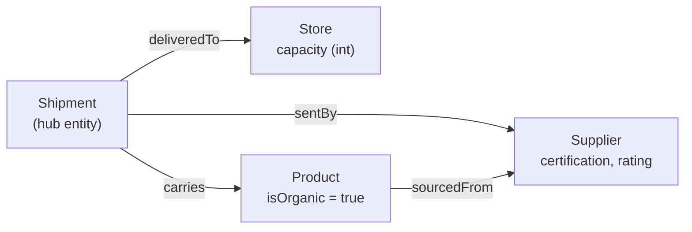
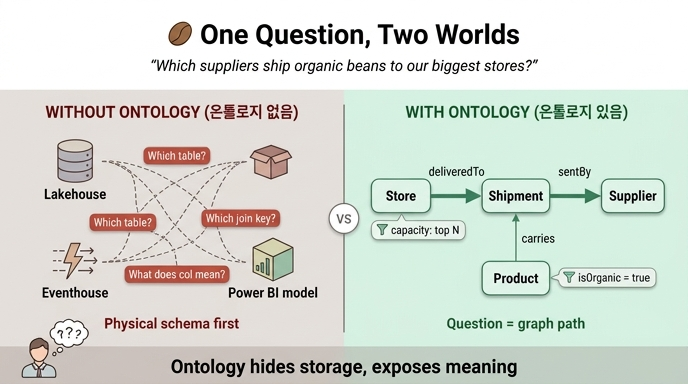

# 온톨로지가 없으면 왜 질문에 답하기 어려운가

> **Q.** 온톨로지가 없을 때 "어떤 공급업체가 최대 수용 규모 매장에 유기농 원두를 공급하는가?" 같은 질문에 답하기 어려운 이유는?
>
> **A.** 어떤 테이블이 어떤 시스템에 있는지, 어떻게 join되는지, 컬럼명이 무엇을 의미하는지를 모두 알아야 한다. 즉 **물리적 저장 구조에 대한 지식**이 질문 자체보다 더 큰 장벽이 된다.

---

## 1. 시나리오: Fourth Coffee의 데이터는 한 곳에 없다

Fourth Coffee는 여러 도시에 매장을 둔 스페셜티 커피 체인이다. 추적하는 대상은 Customer, Order, Product, Store, Supplier, Shipment 6가지지만, **데이터가 저장된 시스템은 세 군데로 쪼개져 있다.**

| 저장소 | 담당 데이터 | 성격 |
|---|---|---|
| **Lakehouse** | 고객 프로필 (customer profiles) | 배치·분석용 파일 기반 테이블 |
| **Eventhouse** (real-time) | 주문 트랜잭션 (order transactions) | 실시간 이벤트 스트림 |
| **Power BI semantic model** | 제품 분석 (product analytics) | BI 계층의 측정값·차원 모델 |

세 시스템은 저장 포맷, 쿼리 언어, 갱신 주기, 심지어 명명 규칙까지 서로 다르다. 그런데 우리가 던진 질문 하나는 이 세 곳을 **모두 가로지른다.**

## 2. 질문 자체는 한 문장이다

> "어떤 공급업체가 최대 수용 규모 매장에 유기농 원두를 공급하는가?"
> ("Which suppliers provide organic beans to our highest-capacity stores?")

비즈니스 담당자가 보기에 이 질문은 지극히 단순하다. 등장하는 개념은 셋뿐이다.

- **공급업체(Supplier)**
- **유기농 원두**(제품의 유기농 여부)
- **최대 수용 규모 매장**(매장의 좌석 수용량)

즉 질문의 **의미론적 복잡도(semantic complexity)는 매우 낮다.**

## 3. 그런데 온톨로지가 없으면 분석가가 알아야 하는 것들

온톨로지 없이 위 질문에 SQL/KQL로 답하려면, 분석가는 질문과 **무관한** 지식을 세 층으로 갖춰야 한다.

### (1) 위치 지식 — "어떤 테이블이 어떤 시스템에 있나"

- 공급업체 마스터는 Lakehouse에 있나, Power BI 모델에만 있나?
- 매장 정보는 어느 시스템 소관인가?
- 배송(Shipment) 기록은 실시간 Eventhouse에만 남는가?

각 시스템에 따로 접근 권한을 받고, 서로 다른 쿼리 엔진을 쓰고, cross-system join이 가능한지부터 확인해야 한다.

### (2) 결합 지식 — "어떻게 join되나"

- Supplier와 Store를 직접 잇는 키는 없다. 실제로는 **Shipment를 거쳐야만** 연결된다(`Shipment.sentBy → Supplier`, `Shipment.deliveredTo → Store`).
- "유기농 원두"는 Product 속성이므로 **Product까지 한 번 더** 타야 한다(`Shipment.carries → Product` 또는 `Product.sourcedFrom → Supplier`).
- 조인 키의 카디널리티가 many-to-one인지 many-to-many인지 모르면 결과 행이 뻥튀기(fan-out)되어 집계가 조용히 틀린다.
- 시스템마다 같은 개체의 키 이름·타입이 다르면(`store_id` vs `STOREID` vs 정수 서로게이트 키) 매핑 테이블까지 필요하다.

이것이 이 질문에서 가장 아픈 지점이다. **연결 경로 자체가 데이터 모델 안에 명시되어 있지 않고, 사람의 머릿속(혹은 아무도 안 읽는 문서)에만 있다.**

### (3) 의미 지식 — "컬럼명이 무엇을 뜻하나"

- 유기농 여부는 `isOrganic`(boolean)인가, `Supplier.certification = 'Organic'`(enum)인가? 둘 다 있으면 어느 쪽이 정답인가?
- `capacity`는 좌석 수인가, 하루 처리량인가, 창고 보관량인가?
- "최대 수용 규모"는 상위 N개인가, 임계값 초과인가?
- `status`, `total`, `weight` 같은 흔한 이름은 시스템마다 다른 뜻일 수 있다.

## 4. 그래서 무엇이 진짜 장벽인가

정리하면 이렇다.

| | 질문의 복잡도 | 답을 얻기까지의 복잡도 |
|---|---|---|
| 다루는 대상 | 개념 3개 (Supplier, 유기농, 매장 규모) | 시스템 3개 + 테이블 N개 + 조인 키 + 컬럼 의미 |
| 필요한 지식 | 비즈니스 도메인 | 물리적 저장 구조(스키마·키·엔진) |
| 지식의 소유자 | 질문한 사람 | 소수의 데이터 엔지니어 |

즉 **병목이 "무엇을 알고 싶은가"가 아니라 "그것이 어디에 어떻게 저장돼 있는가"로 옮겨간다.** 이것이 카드의 핵심 문장인 "물리적 저장 구조에 대한 지식이 질문 자체보다 더 큰 장벽이 된다"의 뜻이다. 결과적으로:

- 질문할 수 있는 사람과 답할 수 있는 사람이 **분리**된다(셀프서비스 불가).
- 조인 경로를 각자 재발명하므로 같은 질문에 **다른 숫자**가 나온다.
- 새 질문 하나마다 파이프라인/쿼리를 새로 만드는 **선형 비용**이 든다.
- 자연어 에이전트(Data Agent)도 스키마 추측에 실패한다 — 모델이 부족한 게 아니라 **의미 계층이 없는** 것이다.

## 5. 온톨로지가 있으면: 질문 = 그래프 순회

온톨로지는 물리 저장소 위에 **의미 계층(semantic layer)** 을 얹는다. 엔티티 타입(명사), 속성, 그리고 **이름 붙은 방향성 관계**가 모델 안에 1급 시민으로 존재한다. 그러면 질문은 그대로 경로가 된다.

```
Store → Shipment → Supplier
   filtered by Product.isOrganic = true
   and Store.capacity
```

Fourth Coffee 온톨로지의 관계로 풀어 쓰면 이렇다.



- **Shipment는 허브 엔티티(hub entity)** 다. Supplier, Store, Product 세 도메인을 한 엔티티가 이어 주므로, "공급업체 → 매장" 같은 직접 키가 없는 연결도 명시적 경로로 표현된다.
- 필터는 이름만 읽으면 되는 속성에 걸린다. `Product.isOrganic = true`(boolean), `Store.capacity`(integer 정렬/상위 N).
- 이 경로는 GQL로 거의 그대로 옮겨진다. 자료의 예시(Fair Trade + 캘리포니아 버전)를 보면 구조가 동일하다.

```gql
MATCH (sup:Supplier)<-[:sentBy]-(s:Shipment)-[:deliveredTo]->(st:Store)
WHERE sup.certification = 'Fair Trade' AND st.state = 'CA'
RETURN sup.name, st.name, s.status
```

우리 질문 버전으로 바꾸면 `carries`로 Product를 하나 더 물고, `isOrganic`과 `capacity`로 필터/정렬하면 된다.

### 무엇이 사라졌는가

- 테이블이 Lakehouse에 있는지 Eventhouse에 있는지 **묻지 않는다** → 온톨로지가 물리 위치를 추상화한다.
- 조인 키를 몰라도 된다 → 관계에 **이름**(`sentBy`, `deliveredTo`, `carries`)과 **카디널리티**가 이미 선언돼 있다.
- 컬럼 의미를 추측하지 않는다 → enum·boolean·타입이 모델 수준에서 값을 제약한다(자료의 "enum이 데이터 품질을 모델 수준에서 강제한다"는 요지).

이래서 자료는 이 모델이 "graph queries, GQL, 그리고 자연어 Data Agent 상호작용을 구동할 수 있다"고 말한다. **impedance mismatch가 없다** — 질문의 모양과 쿼리의 모양이 같다.

## 6. 한 줄 요약

온톨로지가 없으면 답을 얻는 비용이 *질문의 난이도*가 아니라 *창고 구조의 난이도*로 결정된다. 온톨로지는 그 창고 지식을 모델 안으로 흡수해서, 질문을 그대로 `Store → Shipment → Supplier` 순회로 바꿔 준다.

## 관련 카드 연결 고리

- Shipment가 허브 엔티티인 이유 (Supplier·Store·Product 3개 도메인 연결)
- `processedAt`이 many-to-one인 이유 (조인 카디널리티가 곧 결과 정확도)
- 식별자 속성(identifier property)이 필요한 이유 (엔티티 인스턴스 단일 키)

## 인포그래픽


