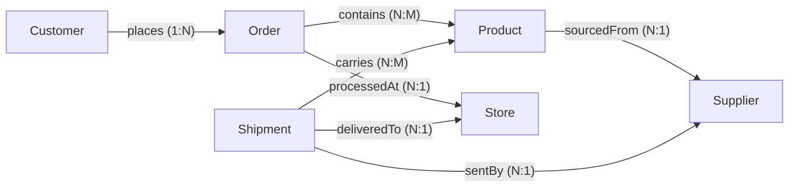
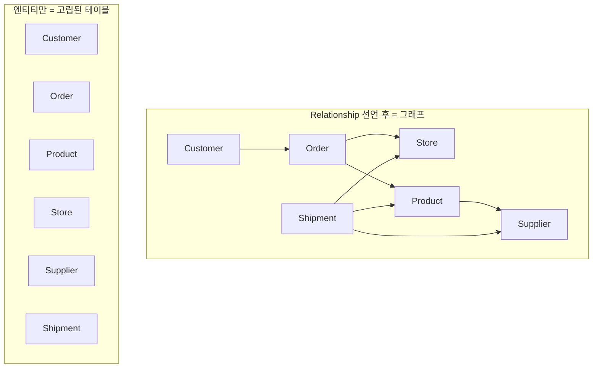

# Relationship이란 무엇인가?

> **정답**: 엔티티 사이의 **방향성 있는 연결(directed connection)**이며 **cardinality**(one-to-many, many-to-many 등)를 갖는다. 이것이 고립된 테이블들을 **그래프**로 만든다.

Fourth Coffee 온톨로지에서 Entity type이 도메인의 **명사**라면, Relationship은 그 명사들을 잇는 **동사**다. 원문의 표현을 그대로 빌리면:

> "Entities alone are just isolated tables. **Relationships** turn them into a graph."

엔티티만 정의해 놓으면 Customer 표, Order 표, Product 표가 각각 따로 놓인 상태에 불과하다. Relationship을 선언하는 순간 그 표들이 서로 이어져 **탐색 가능한(traversable) 그래프**가 된다.

---

## 1. Relationship의 3요소

하나의 relationship을 정의할 때 반드시 정해야 하는 것은 세 가지다.

| 요소 | 의미 | Fourth Coffee 예 |
|---|---|---|
| **이름 (semantic label)** | 이 연결이 도메인에서 무슨 뜻인지 | `places`, `contains`, `processedAt` |
| **방향 (direction)** | source 엔티티 → target 엔티티 | `Customer` → `Order` |
| **Cardinality (다중도)** | 양쪽에 몇 개가 붙을 수 있는지 | one-to-many, many-to-many … |

이름이 중요한 이유: 같은 두 엔티티 사이에도 서로 다른 의미의 연결이 여러 개 존재할 수 있다. Fourth Coffee에서 `Shipment`와 `Product` 사이의 `carries`, `Product`와 `Supplier` 사이의 `sourcedFrom`은 둘 다 "관련 있다"가 아니라 **명확히 다른 업무 의미**를 갖는다. Relationship 이름이 그 의미를 모델 레벨에 못 박아 둔다.

---

## 2. Fourth Coffee의 7개 relationship

완성된 온톨로지는 **6 entity type, 7 relationship**이다.

| # | Relationship | 방향 (source → target) | Cardinality | 의미 |
|---|---|---|---|---|
| 1 | `places` | Customer → Order | **one-to-many (1:N)** | 한 고객이 여러 주문을 하고, 각 주문은 한 고객의 것 |
| 2 | `contains` | Order → Product | **many-to-many (N:M)** | 주문은 여러 상품을 담고, 상품은 여러 주문에 등장 |
| 3 | `processedAt` | Order → Store | **many-to-one (N:1)** | 각 주문은 정확히 한 매장에서 처리, 매장은 많은 주문 처리 |
| 4 | `sourcedFrom` | Product → Supplier | **many-to-one (N:1)** | 각 상품의 원두는 한 공급업체에서 옴 |
| 5 | `sentBy` | Shipment → Supplier | **many-to-one (N:1)** | 각 배송은 한 공급업체에서 출발 |
| 6 | `deliveredTo` | Shipment → Store | **many-to-one (N:1)** | 각 배송은 한 매장에 도착 |
| 7 | `carries` | Shipment → Product | **many-to-many (N:M)** | 한 배송에 여러 상품, 한 상품이 여러 배송에 |



화살표 7개를 지우면 6개의 고립된 상자만 남는다 — 그게 "isolated tables" 상태다. 화살표가 있어야 `Store → Shipment → Supplier` 같은 **경로(path)**가 존재한다.

특히 `Shipment`는 세 방향(`sentBy` → Supplier, `deliveredTo` → Store, `carries` → Product)으로 연결되는 **hub entity**다. Relationship이 3개 이상 모이면 그 엔티티는 서로 떨어져 있던 도메인(소싱 / 물류 / 리테일)을 잇는 교차점이 된다.

---

## 3. "방향성 있는(directed)"이란 무슨 뜻인가

### 3-1. 방향은 의미를 담는다

`places`는 `Customer → Order`다. 반대로 `Order → Customer`로 읽으면 문장이 이상해진다 ("주문이 고객을 place한다"). 방향은 **어느 쪽이 주체이고 어느 쪽이 대상인지**를 고정한다. 그래서 relationship 이름과 방향은 늘 한 쌍으로 읽어야 한다.

`processedAt`도 마찬가지다. `Order → Store`로 정의했기 때문에 "주문이 매장에서 처리된다"가 자연스럽게 읽힌다. 만약 방향을 뒤집으려면 이름도 `processes`(Store → Order)로 바꿔야 뜻이 맞는다.

### 3-2. 방향은 cardinality의 기준점이다

원문의 Step 2 퀴즈가 이 점을 정확히 찍는다.

> "Many-to-one — 많은 주문이 하나의 매장에 매핑된다. **From Order's perspective, this is many-to-one.**"

`processedAt`을 many-to-one이라 부르는 것은 **source가 Order**이기 때문이다. Store 쪽에서 보면 똑같은 연결이 one-to-many다. 즉 **1:N인지 N:1인지는 방향을 정한 뒤에야 말할 수 있다.** 방향 없이 "이건 one-to-many야"라고만 하면 절반의 정보가 빠진 셈이다.

### 3-3. 그러나 **탐색(traversal)은 양방향으로 가능하다**

정의에 방향이 있다는 것과, 질의할 때 그 방향으로만 걸어야 한다는 것은 다른 얘기다. 원문의 GQL 예시가 이를 보여준다.

```gql
MATCH (sup:Supplier)<-[:sentBy]-(s:Shipment)-[:deliveredTo]->(st:Store)
WHERE sup.certification = 'Fair Trade' AND st.state = 'CA'
RETURN sup.name, st.name, s.status
```

- `(sup:Supplier)<-[:sentBy]-(s:Shipment)` — 화살표가 **왼쪽을 향한다**. `sentBy`는 `Shipment → Supplier`로 정의되어 있으므로, Supplier에서 출발해 Shipment로 가려면 관계를 **거슬러(inbound)** 타는 것이다.
- `(s:Shipment)-[:deliveredTo]->(st:Store)` — 이쪽은 정의 방향 그대로(**outbound**) 타고 내려간다.

한 쿼리 안에서 같은 노드를 기준으로 한 번은 역방향, 한 번은 순방향으로 걷는다. 이렇게 **방향은 의미를 위한 것이고, 탐색은 필요에 따라 어느 쪽으로든 갈 수 있다**. 덕분에 다음과 같은 질문이 모두 같은 7개 relationship 위에서 답이 나온다.

| 질문 | 그래프 경로 | 관계를 타는 방향 |
|---|---|---|
| 유기농 원두를 공급하는 업체는? | Product(isOrganic=true) → Supplier | `sourcedFrom` 순방향 |
| 지연된 배송을 받은 매장은? | Shipment(status=Delayed) → Store | `deliveredTo` 순방향 |
| 이 공급업체가 보낸 배송은? | Supplier ← Shipment | `sentBy` **역방향** |
| 이 매장에서 처리된 주문은? | Store ← Order | `processedAt` **역방향** |

---

## 4. Cardinality: 네 가지 형태

Cardinality(다중도, multiplicity)는 **연결의 양쪽 끝에 인스턴스가 몇 개까지 붙을 수 있는지**를 규정한다. `A → B` 방향을 기준으로 네 가지가 있다.

| 형태 | 읽는 법 | 뜻 | Fourth Coffee 예 |
|---|---|---|---|
| **one-to-one (1:1)** | A 하나 ↔ B 하나 | 양쪽 모두 최대 1개 | (이 온톨로지에는 없음) 예: Order ↔ Receipt, Employee ↔ BadgeCard |
| **one-to-many (1:N)** | A 하나 → B 여러 개 | source 1개가 target 다수를 가짐 | `places` (Customer → Order) |
| **many-to-one (N:1)** | A 여러 개 → B 하나 | source 다수가 target 1개를 공유 | `processedAt`, `sourcedFrom`, `sentBy`, `deliveredTo` |
| **many-to-many (N:M)** | A 여러 개 ↔ B 여러 개 | 양쪽 모두 다수 | `contains` (Order → Product), `carries` (Shipment → Product) |

### 1:N과 N:1은 같은 관계를 반대쪽에서 본 것

`places`(Customer → Order, 1:N)와 `processedAt`(Order → Store, N:1)은 구조적으로 같은 종류다. 차이는 **"many"쪽 엔티티를 source로 잡았는가**뿐이다.

- `places`: source가 "one"쪽(Customer) → 1:N
- `processedAt`: source가 "many"쪽(Order) → N:1

원문의 표현대로 N:1은 **"belongs to" / "happens at" 패턴의 가장 흔한 cardinality**다. Fourth Coffee의 7개 중 4개가 N:1인 것도 그래서다 — 실무 도메인은 "이건 저기에 속한다"는 문장으로 가득하다.

### N:M을 판별하는 방법

원문 Step 1 퀴즈의 논리를 그대로 쓰면 된다. 양쪽에서 각각 질문해 보고 **둘 다 "여러 개"면 N:M**이다.

> `contains` (Order → Product)
> - 하나의 주문이 여러 상품을 담을 수 있나? → **예** (라떼 + 머핀 + 원두 한 봉지)
> - 하나의 상품이 여러 주문에 등장할 수 있나? → **예** (라떼는 수천 건의 주문에 등장)
> → 이 **양방향 다중성(bidirectional multiplicity)** 때문에 many-to-many가 필요하다.

반면 `processedAt`은 두 번째 질문("하나의 주문이 여러 매장에서 처리되나?")에서 "아니오"가 나오므로 N:1이다.

### Cardinality를 정확히 잡아야 하는 이유

1. **데이터 무결성** — N:1로 선언하면 "한 주문이 두 매장에서 처리됨" 같은 데이터가 모델 위반으로 잡힌다.
2. **질의 결과의 형태** — 1:N/N:M을 타면 결과가 여러 행으로 fan-out되고, N:1을 타면 단일 값이 붙는다. 집계(sum, avg)의 중복 계산 위험도 여기서 결정된다.
3. **물리 구현 선택** — N:M은 대개 별도의 연결 구조(link/junction)를 필요로 한다. 반면 N:1은 한쪽에 참조 하나로 표현된다.
4. **자연어 질의 품질** — Data Agent가 "매장별 평균 주문 금액"을 옳게 계산하려면 Order↔Store가 N:1임을 알아야 한다.

---

## 5. Relationship vs. Foreign Key / SQL JOIN

"이거 그냥 외래키 아닌가?"가 가장 흔한 질문이다. 겹치는 부분이 있지만 **추상화 수준이 다르다.**

| 관점 | Foreign key + JOIN (관계형) | Relationship (온톨로지/그래프) |
|---|---|---|
| **어디에 존재하나** | 테이블의 **컬럼**으로 존재. 관계 자체가 1급 시민이 아니다 | 모델의 **1급 구성 요소**. 이름·방향·cardinality를 갖는 객체 |
| **의미(semantics)** | `orders.store_id` — 컬럼명에서 유추. 무슨 의미의 연결인지 스키마에 없다 | `processedAt` — 관계 이름이 업무 의미를 명시 |
| **방향** | 참조 방향은 있지만 의미로서의 방향 개념은 약함 | 명시적 source → target |
| **Cardinality 선언** | UNIQUE / NOT NULL 제약으로 **간접적으로** 암시 | `many-to-one`처럼 **직접 선언** |
| **N:M 처리** | junction table을 사람이 만들어야 하고, 그 테이블은 엔티티인지 관계인지 모호 | `contains`를 그냥 many-to-many로 선언 |
| **질의 시** | 매 쿼리마다 `ON a.id = b.a_id`를 **다시** 써야 함. 조인 키를 아는 사람만 쿼리 가능 | 관계 이름으로 `-[:contains]->` 탐색. 조인 조건이 모델에 이미 들어있다 |
| **여러 홉(hop)** | 홉마다 JOIN 추가 → 3~4홉이면 쿼리가 급격히 복잡해짐 | 경로를 쭉 이어 쓰면 됨: `Supplier ← Shipment → Store` |
| **시스템 경계** | 서로 다른 시스템(lakehouse / Eventhouse / 시맨틱 모델)에 걸친 조인은 매우 어렵다 | 물리 위치와 무관하게 논리 관계로 연결 |

원문의 문제 제기가 이 차이를 정확히 겨눈다.

> 온톨로지가 없으면 **"어떤 유기농 원두 공급업체가 우리 최대 규모 매장에 납품하는가?"** 같은 질문에 답하려면 *어떤 테이블이 어느 시스템에 있는지, 어떻게 조인하는지, 컬럼 이름이 무슨 뜻인지*를 모두 알아야 한다.
>
> 온톨로지가 있으면 그 질문은 곧 그래프 탐색이 된다: `Store → Shipment → Supplier` + `Product.isOrganic = true` + `Store.capacity` 필터.

즉 relationship은 **조인 지식을 사람의 머릿속에서 꺼내 모델 안에 영구히 저장한 것**이다. 한 번 선언하면 이후 모든 쿼리·BI·Data Agent가 그 지식을 재사용한다. FK는 "무결성 제약"이 주 목적이고, relationship은 "의미 있는 탐색 경로"가 주 목적이라고 정리해도 좋다.

> 참고: relationship이 FK를 부정하는 것은 아니다. 물리 계층에서는 여전히 FK/조인으로 구현될 수 있다. 다만 **모델 사용자는 그 구현을 몰라도 된다** — 그것이 "no impedance mismatch"의 의미다.

---

## 6. 왜 relationship이 테이블을 그래프로 만드는가

정리하면 세 단계다.

1. **엔티티만 있을 때** — Customer, Order, Product, Store, Supplier, Shipment는 각자 완결된 6개의 목록이다. 각 목록 안에서만 질문할 수 있다("Gold 등급 고객 수", "평균 상품 가격"). 목록을 가로지르는 질문은 불가능하다.

2. **Relationship을 선언하면** — 엔티티가 **노드**가 되고 relationship이 **엣지**가 된다. 노드 + 엣지 = 그래프. 이제 노드에서 엣지를 타고 다른 노드로 **걸어갈(traverse)** 수 있다.

3. **경로가 생기면 질문이 폭발한다** — 엣지가 하나 늘 때마다 새로운 경로 조합이 생긴다. 원문이 "Adding one entity opens up an entire category of location-based queries", "The graph grows incrementally — each step adds new query capabilities"라고 말한 것이 이 효과다. Step 2에서 `processedAt` 하나를 추가하자 "매장별 주문 수", "도시별 평균 주문액", "주문량 기준 인력 배치" 질문이 한꺼번에 가능해졌다.



아래(A)는 정보가 6조각으로 갇혀 있다. 위(B)는 `Customer`에서 출발해 `places` → `processedAt`을 타고 `Store`까지, 혹은 `contains` → `sourcedFrom`을 타고 `Supplier`까지 도달할 수 있다. 같은 데이터인데 **연결이 있느냐 없느냐**만으로 답할 수 있는 질문의 범위가 달라진다.

---

## 7. 한 줄 요약

- Relationship = **이름 + 방향 + cardinality**를 가진 엔티티 간 연결.
- **방향**은 의미(누가 주체인가)와 cardinality의 기준점을 정한다. 단, 질의에서는 `<-[:sentBy]-`처럼 **역방향 탐색도 자유롭다.**
- **Cardinality**는 1:1 / 1:N / N:1 / N:M 네 가지. 양쪽에 각각 "여러 개?"를 물어 판별한다. Fourth Coffee 7개 중 N:1이 4개(belongs-to 패턴), N:M이 2개, 1:N이 1개.
- FK/JOIN과 달리 relationship은 **조인 지식을 모델에 내장한 1급 객체**여서, 시스템 경계를 넘어 재사용된다.
- 그래서 relationship이 **고립된 테이블 6개를 탐색 가능한 그래프 1개로** 바꾼다.
