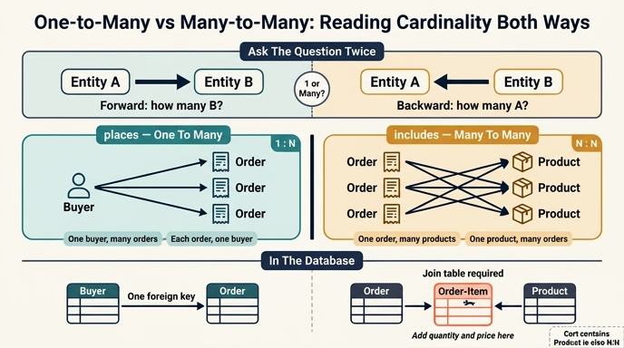

# 왜 `places`는 one-to-many인데 `includes`는 many-to-many인가?

## 한 줄 답

- **places** (`Buyer → Order`): 주문은 **정확히 한 명**의 구매자에게 귀속되지만, 구매자는 시간이 지나며 주문을 **여러 번** 쌓는다 → **one-to-many**
- **includes** (`Order → Product`): 하나의 주문은 **여러 상품**을 담고, 하나의 상품은 **여러 주문**에 반복 등장한다 → **many-to-many**

핵심은 "관계가 복잡해 보이느냐"가 아니라, **양쪽 방향 각각에 대해 최대 개수를 물어봤을 때의 답**이다.

---

## 1. 카디널리티 판별 절차 — 양방향으로 두 번 묻기

카디널리티(cardinality)는 관계의 양 끝에서 **"이쪽 인스턴스 하나에 저쪽 인스턴스가 최대 몇 개까지 붙을 수 있는가?"** 를 각각 물어 결정한다. 질문은 반드시 **두 번**, 방향을 바꿔가며 던진다.

| 단계 | 질문 | places (`Buyer`–`Order`) | includes (`Order`–`Product`) |
|---|---|---|---|
| ① 정방향 | 왼쪽 하나 → 오른쪽 최대 몇 개? | 구매자 1명이 주문을 여러 건 → **多** | 주문 1건이 상품을 여러 개 → **多** |
| ② 역방향 | 오른쪽 하나 → 왼쪽 최대 몇 개? | 주문 1건은 구매자 1명뿐 → **1** | 상품 1개(SKU)는 여러 주문에 등장 → **多** |
| 결론 | (①, ②) 조합 | (多, 1) → **one-to-many** | (多, 多) → **many-to-many** |

조합표로 정리하면:

| ① 정방향 | ② 역방향 | 카디널리티 | 이 온톨로지의 예 |
|---|---|---|---|
| 1 | 1 | one-to-one | `has_cart` (Buyer ↔ Shopping-Cart) |
| 多 | 1 | one-to-many | `places` (Buyer → Order), `writes` (Buyer → Review) |
| 1 | 多 | many-to-one | `reviews` (Review → Product) |
| 多 | 多 | many-to-many | `includes` (Order → Product), `contains` (Cart → Product) |

### 판별할 때 흔한 함정

- **"많으니까 many-to-many"라고 착각하기.** `places`도 주문 수는 많다. 하지만 many는 **역방향에서도** 성립해야 한다. 주문 하나를 집어 들고 "이 주문의 구매자는 누구지?"라고 물으면 답은 항상 **한 명**이다. 그래서 many-to-many가 아니다.
- **개수(count)와 최대 다중도(multiplicity)를 혼동하기.** "대부분의 주문은 상품 1개만 담는다"는 통계일 뿐, 모델은 **가능한 최대치**를 표현한다. 2개짜리 주문이 하나라도 존재할 수 있으면 그쪽은 多다.
- **시점 의존성을 놓치기.** `has_cart`가 one-to-one인 이유는 "**어느 한 순간에** 활성 장바구니는 하나"이기 때문이다. 반면 `places`가 one-to-many인 이유는 "**시간이 흐르며** 주문이 누적"되기 때문. 같은 Buyer에서 출발하는데 카디널리티가 갈리는 결정적 차이가 바로 이 시간 축이다.
- **관계를 뒤집으면 이름이 바뀐다.** `reviews`(Review → Product)는 many-to-one이지만, 반대로 읽으면 `Product → Review`는 one-to-many다. 카디널리티 표기는 **화살표 방향에 종속**이므로 항상 어느 방향으로 읽는지 명시해야 한다.

---

## 2. 왜 `places`가 one-to-many인가 — "귀속(ownership)"의 관점

`Order` 엔티티는 `orderId`, `orderDate`, `status`, `total`, `shippingMethod`를 가진다. 이 속성들은 전부 **한 명의 구매자에게만** 의미가 있다. 배송지도 하나, 결제 주체도 하나, 총액 청구 대상도 하나다. 즉 주문은 구매자에게 **배타적으로 귀속되는 사건 기록(event record)** 이다.

이런 "사건이 주체에게 귀속된다" 패턴은 one-to-many의 전형이다:

- Buyer → Order (`places`)
- Buyer → Review (`writes`)

두 관계 모두 "주체 1명이 시간에 따라 여러 개의 사건을 남기고, 각 사건은 주체 1명에게만 속한다"는 동일한 구조다. 그래서 둘 다 one-to-many다.

물리 스키마로 내려가면 이 구조는 **외래 키 한 개**로 끝난다.

```sql
CREATE TABLE "order" (
  order_id        TEXT PRIMARY KEY,
  buyer_id        TEXT NOT NULL REFERENCES buyer(buyer_id),  -- ← "1" 쪽을 가리키는 FK
  order_date      TIMESTAMP,
  status          TEXT,
  total           NUMERIC(12,2),
  shipping_method TEXT
);
```

`buyer_id` 컬럼이 **하나**라는 사실 자체가 "주문 하나는 구매자 하나"를 강제한다. `NOT NULL`이면 최소 다중도까지 1이 되어 "모든 주문은 반드시 구매자를 가진다"가 된다. **one-to-many는 many 쪽 테이블에 FK를 두는 것으로 표현된다** — 별도 테이블이 필요 없다.

---

## 3. 왜 `includes`가 many-to-many인가 — 그리고 물리 스키마에서의 대가

`includes`는 두 방향 모두 多다.

- 주문 #1001 → 키보드, 마우스, USB 허브 (한 주문에 여러 상품)
- SKU `KB-870` → 주문 #1001, #1042, #1187 … (한 상품이 여러 주문에)

상품은 **재고를 가진 카탈로그 항목**이지 개별 사건이 아니다. 같은 `sku`가 수천 건의 주문에 재등장하는 것이 정상이고, 오히려 그것이 잘 팔리는 상품의 정의다. 그래서 어느 방향으로도 "1"로 고정되지 않는다.

### many-to-many는 단일 FK로 표현할 수 없다

FK 컬럼 하나로는 값 하나만 가리킬 수 있다. many-to-many를 억지로 넣으려면:

- ❌ `order.product_ids = "KB-870,MS-210,HB-4"` — 콤마 문자열. 조인 불가, 인덱스 불가, 무결성 검증 불가
- ❌ `order.product_1, order.product_2, order.product_3` — 반복 컬럼. 4개짜리 주문이 나오면 스키마 변경

그래서 물리 스키마에서는 반드시 **조인 테이블(join table / junction table / associative entity)** 로 풀어낸다.

```sql
CREATE TABLE order_item (              -- ← 조인 테이블
  order_id  TEXT REFERENCES "order"(order_id),
  sku       TEXT REFERENCES product(sku),
  quantity  INTEGER,                   -- ← 관계 자체의 속성
  unit_price NUMERIC(12,2),            -- ← 주문 시점 가격 스냅샷
  PRIMARY KEY (order_id, sku)
);
```

**규칙: one-to-many는 FK 1개, many-to-many는 테이블 1개(=FK 2개).** many-to-many 관계 하나는 항상 두 개의 one-to-many로 분해된다 (`Order → OrderItem`, `Product → OrderItem`).

### 조인 테이블이 "링크 엔티티(link entity)"로 승격되는 순간

위 SQL에서 `quantity`와 `unit_price`를 보라. 이 값들은 **주문에도 상품에도 속하지 않는다** — 오직 "이 주문에서의 이 상품"이라는 **관계 자체**에 속한다.

관계에 속성이 붙기 시작하면 그것은 더 이상 단순 연결이 아니라 **일급 엔티티(first-class entity)** 다. 온톨로지에서도 이때는 `includes`를 지우고 `Order-Line` 같은 엔티티를 명시적으로 만드는 것이 정석이다.

```
[변경 전] Order --includes(many-to-many)--> Product

[변경 후] Order --has_line(one-to-many)--> Order-Line --for_product(many-to-one)--> Product
                                            {quantity, unitPrice, lineTotal, discount}
```

이렇게 승격시키면:

- 관계에 속성을 안전하게 붙일 수 있다 (수량, 시점 가격, 할인, 반품 여부)
- 같은 주문에 같은 SKU를 다른 조건으로 두 줄 넣는 것도 가능해진다
- **모든 관계가 one-to-many / many-to-one으로 환원되어** 카디널리티 추론이 단순해진다

즉 **모든 many-to-many는 "아직 이름 붙지 않은 엔티티가 숨어 있다"는 신호**로 읽을 수 있다. 학습 경로에서는 모델을 단순하게 유지하려고 `includes`를 many-to-many로 두었지만, 실무 주문 시스템은 거의 예외 없이 `OrderLine` / `LineItem`을 둔다.

---

## 4. Shopping-Cart의 `contains`와의 비교

Shopping-Cart 단계에서 새로 생긴 두 관계를 같이 놓고 보면 대비가 선명해진다.

| 관계 | 방향 | 카디널리티 | 판별 근거 |
|---|---|---|---|
| `places` | Buyer → Order | one-to-many | 주문은 구매자 1명 소유, 구매자는 주문 누적 |
| `has_cart` | Buyer → Shopping-Cart | **one-to-one** | 어느 한 순간 활성 장바구니는 정확히 하나, 장바구니도 주인 하나 |
| `includes` | Order → Product | many-to-many | 양방향 모두 多 |
| `contains` | Shopping-Cart → Product | **many-to-many** | 양방향 모두 多 |

### `contains`와 `includes`는 구조적으로 쌍둥이다

두 관계 모두 "컨테이너 → 카탈로그 항목" 패턴이다. 장바구니도 여러 상품을 담고, 상품도 여러 사람의 장바구니에 동시에 들어가 있다. 그래서 카디널리티가 똑같이 many-to-many이고, 물리 스키마에서도 똑같이 조인 테이블(`cart_item(cart_id, sku, quantity)`)이 된다.

**교훈: 카디널리티는 엔티티의 "중요도"나 "지속성"이 아니라, 오직 연결 구조에서 나온다.** Order는 영구 기록이고 Cart는 임시 세션이지만, Product를 향한 관계의 모양은 동일하다.

### 진짜 차이는 상위 관계에 있다

Buyer 쪽을 보면 갈린다.

- `places`가 one-to-many인 이유: 주문은 **시간에 따라 누적되는 이력**
- `has_cart`가 one-to-one인 이유: 장바구니는 **현재 상태(current-state) 스냅샷**

같은 Buyer에서 출발하는 두 관계인데도 하나는 多, 하나는 1이다. 결정한 것은 엔티티의 종류가 아니라 **"시간이 지나면 개수가 늘어나는가?"** 라는 질문의 답이다. 이력형(Order, Review)은 늘어나므로 many, 상태형(Cart)은 늘어나지 않으므로 one.

### 실전 효과 — 카디널리티가 쿼리를 결정한다

`contains`와 `includes`가 둘 다 many-to-many이기 때문에 "장바구니엔 담았지만 사지 않은 상품"이라는 퍼널 질문이 성립한다. 양쪽이 같은 `Product`를 다중으로 가리키므로 **집합 차집합**으로 비교할 수 있는 것이다.

```gql
MATCH (b:Buyer)-[:has_cart]->(c:Cart)-[:contains]->(p:Product)
WHERE NOT EXISTS { (b)-[:places]->(:Order)-[:includes]->(p) }
RETURN b.buyerId, p.name
```

마찬가지로 시나리오 개요의 "구매하지 않은 상품에 리뷰를 쓴 검증된 리뷰어" 질문도 `places → Order → includes → Product` 경로가 many-to-many를 포함하기에 성립한다. 만약 `includes`를 잘못 one-to-many로 모델링했다면 "한 주문에 상품 하나"가 되어 이런 질문 자체가 표현 불가능해진다.

---

## 5. 요약 체크리스트

관계를 만날 때마다 이렇게 물어라.

1. **A 하나에 B가 최대 몇 개?** (정방향)
2. **B 하나에 A가 최대 몇 개?** (역방향)
3. 시간 축을 고려했는가? — "지금 이 순간"인가 "평생 누적"인가
4. 통계적 평균이 아니라 **가능한 최대치**로 답했는가
5. (多, 多)가 나왔다면 → 조인 테이블이 필요하다. **그 조인 테이블에 붙일 속성(수량, 가격, 시점)이 떠오르는가?** 떠오른다면 링크 엔티티로 승격시켜라

## 인포그래픽


