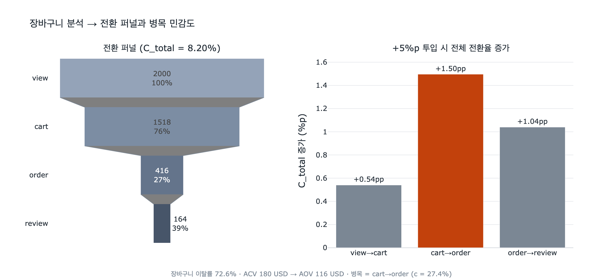

# 장바구니 분석이 열어주는 인사이트 — 전환 퍼널(conversion funnel)

> **Q.** 장바구니 분석이 열어주는 대표적 인사이트는?
> **A.** 전환 퍼널(conversion funnel) 분석이다. 장바구니 대비 주문 비율(cart → order ratio)로 어느 단계에서 구매자가 이탈하는지 파악할 수 있다.

---

## 1. 왜 하필 장바구니인가

E-Commerce 온톨로지에서 Shopping-Cart는 **세션 엔티티(session entity)** 다. 임시적이고 변경 가능하며, "아직 결정하지 않은 상태"를 붙잡아 둔다.

핵심은 이것이다. **장바구니가 없으면 퍼널의 중간이 블랙박스가 된다.**

- Buyer와 Order만 있으면 관측되는 건 "샀다 / 안 샀다" 두 상태뿐이다.
- 안 산 사람 중에서 *관심조차 없던 사람* 과 *담아놓고 결제 직전에 포기한 사람* 을 구분할 수 없다.
- 이 둘은 완전히 다른 문제이고, 처방도 완전히 다르다 (전자는 상품 발견/추천 문제, 후자는 배송비·결제 마찰 문제).

Shopping-Cart 엔티티를 넣는 순간 그 사이에 **관측 지점이 하나 생긴다**. 그래서 아티클도 "Cart analysis enables conversion funnel insights (cart → order ratio)"라고 정리한다.

부수적으로 `itemCount`, `subtotal` 같은 **비정규화(denormalized) 요약 속성**이 카트에 직접 저장되어 있어서, 카트 내용물을 다 펼치지 않고도 퍼널 집계를 빠르게 돌릴 수 있다.

---

## 2. 퍼널 단계 정의와 온톨로지 경로 매핑

퍼널은 `view → cart → order → review` 네 단계로 잡는다. 각 단계는 **그래프에 해당 경로가 존재하는가**로 센다.

| 단계 | 의미 | 그래프 경로 | 비고 |
|---|---|---|---|
| **view** | 상품을 봄 | (온톨로지 밖) 분석 웨어하우스의 view 이벤트 | 이 온톨로지는 view 엔티티가 없다. 시나리오 문서가 말하는 "analytics warehouse for buyer behavior"가 담당 |
| **cart** | 장바구니에 담음 | `Buyer -has_cart-> Shopping-Cart -contains-> Product` | `itemCount > 0` 조건을 함께 건다 |
| **order** | 주문 완료 | `Buyer -places-> Order -includes-> Product` | |
| **review** | 후기 작성 | `Buyer -writes-> Review -reviews-> Product` | `verified = true`로 좁힐 수도 있다 |

여기서 중요한 성질:

- **cart 경로와 order 경로는 서로 독립적인 두 경로다.** 그래서 "장바구니에는 있는데 주문에는 없는" 차집합을 그래프 패턴 하나로 뽑을 수 있다. 아티클의 예시 질문 "Which buyers have full carts but no orders?"가 정확히 이것이고, 답은 `Buyer → Cart (itemCount > 0)` 이면서 `Buyer → Order` 없음이다.
- **review 경로 역시 order와 다른 제3의 경로다.** Buyer에서 Product로 가는 길이 구매 경로(`places→includes`)와 후기 경로(`writes→reviews`) 둘로 갈리면서 **피드백 루프**가 생긴다. 그래서 "산 적 없는데 후기를 쓴 사람"(`writes→reviews` 있고 `places→includes` 없음) 같은 질의가 가능해진다 — 이것이 `verified` 불리언의 존재 이유이기도 하다.

측정 단위는 목적에 따라 둘 중 하나를 고른다.

- **Buyer 단위** — "그 단계에 한 번이라도 도달한 사람 수". 사용자 여정을 볼 때.
- **(Buyer, Product) 페어 단위** — "그 상품이 그 사람의 그 단계에 도달한 횟수". "어떤 상품이 가장 자주 담기고도 안 팔리는가"를 볼 때. 아티클의 "Which products are most often added to carts but not purchased?"가 이쪽이다.

`expy.py`는 Buyer 단위로 퍼널을 세고, 페어 집합에서 `buyerId`만 뽑아 유일값을 구하는 방식으로 구현한다.

---

## 3. 단계 전환율과 전체 전환율의 관계 — 곱셈이다

단계 $i$의 인원을 $N_i$라 할 때, 단계 전환율은

$$c_i = \frac{N_i}{N_{i-1}}$$

전체 전환율은 각 단계 전환율의 **곱**이다.

$$C_{\text{total}} = \frac{N_{\text{last}}}{N_0} = \frac{N_1}{N_0}\cdot\frac{N_2}{N_1}\cdots\frac{N_{\text{last}}}{N_{\text{last}-1}} = \prod_i c_i$$

중간 항이 전부 약분되므로 당연한 항등식이지만, 실무적 함의가 크다.

- **덧셈이 아니라 곱셈이므로 낮은 단계 하나가 전체를 끌어내린다.** $c = (0.76,\ 0.27,\ 0.39)$면 전체는 약 $8.2\%$다. 앞뒤 단계가 아무리 좋아도 가운데 27%를 통과한 사람만 남는다.
- 반대로 **한 단계만 고쳐도 전체가 그 비율만큼 통째로 곱해져 올라간다.** 이 성질이 4절의 민감도 분석으로 이어진다.

주의: 이 항등식은 퍼널이 **엄격한 포함 관계(nested)** 일 때만 깔끔하다. 즉 order에 도달한 사람은 반드시 cart를 거쳤어야 한다. 카트를 건너뛰는 "즉시 구매(buy now)" 경로가 있으면 $N_{\text{order}} \not\subseteq N_{\text{cart}}$가 되어 $c_i > 1$이 나올 수 있다. 이 경우 퍼널 정의를 "카트를 거친 주문"으로 한정하거나, 별도 경로로 분리해서 봐야 한다.

---

## 4. 장바구니 이탈률(cart abandonment rate)

**장바구니 이탈률**은 담아놓고 사지 않은 비율이다. cart → order 전환율의 여집합이다.

$$A = 1 - \frac{N_{\text{order}}}{N_{\text{cart}}} = 1 - c_{\text{cart}\to\text{order}}$$

그래프로는 이렇게 읽는다.

$$A = \frac{\lvert\{b : b \text{에 cart 경로 있음} \wedge b \text{에 order 경로 없음}\}\rvert}{\lvert\{b : b \text{에 cart 경로 있음}\}\rvert}$$

몇 가지 실무적 주의점.

- **분모 정의가 결과를 바꾼다.** 빈 카트(`itemCount = 0`)를 분모에 넣으면 이탈률이 부풀려진다. 보통 `itemCount > 0`인 카트만 센다.
- **시간 창(window)이 필요하다.** 카트는 "지금 활성 상태"인 세션 엔티티고 `has_cart`가 **one-to-one** 이므로, 어느 시점에나 Buyer 하나당 카트 하나뿐이다. 즉 카트 스냅샷만으로는 과거 이력이 남지 않는다. 주간/월간 이탈률을 보려면 `Shopping-Cart.createdAt`을 기준으로 창을 자르고 카트 상태 변화를 별도로 적재해야 한다. 아티클의 "How many carts were abandoned this week?"가 바로 `createdAt` 기준 질의다.
- **아직 진행 중인 카트를 이탈로 세지 말 것.** 방금 만들어진 카트는 아직 결정 전이다. 보통 마지막 활동 후 N시간(흔히 24~72시간) 지난 카트만 이탈로 판정한다.
- 업계 평균 이탈률은 대체로 **60~80%** 대다. 즉 이탈률이 70%라고 해서 그 자체로 이상 신호는 아니고, **자기 시계열/세그먼트 대비 변화**를 봐야 한다.

---

## 5. 평균 장바구니 금액(ACV) vs 평균 주문 금액(AOV)

아티클이 던지는 질문 "What's the average cart value vs. average order value?"는 인원 전환율이 못 잡는 것을 잡는다.

- $\text{ACV} = \operatorname{mean}(\texttt{Shopping-Cart.subtotal})$
- $\text{AOV} = \operatorname{mean}(\texttt{Order.total})$

그리고 **금액 기준 전환율**을 함께 본다.

$$C_{\text{value}} = \frac{\sum \texttt{Order.total}}{\sum \texttt{Cart.subtotal}}$$

이 둘을 인원 기준과 비교하면 이탈의 **성격**이 드러난다.

| 관찰 | 해석 |
|---|---|
| $C_{\text{value}} < c_{\text{cart}\to\text{order}}$ | **비싼 장바구니가 더 많이 이탈**한다. 가격 저항, 배송비 충격, 할부/결제수단 부재를 의심 |
| $C_{\text{value}} > c_{\text{cart}\to\text{order}}$ | 싼 장바구니가 더 많이 이탈한다. 최소 주문 금액·배송비 문턱에 걸려 소액 카트가 죽고 있을 수 있음 |
| $\text{AOV} \ll \text{ACV}$ | 담긴 것 중 **일부만 결제**된다. 재고 부족(`stockQty`), 품목별 배송 지연, 결제 단계에서의 품목 삭제 |
| $\text{AOV} \approx \text{ACV}$ | 카트는 통째로 사거나 통째로 버려진다. all-or-nothing 결정 → 카트 단위 리마인더가 유효 |

`expy.py` 실행 결과에서는 ACV 180 USD → AOV 116 USD, 금액 전환율 17.8% vs 인원 전환율 27.4%로, **비싼 카트가 더 많이 죽는** 전형적 패턴이 나온다. 이 경우 개선 레버는 무료배송 임계값 조정, 할부 옵션, 가격 알림 같은 **결제 마찰 제거**다.

---

## 6. 개선 효과가 왜 병목 단계에 집중되는가

단계 $k$의 전환율을 $c_k \to c_k + \Delta$ 로 올리면, 다른 단계가 그대로일 때

$$C'_{\text{total}} = \left(\prod_{i \neq k} c_i\right)(c_k + \Delta) = C_{\text{total}} \cdot \frac{c_k + \Delta}{c_k}$$

따라서 **상대 증가율**은

$$\frac{\Delta C_{\text{total}}}{C_{\text{total}}} = \frac{\Delta}{c_k}$$

이고, **절대 증가량**은

$$\Delta C_{\text{total}} = C_{\text{total}} \cdot \frac{\Delta}{c_k} = \Delta \cdot \prod_{i \neq k} c_i$$

여기서 결론이 바로 나온다.

> 같은 절대 개선폭 $\Delta$(예: 모든 단계에 +5%p)를 투입할 때, 효과는 $c_k$가 **작을수록 크다**. 즉 **전환율이 가장 낮은 단계 = 병목**에 투자하는 것이 수학적으로 최적이다.

직관적으로도 같다. 절대 증가량 $\Delta \cdot \prod_{i \neq k} c_i$에서 병목 단계를 고를 때 곱에서 빠지는 항이 **가장 작은 값**이므로 남은 곱이 가장 커진다. "가장 좁은 관을 넓혀야 물이 더 흐른다"는 파이프라인 비유 그대로다.

`expy.py`의 민감도 비교 결과 (기준 $C_{\text{total}} = 8.20\%$, 모든 단계 +5%p):

| 개선 단계 | $c_k$ | $C'_{\text{total}}$ | 절대 증가 | 상대 증가 $=\Delta/c_k$ |
|---|---|---|---|---|
| view→cart | 75.9% | 8.74% | +0.54%p | +6.6% |
| **cart→order** | **27.4%** | **9.70%** | **+1.50%p** | **+18.2%** |
| order→review | 39.4% | 9.24% | +1.04%p | +12.7% |

같은 노력을 병목(cart→order)에 쓰면 view→cart에 쓸 때보다 전체 전환율 증가폭이 **약 2.8배** 크다.

### 주의할 점 세 가지

1. **개선 난이도는 균일하지 않다.** 위 계산은 "모든 단계에서 +5%p를 똑같은 비용으로 얻을 수 있다"고 가정한다. 실제로는 이미 낮은 단계가 낮은 데는 구조적 이유(가격, 경쟁, 카테고리 특성)가 있어서 더 비쌀 수 있다. 실전에서는 $\Delta C_{\text{total}} / \text{비용}$으로 비교해야 한다.
2. **개선의 상한이 있다.** $c_k + \Delta \le 1$. 이미 90%인 단계에 +20%p는 불가능하다. 낮은 단계일수록 개선 여지 자체도 크다는 점이 병목 우선 논리를 한 번 더 강화한다.
3. **병목은 이동한다.** 한 단계를 고치면 다음 라운드의 병목은 다른 단계가 된다. 퍼널 최적화는 일회성 작업이 아니라 **반복 사이클**이다.

---

## 7. 한 줄 요약

Shopping-Cart라는 세션 엔티티가 view와 order 사이에 관측 지점을 만들어 주고, 각 단계를 `has_cart→contains` / `places→includes` / `writes→reviews` 같은 **경로 존재 여부**로 세면 전환 퍼널이 나온다. 전체 전환율은 단계 전환율의 곱 $C_{\text{total}} = \prod_i c_i$ 이므로, cart → order 비율(그 여집합이 이탈률)이 어디가 병목인지 알려주고, 상대 개선 효과 $\Delta/c_k$가 **가장 낮은 전환율 단계에 노력을 집중해야 하는 이유**를 설명한다.

---

## 시각화

왼쪽은 Buyer 단위 퍼널(2000 → 1518 → 416 → 164, 전체 전환율 8.20%), 오른쪽은 각 단계에 +5%p를 투입했을 때의 전체 전환율 증가폭이다. 병목인 cart→order(주황) 막대가 가장 높다.
