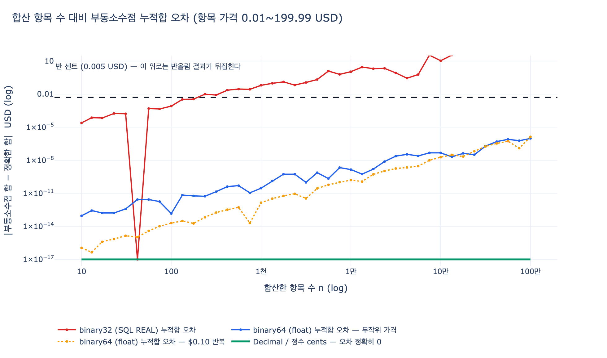

# `Order.total` 과 `Product.price` 가 왜 `decimal (USD)` 인가

## 한 줄 답

`decimal` 은 **정확도**를 위한 선택이고, `(USD)` 는 **의미**를 위한 선택이다.

- **decimal** — 금액은 반올림 오차가 허용되지 않는다. 이진 부동소수점(`float`)은 `0.1`, `19.99` 같은 십진 소수를 애초에 저장하지 못하고, 그 오차가 합산·정산에서 누적돼 1센트가 어긋난다.
- **(USD)** — 단위 없는 수치는 비교도 집계도 성립하지 않는다. 통화를 타입 메타데이터에 못 박아야 `SUM(price)` 가 달러와 원을 조용히 섞어 더하지 않는다.

E-Commerce 온톨로지에서 이 결정은 한 속성이 아니라 **네 속성 전체**에 걸쳐 있다.

| 엔티티 | 속성 | 타입 |
|---|---|---|
| `Buyer` | `totalSpent` | decimal (USD) |
| `Product` | `price` | decimal (USD) |
| `Shopping-Cart` | `subtotal` | decimal (USD) |
| `Order` | `total` | decimal (USD) |

네 속성이 **같은 타입 · 같은 단위**를 공유하기 때문에 "평균 장바구니 값 vs 평균 주문 값", "생애 총 구매액" 같은 교차 집계가 성립한다. 하나라도 `float` 이거나 통화가 빠지면 그 비교는 근거를 잃는다.

---

## 1. 왜 `float` 이 안 되는가 — 이진 부동소수점의 구조적 한계

### 1.1 표현할 수 있는 수의 집합이 다르다

IEEE 754 `binary64`(파이썬 `float`, SQL `DOUBLE PRECISION`)는 값을 다음 꼴로만 표현한다.

$$x = (-1)^{s}\;\times\;\left(1 + \sum_{i=1}^{52} b_i 2^{-i}\right)\;\times\;2^{e}$$

즉 **분모가 2의 거듭제곱인 유리수** $\dfrac{m}{2^{k}}$ 만 정확하다.

$$0.1 = \frac{1}{10} = \frac{1}{2 \cdot 5}$$

분모에 소인수 5가 있으므로 유한한 이진 소수로 쓸 수 없다. 십진법에서 $\frac{1}{3} = 0.333\ldots$ 이 끝나지 않는 것과 같은 현상이다. 실제로 파이썬이 저장하는 값은:

```
float 0.1   -> 0.1000000000000000055511151231257827021181583404541015625
float 19.99 -> 19.989999999999998436805981327779591083526611328125
```

`19.99` 라는 상품 가격은 **DB에 넣는 순간 이미 19.99가 아니다.** 화면에 `19.99` 로 보이는 건 출력 시 가장 짧은 왕복(round-trip) 표현으로 되돌려 인쇄하기 때문일 뿐, 저장된 비트는 다른 수다.

반대로 `decimal` 은 $x = m \times 10^{-k}$ 를 정확히 표현한다. 화폐의 최소 단위가 센트, 즉 $10^{-2}$ 이므로 **손실이 0**이다.

### 1.2 "왜 그동안 문제가 없었는가"가 진짜 함정

오차 하나는 $10^{-16}$ 수준이라 대부분의 경우 반올림하면 정답이 나온다. 그래서 `float` 금액은 **몇 년간 멀쩡하다가** 갑자기 틀린다. 오류가 예외(exception)로 터지지 않고 **그럴듯한 숫자**로 나타나는 것이 금액에서 부동소수점이 위험한 핵심 이유다.

---

## 2. 오차는 어떻게 "돈"이 되는가

### 2.1 합산에서의 누적

`Order.total` 은 항목들의 합이고, `Buyer.totalSpent` 는 주문들의 합이며, 정산 리포트는 그 위의 또 다른 합이다. 순차 합산의 오차 상한은

$$|E_n| \le (n-1)\,\varepsilon \sum_{i=1}^{n} |x_i|, \qquad \varepsilon = 2^{-53} \approx 1.11 \times 10^{-16}$$

이며, 부호가 무작위로 상쇄되면 실제로는 $O(\sqrt{n})$ 정도로 자란다. **중요한 것은 크기가 아니라 경계다.** 오차가 **반 센트($0.005$ USD)** 를 넘는 순간 2자리 반올림 결과가 뒤집히고, 그때부터는 "$10^{-9}$ 짜리 미세 오차"가 아니라 **회계 장부가 1센트 안 맞는 사건**이 된다.

```
[0.10] * 100 을 float 으로 합산  -> 9.99999999999998   (10.00 이 아니다)
Decimal("0.10") * 100            -> 10.00
```

### 2.2 32비트를 고르면 즉시 터진다

많은 스키마가 "금액은 실수니까"라며 SQL `REAL` / `FLOAT4`(binary32)를 고른다. 이때 $\varepsilon_{32} = 2^{-24} \approx 5.96 \times 10^{-8}$ 이라 상황이 완전히 달라진다. 아래는 가격 $0.01\sim199.99$ 를 무작위로 누적한 실측치다.

| 항목 수 $n$ | 누적 총액 | binary32 오차 | binary64 오차 |
|---|---|---|---|
| 100 | $9{,}492 | $8.2 \times 10^{-4}$ | $1.5 \times 10^{-13}$ |
| **222** | — | **반 센트 돌파** | — |
| 1,000 | $100,089 | $0.0625 | $2.9 \times 10^{-11}$ |
| 10,000 | $1,004,968 | **$1.09** | $1.4 \times 10^{-9}$ |
| 1,000,000 | $100,008,182 | **$205.7** | $9.5 \times 10^{-7}$ |

binary32 는 **222건만 더해도** 반올림 결과가 뒤집히고, 100만 건 정산에서는 **$205** 가 사라진다. binary64 는 훨씬 낫지만 그것도 "늦게 틀릴 뿐"이다. `Decimal` / 정수 cents 의 오차는 어느 규모에서도 **정확히 0**이다.

### 2.3 반올림 경계에서의 왜곡

`x.xx5` 형태의 중간값은 float 으로 저장되는 순간 이미 위나 아래로 치우친다.

| 입력 | float 실제 저장값 | `round(f, 2)` | Decimal HALF_UP |
|---|---|---|---|
| `2.675` | 2.67499999999999982236 | **2.67** | **2.68** |
| `1.005` | 1.00499999999999989342 | **1.00** | **1.01** |
| `8.835` | 8.83500000000000085265 | 8.84 | 8.84 |
| `0.125` | 0.12500000000000000000 | **0.12** | **0.13** |

- `2.675`, `1.005` 는 float 이 "절반보다 아래"로 저장해버려 내림된다. 세금 계산서 규칙(HALF_UP)이 무력화된다.
- `0.125` 는 $\frac{1}{8}$ 이라 이진수로 **정확히** 표현되는 진짜 중간값인데, 이번엔 파이썬 `round()` 의 은행가 반올림이 적용돼 `0.12` 가 된다.

즉 float 위에서는 **어떤 반올림 규칙이 적용되는지조차 값마다 달라진다.**

### 2.4 반올림 모드: `ROUND_HALF_EVEN` vs `ROUND_HALF_UP`

`Decimal` 의 장점은 오차가 없는 것에 더해, **반올림 규칙을 선택하도록 강제**한다는 점이다.

| 모드 | 규칙 | 쓰임새 |
|---|---|---|
| `ROUND_HALF_UP` | 정확히 절반이면 항상 올림 | 소비자 청구서, 세금계산서, 대부분의 법정 관행 |
| `ROUND_HALF_EVEN` | 절반이면 짝수 쪽으로 (banker's rounding) | 대량 집계·통계. 파이썬 `Decimal` 기본값, IEEE 754 기본 모드 |

`HALF_EVEN` 이 기본값인 이유는 **편향(bias)** 때문이다. 중간값을 항상 올리면 기대 편향이

$$\mathbb{E}[\text{HALF\_UP bias}] = +\tfrac{1}{2} \times 10^{-k} \times P(\text{tie})$$

로 **한 방향으로 계속 쌓인다**. 실측: `1.05 ~ 5.95` 범위의 중간값 50건을 소수 1자리로 반올림하면

```
정확한 합 : 175.00
HALF_UP   : 177.50   (편향 +2.50)
HALF_EVEN : 175.00   (편향  0.00)
```

50건에 이미 $2.50 이다. 수백만 건 정산에서 이 편향은 무시할 수 없다. 다만 **정답은 상황에 따라 다르다** — 개별 청구서는 `HALF_UP` 이 관행이고, 집계·안분은 `HALF_EVEN` 이 안전하다. 핵심은 "어느 쪽을 쓰는지 스키마와 코드가 명시적으로 답할 수 있어야 한다"는 것이고, float 은 그 질문에 답할 수 없다.

---

## 3. `decimal` vs 정수 minor unit(cents)

정확한 금액 표현에는 두 가지 주류 방식이 있다.

| 방식 | 정확도 | 나눗셈·세금 | 스키마 가독성 | 통화 표현 | 실제 사례 |
|---|---|---|---|---|---|
| `float` / `REAL` | ✗ 손실 | 오차 누적 | 좋음 | 없음 | (쓰면 안 됨) |
| `decimal(12,2) (USD)` | ✓ 십진 정확 | 스케일·반올림 모드 명시 필요 | 좋음 | **타입에 포함** | SQL `NUMERIC`, Java `BigDecimal`, Python `Decimal` |
| `integer cents` | ✓ 완전 정확 | 나눗셈 시 몫/나머지 직접 처리 | 단위 오해 위험 | 별도 컬럼 필요 | Stripe `amount`, 대부분의 결제 API |

### 3.1 정수 cents 방식

$$\text{price}_{\text{USD}} = \frac{\text{price\_cents}}{100}$$

정수 연산은 완전히 정확하고 빠르다. 대신 **나눗셈에서 1원도 잃지 않게 나머지를 명시적으로 분배**해야 한다.

```python
def split_evenly(total_cents: int, n: int) -> list[int]:
    q, r = divmod(total_cents, n)
    return [q + (1 if i < r else 0) for i in range(n)]

split_evenly(10000, 3)  # [3334, 3333, 3333], 합계 10000 — 총액 보존
```

순진하게 나눈 뒤 각자 반올림하면 **1센트가 증발한다(penny leak)**.

```
round(100.00 / 3, 2) * 3 -> [33.33, 33.33, 33.33] = 99.99   (0.01 손실)
```

`float` 로 하면 손실값조차 `0.010000000000005116` 로 나온다.

정수 cents 의 진짜 약점은 **가독성**이다. `amount = 1999` 를 보고 $19.99 인지 $1,999 인지 알려면 스키마 밖의 지식이 필요하다. 소수 3~4자리를 쓰는 통화(예: 쿠웨이트 디나르는 minor unit 3자리)나 단가가 $0.0001 인 광고 CPC 같은 케이스에서는 스케일이 통화·도메인마다 달라져 더 복잡해진다.

### 3.2 그래서 온톨로지는 왜 `decimal (USD)` 인가

온톨로지 스키마는 **저장 구현이 아니라 도메인 의미의 계약**이다. `decimal (USD)` 는

- 정확도를 보장하고,
- `19.99` 라는 값을 사람이 읽는 그대로 표현하며,
- 통화를 타입에 붙여 단위 오해를 원천 차단한다.

실제 구현에서 `INTEGER cents` 로 물리 저장하는 것은 자유다. 온톨로지 타입은 "이 값은 십진 정확도가 요구되는 USD 화폐량"이라는 **제약**을 선언하는 것이고, 물리 스키마는 그 제약을 만족하기만 하면 된다.

---

## 4. `(USD)` — 단위 없는 수치는 값이 아니다

### 4.1 차원 동차성(dimensional homogeneity)

물리량은 언제나 다음 형태다.

$$\text{quantity} = \text{numeric value} \times \text{unit}$$

그리고 **같은 단위끼리만 덧셈·뺄셈·비교가 정의된다.** $3\,\text{m} + 5\,\text{ft}$ 는 환산 없이는 성립하지 않는다. 화폐도 똑같다. `19.99 USD + 25000 KRW` 는 환율이라는 변환 없이는 정의되지 않는 연산이다.

`Product.price : decimal` 만 있고 `(USD)` 가 없으면 데이터베이스는 이 규칙을 강제할 수 없다.

```
raw = [("19.99", "USD"), ("25000", "KRW"), ("5.00", "USD")]

단위를 버린 SUM(price) -> 25024.99
```

**`25024.99` 는 어떤 통화로도 존재하지 않는 값이다.** 그런데 타입이 `decimal` 이기만 하면 이 결과가 틀렸다는 사실을 검출할 방법이 전혀 없다. 반면 통화가 타입에 붙어 있으면 연산이 즉시 실패한다.

```
Money("19.99","USD") + Money("25000","KRW")
-> TypeError: 통화 불일치: USD + KRW
```

**틀린 답을 조용히 내는 것보다 실패하는 편이 낫다.** 이것이 단위를 타입 메타데이터로 올리는 이유다.

### 4.2 온톨로지적 의미 — 타입은 "값의 정체성"이다

온톨로지에서 속성의 타입은 저장 형식이 아니라 **그 값이 무엇인지에 대한 선언**이다. 시나리오의 데이터는 트랜잭션 DB, 검색 엔진, 분석 웨어하우스 세 시스템에 흩어져 있다. 각 시스템은 저장 형식이 다르지만, `Order.total : decimal (USD)` 라는 온톨로지 선언은 셋 모두에 걸쳐 다음을 보장한다.

1. **집계 가능성** — `AVG(cart.subtotal)` 과 `AVG(order.total)` 을 비교하는 것이 의미 있다. 둘 다 USD 이기 때문이다.
2. **조인 안전성** — 여러 시스템에서 온 금액을 한 쿼리에서 더할 수 있다.
3. **검증 가능성** — 다른 통화 값이 들어오면 스키마 위반으로 잡힌다.
4. **의미 보존** — 시간이 지나도 "이 컬럼의 42가 뭘 뜻하는지" 를 두고 팀이 추측하지 않는다.

`datetime`, `integer`(예: `stockQty`, `rating`), `boolean`(`verified`) 과 마찬가지로 `decimal (USD)` 도 **쿼리가 성립하는 조건을 스키마 수준에서 못 박는 장치**다. 다국가 마켓플레이스로 확장한다면 온톨로지는 `price : decimal (USD)` 대신 `price : Money(amount: decimal, currency: ISO-4217)` 라는 **복합 값 객체**로 진화해야 하며, 이때에도 원칙은 같다 — 수치와 단위는 절대 분리되지 않는다.

---

## 5. 실무 체크리스트

- 금액 컬럼에 `FLOAT` / `REAL` / `DOUBLE` 을 쓰지 않는다. `NUMERIC(p, s)` 또는 정수 minor unit 을 쓴다.
- `Decimal` 을 만들 때 **문자열에서** 만든다. `Decimal(0.1)` 은 이미 오염된 float 을 받는다 — `Decimal("0.1")` 이어야 한다.
- JSON 직렬화 주의: 기본 JSON 파서는 숫자를 float 으로 읽는다. 금액은 **문자열로 직렬화**하거나 파서에 `parse_float=Decimal` 을 지정한다.
- 반올림 모드(`HALF_UP` / `HALF_EVEN`)와 스케일(소수 자릿수)을 도메인 규칙으로 문서화한다.
- 안분·할인·세금 계산 후에는 **총액 보존(합이 원래 총액과 같은지)** 을 단언(assert)한다.
- 통화 컬럼(또는 통화가 박힌 타입)을 금액과 **항상 함께** 둔다. 단일 통화 서비스라도 미래의 확장을 위해.
- 환율 변환된 금액은 별도 속성으로 두고 **환율과 기준 시각**을 함께 기록한다. 변환은 손실 연산이다.

---

## 시각화



가로축은 합산한 항목 수, 세로축은 정확한 합과의 절대 오차(USD, 로그 스케일)다. 검은 점선이 **반 센트(0.005 USD)** — 이 선 위로 올라가면 반올림 결과가 실제로 뒤집힌다.

- 빨강(binary32 / SQL `REAL`): $n \approx 222$ 에서 이미 경계를 넘고, 100만 건에서 $205 를 잃는다.
- 파랑·주황(binary64 / `float`): 훨씬 낫지만 오차는 **단조롭게 자란다**. 늦게 틀릴 뿐이다.
- 초록(`Decimal` / 정수 cents): 어느 규모에서도 오차 **정확히 0** (그래프상 바닥선은 로그축 표기를 위한 하한값일 뿐, 실제 값은 0이다).
