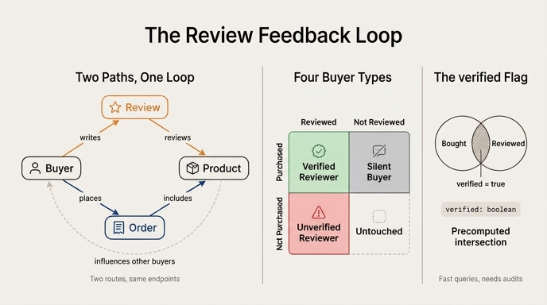

# 피드백 루프를 만드는 경로

## 정답 요약

`Buyer → writes → Review → reviews → Product`

구매자가 상품을 소비한 뒤 리뷰를 쓰고, 그 리뷰가 다른 구매자의 선택에 영향을 주며 다시 Product로 되돌아오는 사이클을 만든다.

---

## 1. Buyer와 Product를 잇는 두 개의 경로

E-Commerce 온톨로지가 완성되면 Buyer에서 Product로 가는 길이 **두 갈래**가 된다.

| 경로 | 관계 체인 | 의미 |
|---|---|---|
| 구매 경로 | `Buyer → places → Order → includes → Product` | 실제로 돈을 내고 산 상품 |
| 리뷰 경로 | `Buyer → writes → Review → reviews → Product` | 평가·의견을 남긴 상품 |

(참고로 3번째 경로도 있다: `Buyer → has_cart → Shopping-Cart → contains → Product` — 아직 사지 않은 "고려 중" 상품. 다만 카트는 결제 전 세션 상태라서 피드백 루프의 구성원은 아니다.)

Step 1~2까지의 그래프는 Buyer에서 Product로 가는 길이 사실상 하나(주문 경로, 혹은 카트 경로)뿐인 **선형 체인**이었다. Review가 추가되는 순간 두 번째 독립 경로가 생기면서 그래프의 성격이 바뀐다.

```
                writes            reviews
        ┌──────────────► Review ──────────┐
        │                                 ▼
     Buyer                             Product
        │                                 ▲
        └──────────────► Order ───────────┘
                places            includes
```

두 경로의 **출발점(Buyer)과 도착점(Product)이 같다**. 이 "같은 두 점을 잇는 서로 다른 두 길"이 원문에서 말하는 loop다.

---

## 2. 그래프에서 "루프"란 정확히 무엇인가

여기서 헷갈리기 쉬운 지점이 있다. 그래프 이론 용어로 정확히 구분하면:

- **Self-loop (자기 순환)**: 노드가 자기 자신을 가리키는 간선. 여기엔 없다.
- **Directed cycle (방향 순환)**: 화살표를 따라가면 출발한 노드로 되돌아오는 것. `Product → ... → Product` 같은 것. **이 온톨로지에는 없다.** 모든 화살표가 Buyer 쪽에서 Product 쪽으로 흐르므로, 방향을 지키면서 원래 자리로 돌아올 수는 없다. 이 그래프는 엄밀히 말하면 DAG(비순환 방향 그래프)다.
- **Undirected cycle / 대체 경로 (alternative path)**: 화살표 방향을 무시하고 보면 `Buyer → Review → Product ← Order ← Buyer`로 닫힌 고리가 만들어진다. 다이아몬드(diamond) 구조라고도 부른다. **원문의 "cycle back to Product"가 가리키는 것은 바로 이것이다.**

그럼 "피드백"은 어디서 오는가? 스키마 수준이 아니라 **의미(semantic) 수준**이다.

```
Buyer A ──구매──► Product ──소비──► Buyer A ──리뷰 작성──► Review
                                                            │
                                                            │ 영향
                                                            ▼
                                              Buyer B ──구매 결정──► Product
```

Review 노드가 다른 Buyer의 구매 결정에 입력값으로 되먹임(feedback)된다. 개별 Buyer 인스턴스 수준에서 보면 화살표가 닫히지 않지만, **Buyer라는 집합 전체를 하나로 보면 정보가 Product → Review → Buyer → Order → Product로 순환**한다. 그래서 "루프"라고 부른다.

시험에서 요구하는 답은 이 세 가지 중 하나를 담고 있으면 된다:
1. Buyer에서 Product로 가는 **두 번째 경로**가 생겼다는 것
2. 그 경로가 `writes → reviews`라는 것
3. 그 결과 두 경로를 **비교하는 질의**가 가능해졌다는 것

---

## 3. 두 경로의 유무 조합 — 구매자 4분면

루프의 진짜 가치는 "닫힌 고리가 예쁘다"가 아니라, **두 경로의 존재/부재를 조합해 집합 연산을 할 수 있다**는 데 있다. Buyer-Product 쌍마다 두 경로를 각각 O/X로 놓으면 4가지 유형이 나온다.

| # | 구매 경로 | 리뷰 경로 | 유형 | 비즈니스 의미 |
|---|---|---|---|---|
| 1 | O | O | **검증된 리뷰어** (verified reviewer) | 가장 신뢰도 높은 피드백. `verified = true`의 근거. 추천 알고리즘·평점 가중치의 핵심 신호 |
| 2 | O | X | **침묵하는 구매자** | 리뷰 요청 캠페인 대상. 평점 데이터의 결측 구간이며, 만족한 다수가 여기 숨어 있어 평점이 극단으로 편향되는 원인이 된다 |
| 3 | X | O | **미구매 리뷰어** | 어뷰징·가짜 리뷰 탐지의 1순위 후보. 다만 선물 수령, 오프라인 구매, 타 채널 구매처럼 정당한 경우도 있어 즉시 삭제가 아니라 조사 대상 |
| 4 | X | X | **미접촉** | 아직 관계가 없는 잠재 고객. 추천·타게팅의 대상 공간 |

Scenario Overview에 나오는 대표 질문이 정확히 3번 유형이다.

> "Which verified reviewers rated products they didn't purchase?"
> → `Buyer`가 `writes → Review → reviews → Product` 경로는 갖지만, 같은 Product에 대해 `places → Order → includes → Product` 경로는 갖지 않는 경우를 찾아라.

이것이 Complete Platform 퀴즈 해설의 요지이기도 하다. **"산 것 vs 리뷰한 것"의 비교 질의는 Product로 가는 길이 두 개일 때만 성립한다.** 경로가 하나뿐이면 비교 대상 자체가 없다. 그래서 "feedback loops create richer query paths than linear chains"가 핵심 takeaway로 남는다.

2번 유형은 전환 퍼널의 다른 쪽 끝이기도 하다. Cart까지 포함하면 `Cart에는 담았지만 Order 없음`(장바구니 이탈) → `Order는 있지만 Review 없음`(리뷰 미작성)으로 이어지는 단계별 이탈 분석이 하나의 그래프 위에서 가능해진다.

---

## 4. `verified` 플래그는 두 경로의 교집합을 물질화한 값

Review 엔티티의 속성을 보자.

| Property | Type |
|---|---|
| `reviewId` | string (식별자) |
| `rating` | integer |
| `title` | string |
| `body` | string |
| `verified` | boolean |

`verified`는 "이 리뷰를 쓴 사람이 그 상품을 실제로 샀는가"를 뜻한다. 이걸 그래프 언어로 다시 쓰면:

```
review.verified == (
  해당 Review의 writer(Buyer)와 해당 Review의 대상(Product) 사이에
  places → Order → includes 경로가 존재하는가
)
```

즉 **`verified`는 새로운 정보가 아니라, 위 4분면의 1번(구매 O + 리뷰 O)에 해당하는지를 미리 계산해 Review 노드에 박아둔 값**이다. Shopping-Cart의 `itemCount`, `subtotal`이 카트 내용물로부터 계산 가능한데도 저장해 두는 것과 같은 **비정규화(denormalization)** 패턴이다.

왜 저장해 두는가:
- **질의 속도**: 매번 두 경로를 조인하는 대신 boolean 하나만 필터하면 된다. GQL 예제도 `WHERE r.verified = true` 한 줄로 끝난다.
- **표시용 신뢰 신호**: 상품 페이지에 "구매 인증" 배지를 붙이려면 조회 시점에 즉답이 필요하다.
- **시점 고정**: 리뷰 작성 당시의 구매 사실을 스냅샷으로 남긴다. 주문이 취소·환불되어도 판단 기준을 유지할 수 있다.

대가도 있다: **일관성 위험**. 저장된 `verified` 값과 실제 그래프 경로가 어긋날 수 있다(주문 취소, 데이터 이관 오류, 어뷰징). 그래서 실무에서는 `verified = true`인데 구매 경로가 없는 리뷰를 찾는 **정합성 감사 질의**를 주기적으로 돌린다. 이건 4분면의 3번 유형을 잡아내는 질의와 정확히 같다.

```gql
MATCH (b:Buyer)-[:writes]->(r:Review)-[:reviews]->(p:Product)
WHERE r.verified = true
  AND NOT EXISTS { MATCH (b)-[:places]->(:Order)-[:includes]->(p) }
RETURN b.buyerId, r.reviewId, p.sku
```

---

## 5. 핵심 정리

- 피드백 루프 경로는 `Buyer → writes → Review → reviews → Product`.
- 이 경로는 기존 구매 경로 `Buyer → places → Order → includes → Product`와 **같은 두 노드를 잇는 두 번째 길**이라서 루프가 된다.
- 화살표 방향까지 따지면 순환(directed cycle)이 아니라 대체 경로(다이아몬드 구조)다. "피드백"은 리뷰가 다른 구매자의 결정에 되먹임된다는 **의미론적** 순환에서 온다.
- 두 경로의 O/X 조합이 구매자 4분면(검증된 리뷰어 / 침묵하는 구매자 / 미구매 리뷰어 / 미접촉)을 만들고, 각각이 다른 액션으로 이어진다.
- `verified`는 그 4분면 중 "구매 O + 리뷰 O" 교집합을 미리 계산해 저장한 비정규화 플래그다. 편하지만 그래프 원본과 어긋날 수 있으므로 감사 질의가 필요하다.
- 최종 온톨로지: 5 엔티티(Buyer, Product, Order, Shopping-Cart, Review), 6 관계(places, includes, has_cart, contains, writes, reviews).

## 인포그래픽


