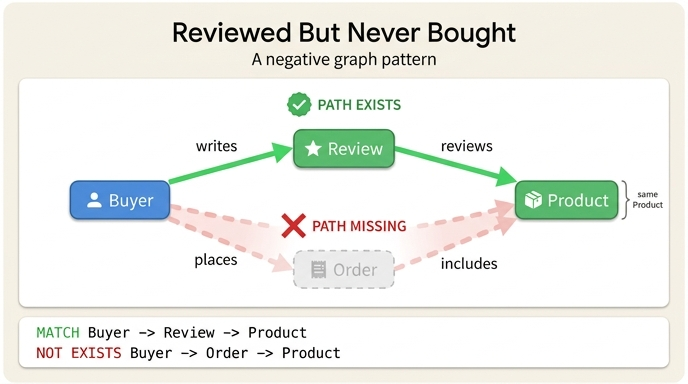

# 힌트: "구매하지 않은 상품을 리뷰한 구매자"의 그래프 패턴

## 한 줄 요약

**두 경로의 차집합(negative pattern)** 이다. 리뷰 경로는 있는데, **같은 Product를 향한** 구매 경로는 없는 `Buyer`를 찾는다.

```
있어야 함:  Buyer --writes--> Review --reviews--> Product
없어야 함:  Buyer --places--> Order  --includes--> Product   (동일한 Product!)
```

---

## 왜 이 질문이 중요한가

원문(Scenario Overview)은 온톨로지가 필요한 이유를 이 질문 하나로 설명한다.

> A question like **"Which verified reviewers rated products they didn't purchase?"** requires joining across buyers, reviews, orders, and products — touching multiple systems.
>
> With an ontology, this becomes a graph pattern: find `Buyer` nodes that have a `writes → Review → reviews → Product` path but no `places → Order → includes → Product` path for the same product.

즉 이 질문은 **buyers / reviews / orders / products** 네 개의 데이터를 가로지른다. 시나리오상 이 데이터들은 각각 다른 시스템에 흩어져 있다.

- 주문 → 트랜잭션 데이터베이스
- 상품 → 검색 엔진
- 구매자 행동 → 분석 웨어하우스

전통적인 방식이라면 시스템 3~4곳에서 데이터를 뽑아 조인 SQL을 짜야 한다. 온톨로지가 있으면 **"이런 모양의 경로를 가진 노드를 찾아줘"** 라는 **하나의 그래프 패턴**으로 표현된다. 이것이 온톨로지의 실용적 가치다.

---

## 패턴을 구성하는 두 경로

이 e-commerce 온톨로지에서 Buyer가 Product에 도달하는 경로는 **두 가지**다. (Cart 경로까지 포함하면 세 가지)

### 경로 A — 리뷰 경로 (존재해야 함)

| 관계 | 방향 | 카디널리티 |
|---|---|---|
| `writes` | `Buyer` → `Review` | one-to-many (한 구매자가 여러 리뷰 작성) |
| `reviews` | `Review` → `Product` | many-to-one (리뷰 하나는 상품 하나에 대해서만) |

### 경로 B — 구매 경로 (존재하면 안 됨)

| 관계 | 방향 | 카디널리티 |
|---|---|---|
| `places` | `Buyer` → `Order` | one-to-many (한 구매자가 여러 주문) |
| `includes` | `Order` → `Product` | many-to-many (주문에 여러 상품, 상품은 여러 주문에) |

### 핵심 제약: "같은 Product"

가장 놓치기 쉬운 부분이다. 단순히 "리뷰는 썼는데 주문 기록이 아예 없는 사람"을 찾는 게 **아니다**.

- ❌ 잘못된 해석: `Buyer`에게 `places` 관계가 하나도 없다
- ✅ 올바른 해석: 리뷰 경로가 도달한 **바로 그 Product 노드**로 이어지는 구매 경로가 없다

구매자가 상품 X, Y를 샀더라도 상품 Z를 리뷰했다면 이 패턴에 걸린다. 즉 **두 경로의 종착 노드가 동일한 Product로 바인딩**되어야 하며, 그 바인딩 하에서 경로 B의 부재를 검사한다.

---

## 왜 "피드백 루프"가 이 질문을 가능하게 하는가

Review 엔티티를 추가하기 전(Step 1~2)에는 Buyer에서 Product로 가는 길이 구매 경로(와 카트 경로)뿐이었다. Review가 들어오면서 **같은 두 노드를 잇는 두 번째, 서로 다른 경로**가 생긴다.

원문의 표현:

> **Feedback loop:** The path `Buyer → writes → Review → reviews → Product` creates a cycle back to Product — buyers consume products, then review them, influencing other buyers.

그리고 퀴즈 해설:

> Without Review, the path from Buyer to Product only goes through Order. Review creates a second path — Buyer → Review → Product — forming a loop. This **dual-path structure** enables comparative queries (e.g. "bought but didn't review" vs "reviewed but didn't buy").

**두 개의 경로가 있어야 비교가 성립한다.** 경로가 하나뿐이면 "있다/없다"만 물을 수 있지만, 두 경로가 있으면 그 **교집합·차집합**을 물을 수 있다.

| 질문 | 패턴 |
|---|---|
| 사고 리뷰도 한 구매자 | 경로 A **AND** 경로 B (교집합) |
| 샀지만 리뷰 안 한 구매자 | 경로 B **AND NOT** 경로 A |
| **리뷰했지만 사지 않은 구매자** | **경로 A AND NOT 경로 B** ← 이 카드 |
| 카트에만 담고 안 산 구매자 | `has_cart → contains` AND NOT `places → includes` |

---

## GQL / Cypher로 써 보면

원문에는 아래 형태의 쿼리 예시가 있다 (긍정 패턴만).

```gql
MATCH (b:Buyer)-[:has_cart]->(c:Cart)-[:contains]->(p:Product)<-[:reviews]-(r:Review)
WHERE r.verified = true
RETURN p.name, r.rating, r.title
```

이 카드의 패턴은 여기에 **부정 조건(NOT EXISTS)** 을 붙인 형태다.

```gql
MATCH (b:Buyer)-[:writes]->(r:Review)-[:reviews]->(p:Product)
WHERE NOT EXISTS {
  MATCH (b)-[:places]->(:Order)-[:includes]->(p)
}
RETURN b.buyerId, p.sku, r.rating
```

`NOT EXISTS { ... }` 안에서 `b`와 `p`가 **바깥 MATCH의 같은 변수를 재사용**한다는 점이 "같은 Product에 대해"라는 제약을 코드로 표현한 것이다.

원문의 원래 질문("Which **verified** reviewers rated products they didn't purchase?")까지 반영하면 `WHERE r.verified = true AND NOT EXISTS { ... }`가 된다. 이 조합은 특히 흥미로운데, `verified`는 "리뷰어가 실제로 구매했는가"를 나타내는 신뢰 신호이기 때문이다.

> The `verified` boolean indicates whether the reviewer actually purchased the product — a critical trust signal.

따라서 `verified = true`인데 구매 경로가 없다면 **데이터 무결성 위반 또는 리뷰 조작 신호**를 잡아내는 감사(audit) 쿼리가 된다. 반대로 `verified = false`인 정상 케이스만 잡고 싶다면 조건을 뒤집으면 된다.

---

## 관련 엔티티·관계 요약 (5 entities, 6 relationships)

```
                 has_cart (1:1)          contains (M:N)
        Buyer ─────────────────> Shopping-Cart ─────────────> Product
          │                                                      ▲
          │ places (1:N)        includes (M:N)                   │
          ├──────────────────> Order ───────────────────────────>┤
          │                                                      │
          │ writes (1:N)        reviews (N:1)                    │
          └──────────────────> Review ──────────────────────────>┘
```

| 엔티티 | 식별자 | 주요 속성 |
|---|---|---|
| Buyer | `buyerId` | email, memberSince, loyaltyTier, totalSpent |
| Product | `sku` | name, category, price, stockQty |
| Order | `orderId` | orderDate, status, total, shippingMethod |
| Shopping-Cart | `cartId` | createdAt, itemCount, subtotal |
| Review | `reviewId` | rating, title, body, **verified** |

---

## 암기 포인트

1. **경로 A(리뷰)는 있고, 경로 B(구매)는 없다** — 존재/부재의 조합
2. 방향과 관계명: `writes → reviews` vs `places → includes`
3. **"같은 Product에 대해"** — 두 경로가 같은 Product 노드에 바인딩되어야 함
4. 이런 부정 패턴이 가능한 이유는 Review가 만든 **dual-path(피드백 루프)** 구조 때문

## 인포그래픽


