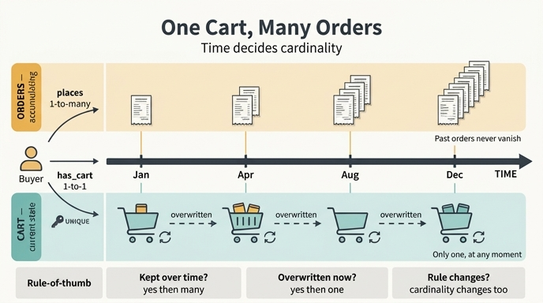

# 왜 `has_cart`는 one-to-one인데 `places`는 one-to-many인가?

## 한 줄 답

장바구니는 **현재 상태(current-state)** 엔티티라 어느 시점에든 활성 장바구니가 하나뿐이지만, 주문은 **시간이 흐르며 누적(accumulating)** 되기 때문이다.

---

## 1. 카디널리티는 "취향"이 아니라 "시간축"의 결과다

관계의 카디널리티를 정할 때 흔한 실수는 "지금 데이터가 이렇게 생겼으니까"로 결정하는 것이다. 실제 판단 기준은 훨씬 단순하다.

> **이 관계의 반대편 노드는 시간이 지나면 쌓이는가, 아니면 덮어써지는가?**

| | `Buyer -[places]-> Order` | `Buyer -[has_cart]-> Shopping-Cart` |
|---|---|---|
| 시간에 대한 성격 | 누적 이력 (append-only) | 현재 상태 (mutable, 하나) |
| 2년 뒤 개수 | 47개, 계속 증가 | 여전히 1개 |
| 과거 값 | 보존됨 (주문 #1은 영원히 존재) | 사라짐 (체크아웃되면 비워짐/새 카트) |
| 카디널리티 | one-to-many | one-to-one |

Order는 **이벤트(event)** 다. 이벤트는 일어난 순간 기록으로 굳어지고, 다음 이벤트가 그 위에 쌓인다. 지운다는 개념 자체가 이상하다 — "작년 3월 주문"은 사실이고, 사실은 없어지지 않는다. 그래서 Buyer 하나에 Order가 계속 매달린다 → one-to-many.

Shopping-Cart는 **상태(state)** 다. 상태는 "지금 이 사람의 장바구니는 무엇인가"라는 질문에 대한 단 하나의 답이다. 상품을 담고 빼면 같은 카트가 변할 뿐, 카트가 늘어나지 않는다. 체크아웃하면 카트는 Order로 전환되고 다시 비워진다 → one-to-one.

**같은 Buyer, 같은 그래프인데 카디널리티가 다른 이유는 반대편 엔티티가 시간을 다루는 방식이 다르기 때문이다.**

아티클의 표현을 그대로 빌리면:

> A buyer accumulates orders over time but only has one cart at any moment.

여기서 핵심 대비어는 **over time(시간에 걸쳐)** vs **at any moment(어느 한 시점에)** 다.

---

## 2. 판별용 질문 3종 세트

새 관계의 카디널리티가 헷갈릴 때 이렇게 물어보면 된다.

1. **"어제 것도 남아 있어야 하나?"**
   - 남아야 한다 → 누적 → one-to-many (Order, Review, Payment, ShipmentEvent)
   - 남을 필요 없다 / 지금 것만 의미 있다 → 현재 상태 → one-to-one (Cart, ActiveSession, CurrentAddress)

2. **"두 개가 동시에 존재하면 사용자에게 무슨 일이 벌어지나?"**
   - Order 두 개 동시 존재 → 정상. 그냥 주문 두 번 한 것.
   - Cart 두 개 동시 존재 → "내 장바구니 보기"를 눌렀을 때 **어느 걸 보여줄지 결정할 수 없다.** 이게 곧 버그다. 답이 모호해지면 그건 one-to-one이어야 한다는 신호다.

3. **"이 엔티티는 만들어지는가, 갱신되는가?"**
   - INSERT 중심 → many
   - UPDATE 중심 → one

---

## 3. one-to-one이 실제로 보장하는 것: 유일성 제약(uniqueness constraint)

one-to-one은 그림에서 화살표를 예쁘게 그리자는 표기 문제가 아니다. **데이터에 강제되는 제약**이다.

`has_cart`가 one-to-one이라고 선언하면 다음 두 가지가 동시에 걸린다.

- **정방향 유일성**: 한 Buyer는 최대 1개의 Shopping-Cart를 가진다.
- **역방향 유일성**: 한 Shopping-Cart는 정확히 1명의 Buyer에게 속한다. (카트를 공유할 수 없다)

구현 레벨로 내려가면 대략 이렇게 나타난다.

```sql
-- Shopping-Cart 테이블에 buyer_id 외래키 + UNIQUE 제약
CREATE TABLE shopping_cart (
  cart_id   TEXT PRIMARY KEY,
  buyer_id  TEXT NOT NULL UNIQUE  REFERENCES buyer(buyer_id),  -- ← UNIQUE 가 one-to-one
  created_at TIMESTAMP,
  item_count INTEGER,
  subtotal   NUMERIC
);

-- 반면 places 는 UNIQUE 없음 → one-to-many
CREATE TABLE "order" (
  order_id  TEXT PRIMARY KEY,
  buyer_id  TEXT NOT NULL REFERENCES buyer(buyer_id),  -- UNIQUE 없음
  order_date TIMESTAMP,
  ...
);
```

`UNIQUE` 한 줄의 유무가 곧 one-to-one과 one-to-many의 차이다.

이 제약이 실제로 사주는 이득:

- **쿼리 결과의 형태가 확정된다.** `buyer.cart`는 리스트가 아니라 단일 객체다. 애플리케이션 코드에서 `carts[0]`이나 `ORDER BY created_at DESC LIMIT 1` 같은 "여러 개 중 하나 고르기" 로직이 사라진다.
- **모호한 상태가 애초에 저장되지 않는다.** 동시 요청으로 카트가 두 개 생기는 레이스 컨디션이 DB 레벨에서 거부된다. 제약이 없으면 이런 데이터는 조용히 들어왔다가 나중에 "장바구니 상품이 사라졌어요" 버그로 터진다.
- **집계가 안전해진다.** `SUM(cart.subtotal)`을 buyer 기준으로 조인해도 중복 계산이 일어나지 않는다. one-to-many를 잘못 조인하면 fan-out으로 금액이 부풀려지는 고전적 실수가 생기는데, one-to-one은 구조적으로 이를 막는다.

반대로 이 제약을 **일부러 걸지 않으면** 무슨 일이 벌어지는지를 생각해 보면 one-to-one의 가치가 선명해진다. `has_cart`를 one-to-many로 풀어놓는 순간, "활성 카트는 하나"라는 규칙은 DB가 아니라 **애플리케이션 코드의 암묵적 관행**이 된다. 즉, 언젠가는 반드시 깨진다.

---

## 4. 카디널리티는 비즈니스 규칙의 그림자다 — 규칙이 바뀌면 같이 바뀐다

이 부분이 가장 중요하다. **one-to-one은 우주의 진리가 아니라, 지금 이 플랫폼이 선택한 비즈니스 규칙의 인코딩이다.**

`has_cart`가 one-to-one인 이유는 "장바구니라는 것의 본질" 때문이 아니라, 이 마켓플레이스가 **"버려는 한 번에 하나의 활성 쇼핑 세션만 가진다"** 는 규칙을 채택했기 때문이다. 규칙이 바뀌면 카디널리티도 따라 바뀐다.

### 시나리오 A: 저장된 장바구니(saved carts) 도입

"나중에 살 것" 카트를 여러 개 만들 수 있게 하면?

- `Buyer -[has_cart]-> Shopping-Cart` 가 **one-to-many** 로 바뀐다.
- 대신 Shopping-Cart에 `isActive: boolean` 또는 `status: active|saved` 속성이 필요해진다.
- "활성 카트는 하나"라는 규칙은 이제 관계 카디널리티가 아니라 **속성 위의 부분 유일성 제약(partial unique constraint)** 으로 옮겨간다.
  ```sql
  CREATE UNIQUE INDEX one_active_cart
    ON shopping_cart (buyer_id) WHERE status = 'active';
  ```
- 또는 아예 관계를 둘로 쪼갠다: `has_active_cart` (one-to-one) + `has_saved_cart` (one-to-many).

### 시나리오 B: 위시리스트를 여러 개 허용

"생일 선물", "캠핑 장비" 같은 위시리스트를 여러 개 만들 수 있게 하면 `Buyer -[has_wishlist]-> Wishlist`는 처음부터 one-to-many다. 위시리스트는 카트와 겉모습이 비슷하지만 (상품 목록을 담는 컨테이너) **체크아웃으로 소멸하지 않고 계속 남는다** — 즉 현재 상태가 아니라 누적/영속 엔티티다. 그래서 카디널리티가 다르다.

### 시나리오 C: 멀티 디바이스 / 멀티 스토어

한 계정이 웹과 모바일에서 별도 카트를 유지하거나, 마켓플레이스가 판매자(seller)별로 카트를 분리한다면 (아마존의 여러 판매자 장바구니 분리와 비슷) `has_cart`는 one-to-many가 되고, 유일성은 `(buyerId, deviceId)` 또는 `(buyerId, sellerId)` 조합에 걸린다.

### 시나리오 D: 게스트 체크아웃

로그인 없이 카트를 만들 수 있게 하면 카트가 Buyer 없이도 존재해야 한다. one-to-one의 "정확히 1명"이 "0 또는 1명"으로 완화된다 — 즉 **optional one-to-one (0..1)** 이 된다. 이건 카디널리티뿐 아니라 **필수성(optionality)** 도 모델링 축이라는 점을 보여준다.

> **정리:** 카디널리티를 정할 때 "장바구니는 원래 하나잖아요"라고 답하면 안 된다. "우리 서비스는 활성 장바구니를 하나만 허용하기로 했다"가 옳은 답이다. 전자는 반박 불가능한 것처럼 들리지만 요구사항이 바뀌는 순간 무너지고, 후자는 언제 다시 검토해야 하는지를 스스로 알려준다.

---

## 5. 대안: one-to-one 관계를 아예 속성으로 흡수하기

one-to-one을 발견하면 항상 던져봐야 하는 질문이 있다.

> **"이걸 굳이 별도 엔티티로 둘 필요가 있나? Buyer의 속성으로 접어 넣으면 안 되나?"**

한쪽이 정확히 하나뿐이라면, 이론적으로는 그 필드들을 부모 엔티티에 그냥 붙일 수 있다.

```
# 별도 엔티티 안                     # 속성 흡수 안
Buyer                                Buyer
  buyerId ✓                            buyerId ✓
  email                                email
  ...                                  ...
  -[has_cart]-> Shopping-Cart          cartItemCount: integer
                  cartId ✓             cartSubtotal: decimal
                  createdAt            cartUpdatedAt: datetime
                  itemCount
                  subtotal
```

둘 다 "정보량"은 같아 보인다. 그런데 이 예제 온톨로지는 별도 엔티티를 선택했다. 왜?

### 별도 엔티티로 유지해야 하는 신호

1. **그 엔티티에서 또 다른 관계가 뻗어나간다** ← 이 케이스에서 결정적
   `Shopping-Cart -[contains]-> Product` (many-to-many)가 존재한다. 속성으로 흡수하면 이 관계를 걸 곳이 없어진다. Buyer에서 직접 Product로 `has_in_cart`를 그릴 수도 있지만, 그러면 "카트 생성 시각", "카트 단위 subtotal" 같은 **관계 자체에 붙는 정보**를 표현할 수 없다. **관계에 속성이 필요하면 그것은 엔티티다.**

2. **독자적인 식별자(identity)가 의미를 가진다**
   `cartId`가 존재한다는 건 카트를 로그, 이벤트 스트림, 분석 파이프라인에서 개별적으로 지목할 수 있다는 뜻이다. "cart_abandoned 이벤트의 cartId"처럼. 속성으로 흡수하면 지목할 대상이 없다.

3. **생명주기(lifecycle)가 부모와 다르다**
   카트는 생성되고, 만료되고, 비워진다. Buyer는 계속 존재한다. 생명주기가 다르면 분리하는 편이 자연스럽다. 흡수하면 "카트를 비운다"가 "Buyer의 필드 3개를 NULL로 만든다"가 되어 의미가 흐려진다.

4. **미래에 one-to-many가 될 가능성이 있다**
   4절의 시나리오 A/C를 보면 `has_cart`는 언제든 one-to-many가 될 수 있다. 이미 별도 엔티티라면 카디널리티 숫자만 바꾸면 되지만, 속성으로 흡수했다면 **엔티티를 새로 만들고 데이터를 마이그레이션하는 대공사**가 된다. one-to-one은 종종 "아직 one-to-many가 아닐 뿐"인 관계다.

5. **접근 권한·저장 위치·갱신 빈도가 다르다**
   카트는 초 단위로 갱신되는 세션 데이터(Redis 등)이고 Buyer는 안정적인 마스터 데이터일 수 있다. 물리적으로 다른 곳에 사는 데이터를 한 엔티티로 뭉치면 온톨로지가 실제 시스템 구조를 왜곡한다.

### 반대로 흡수하는 게 나은 신호

- 필드가 1~2개뿐이고 (`loyaltyTier`, `totalSpent`처럼) 다른 곳으로 관계가 뻗지 않는다.
- 항상 부모와 함께 조회되고, 항상 부모와 함께 생성·삭제된다.
- 독립적으로 이름 붙여 부를 일이 없다 ("이 buyer의 프로필 설정 레코드" 같은 건 그냥 buyer의 필드다).
- 예: `Buyer -[has_profile]-> Profile(displayName, avatarUrl)` — 이건 그냥 Buyer 속성으로 넣는 게 맞다.

> **판단 기준 한 줄:** one-to-one 상대편에서 **밖으로 나가는 화살표가 있거나, 독립적인 생명주기·식별자가 필요하면 엔티티**. 그저 필드 묶음일 뿐이면 **속성**.
>
> 참고로 이 판단은 정규화 이론의 관점과도 일치한다 — one-to-one은 관계형 모델에서 "수직 분할(vertical partitioning)"에 해당하며, 성능·선택적 존재(nullable 덩어리)·접근 제어·확장 여지 같은 실용적 이유가 있을 때만 분리를 정당화한다.

---

## 6. 쿼리에서 드러나는 차이

카디널리티 차이는 결국 쿼리 모양으로 드러난다. 아티클의 GQL 예시를 보자.

```gql
MATCH (b:Buyer)-[:has_cart]->(c:Cart)-[:contains]->(p:Product)<-[:reviews]-(r:Review)
WHERE r.verified = true
RETURN p.name, r.rating, r.title
```

`(b)-[:has_cart]->(c)`는 buyer당 정확히 한 행으로 확장된다 — 팬아웃 없음. 반면 `places`를 타면 buyer당 주문 수만큼 행이 늘어난다. 그래서:

- **카트 기반 질문**은 "지금(now)"에 대한 질문이다 — "장바구니가 차 있는데 주문이 없는 구매자는?" (이탈/전환 분석)
- **주문 기반 질문**은 "기간(over a period)"에 대한 질문이다 — "이번 분기 매출은?", "재구매율은?" — 반드시 시간 필터나 집계가 따라붙는다.

이게 두 관계의 성격 차이를 가장 직관적으로 보여준다. **one-to-one 관계에는 시간 필터가 필요 없고, one-to-many 관계에는 거의 항상 필요하다.**

---

## 7. 같은 원리로 나머지 관계 읽어보기

이 온톨로지의 6개 관계 전부를 같은 렌즈로 볼 수 있다.

| 관계 | 카디널리티 | 왜 |
|---|---|---|
| `Buyer -[places]-> Order` | one-to-many | 주문은 시간에 따라 누적 |
| `Buyer -[has_cart]-> Shopping-Cart` | one-to-one | 카트는 현재 상태, 시점당 하나 |
| `Buyer -[writes]-> Review` | one-to-many | 리뷰도 누적 (Order와 같은 성격) |
| `Order -[includes]-> Product` | many-to-many | 주문에 여러 상품, 상품은 여러 주문에 |
| `Shopping-Cart -[contains]-> Product` | many-to-many | 위와 동일 |
| `Review -[reviews]-> Product` | many-to-one | 리뷰 하나는 상품 하나에 대한 것 |

`writes`가 `has_cart`가 아니라 `places`와 같은 편에 서 있다는 점에 주목하자. 리뷰도 이벤트이고 누적되기 때문이다. **Buyer에서 나가는 세 관계 중 유일하게 `has_cart`만 one-to-one인 이유가 바로 "현재 상태"라는 성격 하나뿐이다.**

---

## 8. 암기 포인트

- **누적 이력 → one-to-many / 현재 상태 → one-to-one.** 카디널리티를 결정하는 건 시간축이다.
- 판별 질문: *"어제 것도 남아 있어야 하나?"* / *"두 개가 동시에 있으면 어떤 걸 보여줘야 하나?"*
- one-to-one이 보장하는 실체는 **유일성 제약** — DB의 `UNIQUE`, 쿼리 결과의 단일성, 팬아웃 없는 안전한 집계.
- 카디널리티는 **비즈니스 규칙의 인코딩**이다. 저장된 장바구니, 다중 위시리스트, 판매자별 카트, 게스트 체크아웃 — 규칙이 바뀌면 one-to-one은 one-to-many나 0..1로 바뀐다.
- one-to-one을 보면 항상 **"엔티티인가 속성인가"** 를 물어라. 밖으로 나가는 관계(`contains`)·독립 식별자(`cartId`)·별도 생명주기가 있으면 엔티티, 없으면 속성.

## 인포그래픽


