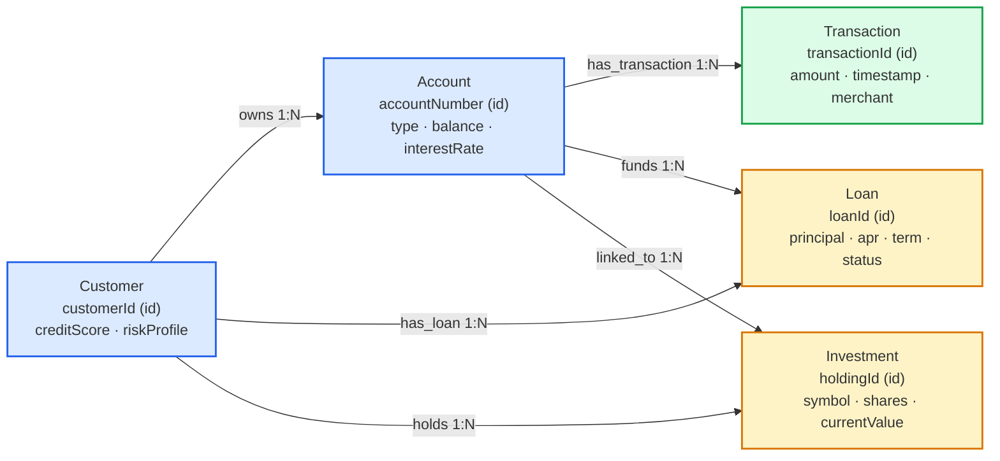
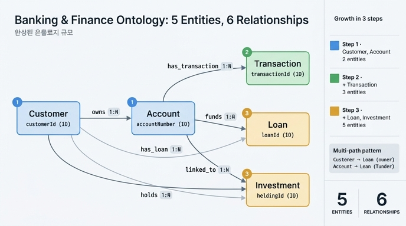

# 완성된 Banking & Finance 온톨로지의 규모

**질문**: 완성된 Banking & Finance 온톨로지의 규모는 어떻게 되는가?

**답**: **5개 엔티티**(Customer, Account, Transaction, Loan, Investment)와 **6개 관계**(owns, has_transaction, has_loan, funds, holds, linked_to)로 구성된다.

이 카드는 Banking & Finance 학습 경로 전체의 **최종 요약** 카드다. 3단계에 걸쳐 쌓아 올린 결과물이 정확히 어떤 모양인지 한 번에 확인하는 것이 목적이다.

---

## 1. 3단계 누적 성장

| 단계 | 추가된 엔티티 | 누적 엔티티 | 누적 관계 | 핵심 개념 |
|---|---|---|---|---|
| 1 | Customer, Account | 2 | 1 (owns) | 소유 체계, 금융 식별자 |
| 2 | + Transaction | 3 | 2 (+has_transaction) | 활동 추적, datetime 정밀도 |
| 3 | + Loan, Investment | **5** | **6** (+has_loan, funds, holds, linked_to) | 금융 상품, 다중 경로 관계 |

3단계에서 엔티티는 2개만 늘었지만 관계는 4개가 늘었다. 엔티티 수보다 **관계 수가 더 빠르게 증가**하는 것이 온톨로지 성장의 전형적인 패턴이다.

---

## 2. 5개 엔티티 — 식별자와 프로퍼티

### Customer (고객)

| 프로퍼티 | 타입 | 식별자 | 설명 |
|---|---|:---:|---|
| `customerId` | string | ✓ | 고객 고유 식별자 |
| `name` | string | | 고객명 |
| `ssn` | string | | 주민·사회보장번호 (스키마상 메타데이터) |
| `creditScore` | integer | | 신용점수 300–850, 수치 비교·범위 질의 가능 |
| `riskProfile` | string | | 은행의 위험 등급 평가 (컴플라이언스용) |

> `ssn` 같은 민감 필드는 "그런 데이터가 존재한다"는 사실만 기술한다. 온톨로지는 스키마이지 데이터베이스가 아니며, 실제 값은 원천 시스템에 남는다.

### Account (계좌)

| 프로퍼티 | 타입 | 식별자 | 설명 |
|---|---|:---:|---|
| `accountNumber` | string | ✓ | 계좌번호 |
| `type` | string | | checking / savings / brokerage 구분 |
| `balance` | decimal (USD) | | 잔액 |
| `interestRate` | decimal (%) | | 이율, 퍼센트 단위 |
| `openDate` | date | | 개설일 (시각 정밀도 불필요 → date) |

### Transaction (거래)

| 프로퍼티 | 타입 | 식별자 | 설명 |
|---|---|:---:|---|
| `transactionId` | string | ✓ | 거래 식별자 |
| `amount` | decimal (USD) | | 거래 금액 |
| `type` | string | | 입금 / 출금 / 이체 / 수수료 |
| `timestamp` | datetime | | **date가 아닌 datetime** — 사기 탐지·감사에 시각 정밀도 필요 |
| `merchant` | string | | 가맹점명 (문자열 프로퍼티로 처리) |

### Loan (대출)

| 프로퍼티 | 타입 | 식별자 | 설명 |
|---|---|:---:|---|
| `loanId` | string | ✓ | 대출 식별자 |
| `principal` | decimal (USD) | | 원금 |
| `apr` | decimal (%) | | 연이율(Annual Percentage Rate) |
| `term` | integer (months) | | 상환 기간, **개월 단위 정수** |
| `status` | string | | active / paid / default 등 상태 |

### Investment (투자 보유)

| 프로퍼티 | 타입 | 식별자 | 설명 |
|---|---|:---:|---|
| `holdingId` | string | ✓ | 보유 종목 식별자 |
| `symbol` | string | | 종목 코드 (MSFT, AAPL 등) |
| `shares` | decimal | | 보유 수량 (소수 주식 가능 → decimal) |
| `purchasePrice` | decimal (USD) | | 매입 가격 |
| `currentValue` | decimal (USD) | | 현재 평가액 |

> `purchasePrice`와 `currentValue`를 **함께** 두는 것이 핵심이다. 두 값이 모두 있어야 파생 계산 없이 손익(gain/loss)을 바로 물어볼 수 있다.

---

## 3. 6개 관계 — 방향·카디널리티·의미

| # | 관계 | 방향 | 카디널리티 | 의미 | 도입 단계 |
|---|---|---|---|---|---|
| 1 | `owns` | Customer → Account | 1:N | 고객은 여러 계좌를 소유, 계좌는 한 고객에 귀속 | 1 |
| 2 | `has_transaction` | Account → Transaction | 1:N | 계좌에 시간에 걸쳐 다수 거래 발생 | 2 |
| 3 | `has_loan` | Customer → Loan | 1:N | 고객이 보유한 대출 (누가 빌렸나) | 3 |
| 4 | `funds` | Account → Loan | 1:N | 대출 상환의 자금 출처 계좌 (무엇으로 갚나) | 3 |
| 5 | `holds` | Customer → Investment | 1:N | 고객의 투자 포트폴리오 (누가 보유하나) | 3 |
| 6 | `linked_to` | Account → Investment | 1:N | 증권 계좌에 연결된 보유 종목 (어느 계좌가 뒷받침하나) | 3 |

6개 관계가 **모두 1:N**이라는 점을 기억하자. 한쪽이 "허브"(Customer, Account) 역할을 하고 나머지가 그에 매달리는 구조다.

### 다중 경로(multi-path) 패턴

Loan과 Investment는 각각 **두 개의 경로**로 Customer에 도달한다.

- Loan: `Customer -[has_loan]-> Loan` (소유) / `Customer -[owns]-> Account -[funds]-> Loan` (자금원)
- Investment: `Customer -[holds]-> Investment` (소유) / `Customer -[owns]-> Account -[linked_to]-> Investment` (연결 계좌)

이 중복은 실수가 아니라 **의도된 설계**다. "누가 보유하는가"와 "어느 계좌가 뒷받침하는가"는 답이 다를 수 있는 서로 다른 질문이다(예: 공동 계좌가 한 사람 명의의 투자를 뒷받침하는 경우).

---

## 4. 전체 그래프



파랑 = 1단계, 초록 = 2단계, 노랑 = 3단계.

---

## 5. 왜 이 규모가 "완성"인가

각 엔티티는 서로 겹치지 않는 하나의 질문 축을 담당한다.

| 엔티티 | 담당하는 질문 | 이어주는 관계 |
|---|---|---|
| Customer | **누구인가?** 신용도와 위험 등급은? | owns, has_loan, holds (3개의 출발점) |
| Account | **돈이 어디에 있나?** 잔액과 종류는? | owns(수신), has_transaction, funds, linked_to |
| Transaction | **돈이 어떻게 움직였나?** 언제, 얼마, 어디서? | has_transaction(수신) |
| Loan | **은행이 얼마를 빌려줬나?** 조건과 상태는? | has_loan, funds(수신) |
| Investment | **고객이 얼마를 불렸나?** 손익은? | holds, linked_to(수신) |

즉 **주체(Customer) → 그릇(Account) → 흐름(Transaction) + 부채(Loan) + 자산(Investment)** 라는 다섯 축이 모두 채워졌고, 6개 관계가 그 축들을 하나의 연결 그래프로 묶는다. 어느 엔티티도 고립되어 있지 않으며, 어느 것을 빼도 축 하나가 답할 수 없게 된다 — 그래서 "완성"이다.

### 대표 질의 4종과 그래프 경로

**1) 고위험 고객의 대규모 대출 (컴플라이언스)**

```
Customer(riskProfile='high') -[has_loan]-> Loan(principal > 100000)
```
학습 경로 도입부의 원래 질문 — "고위험 고객이 소유한 계좌의 모든 거래"까지 확장하면
`Transaction → Account → Customer(riskProfile='high') → Loan(principal > 100K)`로 세 관계를 역·순 방향으로 넘나든다.

**2) 상위 고객의 포트폴리오 합계**

```
Customer -[holds]-> Investment  →  SUM(currentValue)
```
`currentValue`가 decimal이므로 집계가 그대로 가능하다.

**3) 대출과 투자를 함께 뒷받침하는 계좌**

```
Account -[funds]-> Loan  AND  Account -[linked_to]-> Investment
```
같은 계좌에서 두 관계가 동시에 나가는 노드를 찾는 질의. `funds`/`linked_to`를 별도로 둔 덕분에 성립한다.

**4) 투자수익 대 대출비용 비교**

```
Customer -[holds]-> Investment (currentValue)
   vs
Customer -[has_loan]-> Loan (principal × apr)
```

GQL 예시:

```gql
MATCH (c:Customer)-[:holds]->(inv:Investment),
      (c)-[:has_loan]->(loan:Loan)
WITH c, SUM(inv.currentValue) AS portfolio, SUM(loan.principal) AS debt
WHERE portfolio > debt
RETURN c.name, portfolio, debt
```

한 고객 노드에서 두 방향으로 뻗어나간 뒤 각각 집계해 비교한다 — 5엔티티 6관계만으로 자산과 부채를 한 질의에서 맞붙일 수 있다.

---

## 6. 의도적으로 담지 않은 것

"완성"은 "모든 것을 담았다"가 아니다. 이 모델은 아래를 **일부러 제외**했다.

| 빠진 것 | 현재 처리 방식 | 추가하면 열리는 질문 |
|---|---|---|
| **Merchant** (가맹점) | `Transaction.merchant`를 문자열로 | 가맹점별 카테고리·업종·지역 분석, 동일 가맹점의 여러 표기 통합 |
| **Branch** (지점) | 없음 | 지점별 실적, 지역별 대출 집중도, 개설 채널 분석 |
| **Employee** (직원) | 없음 | 담당자별 포트폴리오, 승인 권한·감사 추적 |
| **Product 카탈로그** | `Account.type`, `Loan.status` 문자열 | 상품별 조건 비교, 상품 개편 이력, 자격 요건 규칙 |
| **환율·통화** | 모든 금액이 USD 고정 | 다통화 계좌, 환산 시점에 따른 평가액, 환리스크 |
| **거래 상대방(counterparty)** | 없음 | 계좌 간 이체의 양쪽 추적, 자금세탁 네트워크 탐지 |
| **시계열 잔액 스냅샷** | `Account.balance` 현재값 1개 | 특정 시점 잔액, 잔액 추이, 월말 기준 규제 보고 |

각 항목을 넣는 순간 엔티티가 1개 늘어나는 데 그치지 않고 관계가 2~3개씩 붙으며 모델 복잡도가 급증한다. 반대로, 학습 경로가 던진 질문들(컴플라이언스 조회, 포트폴리오 집계, 다중 경로 추적)에는 5엔티티 6관계로 **충분히** 답할 수 있다.

> **결론: 온톨로지의 규모는 답하려는 질문이 결정한다.**
> "5엔티티 6관계"는 정답 숫자가 아니라, 이 경로가 목표로 한 질문 집합에 대한 최소 충분 규모다. 다통화 리스크를 물으려면 통화 엔티티가 필요하고, 자금세탁을 물으려면 counterparty가 필요하다. 먼저 질문을 정하고, 그 질문이 요구하는 만큼만 그린다.

---

## 인포그래픽


