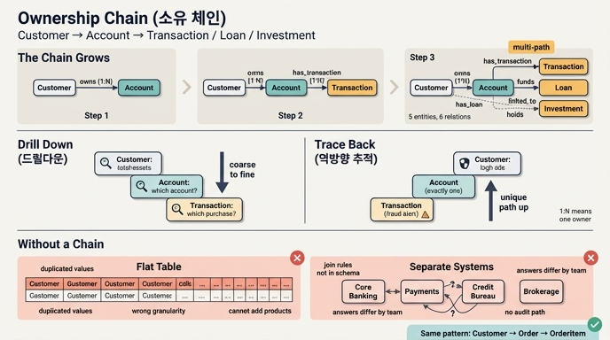

# 소유 체인(Ownership Chain)이란?

## 한 줄 정의

**소유 체인**은 "A가 B를 소유하고, B가 C를 소유하고, ..." 하는 소유 관계가 **연쇄적으로 이어진 경로**다. 온톨로지 그래프 위에서 이 경로를 따라가면 상위 엔티티에서 하위 엔티티로 **드릴다운**할 수 있고, 거꾸로 타면 하위 사실에서 상위 책임 주체로 **거슬러 올라갈** 수 있다.

Banking & Finance 온톨로지의 소유 체인은 다음과 같다.

```
Customer ──owns──▶ Account ──has_transaction──▶ Transaction
                      │
                      ├──funds──▶ Loan          (Customer ──has_loan──▶ Loan)
                      └──linked_to──▶ Investment (Customer ──holds──▶ Investment)
```

즉 카드의 답에 나온 `Customer → Account → Transaction / Loan / Investment`가 이 도메인의 소유 체인이다.

---

## 왜 "체인"이 중요한가

### 1) 컴플라이언스 질문이 곧 경로 탐색이 된다

시나리오 문서가 제시한 대표 질문을 보자.

> "Show all transactions from accounts owned by high-risk customers with active loans exceeding $100K"
> (고위험 고객이 소유한 계좌 중, 활성 대출이 10만 달러를 넘는 고객의 모든 거래를 보여줘)

이 질문은 사람 말로는 한 문장이지만, 데이터로는 **거래 → 계좌 → 고객 → 대출**을 모두 건너다녀야 한다. 소유 체인이 온톨로지에 명시되어 있으면 이 질문은 그냥 그래프 순회다.

```
Transaction → Account → Customer (riskProfile='high') → Loan (principal > 100000)
```

체인이 있으면 "어떤 테이블을 어떤 키로 조인해야 하는지"를 매번 다시 알아낼 필요가 없다. 경로 자체가 스키마에 박혀 있다.

### 2) 드릴다운(위 → 아래)

체인은 **집계에서 개별 사실로 내려가는 축**을 만들어 준다.

| 단계 | 보는 것 | 예시 질문 |
|---|---|---|
| Customer | 고객 단위 요약 | "이 고객의 총 자산은?" |
| → Account | 계좌 단위로 쪼개기 | "그 자산이 어느 계좌에 있나?" |
| → Transaction | 개별 거래로 쪼개기 | "지난달 식당에서 얼마 썼나?" |

각 홉이 한 단계 더 세밀한 입도(granularity)로 내려가는 계단이 된다.

### 3) 역방향 추적(아래 → 위)

체인은 **양방향**으로 쓸 수 있다는 점이 핵심이다. 이상 거래(fraud alert)가 하나 떴다고 하자.

```
Transaction(id=T-9931)
   └─▶ (belongs to) Account(A-1204)
          └─▶ (owned by) Customer(C-77, riskProfile='high')
                 ├─▶ Loan(principal 250,000, status='active')
                 └─▶ Investment(...)
```

거래 하나에서 출발해 **책임 주체(고객)**로 올라가고, 거기서 다시 그 고객의 다른 자산·부채로 **횡으로 퍼져** 나갈 수 있다. AML/KYC, 감사 추적(audit trail), 신용 리스크 재평가가 모두 이 역방향 순회에 기댄다. 소유 체인이 없으면 "이 거래는 결국 누구 책임인가?"에 답하려고 시스템 3~4개를 손으로 뒤져야 한다.

---

## 체인이 단계적으로 자라는 과정

학습 경로는 체인을 한 번에 다 만들지 않는다. 홉을 하나씩 붙이면서 **답할 수 있는 질문의 종류가 늘어나는 것**을 체감하게 설계돼 있다.

### Step 1 — `Customer → Account`

```
Customer ──owns──▶ Account
```

- **owns** (one-to-many): 고객 한 명이 여러 계좌(checking / savings / brokerage)를 가질 수 있지만, 각 계좌는 한 고객에게 속한다.
- 이 두 엔티티가 **은행 온톨로지의 기초(foundation)**다. 이후 모든 금융 상품은 이 둘을 통해 연결된다.
- 이 시점에 답할 수 있는 것: "이 고객은 계좌를 몇 개 갖고 있나?", "brokerage 계좌를 가진 고객은?"

### Step 2 — `+ Transaction`

```
Customer ──owns──▶ Account ──has_transaction──▶ Transaction
```

- **has_transaction** (one-to-many): 계좌 하나에 시간에 따라 수많은 거래가 쌓이지만, 각 거래는 한 계좌에 속한다.
- 체인이 **2홉 → 3홉**으로 깊어진다. 문서의 표현대로 "The ownership chain grows."
- 여기서 비로소 활동(activity) 레이어가 생긴다. `timestamp`가 date가 아니라 **datetime**인 이유도 이 레이어의 목적(사기 탐지, 감사 추적)에서 나온다 — 오후 2:30 거래와 2:31 거래는 다른 사건이다.
- 새로 답할 수 있는 것: "이 고객이 지난달 식당에서 쓴 금액", "거래 패턴이 이상한 계좌", "계좌 유형별 평균 거래액"

### Step 3 — `+ Loan / Investment`

```
Customer ──has_loan──▶ Loan          ◀──funds──── Account
Customer ──holds────▶ Investment     ◀──linked_to── Account
```

- 체인의 끝단이 **분기(branch)**한다. 이제 `Customer → Account → Transaction`은 여러 갈래 중 하나일 뿐이다.
- 최종 규모: **5 엔티티, 6 관계**.
- **멀티패스(multi-path) 패턴**이 등장한다. Investment는 Customer에 두 경로로 닿는다.
  - 직접: `Customer ──holds──▶ Investment` → "누가 이걸 보유하나?" (소유)
  - 간접: `Customer ──owns──▶ Account ──linked_to──▶ Investment` → "어느 계좌가 이걸 받쳐주나?" (자금원)
  - 이 중복은 **의도된 것**이다. 공동 명의 계좌가 한 사람의 투자를 자금 지원하는 경우처럼 두 답이 다를 수 있기 때문이다. 소유 체인이 항상 하나의 선형 사슬이라고 생각하면 이 구분을 놓친다.

| 단계 | 추가 엔티티 | 누적 | 체인 상태 |
|---|---|---|---|
| 1 | Customer, Account | 2 | 2홉 선형 |
| 2 | + Transaction | 3 | 3홉 선형 |
| 3 | + Loan, Investment | 5 | 분기 + 멀티패스 |

---

## 모든 홉이 one-to-many라는 사실의 의미

이 온톨로지의 소유 관계 6개(**owns, has_transaction, has_loan, funds, holds, linked_to**)는 **전부 one-to-many**다. 우연이 아니다.

**"one" 쪽이 소유자, "many" 쪽이 소유물**이라는 방향성이 카디널리티에 인코딩되어 있다. 여기서 따라오는 실질적 결과들:

1. **방향이 명확하다** — 소유물에서 소유자로 올라가는 경로는 항상 **유일**하다. 거래 하나를 잡으면 그 거래가 속한 계좌는 정확히 하나, 그 계좌의 주인도 정확히 하나. 그래서 역방향 추적에 모호함이 없다.
2. **아래로 내려갈 때는 부채꼴로 퍼진다** — 고객 1명 → 계좌 N개 → 거래 N×M개. 그래서 드릴다운 질의는 자연스럽게 **집계(SUM, AVG, COUNT)**와 짝을 이룬다.
   ```gql
   MATCH (c:Customer)-[:holds]->(inv:Investment),
         (c)-[:has_loan]->(loan:Loan)
   WITH c, SUM(inv.currentValue) AS portfolio, SUM(loan.principal) AS debt
   WHERE portfolio > debt
   RETURN c.name, portfolio, debt
   ```
3. **소유물은 소유자 없이 존재하지 않는다** — 계좌 없는 거래, 고객 없는 계좌는 이 모델에서 의미가 없다. 소유 체인은 곧 **생명주기 종속성**을 암시한다.
4. **many-to-many가 필요해지면 모델을 다시 봐야 한다** — 예: 공동 명의 계좌(joint account)를 진짜로 지원하려면 `owns`가 many-to-many가 되어야 하고, 그러면 위 1번의 "유일한 역방향 경로" 보장이 깨진다. 그때는 중간에 `AccountHolder` 같은 연결 엔티티를 두는 편이 낫다. 카디널리티는 그냥 장식이 아니라 **어떤 질의가 안전한가에 대한 계약**이다.

---

## 소유 체인이 없으면 어떻게 되는가

### (A) 플랫 테이블 하나에 다 밀어넣기

```
transactions_flat
──────────────────────────────────────────────────────────
txn_id | amount | merchant | cust_name | cust_ssn | credit_score | acct_no | acct_balance | ...
```

| 문제 | 왜 생기나 |
|---|---|
| 중복과 불일치 | 같은 고객의 신용점수가 거래 행 수만큼 반복 저장 → 어떤 행은 700, 어떤 행은 710 |
| 갱신 이상 | 고객이 주소를 바꾸면 수백만 행을 고쳐야 함 |
| 입도 혼동 | "고객 수"를 세려면 `DISTINCT`, "평균 잔액"을 내면 거래가 많은 계좌가 과대 가중됨 |
| 계층 표현 불가 | 거래가 없는 신규 계좌, 계좌가 없는 신규 고객을 표현할 자리가 없음 |
| 확장 불가 | Loan/Investment를 붙이려면 컬럼을 또 늘리거나 NULL 늪을 만듦 |

플랫 테이블은 체인을 **납작하게 눌러버려서** 어느 속성이 어느 레벨에 속하는지가 사라진다.

### (B) 시스템이 갈라져 있고 연결이 문서로만 존재

현실의 데이터는 코어뱅킹, 결제 프로세서, 신용평가사, 브로커리지 플랫폼에 흩어져 있고 **각자 다른 스키마와 식별자**를 쓴다.

| 문제 | 결과 |
|---|---|
| 조인 규칙이 스키마에 없다 | "계좌번호를 고객ID에 어떻게 매핑하나"가 사람 머릿속/위키/개별 ETL 스크립트에만 존재 |
| 질의마다 재발명 | 컴플라이언스 질문이 하나 올 때마다 엔지니어가 조인 경로를 새로 짜맞춤 |
| 답이 팀마다 다르다 | 리스크팀과 재무팀이 같은 질문에 다른 숫자를 내놓음 |
| 감사 불가 | "이 거래의 소유자"를 증명하려면 수동 대조가 필요 |
| 신규 소스 추가 비용 폭발 | 소스 N개 → 페어와이즈 매핑 O(N²) |

소유 체인을 온톨로지에 **선언**하는 것은 이 조인 지식을 사람에게서 꺼내 **기계가 읽을 수 있는 스키마**로 옮기는 일이다. 그래서 앞의 컴플라이언스 질문이 커스텀 파이프라인이 아니라 한 줄 순회로 표현된다.

> 참고: 온톨로지는 **스키마이지 데이터베이스가 아니다**. `ssn` 같은 민감 속성은 "그런 데이터가 존재한다"는 메타데이터로만 나타나고, 실제 값은 원천 시스템에 남는다. 소유 체인도 값이 아니라 **모양(shape)**에 대한 선언이다.

---

## 다른 도메인의 소유 체인 예시

소유 체인은 금융 전용 패턴이 아니다. 계층적 소유가 있는 거의 모든 도메인에 나타난다.

| 도메인 | 소유 체인 | 드릴다운 질문 | 역방향 질문 |
|---|---|---|---|
| E-commerce | `Customer → Order → OrderItem → Product` | "이 고객이 어떤 상품을 샀나?" | "이 반품은 어느 고객·주문에서 왔나?" |
| SaaS / 멀티테넌시 | `Organization → Workspace → Project → Document` | "이 조직의 문서 총량은?" | "이 문서를 누구 요금제로 과금하나?" |
| 클라우드 인프라 | `Account → Region → VPC → Instance` | "이 계정의 리전별 비용은?" | "이 인스턴스 비용은 어느 팀 부담인가?" |
| 제조 / BOM | `Product → Assembly → Part → Material` | "이 제품에 들어가는 원자재는?" | "이 불량 원자재가 어느 제품에 들어갔나?" (리콜 추적) |
| 의료 | `Patient → Encounter → Order → Result` | "이 환자의 검사 이력은?" | "이 이상 수치는 어느 진료에서 나왔나?" |

특히 e-commerce의 `Customer → Order → OrderItem`은 finance의 `Customer → Account → Transaction`과 **구조적으로 동형**이다. 소유자 하나, 그릇 여러 개, 그릇마다 세부 항목 여러 개 — 그리고 모든 홉이 one-to-many. 도메인 어휘만 갈아끼우면 같은 드릴다운·역추적 질의 패턴이 그대로 작동한다. 이게 온톨로지 패턴을 배워두는 이유다.

---

## 핵심 정리

- 소유 체인 = 소유 관계가 이어 붙은 **경로**. finance에서는 `Customer → Account → Transaction / Loan / Investment`.
- 아래로 타면 **드릴다운**, 위로 타면 **책임 주체 추적·감사**. 컴플라이언스 질의가 곧 그래프 순회가 된다.
- 체인은 홉 단위로 **자란다**: `Customer→Account` → `+Transaction` → `+Loan/Investment`(여기서 분기·멀티패스 등장).
- 모든 홉이 **one-to-many**라서 위로는 경로가 유일하고 아래로는 부채꼴로 퍼진다 → 역추적은 명확, 드릴다운은 집계와 짝.
- 체인이 없으면 플랫 테이블의 중복·입도 혼동, 또는 분산 시스템의 "조인 지식이 스키마 밖에 있는" 문제가 생긴다.

## 인포그래픽


