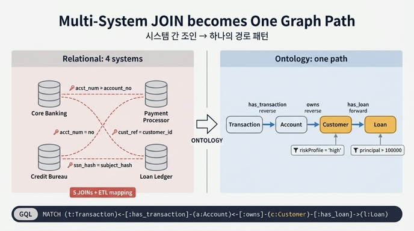

# 고위험 고객의 대출 관련 거래 조회 = 하나의 그래프 경로

## 카드 요약

**질문**: "고위험 고객의 $100K 초과 대출 관련 거래 조회"는 온톨로지에서 어떤 그래프 순회로 표현되는가?

**답**: `Transaction → Account → Customer (riskProfile='high') → Loan (principal > 100000)` 경로의 그래프 순회로 표현된다. 시스템 간 조인이 하나의 경로 패턴으로 단순화된다.

원문 표현은 컴플라이언스 질문 형태다:

> "Show all transactions from accounts owned by high-risk customers with active loans exceeding $100K"
> (고위험 고객이 소유한 계좌에서 발생한 모든 거래를, 그 고객이 $100K 초과 대출을 보유한 경우에 한해 조회)

이 카드의 핵심은 "쿼리 문법"이 아니라 **온톨로지의 가치 명제**다. 여러 시스템에 흩어진 데이터를 이어 붙이는 다중 조인이, 온톨로지에서는 **엔티티를 잇는 하나의 경로 패턴(path pattern)** 으로 축약된다.

---

## 1. 이 질문이 원래 얼마나 어려운 질문인가

시나리오에서 데이터는 한곳에 있지 않다. 원문:

> Data spans core banking systems, payment processors, credit bureaus, and brokerage platforms — each with its own schema and identifiers.

즉 질문 하나를 풀기 위해 **서로 다른 4개 시스템**을 건드려야 한다.

| 필요한 정보 | 사는 곳(전형적으로) | 식별자 |
|---|---|---|
| 거래 내역 (Transaction) | 결제 처리 시스템(payment processor) | `transactionId` |
| 계좌 / 소유 관계 (Account, owns) | 코어 뱅킹 시스템 | `accountNumber`, `customerId` |
| 리스크 프로파일 (`riskProfile`) | 신용평가/크레딧 뷰로 연동 데이터 | `ssn`, `customerId` |
| 대출 (Loan) | 여신(대출) 원장 시스템 | `loanId` |

관계형 세계에서 이 질문을 풀려면 대략 이런 일을 한다.

```sql
-- 시스템별 스키마가 통합 웨어하우스로 ETL된 뒤에야 가능한 형태
SELECT t.*
FROM   transactions   t                       -- 결제 시스템 적재본
JOIN   accounts       a  ON t.account_no  = a.acct_num       -- 컬럼명이 다르다
JOIN   customers      c  ON a.cust_ref    = c.customer_id    -- 키 의미가 다르다
JOIN   risk_profiles  r  ON c.ssn_hash    = r.subject_hash   -- 조인 키가 SSN 해시
JOIN   loans          l  ON l.borrower_id = c.customer_id    -- 또 다른 원장
WHERE  r.profile   = 'high'
  AND  l.principal > 100000
  AND  l.status    = 'active';
```

여기서 실제로 비용이 드는 부분은 SQL 길이가 아니다.

1. **ETL/파이프라인**: 4개 소스를 하나의 웨어하우스로 옮기고 주기적으로 동기화해야 한다.
2. **식별자 정합(identity resolution)**: `account_no` vs `acct_num`, `cust_ref` vs `customer_id`, `ssn_hash` vs `subject_hash`. 같은 실체를 가리키는 키를 사람이 매핑해 둬야 한다.
3. **조인 지식의 암묵성**: "고객 → 계좌는 `cust_ref`로 잇는다"는 사실이 쿼리 작성자의 머릿속과 위키에만 있다. 새 분석가는 매번 다시 배운다.
4. **질문이 바뀌면 조인도 다시**: "고위험 고객의 투자 잔액"을 물으면 조인 그래프를 처음부터 다시 조립한다.

---

## 2. 온톨로지에서는 무엇이 달라지는가

온톨로지는 **엔티티와 관계를 스키마 수준에서 미리 선언**한다. 위 3번의 "암묵적 조인 지식"이 모델 안으로 승격되는 것이 핵심이다.

Banking & Finance 온톨로지의 5 엔티티 / 6 관계 중 이 질문에 쓰이는 부분:

| 관계 | 방향 (선언된 그대로) | 카디널리티 |
|---|---|---|
| `owns` | `Customer` → `Account` | one-to-many |
| `has_transaction` | `Account` → `Transaction` | one-to-many |
| `has_loan` | `Customer` → `Loan` | one-to-many |

(나머지 `funds`: Account → Loan, `holds`: Customer → Investment, `linked_to`: Account → Investment)

조인 키를 매번 찾는 대신, **관계 이름을 따라 걷기만** 하면 된다. 그래서 질문은 이렇게 한 줄로 접힌다.

```
Transaction → Account → Customer (riskProfile='high') → Loan (principal > 100000)
```

### 화살표별로 무슨 관계를 타는가 (방향 주의)

경로의 화살표는 "순회 진행 방향"이고, 관계 선언 방향과 반드시 일치하지 않는다. 이 경로는 **거래에서 출발**하므로 앞 두 홉은 **역방향 순회(reverse traversal)** 다.

| 홉 | 순회 | 타는 관계 | 방향 |
|---|---|---|---|
| 1 | `Transaction → Account` | `has_transaction` (Account → Transaction) | **역방향** — "이 거래가 속한 계좌" |
| 2 | `Account → Customer` | `owns` (Customer → Account) | **역방향** — "이 계좌를 소유한 고객" |
| 3 | `Customer → Loan` | `has_loan` (Customer → Loan) | **정방향** — "이 고객의 대출" |

one-to-many 관계를 역방향으로 타면 **many-to-one**, 즉 결과가 하나로 좁혀진다. 거래 → 계좌는 정확히 1건, 계좌 → 고객도 정확히 1건이다("each transaction belongs to one account", "each account belongs to one customer"). 반대로 마지막 홉만 fan-out(고객 1명 → 대출 N건)이 발생한다.

이 방향성 감각이 성능 직관으로 이어진다: 좁아지는 홉을 먼저 타고(거래→계좌→고객), 넓어지는 홉에서 필터로 잘라낸다(대출 principal 조건).

### 프로퍼티 필터는 경로의 "어디에" 걸리는가

경로 패턴에서 괄호 안의 조건은 **그 노드에 걸리는 술어(predicate)** 다. 관계에 걸리는 게 아니다.

- `riskProfile='high'` → **Customer 노드**의 프로퍼티 필터. Customer는 `customerId`(식별자), `name`, `ssn`, `creditScore`, `riskProfile`을 가지며, `riskProfile`은 은행의 컴플라이언스/모니터링 평가값이다.
- `principal > 100000` → **Loan 노드**의 프로퍼티 필터. `principal`은 decimal (USD) 타입이라 **수치 비교가 가능**하다. 만약 문자열로 모델링됐다면 `> 100000`이라는 술어 자체가 성립하지 않는다. (같은 이유로 `creditScore`는 integer로 모델링된다 — 범위 질의를 위해서다.)
- 원문 질문의 "**active** loans"는 `Loan.status = 'active'`로, 카드 답에는 생략되어 있지만 실제 컴플라이언스 질의에는 함께 걸린다.
- `Transaction`, `Account`에는 필터가 없다 — 이 둘은 결과 대상과 경로의 중간 경유지일 뿐이다.

정리하면 경로는 **구조(어떤 관계를 따라가는가)**, 필터는 **내용(각 지점에서 무엇을 만족해야 하는가)** 를 담당한다. 이 둘이 한 패턴 안에 함께 쓰여 있어서, 질문의 문장 구조와 질의의 형태가 거의 1:1로 대응된다.

---

## 3. GQL 질의로 써 보기

경로 패턴을 GQL(그래프 질의 언어)로 옮기면 이렇게 된다. 화살표를 역방향(`<-`)으로 쓰면 선언된 관계 방향을 유지하면서 거래에서 출발할 수 있다.

```gql
MATCH (t:Transaction)<-[:has_transaction]-(a:Account)
        <-[:owns]-(c:Customer)-[:has_loan]->(l:Loan)
WHERE c.riskProfile = 'high'
  AND l.principal   > 100000
  AND l.status      = 'active'
RETURN t.transactionId,
       t.amount,
       t.timestamp,
       t.merchant,
       a.accountNumber,
       c.name,
       l.loanId,
       l.principal
ORDER BY t.timestamp DESC
```

같은 질의를 **고객에서 출발**해 모두 정방향으로 쓸 수도 있다. 그래프 경로는 어느 끝에서 읽어도 동일한 패턴이기 때문이다.

```gql
MATCH (c:Customer {riskProfile: 'high'})-[:has_loan]->(l:Loan),
      (c)-[:owns]->(a:Account)-[:has_transaction]->(t:Transaction)
WHERE l.principal > 100000
  AND l.status    = 'active'
RETURN c.customerId, c.name, l.loanId, l.principal,
       a.accountNumber, t.transactionId, t.amount, t.timestamp
```

한 고객이 대출 N건을 가지면 거래 하나가 N번 나올 수 있으니, 거래 목록만 원한다면 대출 조건을 존재 판정으로 분리하는 편이 깔끔하다.

```gql
MATCH (c:Customer {riskProfile: 'high'})-[:owns]->(a:Account)
        -[:has_transaction]->(t:Transaction)
WHERE EXISTS {
        MATCH (c)-[:has_loan]->(l:Loan)
        WHERE l.principal > 100000 AND l.status = 'active'
      }
RETURN DISTINCT t.transactionId, t.amount, t.timestamp, t.merchant
ORDER BY t.timestamp DESC
```

SQL 버전과 비교해 사라진 것들에 주목할 것.

- `ON ... = ...` **조인 조건이 전부 없다** → 관계 이름(`owns`, `has_transaction`, `has_loan`)이 그 역할을 한다.
- **테이블/시스템 이름이 없다** → `Customer`, `Account` 같은 개념 이름만 쓴다. 물리적으로 어느 시스템에서 오는지는 온톨로지 매핑이 감춘다.
- 컬럼명 불일치(`acct_num` vs `account_no`)를 다룰 필요가 없다 → 식별자 프로퍼티(`accountNumber`, `customerId`, `loanId`)로 통일되어 있다.

---

## 4. 왜 이게 "단순화"인가 — 재사용성 관점

경로 패턴의 진짜 이점은 **한 번 선언한 관계를 다른 질문에서 계속 재사용**한다는 점이다. 완성된 모델이 지원하는 질문들이 모두 같은 관계 집합을 조합한 경로다.

| 질문 | 그래프 경로 |
|---|---|
| 고위험 고객의 대출 관련 거래 (이 카드) | `Transaction → Account → Customer(riskProfile='high') → Loan(principal > 100K)` |
| 고위험 고객이 보유한 대형 대출 | `Customer(riskProfile=high) → Loan(principal > 100K)` |
| 상위 고객의 포트폴리오 가치 | `Customer → Investment (sum currentValue)` |
| 대출과 투자를 동시에 대는 계좌 | `Account → Loan` AND `Account → Investment` |
| 투자 수익이 대출 비용을 넘는 고객 | `Customer → Investment (currentValue)` vs `Customer → Loan (principal × apr)` |

관계형 세계에서는 질문마다 조인 그래프를 새로 조립하고, 새 소스가 붙으면 ETL도 늘어난다. 온톨로지에서는 **관계 6개를 선언해 두면 질문은 그 위를 걷는 경로로 표현**된다. 이것이 "시스템 간 조인이 하나의 경로 패턴으로 단순화된다"는 문장의 실질이다.

### 함께 기억할 두 가지 뉘앙스

- **다중 경로(multi-path)**: Investment는 `holds`(Customer 직접)와 `linked_to`(Account 경유) 두 경로로 Customer에 닿는다. 의도된 중복이며 각각 "소유"와 "자금 출처"라는 다른 질문에 답한다. 경로를 어느 것으로 타느냐가 곧 질문의 의미를 결정한다.
- **온톨로지는 스키마이지 데이터베이스가 아니다**: `ssn` 같은 민감 프로퍼티는 "그런 데이터가 존재한다"는 메타데이터로만 나타난다. 위 경로 패턴 역시 실제 값이 아니라 데이터의 *모양*을 따라 걷는 표현이다.

---

## 5. 한 줄 정리

거래·계좌·고객·대출이 각기 다른 시스템에 살아도, 온톨로지가 `has_transaction` / `owns` / `has_loan`을 선언해 두면 컴플라이언스 질문은 조인 지옥이 아니라 **`Transaction → Account → Customer → Loan` 이라는 한 줄의 경로 순회**가 되고, 조건은 그 경로 위 Customer(`riskProfile='high'`)와 Loan(`principal > 100000`) 지점에 붙는다.

## 인포그래픽


