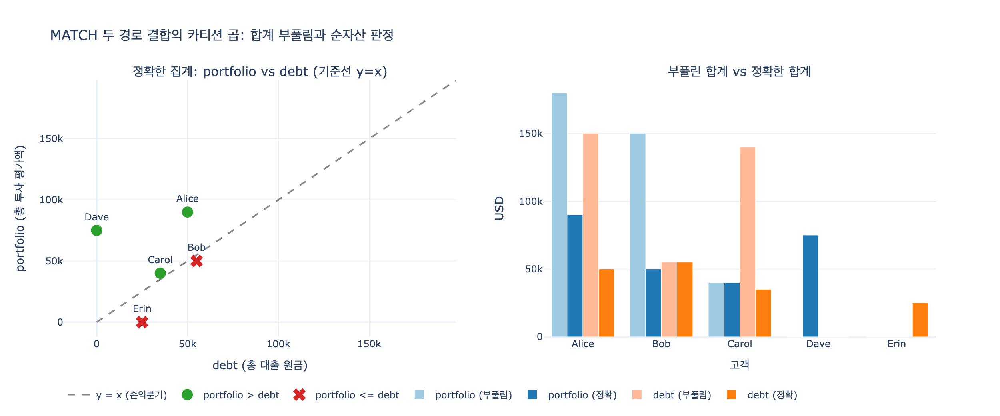

# 투자 포트폴리오 > 총 대출 원금 고객 찾기 — GQL 질의 해부

## 카드의 질의

```gql
MATCH (c:Customer)-[:holds]->(inv:Investment),
      (c)-[:has_loan]->(loan:Loan)
WITH c, SUM(inv.currentValue) AS portfolio, SUM(loan.principal) AS debt
WHERE portfolio > debt
RETURN c.name, portfolio, debt
```

Banking & Finance 온톨로지(Customer, Account, Transaction, Loan, Investment / 6 관계)에서
`holds`는 `Customer → Investment`, `has_loan`은 `Customer → Loan`이다.
두 관계는 **같은 시작 노드에서 갈라지는 서로 다른 경로**이며, 이 질의는 그 두 경로를 한 번에 잡아
고객별로 합계를 비교한다.

---

## 1. 절 단위 해부

### `MATCH` — 쉼표 나열은 "공유 변수 기준 조인"

```gql
MATCH (c:Customer)-[:holds]->(inv:Investment),
      (c)-[:has_loan]->(loan:Loan)
```

쉼표로 구분된 두 패턴은 **독립적인 두 질의가 아니다**. 두 패턴이 변수 `c`를 공유하므로,
엔진은 각 패턴의 결과 테이블을 `c` 값 기준으로 **결합(join)** 한다.

- 만약 두 패턴이 아무 변수도 공유하지 않았다면 → 전체 카티션 곱(cross join).
- `c`를 공유하므로 → `c`별로 국소적인 카티션 곱.

즉 결과 테이블 한 행은 `(c, inv, loan)` **삼중 조합** 하나다.
`MATCH` 결과는 그래프가 아니라 항상 **행(binding table)** 이라는 점이 핵심이다.

### 카티션 곱: 투자 3건 × 대출 2건 = 6행

Alice가 투자 3건(40,000 / 30,000 / 20,000)과 대출 2건(30,000 / 20,000)을 가졌다고 하자.

| c | inv | loan |
|---|---|---|
| Alice | H1 (40,000) | L1 (30,000) |
| Alice | H1 (40,000) | L2 (20,000) |
| Alice | H2 (30,000) | L1 (30,000) |
| Alice | H2 (30,000) | L2 (20,000) |
| Alice | H3 (20,000) | L1 (30,000) |
| Alice | H3 (20,000) | L2 (20,000) |

3 × 2 = **6행**. 투자 노드 하나가 대출 개수만큼 반복되고, 대출 노드 하나가 투자 개수만큼 반복된다.

### `WITH` — 집계 경계(aggregation boundary)

```gql
WITH c, SUM(inv.currentValue) AS portfolio, SUM(loan.principal) AS debt
```

`WITH`의 프로젝션 목록에 집계 함수가 섞여 있으면, **비집계 항목이 자동으로 그룹 키**가 된다.
여기서는 `c` 하나뿐이므로 "고객별 그룹"이다. SQL의 `GROUP BY c`가 암묵적으로 붙는 셈이다.

`WITH`는 두 가지 일을 한다.

1. **집계 경계를 만든다** — 이 지점 이후로 `inv`, `loan`은 스코프에서 사라진다.
   `WITH`에 명시하지 않은 변수는 뒤에서 쓸 수 없다(그래서 `c`를 반드시 다시 써 준다).
2. **파이프라인을 이어 준다** — 앞 절의 결과 테이블이 뒤 절의 입력 테이블이 된다.

### 함정: `SUM`이 부풀려진다

집계 대상 행이 이미 카티션 곱이므로, Alice의 합계는 이렇게 계산된다.

$$\widehat{portfolio}_{Alice} = (40{,}000 + 30{,}000 + 20{,}000) \times 2 = 180{,}000$$
$$\widehat{debt}_{Alice} = (30{,}000 + 20{,}000) \times 3 = 150{,}000$$

일반식으로, 고객 $c$의 투자 수를 $n^{inv}_c$, 대출 수를 $n^{loan}_c$라 하면

$$\widehat{portfolio}_c = n^{loan}_c \cdot \sum_i v_i, \qquad
  \widehat{debt}_c = n^{inv}_c \cdot \sum_j p_j$$

**각 합계는 상대 경로의 행 수만큼 곱해진다.** 두 배수가 서로 다르므로 비교 결과가 왜곡된다.

### `WHERE` — 위치가 의미를 바꾼다

```gql
WHERE portfolio > debt
```

이 `WHERE`는 `WITH` **뒤**에 있으므로 집계 결과를 필터한다. SQL의 `HAVING`에 해당한다.

같은 키워드가 위치에 따라 전혀 다른 일을 한다.

| 위치 | 역할 | 참조 가능한 것 |
|---|---|---|
| `MATCH ... WHERE loan.status = 'active'` | 행 단위 필터, **집계 전** | 패턴 변수 (`inv`, `loan`) |
| `WITH ... WHERE portfolio > debt` | 그룹 단위 필터, **집계 후** | 집계 별칭 (`portfolio`, `debt`) |

`MATCH` 직후의 `WHERE`에 `portfolio > debt`를 쓰면 그 컬럼이 아직 존재하지 않아 컴파일 에러다.
반대로 `WITH` 뒤에서는 `inv`, `loan`이 스코프를 벗어나 참조할 수 없다.
이 두 필터는 성능 관점에서도 다르다 — 집계 전 필터는 곱집합 자체를 줄이지만,
집계 후 필터는 이미 만들어진 그룹만 걸러낸다.

---

## 2. 부풀림이 실제로 답을 바꾸는 사례

세 고객으로 확인해 보자 (`expy.py`에서 그대로 재현한다).

| 고객 | 투자 | 대출 | 정확한 portfolio / debt | 부풀린 portfolio / debt | 정확 판정 | 부풀림 판정 |
|---|---|---|---|---|---|---|
| Alice | 3건 (90,000) | 2건 (50,000) | 90,000 / 50,000 | 180,000 / 150,000 | 포함 | 포함 (우연히 일치) |
| Bob | 1건 (50,000) | 3건 (55,000) | 50,000 / 55,000 | 150,000 / 55,000 | 제외 | **포함 — 거짓 양성** |
| Carol | 4건 (40,000) | 1건 (35,000) | 40,000 / 35,000 | 40,000 / 140,000 | 포함 | **제외 — 거짓 음성** |

- **Bob**: 투자가 1건뿐이라 `portfolio`는 안 부풀려지지만, 대출이 3건이라 `portfolio`가 ×3 된다.
  실제로는 순부채인데 순자산 고객으로 잡힌다.
- **Carol**: 투자 4건 때문에 `debt`가 ×4 된다. 실제로는 순자산인데 탈락한다.

부풀림은 **양방향으로 모두 오류를 낸다.** "투자가 많은 고객이 유리하게 나온다" 같은 단순한
편향이 아니라, 어느 쪽 경로의 카디널리티가 큰지에 따라 결과가 뒤집힌다.
투자 수와 대출 수가 정확히 같은 고객만 판정이 보존된다($n^{inv} = n^{loan}$일 때 양변이 같은 배수).

---

## 3. 부풀림을 피하는 올바른 작성법

### (a) 순차 집계 — 각 `MATCH` 뒤에 `WITH`로 경로를 닫는다

```gql
MATCH (c:Customer)-[:holds]->(inv:Investment)
WITH c, SUM(inv.currentValue) AS portfolio        -- 투자 경로를 여기서 닫는다
MATCH (c)-[:has_loan]->(loan:Loan)                -- 이제 c는 고객당 1행
WITH c, portfolio, SUM(loan.principal) AS debt    -- 대출만 다시 접힌다
WHERE portfolio > debt
RETURN c.name, portfolio, debt
```

첫 `WITH`가 투자 경로를 고객당 1행으로 접어 버리므로, 두 번째 `MATCH`가 만드는 행은
대출 개수만큼뿐이고 곱집합이 생기지 않는다.
**결과: Alice, Carol** (정확). 단, 대출이 없는 고객은 여전히 탈락한다(아래 4절).

### (b) `DISTINCT` — 곱집합은 두고 집계 대상만 유일화

```gql
MATCH (c:Customer)-[:holds]->(inv:Investment),
      (c)-[:has_loan]->(loan:Loan)
WITH c, COLLECT(DISTINCT inv) AS invs, COLLECT(DISTINCT loan) AS loans
WITH c, REDUCE(s = 0.0, i IN invs  | s + i.currentValue) AS portfolio,
        REDUCE(s = 0.0, l IN loans | s + l.principal)    AS debt
WHERE portfolio > debt
RETURN c.name, portfolio, debt
```

`COLLECT(DISTINCT inv)`는 **노드 정체성** 기준으로 중복을 제거하므로 안전하다.
**결과: Alice, Carol** (정확).

> **주의 — `SUM(DISTINCT ...)`는 함정이다.**
> `SUM(DISTINCT inv.currentValue)`는 노드가 아니라 **값**을 중복 제거한다.
> Carol처럼 10,000짜리 보유가 4건이면 40,000이 10,000으로 붕괴한다.
> 중복 제거의 기준은 반드시 식별자(`holdingId`, `loanId`)나 노드 자체여야 한다.

### (c) 서브질의 / 패턴 컴프리헨션으로 완전 분리

```gql
MATCH (c:Customer)
WITH c,
     [ (c)-[:holds]->(i:Investment) | i.currentValue ] AS pf_vals,
     [ (c)-[:has_loan]->(l:Loan)    | l.principal    ] AS debt_vals
WITH c, REDUCE(s = 0.0, v IN pf_vals   | s + v) AS portfolio,
        REDUCE(s = 0.0, v IN debt_vals | s + v) AS debt
WHERE portfolio > debt
RETURN c.name, portfolio, debt
```

또는 `CALL { ... }` 서브질의로 각 경로를 독립 스코프에서 집계한 뒤 결합해도 된다.
두 경로가 서로의 카디널리티를 전혀 보지 못하므로 부풀림이 원천적으로 불가능하다.
**결과: Alice, Carol, Dave** — 리스트가 비면 합계가 0이 되어, 대출이 없는 고객까지 포함된다.

### 세 방식 비교

| 작성법 | Alice | Bob | Carol | Dave (대출 0) | 결과 집합 |
|---|---|---|---|---|---|
| 카드 질의 (두 경로 한 `MATCH`) | O | **O (오답)** | **X (오답)** | 탈락 | Alice, Bob |
| (a) 순차 집계 | O | X | O | 탈락 | Alice, Carol |
| (b) `COLLECT(DISTINCT)` | O | X | O | 탈락 | Alice, Carol |
| (c) 서브질의 / 패턴 컴프리헨션 | O | X | O | **O** | Alice, Carol, Dave |

---

## 4. Inner join 성질: 투자만 있고 대출이 없는 고객은 사라진다

`MATCH`의 각 패턴은 **최소 1건 매칭을 요구**한다. 따라서

- 대출이 0건인 고객 → `(c)-[:has_loan]->(loan)` 이 실패 → 행이 아예 만들어지지 않음
- 투자가 0건인 고객 → `(c)-[:holds]->(inv)` 이 실패 → 동일

행 수 = $n^{inv}_c \times n^{loan}_c$ 이므로 어느 한쪽이 0이면 곱이 0이다. 즉 **inner join**이다.

문제는 비즈니스 의미다. **투자 75,000, 대출 0인 고객은 "포트폴리오가 총 대출 원금을 초과하는
고객"의 가장 전형적인 사례인데, 질의에서 통째로 빠진다.** 무부채 고객이야말로 이 질의가
찾으려는 대상인데도 결과에 안 나오는 것이다.

### `OPTIONAL MATCH`로 보정

```gql
MATCH (c:Customer)
OPTIONAL MATCH (c)-[:holds]->(inv:Investment)
WITH c, SUM(inv.currentValue) AS portfolio     -- 없으면 SUM(null) = 0
OPTIONAL MATCH (c)-[:has_loan]->(loan:Loan)
WITH c, portfolio, SUM(loan.principal) AS debt
WHERE portfolio > debt
RETURN c.name, portfolio, debt
ORDER BY portfolio - debt DESC
```

- `OPTIONAL MATCH`는 매칭 실패 시 변수를 `null`로 채우고 **행을 유지**한다 (left outer join).
- 집계 함수는 `null`을 무시하므로 `SUM`이 `0`이 된다 (`COUNT(inv)`도 0).
- `OPTIONAL MATCH`를 각각 별도의 `WITH`로 감싸는 것도 중요하다. 두 `OPTIONAL MATCH`를
  집계 없이 연달아 쓰면 **여전히 곱집합이 생긴다** — `OPTIONAL`은 "0건 허용"일 뿐
  "곱하지 않음"이 아니다.

이렇게 하면 무부채 고객까지 포함된 완전한 세그먼트가 나온다.

---

## 5. 이 질의가 답하는 비즈니스 질문

`portfolio > debt`는 **순자산(net worth) 관점의 고객 세분화**다.

$$\text{net} = \sum_i \texttt{currentValue}_i - \sum_j \texttt{principal}_j$$

| 세그먼트 | 조건 | 활용 |
|---|---|---|
| 순자산 우위 | `portfolio > debt` | 자산관리(WM)·프라이빗 뱅킹 업셀, 신용 한도 상향 |
| 순부채 | `portfolio <= debt` | 부채 상환 상품, 리스크 모니터링 |
| 무부채 고투자 | `debt = 0`, `portfolio` 큼 | 대출 상품 크로스셀 (여기서 `OPTIONAL MATCH`가 필수) |

주의할 점: `principal`은 **최초 원금**이고 `currentValue`는 **현재 평가액**이다.
남은 잔액(outstanding balance)이 아니므로 엄밀한 순자산 지표는 아니다.
학습 경로의 원문도 이 대비를 "Which customers' investments outperform their loan costs?
→ Customer → Investment (currentValue) vs Customer → Loan (principal × apr)"로 제시하며,
정확한 비교에는 `apr`·`term`을 반영한 총 이자비용이 필요함을 시사한다.
또 `Loan.status`를 무시하면 완료·상각된 대출까지 합산되므로,
실무 질의에는 `WHERE loan.status = 'active'`처럼 **집계 전 필터**를 함께 넣는 것이 맞다.

---

## 6. GQL(ISO/IEC 39075)과 Cypher — `WITH`는 표준 GQL 문법이 아니다

카드의 질의는 ```` ```gql ```` 로 표기되어 있지만, 문법은 **Cypher/openCypher 계열**이다.

- **GQL은 ISO/IEC 39075:2024**로 2024년 4월 제정된 그래프 질의 표준이며, Cypher가 그 주된
  입력이었다. Neo4j는 Cypher를 GQL에 정합시키는 방향으로 진화시키고 있다.
- GQL과 Cypher는 **선형 조합(linear composition)** 이라는 같은 실행 모델을 공유한다.
  앞 문장의 결과 테이블 컬럼이 다음 문장의 입력이 된다.
- 그런데 **표준 GQL에는 Cypher의 `WITH`가 없다.** GQL은 역할을 나눠 놓았다.

| 역할 | Cypher | 표준 GQL |
|---|---|---|
| 계산 컬럼 추가 | `WITH c, x + y AS z` (모든 변수 재나열 필수) | `LET z = x + y` (기존 변수 스코프 유지) |
| 행 필터 | `WHERE` | `FILTER` |
| 집계 + 그룹핑 | `WITH`/`RETURN`의 암묵적 그룹핑 | `RETURN ... GROUP BY ...` (별도 집계 문장 없음) |
| 문장 연결 | `WITH`가 암묵적으로 파이프 | `NEXT` 키워드로 명시적 연결 |

- Cypher의 `WITH`는 **blocking** 이다 — 뒤에서 쓸 변수를 전부 다시 나열해야 하고,
  빠뜨린 변수는 스코프에서 사라진다.
- GQL의 `LET`은 **비파괴적** 이다 — 기존 바인딩 스트림을 건드리지 않고 컬럼만 추가한다.
  그래서 중간 계산이나 긴 식의 별칭 부여에 적합하다.
- GQL에서 집계는 `RETURN`에 `GROUP BY`를 붙여 수행하고, **집계 이후의 필터는 `FILTER` 문**으로
  쓴다. Cypher의 `WITH ... WHERE`가 담당하던 `HAVING` 역할이 `FILTER`로 명확히 분리된 것이다.

같은 질의를 표준 GQL 스타일로 옮기면 대략 이런 모양이 된다 (엔진별 지원 범위는 다름).

```gql
MATCH (c:Customer)-[:holds]->(inv:Investment)
RETURN c, SUM(inv.currentValue) AS portfolio GROUP BY c
NEXT
MATCH (c)-[:has_loan]->(loan:Loan)
RETURN c, portfolio, SUM(loan.principal) AS debt GROUP BY c, portfolio
NEXT
FILTER portfolio > debt
RETURN c.name AS name, portfolio, debt
```

`NEXT`로 문장을 잇고, `GROUP BY`로 그룹 키를 **명시**하고, `FILTER`로 집계 후 필터를 표현한다.
Cypher에서 암묵적이던 그룹 키가 GQL에서는 명시적이라는 점이 특히 중요하다 —
카드 질의의 부풀림 함정도, 그룹 키와 곱집합의 관계가 눈에 보이면 훨씬 잡기 쉽다.

> 실무 팁: `RETURN` 앞에 `WITH c, COUNT(DISTINCT inv) AS ni, COUNT(DISTINCT loan) AS nl`을 잠깐
> 끼워 넣어 두 카디널리티를 눈으로 확인하는 습관이 곱집합 버그를 가장 빨리 잡아낸다.

---

## 핵심 정리

1. `MATCH`의 쉼표 나열은 공유 변수(`c`) 기준 **조인**이고, 고객별로 **투자 수 × 대출 수** 행을 만든다.
2. 그 위에서 `SUM`을 돌리면 각 합계가 **상대 경로의 행 수만큼 부풀려진다** ($n^{loan}$, $n^{inv}$배).
3. 부풀림은 거짓 양성과 거짓 음성을 **둘 다** 만든다. $n^{inv} = n^{loan}$인 고객만 우연히 보존된다.
4. `WITH`는 집계 경계이자 스코프 경계다. 뒤따르는 `WHERE`는 `HAVING`(집계 후 필터)이다.
5. 올바른 작성법: 경로별 순차 집계 / `COLLECT(DISTINCT)` / 서브질의 분리.
   `SUM(DISTINCT 값)`은 값 중복 제거이므로 쓰면 안 된다.
6. `MATCH`는 inner join이라 **대출 0건 고객이 탈락**한다 — `OPTIONAL MATCH` + 단계별 `WITH`로 보정.
7. 표준 GQL은 `WITH` 대신 `LET` / `FILTER` / `RETURN ... GROUP BY` / `NEXT`를 쓴다.

## 시각화



왼쪽은 정확한 집계로 계산한 고객별 `portfolio` vs `debt` 산점도다. 점선 $y = x$ 위쪽이
순자산 우위(`portfolio > debt`) 구간이고, Bob과 Erin만 아래쪽에 있다.
오른쪽은 부풀린 합계(연한 색)와 정확한 합계(진한 색)를 나란히 놓은 것이다.
Alice는 두 값 모두 부풀려져 판정이 우연히 보존되고, Bob은 `portfolio`만, Carol은 `debt`만
부풀려져 각각 거짓 양성·거짓 음성이 발생한다. Dave는 대출이 0이라 곱집합 행 자체가 없어
부풀림 막대가 아예 존재하지 않는다 — 질의에서 탈락했다는 뜻이다.
