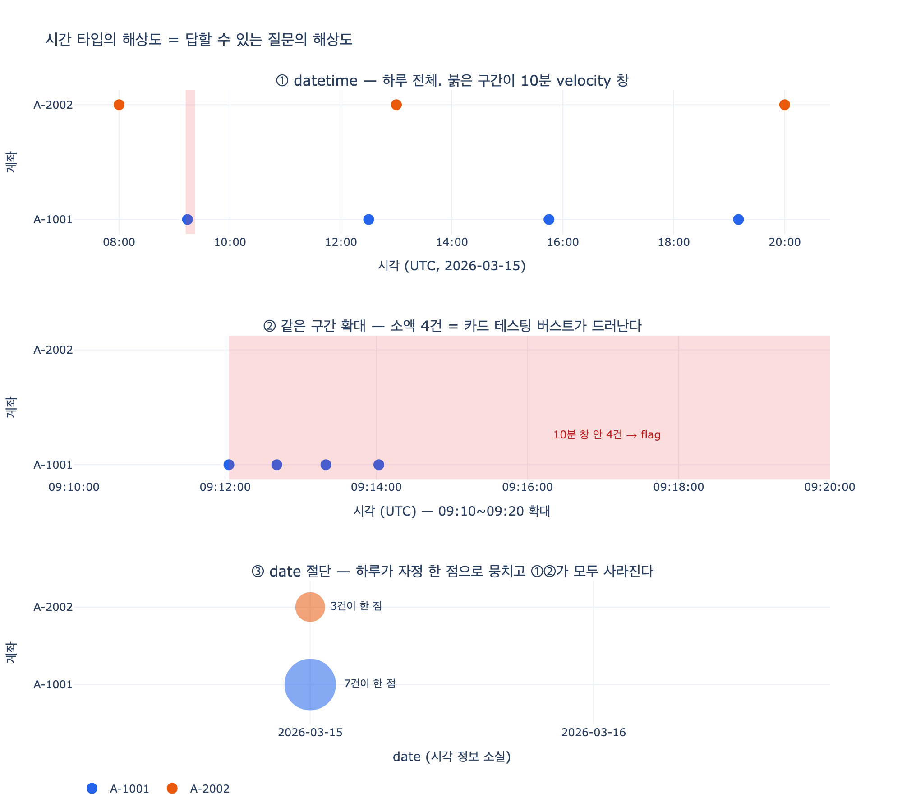

# Transaction의 `timestamp`는 왜 date가 아니라 datetime인가

## 카드 요약

**Q.** Transaction의 `timestamp`가 date가 아니라 datetime인 이유는 무엇인가?

**A.** 금융 거래는 시각 정밀도가 필요하기 때문이다. 사기 탐지 관점에서 오후 2시 30분 결제와 2시 31분 결제는 서로 다른 사건이다.

학습 경로의 Transactions 섹션에서 Transaction 엔티티는 이렇게 정의됐다.

| Property | Type | Identifier? |
|---|---|---|
| `transactionId` | string | ✓ |
| `amount` | decimal (USD) | |
| `type` | string | |
| **`timestamp`** | **datetime** | |
| `merchant` | string | |

## 핵심 원리: 시간 타입의 해상도 = 답할 수 있는 질문의 해상도

이 카드를 "금융은 정밀해야 하니까"로 외우면 절반만 이해한 것이다. 진짜 규칙은 더 일반적이다.

> 프로퍼티의 타입은 **저장 형식**을 고르는 결정이 아니라, **그 데이터로 물을 수 있는 질문의 집합**을 고르는 결정이다.

`datetime`을 `date`로 바꾸는 것은 정밀도를 조금 낮추는 게 아니라, 시각 정보를 **86,400초만큼 뭉개서(truncate) 영구히 파괴**하는 것이다. 그리고 사기 탐지·회계·감사에서 실제로 물어야 하는 질문 대부분은 두 사건의 **시간차 $\Delta t$** 를 분모나 조건으로 쓴다. $\Delta t$의 최소 단위가 1일이 되면 그 질문들은 근사조차 불가능해진다.

```
datetime: 2026-03-15T09:12:03Z  →  "9시 12분 3초에 무슨 일이"
date:     2026-03-15            →  "그날 언젠가"
                                    ↑ 하루 안의 순서·간격·속도가 전부 소실
```

같은 학습 경로가 `creditScore`를 integer로 둔 이유(숫자 비교·범위 질의를 가능하게 하려고)와 정확히 같은 논리다. **타입은 질의 능력의 선언이다.**

---

## `date`로 뭉갤 때 사라지는 것들

### 1. velocity 규칙 (velocity check)

결제 업계에서 **velocity check**는 같은 카드·계좌·기기·IP가 **정해진 시간 창** 안에 몇 번 행동했는지를 세는 실시간 사기 규칙이다. 대표적인 규칙 형태는 이렇다.

$$\text{flag} \iff \bigl|\{\, t_j : 0 \le t_j - t_i \le W \,\}\bigr| \ge N$$

예를 들어 $W = 10\ \text{min},\ N = 3$ — "10분 안에 3건 이상이면 flag".

여기에 $W$가 들어 있다. `date`만 있으면 $W$로 쓸 수 있는 가장 작은 값이 1일이므로, 이 규칙을 **표현조차 할 수 없다**. 할 수 있는 최선의 근사는 "같은 날 3건 이상"이고, 그 근사는 양방향으로 틀린다.

- **false positive** — 아침·점심·저녁에 각 1건씩 쓴 완전히 정상적인 고객이 "하루 3건"으로 flag된다. 시간 창이 없으니 몰린 것과 흩어진 것을 구분할 수 없다.
- **false negative** — 23:58, 23:59, 00:01에 터진 3건 버스트는 두 날짜로 쪼개져 어느 날도 임계치를 못 넘는다. **자정 경계에서 규칙이 통째로 눈이 먼다.**
- **조사 범위가 뭉개진다** — 실제로 flag된 날에도 "그날 7건 전부"만 알 수 있고, 문제의 구간이 09:12~09:14였다는 사실을 특정할 수 없다. 정상 결제까지 같이 물들어 조사 비용이 커진다.

실무에서는 여러 식별자를 조합해 창을 걸기도 한다. 한 IP가 10분 안에 50개의 서로 다른 카드를 시도했는가, 한 기기가 여러 가맹점 계정으로 결제했는가 같은 규칙이다. 이런 다차원 규칙도 전부 시간 창을 전제로 한다.

### 2. 카드 테스팅 (card testing)

탈취한 카드 번호가 살아 있는지 확인하려고 공격자는 **소액 결제를 연달아 시도**한다. 승인되면 유효한 카드, 거절되면 폐카드. 그 뒤에 고액 사기가 온다.

이 패턴의 지문은 금액(1달러 수준)과 **간격(수십 초)** 이다. `date` 해상도에서는 "1달러 결제가 그날 4건"만 남는데, 이는 무료 체험 결제나 소액 정기결제와 구분되지 않는다. **40초 간격**이라는 정보가 곧 공격의 증거인데 그것이 사라진다.

### 3. 지리적 불가능성 (impossible travel)

같은 카드가 서로 다른 도시에서 결제됐을 때, 두 결제 사이에 필요한 이동 속도는

$$v = \frac{d}{\Delta t}$$

이고 $d$는 두 좌표의 대권거리(haversine):

$$d = 2R \arcsin\sqrt{\sin^2\frac{\Delta\varphi}{2} + \cos\varphi_1\cos\varphi_2\sin^2\frac{\Delta\lambda}{2}}$$

서울에서 14:30, 부산에서 14:35에 결제가 찍혔다면 $d \approx 325\ \text{km}$, $\Delta t = 5\ \text{min}$ → $v \approx 3{,}900\ \text{km/h}$. 여객기(약 900 km/h)를 크게 넘으므로 **물리적으로 불가능** → 카드 복제(cloning) 의심.

`date`만 있으면 $\Delta t = 0$이 되어 $v$가 **정의되지 않는다**. 반대로 "1일"로 뭉개면 $325/24 \approx 13.5\ \text{km/h}$ — 걸어서도 가능한 속도가 되어 모든 impossible travel이 "정상"으로 통과한다. 같은 규칙이 로그인 이상 탐지("뉴욕 로그인 5분 뒤 도쿄 로그인")에도 그대로 쓰인다.

### 4. 거래 순서 (ordering)

`date`만 있으면 같은 날 거래들 사이에 **전순서(total order)가 없다**. 그런데 잔액은 누적합이다.

$$B_k = B_0 + \sum_{i=1}^{k} a_i, \qquad \text{overdraft} \iff \min_k B_k < 0$$

총합 $\sum a_i$는 순서와 무관하지만 **최솟값** $\min_k B_k$는 순서에 따라 바뀐다. 잔액 10만원 계좌에서 같은 날 40만원 출금과 50만원 입금이 있었다면,

- 출금 먼저(실제 09:05 → 14:00): 잔액이 −30만원까지 떨어져 **잔액 부족, 수수료 발생**
- 입금 먼저(임의 순서): 한 번도 음수가 되지 않아 **수수료 없음**

최종 잔액은 둘 다 20만원으로 같다. **결과는 같은데 판정이 정반대**다. 그래서 "이 계좌에 초과인출 수수료를 부과해야 하나?"는 `date` 해상도로는 **답이 정해지지 않는 질문**이 된다. 이건 사기 탐지 이전의 기본 회계 정확성 문제다. (금액이 완전히 동일한 거래가 여럿이면 datetime조차 부족해 별도의 시퀀스 번호를 두는 경우도 있다 — 방향은 언제나 해상도를 올리는 쪽이다.)

### 5. 감사 추적(audit trail)과 규제 요건

금융 규제는 "무슨 일이 있었나"가 아니라 **"정확히 언제, 어떤 순서로 있었나"** 를 요구한다.

- **거래 재구성(reconstruction)** — 조사 시 사건을 시간순으로 되짚어야 한다. 순서가 없는 로그는 재구성이 불가능하다.
- **의심거래보고(STR/SAR)와 구조화 거래(structuring) 탐지** — 보고 임계치를 피하려 금액을 쪼개 여러 번 입금하는 패턴은 시간 간격이 핵심 지표다.
- **거래 시각 기록 의무** — 자본시장 규제(예: MiFID II의 시계 동기화 요건)에서는 주문·체결 시각을 밀리초·마이크로초 수준으로 기록하고 기준시각과 동기화하도록 요구한다. 여기서는 datetime조차 초 단위로는 부족하다.
- **불변성** — audit trail은 append-only여야 하고, 각 레코드에는 발생 시각과 기록 시각이 함께 남는다.

즉 `timestamp`의 datetime은 **탐지(detection)** 만이 아니라 **입증(provability)** 을 위한 것이기도 하다. 나중에 정밀도를 되돌릴 방법이 없으므로, 처음부터 남겨야 한다.

### 6. 타임존과 UTC 저장 원칙

`datetime`을 쓰기로 했다면 다음 규칙이 따라온다.

> **UTC(또는 타임존 오프셋 포함)로 저장하고, 표시할 때만 로컬 시각으로 변환한다.**

같은 한 순간이 타임존마다 다른 **날짜**가 되기 때문이다.

| 저장값 (UTC) | Asia/Seoul | America/New_York | date가 다른가 |
|---|---|---|---|
| `2026-03-15T23:30:00Z` | 2026-03-16 08:30 | 2026-03-15 19:30 | **예 — 하루 차이** |

이 하루 차이가 월말·분기말에 걸리면 **회계 기간이 바뀐다**. "3월 매출"이 서울 기준과 뉴욕 기준으로 달라진다.

여기서 `date` 타입의 더 깊은 문제가 드러난다. 날짜만 저장하면 **어느 타임존 기준의 날짜인지 정보가 이미 파괴되어 있어 되돌릴 수 없다**. 반면 오프셋을 가진 datetime은 언제든 원하는 타임존의 날짜로 재계산할 수 있다. datetime은 date를 포함하지만, date는 datetime을 복원하지 못한다 — **한 방향으로만 접히는 정보**다.

관련해서 흔히 밟는 함정:
- 로컬 시각을 오프셋 없이 저장 → DST 전환 시 같은 로컬 시각이 두 번 존재하거나(가을) 아예 없어짐(봄)
- 서버 로컬 타임존에 의존 → 서버를 다른 리전으로 옮기면 과거 데이터 해석이 바뀜
- 사용자에게 보여줄 때 UTC를 그대로 노출 → "내 결제는 15일 저녁이었는데 왜 16일로 나오나" 문의

### 7. 승인 시각 ≠ 정산 시각 — 그래서 시각 프로퍼티는 여러 개일 수 있다

한 거래에는 사실 **여러 개의 "언제"** 가 있다.

| 시각 | 의미 | 누가 쓰는가 |
|---|---|---|
| **승인(authorization)** | 카드 단말/게이트웨이에서 승인된 순간 | 사기 탐지, velocity, impossible travel |
| **정산·기표(settlement/posting)** | 실제로 계좌에 반영되어 잔액이 확정된 순간 | 회계, 잔액, 명세서, 초과인출 판정 |
| **기록(recorded/ingested)** | 데이터 파이프라인이 이 레코드를 받은 순간 | 감사, 지연 모니터링, 재처리 |

승인과 정산 사이에는 보통 수 시간에서 며칠의 지연(batch settlement)이 있다. 15일 23:47에 승인된 결제가 17일 04:00에 정산되면, **"3월 15일 매출"의 답이 어느 시각을 쓰느냐에 따라 달라진다.**

그래서 성숙한 금융 모델에서는 `timestamp` 하나가 `authorizedAt`, `settledAt`, `recordedAt`처럼 갈라진다. 학습 경로의 Transaction은 입문용이라 `timestamp` 하나로 시작하지만, 방향은 분명하다 — **필요한 질문마다 대응하는 시각 프로퍼티를 둔다.** 이 세 시각을 하나로 합치면 어떤 질문에는 반드시 틀린 답을 준다. (bi-temporal 모델링: "사건이 언제 일어났나"와 "우리가 언제 알았나"를 분리해 기록하는 방식이다.)

---

## 대조: `Account.openDate`는 왜 date로 충분한가

같은 학습 경로의 Account 엔티티를 보면 흥미로운 대비가 있다.

| 프로퍼티 | 타입 | 이유 |
|---|---|---|
| `Transaction.timestamp` | **datetime** | velocity 창, impossible travel, 거래 순서, 감사 재구성 — 모두 $\Delta t$를 요구 |
| `Account.openDate` | **date** | 계좌 개설로 답할 질문은 "며칠에 열렸나"까지. 시각까지 필요한 질문이 없다 |

`openDate`로 묻는 질문은 이런 것들이다: 계좌 연령이 몇 년인가, 이번 분기에 개설된 계좌는 몇 개인가, 개설 후 90일이 지났는가. 전부 **일 단위 해상도로 답이 정해진다**. 09:12에 열렸다는 정보로 답이 달라지는 질문은 없고, 같은 날 개설된 두 계좌 사이의 순서가 의미를 갖는 상황도 없다.

여기서 원칙이 나온다.

> **필요한 해상도만 쓴다.** `datetime`이 언제나 정답인 게 아니라, 그 프로퍼티로 답할 질문이 요구하는 해상도를 고른다.

과잉 해상도에도 비용이 있다.
- 저장·인덱스 비용, 시간대 변환·비교 로직의 복잡도
- 타임존/DST 버그의 표면적이 늘어난다
- **행동 시각은 개인정보다** — 새벽 3시 결제 이력은 생활 패턴을 드러내므로, 필요 없으면 남기지 않는 것이 데이터 최소화 원칙에 맞다
- 개념적 오해 — `openDate`에 시각이 있으면 "개설 시각이 의미가 있나?"라는 없는 질문을 유발한다

거꾸로 **부족한 해상도는 되돌릴 수 없다.** datetime을 date로 내리는 것은 언제든 가능하지만(`t.date()`), date를 datetime으로 올리는 것은 불가능하다. 그래서 애매하면 **답해야 할 질문에서 거꾸로 계산**하는 것이 유일한 판단 기준이다.

## 한 문장으로

`timestamp`가 datetime인 이유는 "금융은 정밀하니까"가 아니라, **velocity 창·impossible travel·거래 순서·감사 재구성이 모두 두 사건의 시간차를 필요로 하고, date로 절단하면 그 시간차가 파괴되어 질문 자체가 성립하지 않기 때문**이다. 그리고 같은 논리로 `openDate`는 date다 — 그 프로퍼티에는 시간차를 묻는 질문이 없다.

## 참고

- [What is a Velocity Check? — PayPro Global](https://payproglobal.com/answers/what-is-velocity-check/)
- [What are velocity checks & how do they prevent payment fraud? — Checkout.com](https://www.checkout.com/blog/velocity-check)
- [Velocity Check: Fraud Prevention Technique — SEON](https://seon.io/resources/dictionary/velocity-check/)
- [How to Use Velocity Checks as an Effective Fraud Tool — Chargeback Gurus](https://www.chargebackgurus.com/blog/velocity-checks)
- [Velocity Check: Definition, How It Works — PXP](https://www.pxp.io/payments-glossary/velocity-check)

## 시각화



같은 하루치 거래 로그를 세 해상도로 본 것이다. ①에서 A-1001의 오전 점 하나는 실은 뭉친 것이고, ②로 확대하면 그것이 40초 간격 소액 4건 — 카드 테스팅 버스트임이 드러난다. ③은 같은 데이터를 `date`로 절단한 결과로, 하루 전체가 자정 한 점에 모여 "7건"이라는 개수만 남고 ①과 ②가 보여준 모든 구조가 사라진다. `expy.py`를 실행하면 velocity 규칙의 false positive/negative, 순서에 따른 잔액 판정 역전, $v = d/\Delta t$ 계산, 타임존 날짜 경계 이동을 직접 출력으로 확인할 수 있다.
