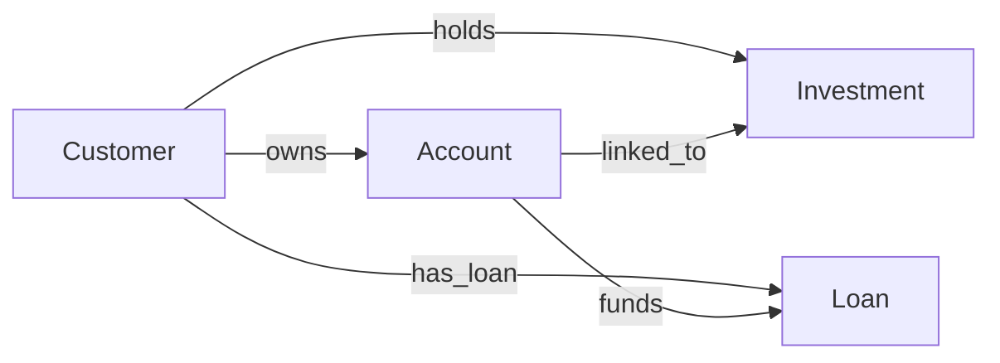

# 다중 경로 관계 (Multi-path Relationship)

## 한 줄 정의

**한 엔티티에서 다른 엔티티로 가는 길이 둘 이상 있고, 각 길이 서로 다른 의미(질문)를 담고 있는 구조.**

그래프에서 `A`와 `B` 사이에 직접 간선 하나와, 중간 엔티티를 거치는 우회 경로가 동시에 존재하면 모양이 다이아몬드가 된다. Banking & Finance 온톨로지는 이 패턴을 두 번 사용한다.



- `Customer → holds → Investment` **vs** `Customer → owns → Account → linked_to → Investment`
- `Customer → has_loan → Loan` **vs** `Customer → owns → Account → funds → Loan`

---

## 사례 1 — Investment: 소유 경로 vs 연결(자금) 경로

| 경로 | 관계 | 답하는 질문 |
|---|---|---|
| 직접 | `Customer -[holds]-> Investment` | **"이 보유분은 누구의 것인가?"** (소유·귀속) |
| 간접 | `Customer -[owns]-> Account -[linked_to]-> Investment` | **"이 보유분은 어느 계좌에 연결되어 있는가?"** (자금원·집행 계좌) |

`holds`는 포트폴리오의 **주인**을 말한다. 세무 보고, 수익률 리포트, 자산 규모 기준 고객 세그멘테이션은 전부 이 경로다.
`linked_to`는 매수 대금이 빠져나가고 배당이 들어오는 **브로커리지 계좌**를 말한다. 자금 흐름 추적, 결제 실패 원인 분석, 계좌 폐쇄 시 영향 범위 산정은 이 경로다.

## 사례 2 — Loan: 채무 경로 vs 상환 경로

| 경로 | 관계 | 답하는 질문 |
|---|---|---|
| 직접 | `Customer -[has_loan]-> Loan` | **"이 대출의 채무자(신용 위험을 지는 사람)는 누구인가?"** |
| 간접 | `Customer -[owns]-> Account -[funds]-> Loan` | **"매달 상환금은 어느 계좌에서 인출되는가?"** |

`has_loan`은 신용 심사·연체 판정·`creditScore`/`riskProfile` 연동의 기준이다.
`funds`는 자동이체 실패, 잔액 부족(NSF) 경고, 상환 계좌 변경 처리의 기준이다.

---

## 왜 정규화 위반이 아닌가

관계형 사고로 보면 "`Customer→Investment`는 `Account`를 통해 이미 유도되니 `holds`는 중복(transitive dependency)"처럼 보인다. 하지만 **함수 종속이 성립하지 않는다.**

> 보유자(holder)는 연결 계좌의 소유자에 의해 결정되지 않는다. 즉 `funding_account.owner → investment.holder` 라는 FD가 없다.

FD가 없으면 정규화가 제거해야 할 중복이 아니다. 두 답이 실제로 갈리는 사례가 있기 때문이다.

**두 답이 갈리는 상황**

1. **공동/가족 계좌** — 부부 공동 성격의 계좌(모델상 소유자는 배우자 A 한 명)에서 자금이 나가지만, 보유분은 배우자 B 명의다. `holds → B`, `owns/linked_to → A`.
2. **미성년 자녀 계좌** — 자녀가 `holds`, 부모 계좌가 `linked_to`.
3. **학자금 대출** — 학생이 `has_loan`(채무자), 부모 계좌가 `funds`(상환).
4. **상환 계좌 변경** — 채무자는 그대로인데 `funds` 대상 계좌만 바뀐다. 두 관계는 **독립적으로 변한다.**
5. **계좌 해지** — `linked_to`/`funds`는 끊기지만 `holds`/`has_loan`은 유지되어야 한다.

두 경로가 **항상** 같은 답을 내는 경우라면 그건 진짜 중복이므로, 하나를 제거하거나 "파생 관계(derived)"로 명시해야 한다. 다중 경로가 정당한지 판단하는 기준은 세 가지다.
① 서로 다른 질문에 답하는가 ② 답이 갈리는 실제 사례가 있는가 ③ 각각 독립적으로 변경·소멸할 수 있는가.

---

## 질의에서 어떤 경로를 골라야 하는가

| 알고 싶은 것 | 골라야 하는 경로 |
|---|---|
| 고객별 총 포트폴리오 가치 | `holds` |
| 고객별 총 부채, 신용 노출 | `has_loan` |
| 특정 계좌를 닫으면 영향받는 보유분/대출 | `linked_to`, `funds` |
| 자금세탁 모니터링(자금 유입 경로) | `owns → linked_to` / `owns → funds` |
| 대출과 투자를 동시에 지탱하는 계좌 찾기 | `Account → funds` **AND** `Account → linked_to` |
| 명의자와 자금원이 다른 건(리스크·KYC 플래그) | 두 경로를 **비교** |

원칙: **"누구의 것/누구 책임"은 직접 경로, "어느 계좌를 거치는가"는 간접 경로.**

### 올바른 질의 — 소유 기준 포트폴리오

```gql
MATCH (c:Customer)-[:holds]->(inv:Investment)
RETURN c.name, SUM(inv.currentValue) AS portfolioValue
ORDER BY portfolioValue DESC
```

### 같은 모양이지만 다른 답 — 계좌 기준 포트폴리오

```gql
MATCH (c:Customer)-[:owns]->(a:Account)-[:linked_to]->(inv:Investment)
RETURN c.name, SUM(inv.currentValue) AS accountBackedValue
ORDER BY accountBackedValue DESC
```

두 질의 결과가 갈리는 예시 데이터(자녀 명의 보유분을 부모 계좌가 지탱):

| 고객 | `holds` 기준 | `owns→linked_to` 기준 |
|---|---|---|
| 김부모 | $0 | $120,000 |
| 김자녀 | $120,000 | $0 |

같은 이름의 `SUM(inv.currentValue)`인데 귀속 주체가 완전히 뒤바뀐다.

### 오답 사례 1 — 경로를 잘못 골라 나오는 조용한 오답

"자산 $100K 이상 우수 고객에게 프리미엄 등급 부여"를 계좌 경로로 계산하면 위 표에서 **김부모가 우수 고객이 되고 김자녀는 누락된다.** 세무 보고서라면 명의자가 아닌 사람에게 자산을 귀속시킨 잘못된 신고가 된다. 질의는 에러 없이 성공하고, 숫자도 그럴듯해서 발견되지 않는다.

### 오답 사례 2 — 두 경로를 한 `MATCH`에 섞어 카티션 곱

```gql
-- 잘못된 질의: 두 경로를 각각의 패턴으로 나열
MATCH (c:Customer)-[:holds]->(inv:Investment),
      (c)-[:owns]->(:Account)-[:linked_to]->(inv2:Investment)
RETURN c.name, SUM(inv.currentValue) AS portfolio
```

`inv`와 `inv2`가 독립 변수이므로 행이 곱해진다. 보유분 3건 × 계좌연결 3건 = 9행이 되어 포트폴리오 합계가 **3배로 부풀려진다.** 두 경로를 함께 쓸 때는 반드시 같은 노드로 묶어야 한다.

```gql
-- 의도가 "두 경로가 일치하는 건만": 동일 변수 inv 를 공유
MATCH (c:Customer)-[:holds]->(inv:Investment)
MATCH (c)-[:owns]->(a:Account)-[:linked_to]->(inv)
RETURN c.name, a.accountNumber, inv.holdingId
```

### 다중 경로를 활용하는 질의 — 불일치 탐지

다중 경로 모델의 진짜 값어치는 두 경로를 **비교**할 때 나온다.

```gql
MATCH (holder:Customer)-[:holds]->(inv:Investment)
OPTIONAL MATCH (funder:Customer)-[:owns]->(:Account)-[:linked_to]->(inv)
WHERE funder IS NULL OR funder.customerId <> holder.customerId
RETURN inv.holdingId, inv.symbol, holder.name AS 명의자, funder.name AS 자금계좌주
```

명의자와 자금원이 다른 보유분(제3자 자금 유입 의심, KYC 검토 대상)과 연결 계좌가 아예 없는 보유분(데이터 품질 문제)을 한 번에 뽑아낸다. **단일 경로 모델에서는 애초에 물어볼 수 없는 질문이다.**

대출 쪽 동일 패턴:

```gql
MATCH (debtor:Customer)-[:has_loan]->(l:Loan)
WHERE l.status = 'active'
OPTIONAL MATCH (payer:Customer)-[:owns]->(a:Account)-[:funds]->(l)
WHERE payer IS NULL OR payer.customerId <> debtor.customerId
RETURN l.loanId, l.principal, debtor.name AS 채무자, payer.name AS 상환계좌주
```

---

## 관계형 스키마로 옮기면 의미가 어떻게 소실되는가

같은 구조를 테이블로 쓰면 FK 두 개가 된다.

```sql
CREATE TABLE investment (
  holding_id     VARCHAR PRIMARY KEY,
  customer_id    VARCHAR REFERENCES customer(customer_id),
  account_number VARCHAR REFERENCES account(account_number),
  symbol         VARCHAR,
  current_value  NUMERIC
);
```

여기서 잃는 것들.

1. **역할 이름이 사라진다.** `holds`와 `linked_to`라는 술어(predicate)가 `customer_id`, `account_number`라는 무명의 컬럼으로 납작해진다. 어느 쪽이 소유이고 어느 쪽이 자금원인지 스키마에 없다.
2. **컬럼명 규약은 강제력이 없다.** `holder_customer_id`, `funding_account_number`로 고쳐도 그건 사람 대상 관례다. 쿼리 엔진·카탈로그·BI 도구는 여전히 "그냥 두 개의 FK"로 본다. 조인 방향을 실수해도 아무 것도 막아주지 않는다.
3. **정규화 리팩터링이 관계를 지운다.** 리뷰어 눈에는 `customer_id`가 `account_number`를 통해 유도 가능한 중복으로 보인다. "3NF 위반"이라며 `customer_id`를 삭제하고 `JOIN account USING (account_number)`로 대체하는 순간, 명의자와 자금계좌주가 다른 케이스가 **영구히 표현 불가능**해진다. 정보 손실형 정규화다.
4. **어느 경로가 정답인지가 스키마 밖(문서·구전)에 산다.** 새로 온 개발자는 두 조인 중 편한 쪽을 고른다. 위 "오답 사례 1"이 이렇게 발생한다.
5. **비교 질의가 어렵다.** 불일치 탐지 SQL은 `investment`를 `customer`와 `account→customer`에 각각 조인한 뒤 두 `customer_id`를 비교하는 형태가 되는데, 두 조인의 의미 차이가 코드에 드러나지 않아 유지보수 중 뭉개진다.

온톨로지는 **관계를 1급 시민**으로 만든다. 이름·방향·카디널리티가 스키마 자체에 있으므로 `-[:holds]->`와 `-[:linked_to]->`는 물리적으로 다른 것이고, 질의문을 읽는 것만으로 어떤 질문에 답하는지 알 수 있다. 다중 경로가 "중복"이 아니라 "의도된 모델링"으로 남을 수 있는 이유가 여기 있다.

---

## 정리

- 다중 경로 관계 = 같은 두 엔티티를 잇는 **서로 다른 의미의** 경로가 둘 이상 존재하는 구조.
- Investment: `holds`(누가 소유) / `linked_to`(어느 계좌가 연결) — Loan: `has_loan`(누가 채무자) / `funds`(어느 계좌가 상환).
- 정당성의 근거는 **함수 종속이 없다는 것**, 즉 공동계좌·자녀 계좌·학자금 대출처럼 두 답이 실제로 갈린다는 것.
- 질의 원칙: 귀속·책임은 직접 경로, 자금 흐름·계좌 영향은 간접 경로. 섞을 때는 같은 노드 변수로 묶어 카티션 곱을 피한다.
- 두 경로를 비교하는 질의가 이 모델의 최대 이득(KYC 플래그, 데이터 품질 감사).
