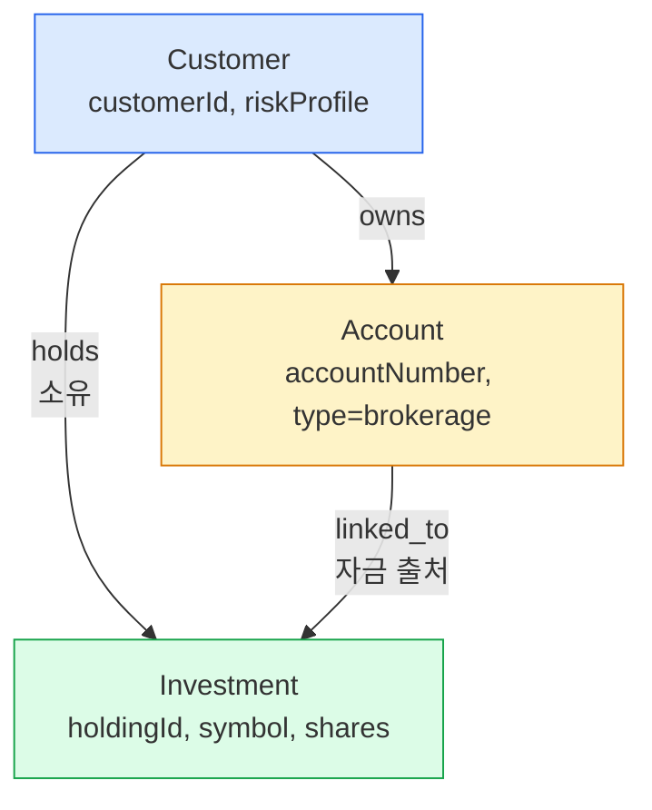
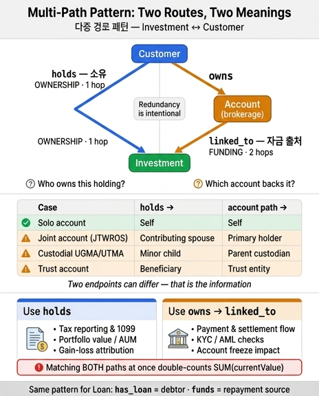

# Investment ↔ Customer: 다중 경로 패턴(multi-path pattern)

## 한 줄 답

`Investment`는 `Customer`에 **두 경로**로 닿는다. 이를 **다중 경로 패턴(multi-path pattern)** 이라 부른다.

| 경로 | 관계 체인 | 모델링 대상 | 답하는 질문 |
|---|---|---|---|
| 직접 경로 | `Customer -holds-> Investment` | **소유(ownership)** | 이 보유 자산의 **주인**은 누구인가 |
| 간접 경로 | `Customer -owns-> Account -linked_to-> Investment` | **자금 출처(funding)** | 어떤 **브로커리지 계좌**가 이 자산을 뒷받침하는가 |

asset 원문의 노트가 그대로 이 점을 못 박는다.

> **Multi-path pattern:** Investment connects to Customer through *two* different paths: directly via `holds` and indirectly via `Account → linked_to`. This redundancy is intentional — it models both ownership (who holds it?) and funding (which account backs it?).

핵심은 **"중복이 실수가 아니라 의도"** 라는 것이다. 두 경로는 겹쳐 보이지만 서로 다른 질문에 답하고, **답이 갈릴 수 있기 때문에** 둘 다 필요하다.

## 다이아몬드 구조

두 경로는 `Customer`에서 갈라져 `Investment`에서 다시 만난다. 그래서 그래프 모양이 다이아몬드(마름모)다.



ASCII로 보면 갈라짐과 재합류가 더 뚜렷하다.

```
                  Customer
                 /        \
          holds /          \ owns
         (소유) /            \
              /              Account   (type = brokerage)
             /                    \
            /                      \ linked_to
           /                        \  (자금 출처)
      Investment <------------------+
        ^                          ^
        |                          |
   "누가 주인인가"          "어떤 계좌로 거래·결제되나"
```

왼쪽 변은 **1홉(hop)**, 오른쪽 변은 **2홉**이다. 홉 수가 다르다는 것 자체가 신호다. 짧은 변은 "법적·세무적 귀속"이라는 사실을 지름길로 박아 넣은 것이고, 긴 변은 "실제 자금·거래 인프라"를 계좌라는 중간 실체를 거쳐 표현한 것이다. 만약 두 경로가 항상 같은 고객으로 수렴한다면 `holds`는 삭제 가능한 파생 관계일 뿐이다. 아래 시나리오들이 그렇지 않음을 보여준다.

## 두 경로의 답이 갈리는 실제 시나리오

### 1. 공동 브로커리지 계좌(joint brokerage account)

부부가 **JTWROS**(Joint Tenants with Rights of Survivorship) 또는 **Tenants in Common** 등록으로 공동 계좌를 연다. 브로커는 1099-DIV / 1099-B를 **primary account holder(첫 번째 명의자)의 SSN 하나로만** 발행한다. 그런데 IRS의 소득 귀속 원칙은 등록 형태가 아니라 **실제 출자 비율(actual contribution)** 을 따르므로, primary holder는 배우자 몫을 **nominee 1099**로 재배분해야 한다.

즉 자금은 공동 계좌에서 나갔지만, 특정 보유 자산의 경제적 주인은 배우자 한 명일 수 있다.

- `holds` → 배우자 B (실제 출자·귀속자)
- `owns → linked_to` → 배우자 A (계좌 명의자, primary holder)

### 2. 미성년 자녀 명의 보유 자산 (custodial account, UGMA/UTMA)

**UGMA**(Uniform Gifts to Minors Act) / **UTMA**(Uniform Transfers to Minors Act) 계좌는 이 패턴의 교과서적 사례다.

- 입금은 **철회 불가능한 증여(irrevocable gift)** 이며, 자산의 **법적 소유자는 미성년자 본인**이다.
- 계좌는 **미성년자의 SSN으로 개설·보고**된다.
- 부모/조부모는 **소유자가 아니라 custodian(관리인)** 이다. 투자 판단과 거래를 실행하지만, 인출은 아동의 이익을 위해서만 가능하다.
- 주(state)별 성년 연령(보통 18~25세)에 도달하면 custodian은 통제권을 아동에게 **이전해야 한다.**

여기서 소스 시스템이 어떤 실체를 무엇으로 적재했는지에 따라 두 경로가 갈린다. 브로커리지 플랫폼이 `Account`를 custodian(부모) 기준으로 적재하고, 보유 자산 원장은 수혜자(자녀) 기준으로 적재했다면:

- `holds` → 자녀 (법적 소유자, 세무 보고 주체)
- `owns → linked_to` → 부모 (custodian, 거래 실행 주체)

### 3. 신탁 계좌(trust account)

계좌 명의는 신탁(trust)이고 실질 수익자는 수익자(beneficiary)다. 신탁을 `Customer` 레코드로 적재하면 계좌 경로는 신탁에 도달하고, 수익 귀속 경로는 수익자에 도달한다.

- `holds` → 수익자(beneficiary)
- `owns → linked_to` → 신탁(trustee 명의 법적 실체)

### 4. 법인 계좌(corporate / entity account)

법인이 계좌 명의자이고, 특정 보유 자산은 임원 보상 프로그램처럼 개인에게 배분되어 있을 수 있다.

- `holds` → 개인(수혜 임직원)
- `owns → linked_to` → 법인

### 정리 표

| 시나리오 | `holds`가 가리키는 Customer | `owns → linked_to`가 도달하는 Customer | 두 경로 일치? |
|---|---|---|---|
| 개인 단독 브로커리지 계좌 | 본인 | 본인 | ✅ 일치 |
| 공동 계좌(JTWROS/TIC) | 실제 출자·귀속 배우자 B | 계좌 명의자(primary holder) A | ❌ 불일치 |
| 미성년 자녀 (UGMA/UTMA custodial) | 자녀(법적 소유자) | 부모(custodian) | ❌ 불일치 |
| 신탁 계좌 | 수익자(beneficiary) | 신탁 실체 | ❌ 불일치 |
| 법인 계좌 | 배분받은 개인 | 법인 | ❌ 불일치 |
| 자녀가 성년 도달 후 계좌 이관 완료 | 자녀 | 자녀 | ✅ 일치(시점 이후) |

마지막 행이 특히 중요하다. 두 경로의 일치/불일치는 **고정된 사실이 아니라 시점에 따라 변한다.** 단일 경로 모델로는 이 전이를 표현조차 할 수 없다.

## 질의 시 어느 경로를 골라야 하는가

경로 선택이 곧 **의미 선택**이다. 잘못 고르면 문법은 통과하지만 답이 틀린다.

| 질문 유형 | 써야 할 경로 | 이유 |
|---|---|---|
| 세금 보고, 1099 귀속, 자본이득 계산 | `holds` | 소득·이득은 법적 소유자에게 귀속 |
| 포트폴리오 가치, 고객별 순자산(AUM) | `holds` | 자산의 경제적 주인 기준 집계 |
| 미성년자 보유 자산 규정 준수 점검 | `holds` | 수혜자 본인이 소유자 |
| 결제·정산 흐름, 매수 자금 출처 추적 | `owns → linked_to` | 현금은 계좌에서 움직인다 |
| KYC / AML, 거래 권한·지시 주체 | `owns → linked_to` | 계좌를 통제하는 주체가 거래를 지시 |
| 계좌 명세서·수수료 청구 대상 | `owns → linked_to` | 명세서는 계좌 단위로 발행 |
| 계좌 동결·제재 시 영향받는 보유 자산 | `owns → linked_to` | 제재는 계좌 레벨에서 적용 |

asset의 예시 질의 `Customer → Investment (sum currentValue)`가 `holds`를 쓰는 이유가 이것이다. 반면 `Which accounts fund both loans and investments?`는 `Account → Loan` / `Account → Investment` 즉 **계좌 경로만** 쓴다.

## 함정: 두 경로를 무심코 함께 매칭하면 중복 집계된다

다이아몬드는 그래프 질의에서 전형적인 **fan-out 중복(double counting)** 함정을 만든다. 아래는 "고객별 포트폴리오 총액"을 구하려는 잘못된 질의다.

```gql
-- ❌ 잘못됨: 두 경로를 동시에 매칭 → currentValue가 부풀려짐
MATCH (c:Customer)-[:holds]->(inv:Investment),
      (c)-[:owns]->(a:Account)-[:linked_to]->(inv)
RETURN c.name, SUM(inv.currentValue) AS portfolio
```

두 경로가 모두 성립하면 `(c, inv)` 쌍이 한 번만 나오는 게 아니라, 그 고객이 그 보유 자산에 연결된 **계좌 수만큼** 행이 복제된다. 고객이 브로커리지 계좌 3개로 같은 보유 자산을 뒷받침하면 `SUM(inv.currentValue)`가 **3배**가 된다. `owns`도 `linked_to`도 one-to-many이므로 카티전 곱이 두 단계로 누적된다.

올바른 형태는 두 가지다. 소유 기준 집계라면 계좌 경로를 아예 매칭하지 않는다.

```gql
-- ✅ 소유 기준 집계: 계좌 경로를 끌어들이지 않는다
MATCH (c:Customer)-[:holds]->(inv:Investment)
RETURN c.name, SUM(inv.currentValue) AS portfolio
```

계좌 조건이 정말 필요하다면(예: "브로커리지 계좌로 뒷받침되는 보유 자산만"), 조인이 아니라 **존재 여부 필터**로 표현해 중복을 막는다.

```gql
-- ✅ 계좌 조건은 존재 검사로: 행 복제 없음
MATCH (c:Customer)-[:holds]->(inv:Investment)
WHERE EXISTS {
  MATCH (c)-[:owns]->(a:Account)-[:linked_to]->(inv)
  WHERE a.type = 'brokerage'
}
RETURN c.name, SUM(inv.currentValue) AS portfolio
```

또는 집계 전에 `DISTINCT`로 쌍을 접는다.

```gql
MATCH (c:Customer)-[:holds]->(inv:Investment),
      (c)-[:owns]->(:Account)-[:linked_to]->(inv)
WITH DISTINCT c, inv
RETURN c.name, SUM(inv.currentValue) AS portfolio
```

교훈: **두 경로를 함께 매칭하는 것은 "교집합 조건"을 뜻할 때만 하고, 집계 대상 값은 한 경로에서만 가져온다.**

## 데이터 품질 검증: 두 경로가 불일치하는 레코드 찾기

다중 경로 패턴의 가장 실용적인 부수 효과는 **교차 검증(cross-validation)** 이다. 두 경로가 서로를 감시한다.

### (1) 소유자와 계좌 명의자가 다른 보유 자산

```gql
MATCH (owner:Customer)-[:holds]->(inv:Investment),
      (funder:Customer)-[:owns]->(a:Account)-[:linked_to]->(inv)
WHERE owner.customerId <> funder.customerId
RETURN inv.holdingId, inv.symbol,
       owner.name  AS holds_owner,
       funder.name AS account_owner,
       a.accountNumber, a.type
ORDER BY inv.currentValue DESC
```

결과는 **전부 오류가 아니다.** custodial·joint·신탁·법인 계좌라면 정당하다. 그래서 이 질의는 "버그 목록"이 아니라 **"검토 대기 큐(review queue)"** 로 다뤄야 한다. 정당한 사례를 화이트리스트로 분류해 나가면, 남는 것이 진짜 데이터 오류다.

### (2) 고아 보유 자산 — 소유자는 있으나 뒷받침 계좌가 없음

```gql
MATCH (c:Customer)-[:holds]->(inv:Investment)
WHERE NOT EXISTS {
  MATCH (:Account)-[:linked_to]->(inv)
}
RETURN c.name, inv.holdingId, inv.symbol, inv.currentValue
```

브로커리지 계좌 적재 누락 또는 계좌 폐쇄 후 링크 유실을 잡는다.

### (3) 반대 방향 고아 — 계좌는 연결됐으나 소유자 미지정

```gql
MATCH (a:Account)-[:linked_to]->(inv:Investment)
WHERE NOT EXISTS {
  MATCH (:Customer)-[:holds]->(inv)
}
RETURN a.accountNumber, a.type, inv.holdingId, inv.symbol
```

세금 보고 귀속 주체가 없는 보유 자산이므로 컴플라이언스상 우선순위가 높다.

### (4) 계좌 타입 정합성 — 브로커리지가 아닌 계좌가 보유 자산에 링크됨

```gql
MATCH (a:Account)-[:linked_to]->(inv:Investment)
WHERE a.type <> 'brokerage'
RETURN a.accountNumber, a.type, inv.holdingId
```

`linked_to`의 의도는 "A brokerage account linked to investment holdings"이므로, checking/savings 계좌가 걸려 있으면 적재 매핑 오류 신호다.

### (5) 불일치 규모 요약 — 데이터 품질 지표

```gql
MATCH (owner:Customer)-[:holds]->(inv:Investment)
OPTIONAL MATCH (funder:Customer)-[:owns]->(:Account)-[:linked_to]->(inv)
WITH inv,
     owner,
     COUNT(DISTINCT funder) AS funder_count,
     COUNT(DISTINCT CASE WHEN funder.customerId = owner.customerId
                         THEN funder.customerId END) AS self_match
RETURN
  SUM(CASE WHEN funder_count = 0 THEN 1 ELSE 0 END) AS no_funding_account,
  SUM(CASE WHEN self_match  = 1 THEN 1 ELSE 0 END) AS aligned,
  SUM(CASE WHEN funder_count > 0 AND self_match = 0
           THEN 1 ELSE 0 END)                      AS divergent
```

`divergent` 비율이 갑자기 튀면 소스 시스템 매핑이 깨졌다는 뜻이다.

## Loan에 적용된 같은 패턴

`Investment`만의 특수 사정이 아니다. `Loan`도 **정확히 동일한 다이아몬드**를 갖는다.

```
       Customer                          Customer
      /        \                        /        \
 has_loan     owns                 holds        owns
(채무 귀속)      \                  (소유)          \
    |          Account                |          Account
    |             \                   |             \
    |            funds                |          linked_to
    |         (상환 자금원)              |          (자금 출처)
    Loan <-------+                Investment <-------+
```

| | 소유·귀속 경로 (1홉) | 자금 경로 (2홉) |
|---|---|---|
| Investment | `holds` — 누가 보유하는가 | `linked_to` — 어떤 계좌가 뒷받침하는가 |
| Loan | `has_loan` — 누가 채무자인가 | `funds` — 어떤 계좌가 상환금을 내는가 |

`funds`의 정의가 "An account serves as the payment source for loan repayments"인 점에 주목하자. 채무자와 상환 계좌 명의자가 다른 경우는 흔하다. 부모가 자녀 학자금 대출의 자동이체를 자기 계좌로 걸어 두면 `has_loan`은 자녀를, `funds` 경로는 부모를 가리킨다. 신용 보고와 채무 귀속은 `has_loan`, 연체 알림·자동이체 실패 처리는 `funds` 경로다.

즉 이 온톨로지의 6개 관계 중 4개가 **동일한 설계 원칙의 두 인스턴스**다. `holds`/`has_loan`은 "누구의 것인가", `linked_to`/`funds`는 "돈이 어디서 오는가". 이 대칭을 알아채면 관계 4개를 개별 사실로 암기할 필요가 없다.

## 기억할 한 문장

**다중 경로 패턴 = 소유(1홉)와 자금(2홉)을 각각 다른 변으로 새겨 넣은 다이아몬드.** 두 변의 끝점이 갈릴 수 있기 때문에 중복이 아니라 정보다.

## 인포그래픽


