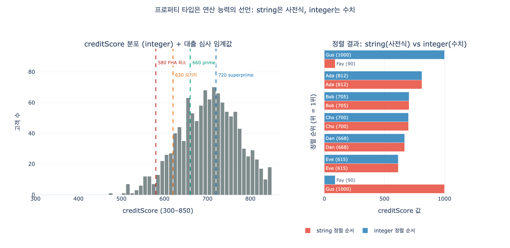

# creditScore를 integer로 모델링하는 이유

## 한 줄 요약

프로퍼티 타입은 "값을 어떻게 저장할지"가 아니라 **"이 프로퍼티로 어떤 연산이 허용되는지"를 선언하는 계약**이다. `creditScore: integer`는 질의 엔진에게 "이 값은 비교·범위·정렬·집계가 가능한 수치"라고 알려준다. `string`으로 두면 그 능력이 전달되지 않는다.

---

## 1. 타입은 저장 형식이 아니라 연산 능력의 선언

온톨로지는 데이터베이스가 아니라 **스키마**다. `finance-path.md`의 Customer 표를 보면:

| Property | Type | Identifier? |
|---|---|---|
| `customerId` | string | ✓ |
| `name` | string | |
| `ssn` | string | |
| `creditScore` | **integer** | |
| `riskProfile` | string | |

여기서 `integer`는 "3자리 숫자를 담는다"는 뜻이 아니다. 이 프로퍼티에 대해 다음이 **의미 있고 지원된다**는 선언이다.

| 연산 | integer | string |
|---|---|---|
| 비교 (`>`, `<`, `BETWEEN`) | 수치 순서 | 사전식 순서 (오답 발생) |
| 범위 필터 (`> 700`) | ✓ | ✗ (또는 조용히 틀린 결과) |
| 정렬 (`ORDER BY`) | 수치 정렬 | 문자 정렬 |
| 집계 (`AVG`, `SUM`, `MIN/MAX`, 분위수) | ✓ | ✗ (타입 에러) |
| 히스토그램 / 버케팅 | ✓ | 값마다 개별 카테고리 |
| 산술 (`score - 700`, 가중 스코어링) | ✓ | ✗ |
| B-tree 인덱스 범위 스캔 · 통계 기반 플랜 | ✓ | 제한적 |

퀴즈 해설이 말하는 핵심이 바로 이것이다: *"A string property wouldn't convey this capability to query engines."* — 능력이 **전달되지 않는다**는 표현이 중요하다. 값 자체는 string으로도 담을 수 있지만, 질의 엔진은 그 값을 수처럼 다룰 근거가 없다.

---

## 2. string으로 두면 생기는 구체적 실패: 사전식 비교

문자열 비교는 **문자 코드 단위로 왼쪽부터** 진행된다. 길이도, 자릿수도 고려하지 않는다.

```
"90"  vs "700"   →  '9'(0x39) vs '7'(0x37)  →  '9' > '7'  →  "90" > "700"   (거짓말!)
"800" vs "90"    →  '8'      vs '9'         →  "800" < "90"                 (거짓말!)
```

즉 string 상태에서 `creditScore > "700"` 이라는 필터를 걸면, 실제로는 **"첫 글자가 7보다 큰 문자로 시작하는 모든 값"**을 뽑는다. 결과적으로:

- 신용점수 90(존재하지 않지만 데이터 오류로 들어온 값)이나 `"8"`, `"9"` 같은 절단된 값이 통과한다
- 실제 우량 고객인 `"1000"`(스케일이 다른 소스에서 유입) 같은 값은 `'1' < '7'`이라 **탈락**한다
- 어떤 에러도 나지 않는다. **조용히 틀린 대출 심사 결과**가 나온다

이게 타입 미스매치 중 가장 위험한 부류다. 크래시가 아니라 **잘못된 답**이기 때문이다.

## 3. 막히는 것들: 범위·정렬·집계·히스토그램·임계값

`creditScore`가 string이면 다음 질의들이 전부 불가능하거나 왜곡된다.

```gql
-- 범위 질의 (임계값 필터)
MATCH (c:Customer) WHERE c.creditScore > 700 RETURN c.name

-- 분포 파악
MATCH (c:Customer) RETURN AVG(c.creditScore), MIN(c.creditScore), MAX(c.creditScore)

-- 세그먼트 버케팅
MATCH (c:Customer)
WITH CASE WHEN c.creditScore >= 720 THEN 'superprime'
          WHEN c.creditScore >= 660 THEN 'prime'
          ELSE 'subprime' END AS tier
RETURN tier, COUNT(*)

-- 다른 수치 프로퍼티와의 결합 (finance-path의 컴플라이언스 질의)
MATCH (c:Customer)-[:has_loan]->(l:Loan)
WHERE c.creditScore < 620 AND l.principal > 100000 RETURN c, l
```

string이면 `AVG`는 타입 에러, 버케팅은 각 문자열이 독립 카테고리, 히스토그램의 x축은 순서 없는 명목형 축이 된다.

### 질의 엔진 관점: 인덱스와 통계

- **인덱스 범위 스캔**: integer 컬럼의 B-tree는 `> 700`을 인덱스의 특정 지점부터 끝까지 순차 스캔하는 것으로 처리한다. string 컬럼에서 "수치적으로 700보다 큰 것"은 인덱스 순서와 대응되지 않아 **전체 스캔 + 매 행 캐스팅**이 된다.
- **통계/히스토그램**: 옵티마이저는 수치 컬럼의 min/max·분포 히스토그램으로 선택도(selectivity)를 추정해 조인 순서와 방식을 정한다. string 컬럼에는 그런 수치 분포가 없어 추정이 무너지고, 결과적으로 나쁜 실행 계획이 나온다.
- **파티셔닝/정렬 최적화**: 범위 파티션 프루닝, 정렬 병합 등 수치 순서를 전제하는 최적화가 모두 비활성화된다.

---

## 4. 도메인이 뒷받침한다: FICO 300~850과 실제 대출 임계값

`creditScore`는 **300~850의 유계(bounded) 정수 스케일**이다(FICO). 이 도메인 자체가 "수치 비교가 본질"임을 말해준다. 실제 대출 심사는 임계값 기반이다.

FICO 등급 구간:

| 구간 | 점수 |
|---|---|
| Poor | 300–579 |
| Fair | 580–669 |
| Good | 670–739 |
| Very Good | 740–799 |
| Exceptional | 800–850 |

CFPB의 차주 위험 프로파일(prime/subprime 구간):

| 프로파일 | 점수 |
|---|---|
| Deep subprime | < 580 |
| Subprime | 580–619 |
| Near-prime | 620–659 |
| **Prime** | **660–719** |
| **Superprime** | **720+** |

실무 컷오프 예: 580(FHA 최소), 620(컨벤셔널 모기지 최소), 670(무담보 상품의 "good credit" 기준선), 720(주요 대출기관의 2번째 우대 금리 티어 컷오프).

이 모든 규칙이 `score >= K` 형태다. 즉 이 프로퍼티의 **존재 이유가 범위 비교**다. 그런데 string으로 모델링하면 존재 이유 자체가 작동하지 않는다. 퀴즈의 오답 선지들("문자열이 저장하기 어렵다", "항상 세 자리다", "정수가 저장공간을 덜 쓴다")은 전부 **저장 관점**이고, 정답만이 **연산 관점**이라는 점을 눈여겨볼 것.

> 참고: "항상 세 자리"라는 것도 정답이 아니다. 자릿수가 고정이라면 오히려 zero-padding한 string 비교가 우연히 맞아떨어지기도 한다. 하지만 그건 타입이 아니라 포맷 규약에 기댄 우연이고, 스케일이 다른 소스가 유입되면 깨진다.

---

## 5. 반대 방향: 숫자처럼 보이지만 string이어야 하는 것들

타입 선택 기준이 "생김새"가 아니라 "필요한 연산"이라는 걸 확인하는 가장 좋은 방법은 **반례**다. 같은 Customer/Account 표를 보라.

| Property | Type | 왜 string인가 |
|---|---|---|
| `customerId` | string | 식별자. 비교·평균이 무의미 |
| `ssn` | string | `123-45-6789` 하이픈 포함, 선행 0 존재, 산술 무의미 |
| `accountNumber` | string | 선행 0 소실 위험, 자릿수 고정, 산술 무의미 |
| `transactionId`, `loanId`, `holdingId` | string | 순수 식별자 |

### 선행 0 소실

```
"0012345678"  →  int  →  12345678  →  다시 문자열로  →  "12345678"   (계좌 불일치!)
```

계좌번호를 integer로 바꾸면 되돌릴 수 없는 정보 손실이 발생한다. 우편번호도 마찬가지다(미국 `02134` → `2134`). 게다가 계좌번호는 16~20자리가 흔해 32비트 정수 범위를 넘고, 체크디지트 규칙상 문자가 섞일 수도 있다.

### 산술이 무의미하다

`AVG(accountNumber)`, `SSN + 1`, `zipCode * 2`는 모두 문법적으로는 가능하지만 **의미가 없다**. 타입을 string으로 두면 이런 질의는 애초에 타입 에러로 막힌다 — 이것도 타입의 순기능이다. integer로 두면 무의미한 집계가 조용히 성공해서 대시보드에 "평균 계좌번호"가 뜬다.

### 판별 규칙

> **그 숫자에 대해 덧셈·평균·크기 비교가 의미를 갖는가?**
> - 예 → 수치 타입 (`creditScore`, `balance`, `principal`, `term`, `shares`)
> - 아니오, 라벨/코드일 뿐 → string (`accountNumber`, `ssn`, `zipCode`, `*Id`)

`finance-path.md`의 다른 프로퍼티 타입 선택도 같은 기준으로 읽힌다: `balance`/`principal`/`apr`은 소수 정밀도가 필요하므로 `decimal`, `term`은 개월 단위 정수이므로 `integer`, `timestamp`는 사기 탐지에 시각 정밀도가 필요하므로 `date`가 아니라 `datetime`. 전부 "이 값으로 어떤 연산·질문을 할 것인가"에서 역산된 결정이다.

---

## 정리

1. 타입은 저장 형식 선언이 아니라 **연산 능력의 계약**이다
2. string 비교는 사전식이라 `"90" > "700"` 같은 결과가 나오고, **에러 없이 틀린다**
3. 범위 필터·정렬·`AVG`/분위수·히스토그램·버케팅이 전부 막히거나 왜곡된다
4. 질의 엔진이 **인덱스 범위 스캔과 수치 통계**를 쓸 수 없어 실행 계획도 나빠진다
5. `creditScore`는 300~850 유계 정수이고 대출 심사가 전부 `>= K` 임계값이므로, 수치 타입이 **존재 이유**다
6. 반대로 계좌번호·SSN·우편번호는 숫자처럼 보여도 **선행 0 소실과 무의미한 산술** 때문에 string이 맞다

## 시각화



왼쪽: `creditScore`가 integer일 때만 임계값(580 / 620 / 660 / 720)을 **수치 축 위의 한 지점**으로 그을 수 있다. string 축이라면 값들이 순서 없는 카테고리로 흩어져 이 선을 놓을 자리가 없다.

오른쪽: 완전히 동일한 7개 값을 string 정렬(빨강)과 integer 정렬(파랑)로 나란히 놓은 것. `Fay(90)`가 사전식에서는 1위로 올라가고 `Gus(1000)`는 최하위로 밀린다. "우량 고객 상위 3명" 질의의 답이 타입 하나 때문에 바뀐다.

## 참고 자료

- [Borrower Risk Profiles — Consumer Financial Protection Bureau](https://www.consumerfinance.gov/data-research/consumer-credit-trends/student-loans/borrower-risk-profiles/)
- [What Are the Different Credit Score Ranges? — Capital One](https://www.capitalone.com/learn-grow/money-management/credit-score-ranges/)
- [The 5 credit score ranges you need to know — CNBC Select](https://www.cnbc.com/select/borrower-risk-profiles-based-on-credit-score/)
