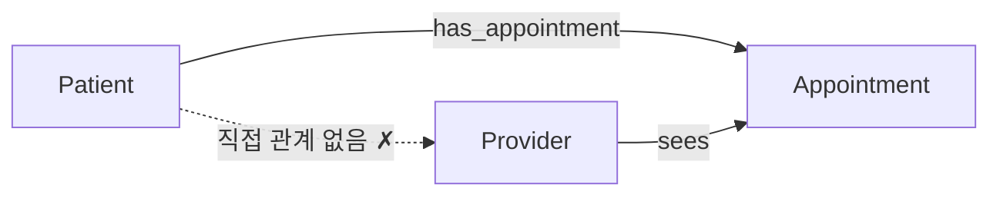
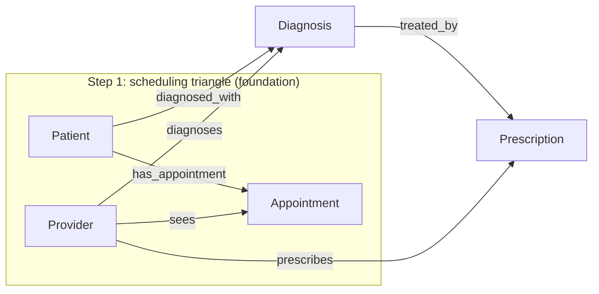

# scheduling triangle (스케줄링 삼각형)

**Q.** scheduling triangle(스케줄링 삼각형)이란 무엇을 가리키는가?

**A.** **Patient–Appointment–Provider**로 이루어진 구조다. 이 삼각형이 healthcare 온톨로지의 **기반(foundation)** 을 형성한다.

---

## 1. 세 개의 질문, 세 개의 엔티티

Healthcare 도메인의 진료 전달(care delivery)은 결국 세 가지 질문으로 환원된다. 원문(`Care Delivery` 섹션)은 이를 이렇게 정리한다.

| 질문 | 엔티티 | 역할 |
|---|---|---|
| 누가 진료를 **받는가?** | **Patient** | 진료 수혜자 (actor) |
| 누가 진료를 **제공하는가?** | **Provider** | 진료 제공자 (actor) |
| 진료가 **언제/어디서** 일어나는가? | **Appointment** | 만남이 실제로 발생하는 사건(event) |

이 세 엔티티가 healthcare 스케줄링과 진료 전달을 모두 담아내며, **모든 진단과 치료는 appointment에서 흘러나온다**(every diagnosis and treatment flows from an appointment).

각 엔티티의 주요 속성:

- **Patient** — `patientId`(식별자), `mrn`, `dateOfBirth`, `bloodType`, `allergies`
  - `mrn`(Medical Record Number)은 병원 내부 식별자로, 온톨로지 식별자(`patientId`)와 **공존**한다. 도메인 고유 식별자와 온톨로지 식별자를 분리하는 패턴.
- **Provider** — `providerId`(식별자), `name`, `specialty`, `licenseNumber`, `department`
  - `specialty` / `department`가 있어야 "cardiology provider만" 같은 임상 도메인 필터링과 의뢰(referral)·라우팅 질의가 가능하다.
- **Appointment** — `appointmentId`(식별자), `scheduledTime`, `duration`, `type`, `status`
  - `duration`은 분(minutes) 단위 integer → 스케줄 계산과 가동률(utilization) 분석이 가능해진다.

## 2. "삼각형"이라 부르지만 관계는 두 개뿐이다 (핵심)

이 카드에서 가장 잘 틀리는 지점이다. 삼각형처럼 **그려지지만**, 실제로 정의된 관계(relationship)는 **딱 두 개**다.

| 관계명 | 방향 | 카디널리티 | 의미 |
|---|---|---|---|
| `has_appointment` | `Patient` → `Appointment` | one-to-many | 한 환자는 시간이 지나며 여러 예약을 갖는다 |
| `sees` | `Provider` → `Appointment` | one-to-many | 한 제공자는 여러 예약을 처리한다 |

그리고 **`Patient` ↔ `Provider` 직접 관계는 존재하지 않는다.**



즉 삼각형의 **세 번째 변(Patient–Provider)은 비어 있고**, 두 명의 사람(actor)은 오직 **Appointment를 경유해서만** 서로 연결된다. 위 그림의 점선은 "모델에 없는 변"을 표시한 것이지, 정의된 관계가 아니다.

- "이 환자를 진료한 의사는?" → `Patient -has_appointment-> Appointment <-sees- Provider` 로 **2-hop 조인**해서 알아낸다.
- "이 의사가 본 환자는?" → 같은 경로를 반대 방향으로 탄다.
- 3개 노드 + 2개 엣지이므로 위상적으로는 **삼각형이 아니라 Appointment를 꼭짓점으로 하는 V자(경로 그래프)** 다. "삼각형"은 세 엔티티가 한 덩어리로 묶인 모습을 부르는 **별칭**으로 이해하면 된다.

### 왜 직접 관계를 만들지 않는가

- **사건에 붙어야 하는 정보가 있다.** 언제(`scheduledTime`), 얼마나(`duration`), 어떤 종류(`type`), 상태(`status`)는 "환자–의사 쌍"의 속성이 아니라 **개별 만남의 속성**이다. 직접 엣지에는 이 값들을 담을 곳이 없다.
- **같은 쌍이 여러 번 만난다.** 환자–의사 관계는 시간에 따라 반복되는 다대다 관계이고, 각 만남은 구별되어야 한다. Appointment를 실체화(reification)해야 재방문 이력이 표현된다.
- **양방향 질의가 대칭적으로 열린다.** 원문의 퀴즈 해설이 지적하듯, 두 관계를 모두 모델링하면 `"환자의 다음 방문은 언제인가?"`와 `"이 제공자는 하루에 환자를 몇 명 보는가?"`를 **같은 구조에서** 답할 수 있다.
- 그래서 원문 마지막 퀴즈에서 **"Provider connects to Patient directly"** 는 명시적으로 **오답**으로 처리된다.

### shared entity pattern

Appointment는 **두 독립 actor가 참여하는 사건**을 표현하는 **공유 엔티티(shared entity)** 다. 원문 표현으로는 *"the meeting point where two independent entities interact"*. 이 패턴은 두 주체가 같은 이벤트에 참여할 때마다 반복적으로 쓰인다 — 이커머스의 `Customer–Order–Product`, 예약 시스템의 `User–Booking–Resource` 등과 같은 계열이다.

## 3. 이 기반 위에 Diagnosis · Prescription이 쌓이는 방식

"foundation(기반)"이라는 표현이 붙은 이유는, 이후 두 단계가 **이 삼각형의 골격을 그대로 반복·확장**하기 때문이다.

### Step 2 — Diagnosis 추가 (엔티티 4개)

진료가 끝나면 임상 소견이 나온다. Diagnosis(`diagnosisId`, `icdCode`, `severity` 등)가 추가되며 관계도 **똑같이 두 개**가 붙는다.

| 관계명 | 방향 | 의미 |
|---|---|---|
| `diagnosed_with` | `Patient` → `Diagnosis` | 환자가 그 상태를 **가진다** |
| `diagnoses` | `Provider` → `Diagnosis` | 제공자가 그 상태를 **판단·기록했다** |

→ 즉 **`Patient → Diagnosis ← Provider`** 라는, 스케줄링 삼각형과 **완전히 같은 모양의 두 번째 삼각형**이 생긴다. 원문은 이를 **dual authorship / dual-connected entity** 라고 부른다. 환자 중심 뷰("내 모든 질환")와 제공자 중심 뷰("내가 진단한 모든 질환")를 동시에 지원하기 위한 것이다.

> ⚠️ 주의: 서술상으로는 "진단은 appointment에서 흘러나온다"지만, **모델에는 `Appointment → Diagnosis` 관계가 정의되어 있지 않다.** Diagnosis는 Appointment가 아니라 Patient·Provider에 직접 붙는다. 따라서 스케줄링 축(Appointment 경유)과 임상 축(Diagnosis 경유)은 **Patient/Provider를 공유 허브로 삼아 나란히 뻗는** 구조다.

### Step 3 — Prescription 추가 (엔티티 5개, 관계 6개)

진단에 대한 치료 응답이 Prescription(`rxNumber` 식별자, `refillsRemaining` 등)이다.

| 관계명 | 방향 | 의미 |
|---|---|---|
| `treated_by` | `Diagnosis` → `Prescription` | 하나의 진단이 여러 처방으로 이어질 수 있다 |
| `prescribes` | `Provider` → `Prescription` | 제공자가 처방을 작성한다 |

이로써 **care chain**이 완성된다: `Patient → Diagnosis → Prescription`. 그리고 **Provider는 모든 단계에 붙는다** — appointment를 보고(`sees`), 진단하고(`diagnoses`), 처방한다(`prescribes`). 그래서 Provider가 이 온톨로지에서 **가장 많이 연결된 엔티티**가 된다.



### 전체 진행 요약

| 단계 | 추가 엔티티 | 누적 엔티티 | 배우는 개념 |
|---|---|---|---|
| 1 | Patient, Provider, Appointment | 3 | shared entity, 스케줄링 |
| 2 | Diagnosis | 4 | 표준 코드(ICD), dual connection |
| 3 | Prescription | 5 (관계 6) | care chain, 치료 추적 |

## 4. 삼각형이 실제 질의에서 하는 일

기반 구조가 갖춰졌기 때문에, 여러 축을 넘나드는 임상 질문이 그래프 경로로 번역된다. 원문의 대표 질문:

> "cardiology provider가 severe로 진단한 환자 중, refill이 0으로 남은 처방을 가진 사람은 누구인가?"

이는 `Patient → Diagnosis (severity=severe) ← Provider (specialty=Cardiology)` 와 `Diagnosis → Prescription (refillsRemaining=0)` 의 결합으로 매핑된다.

```cypher
MATCH (p:Patient)-[:diagnosed_with]->(d:Diagnosis)-[:treated_by]->(rx:Prescription)
```

여기서 **환자와 제공자가 직접 이어져 있지 않다는 점이 오히려 장점**이 된다. 두 actor는 중간 사건(Appointment / Diagnosis / Prescription)을 어떤 것으로 고르느냐에 따라 **"스케줄상 만난 관계"**, **"진단을 내린 관계"**, **"처방을 준 관계"** 로 각각 구분되어 조회될 수 있다. 직접 엣지 하나로 뭉쳤다면 이 구분이 사라진다.

## 5. 암기 포인트

- 삼각형 = **Patient – Appointment – Provider**, healthcare 온톨로지의 **기반(foundation)**.
- 관계는 **두 개뿐**: `has_appointment`(Patient→Appointment), `sees`(Provider→Appointment). 둘 다 one-to-many.
- **Patient–Provider 직접 관계는 없다.** 두 사람은 **Appointment를 통해서만** 연결된다 (2-hop).
- Appointment는 **shared entity** — 두 독립 actor가 만나는 지점이자, 만남 고유 속성(시간·길이·상태)을 담는 그릇.
- 같은 모양이 반복된다: `Patient → Diagnosis ← Provider` (dual authorship) → 이어서 `Diagnosis → Prescription`, `Provider → Prescription`.
- 최종 형태: **엔티티 5개, 관계 6개**, care chain은 `Patient → Diagnosis → Prescription`, Provider는 전 단계에 연결.
