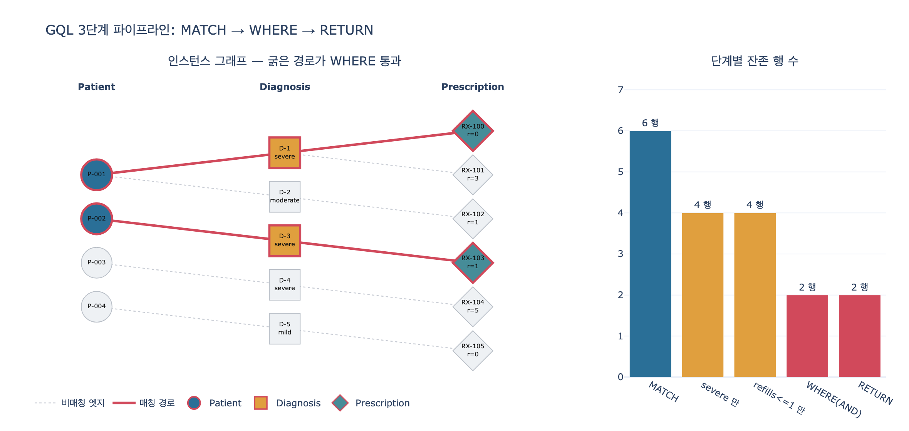

# severe 진단 환자 중 처방이 소진되어 가는 사람 찾기

## 문제

> severe 진단 환자 중 처방이 소진되어 가는 사람을 찾는 GQL 쿼리는?

## 정답

```gql
MATCH (p:Patient)-[:diagnosed_with]->(d:Diagnosis)-[:treated_by]->(rx:Prescription)
WHERE d.severity = 'severe' AND rx.refillsRemaining <= 1
RETURN p.patientId, d.description, rx.medication, rx.refillsRemaining
```

---

## 1. 이 쿼리가 서는 배경 — Healthcare 온톨로지의 care chain

Healthcare System 학습 경로는 3단계로 5개 엔티티 / 6개 관계 온톨로지를 쌓는다.

| 단계 | 추가 엔티티 | 핵심 개념 |
|---|---|---|
| 1 | Patient, Provider, Appointment | 공유 엔티티(shared entity), 스케줄링 |
| 2 | + Diagnosis | 표준 코드(ICD), 이중 연결 |
| 3 | + Prescription | **care chain**, 치료 추적 |

3단계에서 완성되는 것이 **care chain** — `Patient → Diagnosis → Prescription` 이다.
원문의 표현대로 "appointment → diagnosis → treatment" 로 진료 사이클이 닫힌다.
이 카드의 쿼리는 바로 그 care chain을 **그대로 따라 걷는** 쿼리다.

관련 엔티티의 프로퍼티는 다음과 같다(식별자는 ✓):

| Patient | | Diagnosis | | Prescription | |
|---|---|---|---|---|---|
| `patientId` | ✓ | `diagnosisId` | ✓ | `rxNumber` | ✓ |
| `mrn` | | `icdCode` | | `medication` | |
| `dateOfBirth` | | `description` | | `dosage` | |
| `bloodType` | | **`severity`** | | `frequency` | |
| `allergies` | | `diagnosedDate` | | **`refillsRemaining`** | |

관계 두 개가 이 쿼리의 뼈대다.

- **`diagnosed_with`** — `Patient` → `Diagnosis` (one-to-many)
  한 환자는 병력 전체에 걸쳐 여러 진단을 가질 수 있다.
- **`treated_by`** — `Diagnosis` → `Prescription` (one-to-many)
  한 진단이 여러 처방으로 이어질 수 있다(같은 질환에 약 여러 개).

> 원문 시나리오의 질문: *"Which patients diagnosed with severe conditions ... still have
> prescriptions with zero refills remaining?"* — 이 임상 질문이 온톨로지 위에서
> `Patient → Diagnosis (severity=severe)` 와 `Diagnosis → Prescription (refills 부족)`
> 두 조각의 합성으로 표현된다는 게 이 카드의 요지다.

---

## 2. 절 단위 분해

GQL 질의는 세 절이 파이프라인으로 이어진 구조다. 각 절은 **행(row) 집합**을 받아 행 집합을 낸다.

```
그래프 ──MATCH──> 바인딩 행 R0 ──WHERE──> 걸러진 행 R1 ──RETURN──> 투영된 결과 R2
```

### 2-1. MATCH — 3-노드(2-hop) 경로 열거

```gql
MATCH (p:Patient)-[:diagnosed_with]->(d:Diagnosis)-[:treated_by]->(rx:Prescription)
```

문법 조각을 하나씩 뜯으면:

| 조각 | 문법 | 의미 |
|---|---|---|
| `(p:Patient)` | 소괄호 = 노드 | 변수 `p` 에 라벨 `Patient` 인 노드를 바인딩 |
| `-[:diagnosed_with]->` | 대괄호 = 관계, 화살표 = 방향 | `p` 에서 **나가는** `diagnosed_with` 엣지 |
| `(d:Diagnosis)` | 노드 | 중간 노드를 `d` 에 바인딩 |
| `-[:treated_by]->` | 관계 | `d` 에서 나가는 `treated_by` 엣지 |
| `(rx:Prescription)` | 노드 | 종점을 `rx` 에 바인딩 |

읽는 법: **"소괄호는 노드, 대괄호는 관계, 콜론 뒤는 타입(라벨), 화살표는 방향"**.
노드가 3개이므로 엣지는 2개 — 즉 **2-hop 경로**이며, 노드 수로 세면 3-노드 경로다.
카드 문제에서 "3-hop 경로"라 부르는 것은 Patient·Diagnosis·Prescription **세 홉의 체인**,
즉 care chain 전체를 한 번에 훑는다는 뜻으로 이해하면 된다.

#### 화살표 방향이 왜 중요한가

`-[:rel]->` 의 화살표는 장식이 아니다. 온톨로지에서 `treated_by` 는
`Diagnosis → Prescription` 으로 **방향을 갖고 선언**되었으므로, 진단 노드에서 나가는
엣지만 존재한다. 따라서:

```gql
-- 올바름: 진단이 처방으로 치료된다
(d:Diagnosis)-[:treated_by]->(rx:Prescription)

-- 0행: 처방에서 진단으로 나가는 treated_by 엣지는 없다
(d:Diagnosis)<-[:treated_by]-(rx:Prescription)
```

방향을 뒤집으면 문법 오류가 아니라 **조용히 0행**이 나온다. 그래프 질의의 가장 흔한 버그.
방향을 신경 쓰지 않고 양방향으로 매칭하려면 화살표 없이 `-[:treated_by]-` 로 쓴다.

#### 관계 변수를 생략한 이유

`-[:diagnosed_with]->` 에는 관계 변수 이름이 없다. `-[r:diagnosed_with]->` 처럼 이름을
줄 수 있지만, 이 쿼리는 관계의 프로퍼티를 쓰지 않으므로 굳이 바인딩할 필요가 없다.
"필요한 것만 바인딩한다"가 관례다.

#### 변수 바인딩 p / d / rx — MATCH 출력의 실체

MATCH 의 결과는 노드 하나가 아니라 **변수 → 노드 매핑의 목록**이다.

| p | d | rx |
|---|---|---|
| P-001 | D-1 | RX-100 |
| P-001 | D-1 | RX-101 |
| P-001 | D-2 | RX-102 |
| … | … | … |

세 변수가 **같은 행에 함께** 놓이는 것이 핵심이다. 관계형 DB라면 3-테이블 조인을
직접 써야 할 일을, 그래프 질의는 패턴 하나로 처리하고 그 결과로 `p`, `d`, `rx` 를
동시에 손에 쥐어 준다. 덕분에 다음 절에서 진단 속성과 처방 속성을 한 술어 안에서
비교할 수 있다.

또 하나 주의: 한 진단에 처방이 2개 붙어 있으면 **같은 환자가 두 행에 나온다**.
결과의 단위는 "환자"가 아니라 **"경로"** 다. 환자 단위로 접으려면
`RETURN DISTINCT p.patientId` 나 집계(`count`, `collect`)를 써야 한다.

### 2-2. WHERE — 두 술어의 AND 결합

```gql
WHERE d.severity = 'severe' AND rx.refillsRemaining <= 1
```

| 술어 | 대상 변수 | 비교 종류 | 임상적 역할 |
|---|---|---|---|
| `d.severity = 'severe'` | 중간 노드 `d` | 문자열 동등 | 위험도 층화(risk stratification) — 중증만 남긴다 |
| `rx.refillsRemaining <= 1` | 종점 노드 `rx` | 정수 범위 | 소진 임박 재고를 잡는다 |

두 조건이 **서로 다른 변수**에 걸린다는 점이 이 쿼리의 백미다. 하나는 진단의 속성,
하나는 처방의 속성인데, MATCH 가 둘을 한 행에 묶어 놨으므로 별도 조인 없이 AND 로
엮을 수 있다.

문법 주의점:

- **`=` 는 비교 연산자다** (대입이 아니다). GQL/Cypher 에는 대입용 `=` 가 SET 절에만 있다.
- 문자열 리터럴은 **작은따옴표** `'severe'`. Cypher 는 큰따옴표도 허용하지만 GQL 표준은
  작은따옴표를 쓴다.
- `severity` 는 온톨로지에서 **string** 타입이므로 정확히 일치해야 한다.
  `'Severe'`, `'SEVERE'` 는 매칭되지 않는다(대소문자 구분). 그래서 실무 온톨로지에서는
  severity를 자유 문자열이 아니라 enum/코드 값으로 제약하는 편이 안전하다.
- 프로퍼티 접근은 **`변수.프로퍼티`** — `d.severity` 는 "행에 바인딩된 그 진단 노드의
  severity 값"을 뜻한다. 노드 라벨(`Diagnosis.severity`)이 아니라 **변수**를 쓴다는 게 중요.

#### `<= 1` 을 쓰는 임상적 의도

원문 시나리오는 `refillsRemaining = 0` 을 예로 들었는데, 이 쿼리는 `<= 1` 을 쓴다.
이 한 글자 차이가 운영상으로는 전혀 다른 성격의 리스트를 만든다.

| 조건 | 잡히는 대상 | 성격 |
|---|---|---|
| `= 0` | 이미 리필이 **바닥난** 처방 | 사후 대응 — 발견 시점에 이미 약이 끊겼을 수 있다 |
| `<= 1` | 0회 + **마지막 1회만 남은** 처방 | 사전 개입 — 끊기기 전에 잡는다 |

`<= 1` 을 선택하는 이유:

1. **리드 타임 확보.** 처방 갱신에는 진료 예약, 처방 발행, 약국 조제라는 시간이 든다.
   `= 0` 으로 잡으면 그 시간이 이미 없다. 마지막 리필이 남은 구간에서 잡아야 갱신이
   제때 이뤄진다.
2. **중증 환자에게 복약 중단은 곧 악화다.** 심부전에서 이뇨제가 끊기면 체액 과부하,
   중증 천식에서 흡입 스테로이드가 끊기면 급성 발작 — 재입원·응급실 방문으로 직결된다.
   `severity = 'severe'` 와 결합했기 때문에 임계값을 보수적으로 넓히는 것이 정당화된다.
3. **`refillsRemaining` 이 integer 타입이라 범위 비교가 성립한다.** 원문의 key takeaway
   중 "Integer properties (refillsRemaining, duration) enable operational queries" 가
   바로 이 얘기다. string 이었다면 사전식 비교로 떨어져 `"10" < "2"` 같은 오답이 난다.
4. **임계값 1은 도메인 파라미터다.** 갱신에 며칠 걸리는 전문의약품이면 `<= 2`,
   자동 갱신되는 만성질환 약이면 `= 0` 으로 좁힐 수도 있다. 쿼리에 박힌 숫자가 아니라
   운영 정책의 표현이라고 봐야 한다.

두 조건을 AND 로 묶은 결과는 교집합이다. 각각 단독으로는 넓지만 AND 는 좁다 —
"중증인데 약이 곧 끊긴다"는 이중 조건이 곧 **우선 개입 대상**의 정의가 된다.

### 2-3. RETURN — 프로젝션(projection)

```gql
RETURN p.patientId, d.description, rx.medication, rx.refillsRemaining
```

노드 전체를 돌려주지 않고 **프로퍼티 4개만** 뽑는다. 각 항목이 결과 테이블의 컬럼이 되고,
행 수는 WHERE 통과 행 수와 같다(DISTINCT·집계가 없으므로).

| 컬럼 | 출처 변수 | 왜 필요한가 |
|---|---|---|
| `p.patientId` | `p` | **누구에게** 연락할지 — 식별자 |
| `d.description` | `d` | **왜** 급한지 — 사람이 읽는 병명 (`icdCode` 대신 `description` 을 고른 이유) |
| `rx.medication` | `rx` | **어떤 약**을 갱신해야 하는지 |
| `rx.refillsRemaining` | `rx` | **얼마나 급한지** — 0 과 1 의 우선순위 구분 |

두 가지를 짚을 만하다.

- **`refillsRemaining` 이 WHERE 와 RETURN 에 모두 등장한다.** WHERE 에서 이미 걸렀지만,
  통과한 행들 사이에서 0(이미 소진)과 1(마지막 1회)을 구분해 **트리아지 순서**를 정하려면
  값 자체가 결과에 있어야 한다. 필터링과 표시는 별개의 목적이다.
- **`icdCode` 가 아니라 `description` 을 골랐다.** ICD 코드는 보험·청구·연구 시스템과의
  상호운용성을 위한 표준 코드지만, 이 결과의 소비자는 환자에게 전화를 걸 임상 코디네이터다.
  `I50.9` 보다 `Heart failure` 가 쓸모 있다. 같은 온톨로지에서 청구 시스템용 쿼리라면
  반대로 `d.icdCode` 를 투영할 것이다.

즉 이 RETURN 은 그대로 **콜 리스트(call list)** 로 쓸 수 있게 설계된 프로젝션이다.

---

## 3. 전체 파이프라인 요약

| 절 | 하는 일 | 변수 | 결과 |
|---|---|---|---|
| `MATCH` | care chain 2-hop 경로 열거 | `p`, `d`, `rx` 바인딩 생성 | 경로 전부 |
| `WHERE` | 서로 다른 변수의 두 술어를 AND | 기존 바인딩 사용 | 중증 ∩ 소진임박 |
| `RETURN` | 프로퍼티 4개 투영 | 바인딩에서 값 추출 | 4컬럼 테이블 |

---

## 4. 자주 하는 실수

| 잘못된 코드 | 문제 |
|---|---|
| `(d:Diagnosis)<-[:treated_by]-(rx:Prescription)` | 방향 반대 → 조용히 0행 |
| `WHERE Diagnosis.severity = 'severe'` | 라벨이 아니라 **변수** `d` 를 써야 한다 |
| `WHERE d.severity == 'severe'` | GQL/Cypher 의 동등 비교는 `=` 하나 |
| `WHERE rx.refillsRemaining <= '1'` | 정수 프로퍼티에 문자열 리터럴 → 타입 불일치 |
| `MATCH (p:Patient)-[:treated_by]->(rx:Prescription)` | Patient → Prescription 직접 관계는 온톨로지에 없다. 반드시 Diagnosis 를 경유 |
| `RETURN p, d, rx` | 동작하지만 노드 전체를 반환 — 원하는 4컬럼 테이블이 아니다 |

---

## 5. 같은 온톨로지로 답할 수 있는 다른 질문

원문이 정리한 대응표:

| 임상 질문 | 그래프 경로 |
|---|---|
| 처방 갱신이 필요한 환자? | Patient → Diagnosis → Prescription (refillsRemaining=0) |
| 약을 가장 많이 처방하는 의료진? | Provider → Prescription (count) |
| 아직 치료가 없는 중증 진단? | Diagnosis (severity=severe) 인데 → Prescription 없음 |
| 자기가 진단한 질환을 직접 처방하는 전문의? | Provider → Diagnosis AND Provider → Prescription |

세 번째 항목("치료 없는 중증 진단")은 이 카드 쿼리의 **부정형**이라는 점이 흥미롭다.
Cypher 라면 `WHERE NOT (d)-[:treated_by]->(:Prescription)` 처럼 패턴 부재로 표현한다.

## 시각화



왼쪽은 인스턴스 그래프 — 굵은 붉은 경로가 WHERE 를 통과한 2개 경로다.
`D-4`(severe 신부전)는 중증이지만 처방 `RX-104` 의 리필이 5회 남아 탈락하고,
`RX-105`(리필 0회)는 진단 `D-5` 가 mild(요통)라 탈락한다.
오른쪽 퍼널은 MATCH 6행 → 단독 조건 각 4행 → AND 2행으로 좁혀지는 과정을 보여준다.
자세한 단계별 재현은 `expy.py` 참고.
