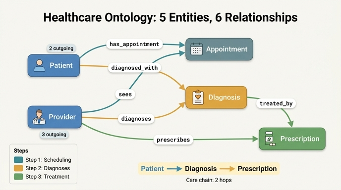

# Healthcare 온톨로지의 6개 관계 전체 목록

## 정답 요약

완성된 Healthcare 온톨로지는 **5 엔티티(Patient, Provider, Appointment, Diagnosis, Prescription)** 와 **6 관계**로 구성된다.

1. `has_appointment` (Patient → Appointment)
2. `sees` (Provider → Appointment)
3. `diagnosed_with` (Patient → Diagnosis)
4. `diagnoses` (Provider → Diagnosis)
5. `treated_by` (Diagnosis → Prescription)
6. `prescribes` (Provider → Prescription)

## 6개 관계 정리표

| # | 관계명 | 출발(from) | 도착(to) | 카디널리티 | 도입 단계 | 의미 |
|---|---|---|---|---|---|---|
| 1 | `has_appointment` | Patient | Appointment | one-to-many | Step 1 (Care Delivery) | 환자는 시간에 걸쳐 여러 번 예약을 갖는다 |
| 2 | `sees` | Provider | Appointment | one-to-many | Step 1 (Care Delivery) | 의료진은 다수의 예약(진료)을 담당한다 |
| 3 | `diagnosed_with` | Patient | Diagnosis | one-to-many | Step 2 (Diagnoses) | 환자는 병력상 여러 진단을 가질 수 있다 |
| 4 | `diagnoses` | Provider | Diagnosis | one-to-many | Step 2 (Diagnoses) | 의료진이 임상 판단에 따라 진단을 기록한다 |
| 5 | `treated_by` | Diagnosis | Prescription | one-to-many | Step 3 (Complete Care Model) | 하나의 진단에 여러 처방(복수 약제)이 나올 수 있다 |
| 6 | `prescribes` | Provider | Prescription | one-to-many | Step 3 (Complete Care Model) | 의료진이 환자에게 처방을 발행한다 |

> 6개 관계 **모두 one-to-many**다. 즉 출발 쪽 1건이 도착 쪽 여러 건을 가리키는 형태로, 이 온톨로지에는 many-to-many나 one-to-one 관계가 없다.

## 단계별로 2개씩 늘어나는 리듬

학습 경로가 3단계이고 각 단계마다 관계가 정확히 2개씩 추가된다 — 이 리듬을 기억하면 6개를 빠짐없이 떠올릴 수 있다.

| 단계 | 추가 엔티티 | 누적 엔티티 | 추가 관계 | 누적 관계 |
|---|---|---|---|---|
| 1 | Patient, Provider, Appointment | 3 | `has_appointment`, `sees` | 2 |
| 2 | + Diagnosis | 4 | `diagnosed_with`, `diagnoses` | 4 |
| 3 | + Prescription | 5 | `treated_by`, `prescribes` | 6 |

또한 각 단계는 "**Patient 쪽 관계 1개 + Provider 쪽 관계 1개**"라는 짝 구조를 갖는다 — 단, Step 3에서는 Patient 자리를 Diagnosis가 대신한다(`treated_by`가 Patient가 아니라 Diagnosis에서 출발).

## 구조: 누가 몇 개의 화살표를 내보내는가

### Provider — 3개 관계의 출발점 (가장 많이 연결된 엔티티)

`sees`, `diagnoses`, `prescribes` 세 관계가 모두 **Provider에서 출발**한다. 6개 중 절반이다. 이는 실제 임상 워크플로에서 의료진이 진료 → 진단 → 처방의 **모든 단계에 개입**한다는 사실을 그대로 반영한 것이다. 원문의 표현대로 "Provider connects at every stage".

- 진료를 본다 → `sees` → Appointment
- 진단을 내린다 → `diagnoses` → Diagnosis
- 처방을 쓴다 → `prescribes` → Prescription

Provider는 들어오는(in) 관계가 **0개**인 순수 출발 노드다.

### Patient — 2개 관계의 출발점

`has_appointment`, `diagnosed_with` 두 관계가 Patient에서 출발한다. Patient도 들어오는 관계가 **0개**인 순수 출발 노드다.

### Diagnosis — 유일하게 in·out 양쪽을 갖는 중간 노드

| 엔티티 | out(나가는) | in(들어오는) | 역할 |
|---|---|---|---|
| Patient | 2 (`has_appointment`, `diagnosed_with`) | 0 | 출발 노드 |
| Provider | 3 (`sees`, `diagnoses`, `prescribes`) | 0 | 출발 노드 (최다 연결) |
| Appointment | 0 | 2 (`has_appointment`, `sees`) | 종단(leaf) — 공유 엔티티 |
| **Diagnosis** | **1 (`treated_by`)** | **2 (`diagnosed_with`, `diagnoses`)** | **중간(intermediate) 노드** |
| Prescription | 0 | 2 (`treated_by`, `prescribes`) | 종단(leaf) |

Diagnosis만 in과 out을 동시에 갖기 때문에, **2-hop 경로(care chain)** 가 가능한 지점은 오직 Diagnosis를 경유하는 길뿐이다:

```
Patient --diagnosed_with--> Diagnosis --treated_by--> Prescription
```

원문의 GQL 예제가 정확히 이 경로를 쓴다.

```gql
MATCH (p:Patient)-[:diagnosed_with]->(d:Diagnosis)-[:treated_by]->(rx:Prescription)
WHERE d.severity = 'severe' AND rx.refillsRemaining <= 1
RETURN p.patientId, d.description, rx.medication, rx.refillsRemaining
```

### 공유 엔티티(shared entity) 패턴

Appointment와 Diagnosis는 각각 **Patient와 Provider 양쪽에서 화살표를 받는다**. 두 독립적인 행위자가 만나는 지점이라는 뜻이다.

- Appointment: `has_appointment`(Patient) + `sees`(Provider) → 스케줄링 삼각형
- Diagnosis: `diagnosed_with`(Patient) + `diagnoses`(Provider) → dual authorship(누가 가졌는지 + 누가 식별했는지)

덕분에 환자 중심 뷰("내 모든 진단")와 의료진 중심 뷰("내가 내린 모든 진단") 양쪽 질의가 가능하다.

## 존재하지 않는 관계 (혼동 주의)

6개를 외울 때 "있을 것 같지만 이 온톨로지에는 없는" 간선을 함께 기억해야 답이 정확해진다.

| 있을 법한 관계 | 실제 | 대신 어떻게 도달하는가 |
|---|---|---|
| **Patient ↔ Provider 직접 연결** | ❌ 없음 | Appointment 또는 Diagnosis를 **공유 엔티티로 경유**해 간접 연결. 원문 퀴즈에서 "Provider connects to Patient directly"는 명시적 오답으로 제시된다 |
| **Appointment → Diagnosis** | ❌ 없음 | 개념적으로는 "진료가 진단을 만든다"지만, 모델상 Diagnosis는 Appointment가 아니라 Patient/Provider에 직접 붙는다 |
| **Patient → Prescription 직접 연결** | ❌ 없음 | `Patient → Diagnosis → Prescription` 2-hop으로 도달 (`diagnosed_with` + `treated_by`) |
| Appointment → Prescription | ❌ 없음 | 처방은 Diagnosis와 Provider에서만 연결된다 |
| Diagnosis → Appointment (역방향) | ❌ 없음 | 관계는 모두 단방향 정의다 |

특히 **Appointment는 종단 노드**라는 점이 함정이다. 서사(appointment → diagnosis → treatment)와 달리 그래프상 Appointment에서 나가는 간선은 하나도 없다. 임상 플로우의 이야기 순서와 온톨로지의 간선 방향을 혼동하지 않도록 주의한다.

## 관계 이름 짝 맞추기 (헷갈리는 지점)

의미가 유사한데 이름이 다른 짝들을 구분해 두자.

| 짝 | 차이 |
|---|---|
| `diagnosed_with` vs `diagnoses` | 앞은 **Patient**가 주어(진단을 "받았다"), 뒤는 **Provider**가 주어(진단을 "내린다") |
| `has_appointment` vs `sees` | 앞은 **Patient**→Appointment, 뒤는 **Provider**→Appointment. 같은 대상을 향하지만 이름이 완전히 다르다 |
| `treated_by` vs `prescribes` | 앞은 **Diagnosis**→Prescription(진단이 처방으로 치료됨), 뒤는 **Provider**→Prescription(의료진이 처방을 씀) |

`treated_by`는 이름이 수동태(`_by`)라서 방향을 거꾸로 외우기 쉽다. 하지만 정의는 **Diagnosis → Prescription** (출발이 Diagnosis)이다.

## 이 6개 관계가 가능하게 하는 질의

| 질문 | 그래프 경로 |
|---|---|
| 처방 리필이 필요한 환자는? | Patient → Diagnosis → Prescription (refillsRemaining=0) |
| 약을 가장 많이 처방하는 의료진은? | Provider → Prescription (count) |
| 아직 치료가 없는 중증 진단은? | Diagnosis (severity=severe) 중 → Prescription 없는 것 |
| 자기가 진단한 질환을 직접 처방까지 하는 전문의는? | Provider → Diagnosis AND Provider → Prescription |

## 한 줄 암기

**Patient가 2개(예약·진단), Provider가 3개(예약·진단·처방), Diagnosis가 1개(처방) = 총 6개.** 출발 노드별로 2+3+1로 세면 빠뜨리지 않는다.

## 인포그래픽


