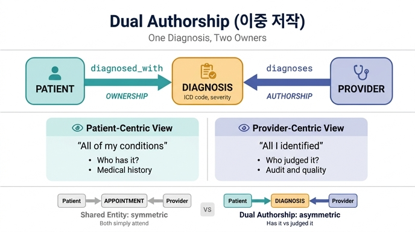

# dual authorship(이중 저작) 패턴

## 한 줄 정의

**Diagnosis 하나가 두 개의 서로 다른 출처에서 동시에 도달 가능해지는 구조.**
`Patient`(그 상태를 *가진* 사람)와 `Provider`(그 상태를 *식별한* 사람) 양쪽에서 각각 관계가 들어온다.

```
Patient  --diagnosed_with-->  Diagnosis  <--diagnoses--  Provider
         (누가 그 상태를 가졌나)        (누가 그것을 판단했나)
```

원문(healthcare-path.md, Diagnoses 챕터)의 정의는 이렇다.

> **Dual authorship:** Diagnosis connects to both Patient (who has the condition) and Provider (who identified it). This dual connection enables both patient-centric views ("all of my conditions") and provider-centric views ("all conditions I've identified").

---

## 왜 "authorship(저작)"이라는 단어를 썼나

Diagnosis는 자연에 존재하는 사실이 아니라 **누군가가 판단해서 만들어낸 기록**이다. 같은 증상에 대해 의사 A와 의사 B가 다른 ICD 코드를 붙일 수 있다. 즉 진단에는 언제나 **작성자(author)**가 있다.

그러므로 진단 기록에는 두 종류의 주체가 붙는다.

| 축 | 질문 | 관계 | 성격 |
|---|---|---|---|
| 대상 | 이 상태는 **누구의 것인가?** | `diagnosed_with` (Patient → Diagnosis) | **소유 / 귀속(ownership)** |
| 작성자 | 이 판단은 **누가 내렸나?** | `diagnoses` (Provider → Diagnosis) | **저작 / 책임(authorship)** |

두 개의 저자성 축이 하나의 노드에 걸려 있으니 "dual authorship"이다.

---

## `diagnosed_with` vs `diagnoses`: 소유 vs 저작

두 관계는 그래프 모양만 보면 똑같이 "one-to-many, X → Diagnosis"지만, 의미가 전혀 다르다.

### `diagnosed_with` — Patient → Diagnosis (one-to-many)

- 원문 설명: *"A patient can have multiple diagnoses over their medical history."*
- **소유(has-a) 의미.** 환자의 임상적 상태 그 자체를 가리킨다.
- 이 관계는 **환자의 신체적 사실에 붙어 있다.** 진단서를 쓴 의사가 은퇴하거나 병원을 옮겨도, 환자가 당뇨라는 사실은 그대로 남는다.
- 시간적으로 누적된다. 의료 이력(medical history) 전체가 이 엣지들의 집합이다.
- 전형적 쿼리: "내 모든 상태" / "당뇨로 진단된 환자는 누구인가" / "이 환자의 동반질환(comorbidity) 목록"

### `diagnoses` — Provider → Diagnosis (one-to-many)

- 원문 설명: *"A provider records diagnoses based on their clinical assessment."*
- **저작(authored-by) 의미.** 임상적 판단 행위의 주체를 기록한다.
- 이 관계는 **책임과 감사(audit) 추적에 쓰인다.** 오진 검토, 진단 품질 평가, 의사별 진단 패턴 분석이 모두 이 엣지에 의존한다.
- 전형적 쿼리: "내가 식별한 모든 상태" / *"Which provider identified the most severe conditions last quarter?"* / *"What are the most common diagnoses by department?"* (Provider의 `department` 속성을 경유)

### 방향을 헷갈리지 않는 팁

관계 이름의 문법이 그대로 힌트다.

- `diagnosed_with` — 수동태. 주어는 **진단을 받는 쪽**(Patient). "환자는 X를 *진단받았다*."
- `diagnoses` — 능동태. 주어는 **진단을 내리는 쪽**(Provider). "의사는 X를 *진단한다*."

### 두 관점이 왜 동시에 필요한가

한쪽만 모델링하면 절반의 질문에 답할 수 없다.

- `diagnosed_with`만 있으면: 환자 차트는 만들 수 있지만, 누가 그 판단을 했는지 알 수 없다 → 책임 추적 불가, 진단 품질 분석 불가.
- `diagnoses`만 있으면: 의사 실적은 볼 수 있지만, 환자의 상태 목록을 조회할 수 없다 → 임상 진료 자체가 불가능.

이중 연결이 있으면 두 방향을 **조합**할 수도 있다. 예: `(p:Patient)<-[:diagnosed_with]-` 와 `-[:diagnoses]-(pr:Provider)`를 같이 걸어 "이 의사가 진단한 환자들"이라는 2-hop 경로를 얻는다 — Patient와 Provider 사이에 직접 관계를 만들지 않고도 Diagnosis를 경유해서 도출된다.

---

## Appointment의 shared entity 패턴과 비교

같은 학습 경로 1챕터에서 Appointment를 두고 이렇게 설명한다.

> **Shared entity pattern:** Appointment connects to *both* Patient and Provider. It's the meeting point where two independent entities interact.

Diagnosis와 Appointment는 **구조가 동일하다.** 둘 다 Patient와 Provider 양쪽에서 들어오는 엣지를 받는 노드다.

```
Patient --has_appointment--> Appointment <--sees--    Provider    ← shared entity
Patient --diagnosed_with-->  Diagnosis   <--diagnoses-- Provider  ← dual authorship
```

원문의 마지막 요약도 둘을 한 묶음으로 취급한다: *"**Shared entities** (Appointment, Diagnosis) connect multiple actors."*

### 공통점

- **위상(topology)이 같다.** Patient → X ← Provider 형태의 수렴 노드.
- **두 방향 쿼리를 모두 가능하게 한다.** Patient 쪽에서도, Provider 쪽에서도 진입 가능.
- **Patient–Provider 직접 관계를 불필요하게 만든다.** 둘 사이의 연결은 공유 노드를 경유해 유도된다. 덕분에 Patient와 Provider는 서로 독립적인 엔티티로 유지된다.
- **역할이 분리된 엣지 이름을 쓴다.** `has_appointment`/`sees`, `diagnosed_with`/`diagnoses` — 같은 노드를 향하지만 이름이 다르다. 방향과 의미를 이름에 담는 것이 핵심 관행이다.

### 차이점

| | Appointment (shared entity) | Diagnosis (dual authorship) |
|---|---|---|
| 노드의 본질 | **이벤트**(event). 특정 시각에 일어나는 만남 | **주장/기록**(assertion). 임상적 판단의 결과물 |
| 두 주체의 대칭성 | **대칭적.** 환자와 의사가 같은 자격으로 *참여*한다 | **비대칭적.** 한쪽은 상태를 *가지고*, 한쪽은 그것을 *판단한다* |
| 두 엣지의 의미 | 둘 다 "참여(participation)" | 한쪽은 소유, 한쪽은 저작 — 종류가 다르다 |
| 왜 두 엣지가 필요한가 | 만남에는 원래 참가자가 둘이다 | 기록에는 대상과 작성자가 따로 있다 |
| 시간성 | `scheduledTime`, `duration` — 순간적 | `diagnosedDate` 이후 **지속되는 상태** |
| 관계 제거 시 잃는 것 | 스케줄 그림의 절반 | 임상 사실(Patient 쪽) 또는 책임 추적(Provider 쪽) |
| 하위 흐름 | 종결형. 진단으로 이어질 뿐 | `treated_by`로 Prescription까지 care chain 연장 |

### 정리

**shared entity는 구조 패턴의 이름이고, dual authorship은 그 구조가 "기록/주장" 성격의 노드에 적용됐을 때의 의미론적 이름이다.** dual authorship은 shared entity의 한 특수 사례라고 봐도 된다. 시험에서 구분해야 할 지점은 딱 하나다 — Appointment의 두 엣지는 **대칭적 참여**, Diagnosis의 두 엣지는 **비대칭적인 소유 vs 저작**.

---

## 이 패턴이 전체 그래프에서 하는 일

Provider는 이 온톨로지에서 가장 많이 연결된 엔티티다. `sees`(Appointment), `diagnoses`(Diagnosis), `prescribes`(Prescription) — 진료의 모든 단계에 붙는다. dual authorship은 그 중 임상 판단 단계에 해당한다.

care chain 전체는 이렇게 흐른다.

```
Appointment  →  Diagnosis  →  Prescription
   (만남)        (판단)         (처방)
     ↑             ↑              ↑
  Provider가 모든 단계에 연결됨
```

즉 Provider가 각 단계에 붙는 방식(참여 / 저작 / 저작)을 구분해서 이해하는 것이, 이 온톨로지 설계를 읽는 열쇠다.

---

## 한 문장 암기

> Diagnosis는 **상태를 가진 Patient**와 **그것을 식별한 Provider** 양쪽에 연결된다 — `diagnosed_with`는 소유, `diagnoses`는 저작. 그래서 "내 모든 상태"와 "내가 식별한 모든 상태"를 동시에 물어볼 수 있다.

## 인포그래픽


