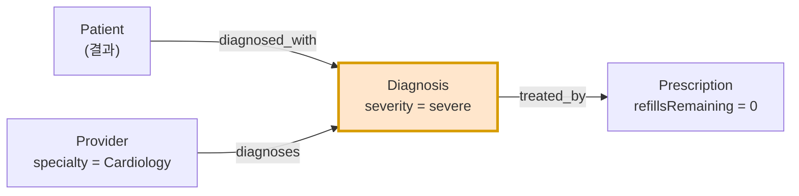
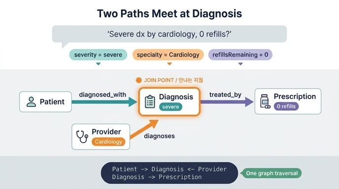

# "cardiology provider가 severe로 진단한 환자 중 리필이 0인 처방" → 온톨로지 경로 매핑

## 원문 질문

> **"Which patients diagnosed with severe conditions by cardiology providers still have prescriptions with zero refills remaining?"**
> (심장내과 provider가 중증으로 진단한 환자 중, 남은 리필이 0인 처방을 아직 가지고 있는 사람은?)

Healthcare System 학습 경로의 **Scenario Overview**에서, "왜 온톨로지가 필요한가"를 설명하기 위해 제시된 대표 질문이다.

## 정답 매핑

```
Patient → Diagnosis (severity=severe) ← Provider (specialty=Cardiology)
Diagnosis → Prescription (refillsRemaining=0)
```

두 개의 그래프 탐색 경로가 **Diagnosis에서 만나는(join) 구조**다.

## 이 질문이 어려운 이유 — 데이터가 흩어져 있다

원문 질문 하나에 4개의 서로 다른 시스템이 걸려 있다.

| 질문의 조각 | 실제 데이터 출처 |
|---|---|
| 환자 기록 | EHR (전자의무기록) |
| 진단 이력 + 중증도 | EHR / 진단 코딩 시스템 |
| provider 전문과(specialty) | 스케줄링 시스템 / 인사·자격 정보 |
| 처방과 남은 리필 수 | 약국(pharmacy) DB |

시스템별로 조회하면 4번의 쿼리와 수동 조합이 필요하지만, 온톨로지에서는 **엔티티와 관계를 따라가는 단일 그래프 탐색**으로 표현된다. 이것이 "왜 온톨로지인가"에 대한 답이다.

## 질문 분해 → 조건별 매핑

질문을 조건 단위로 쪼개면 각 조건이 어느 엔티티의 어느 속성에 붙는지가 드러난다.

| 자연어 조건 | 엔티티 | 속성 필터 | 사용 관계 |
|---|---|---|---|
| "환자" | `Patient` | — (결과로 반환할 대상) | — |
| "severe로 진단한" | `Diagnosis` | `severity = 'severe'` | `diagnosed_with` (Patient → Diagnosis) |
| "cardiology provider가" | `Provider` | `specialty = 'Cardiology'` | `diagnoses` (Provider → Diagnosis) |
| "리필이 0인 처방" | `Prescription` | `refillsRemaining = 0` | `treated_by` (Diagnosis → Prescription) |

**핵심 포인트: 속성은 그 속성을 소유한 엔티티에 붙는다.**
`severity`는 Diagnosis의 속성, `specialty`는 Provider의 속성, `refillsRemaining`은 Prescription의 속성이다. 자연어에서는 "cardiology가 severe로 진단"처럼 한 문장에 뭉쳐 있지만, 온톨로지에서는 세 개의 서로 다른 엔티티에 흩어져 있는 필터다.

## 그래프 구조



텍스트로 그리면 다음과 같다.

```
   Patient ──diagnosed_with──▶ ┌───────────────────┐
                               │     Diagnosis     │ ──treated_by──▶ Prescription
  Provider ──diagnoses──────▶  │  severity=severe  │                refills=0
 specialty=                    └───────────────────┘
 Cardiology                       ▲ 만나는 지점
```

## 왜 두 경로가 Diagnosis에서 만나는가

### 1) Diagnosis는 dual-connected(이중 연결) 엔티티다

학습 경로의 **Diagnoses** 단계에서 강조하는 패턴이다.

- `diagnosed_with` — `Patient` → `Diagnosis` : **누가 그 상태를 가졌는가**
- `diagnoses` — `Provider` → `Diagnosis` : **누가 그것을 판단했는가**

두 관계가 모두 Diagnosis를 향하기 때문에, 답의 첫 줄이 `Patient → Diagnosis ← Provider`처럼 **화살표가 가운데를 향해 마주 보는** 모양이 된다. 이 구조 덕분에 환자 중심 뷰("내 모든 진단")와 provider 중심 뷰("내가 내린 모든 진단") 양쪽이 동시에 가능하다. 이 카드의 질문은 두 뷰를 **교집합**으로 쓰는 사례다.

> 같은 패턴이 Appointment에도 있다(Patient와 Provider가 모두 Appointment에 연결되는 shared entity 패턴). Diagnosis는 그 패턴의 "임상 판단" 버전이다.

### 2) Diagnosis는 care chain(치료 사슬)의 허리다

**Complete Care Model** 단계에서 `treated_by` (Diagnosis → Prescription)가 추가되며 `Patient → Diagnosis → Prescription`의 care chain이 완성된다. 그래서 Diagnosis는

- 위쪽으로는 Patient/Provider와 연결되고,
- 아래쪽으로는 Prescription과 연결된다.

즉 Diagnosis는 **"누가·누구에게" 축과 "그래서 어떤 치료" 축이 교차하는 중심 노드**다. 그래서 이 질문의 두 경로가 필연적으로 여기서 만난다.

## GQL로 쓰면

학습 경로에 실린 예시 쿼리(리필 임계값을 `<= 1`로 완화한 버전)는 다음과 같다.

```gql
MATCH (p:Patient)-[:diagnosed_with]->(d:Diagnosis)-[:treated_by]->(rx:Prescription)
WHERE d.severity = 'severe' AND rx.refillsRemaining <= 1
RETURN p.patientId, d.description, rx.medication, rx.refillsRemaining
```

여기에 provider 조건까지 붙여 원문 질문을 완전히 표현하면 이렇게 된다.

```gql
MATCH (p:Patient)-[:diagnosed_with]->(d:Diagnosis)-[:treated_by]->(rx:Prescription),
      (prov:Provider)-[:diagnoses]->(d)
WHERE d.severity = 'severe'
  AND prov.specialty = 'Cardiology'
  AND rx.refillsRemaining = 0
RETURN p.patientId, prov.name, d.description, rx.medication
```

두 번째 MATCH 패턴 `(prov:Provider)-[:diagnoses]->(d)`가 **같은 변수 `d`를 재사용**하는 부분이 바로 "두 경로가 Diagnosis에서 만난다"는 말의 구현체다.

## 흔한 오답 / 헷갈리는 지점

| 잘못된 매핑 | 왜 틀렸나 |
|---|---|
| `Provider → Patient` 로 직접 연결 | 이 온톨로지에 Provider–Patient 직접 관계는 **없다**. 항상 Appointment / Diagnosis / Prescription 같은 공유 엔티티를 경유한다. |
| `Patient → Prescription` 로 직접 연결 | Prescription은 Diagnosis를 통해서만 환자에 도달한다(`treated_by`). 처방은 "진단에 대한 대응"으로 모델링됐다. |
| provider 조건을 `Provider → Prescription`(prescribes)으로 매핑 | 질문은 "**진단한**(diagnosed) provider"이므로 `diagnoses` 관계를 써야 한다. `prescribes`를 쓰면 "심장내과가 **처방한**" 다른 질문이 된다. |
| `severity`를 Patient 속성으로 취급 | severity는 Diagnosis의 속성이다. 환자가 "중증"인 게 아니라 특정 진단이 중증이다. |
| Appointment를 경로에 끼워 넣기 | 이 질문에는 스케줄 조건(시간·상태)이 없으므로 Appointment는 필요 없다. 임상 질문은 Diagnosis 축, 스케줄 질문은 Appointment 축을 탄다. |

## 함께 기억할 매핑 표

같은 온톨로지(5 엔티티 / 6 관계)로 답할 수 있는 다른 질문들과 나란히 보면 패턴이 보인다.

| 질문 | 그래프 경로 |
|---|---|
| 리필이 필요한 환자는? | `Patient → Diagnosis → Prescription (refillsRemaining=0)` |
| 약을 가장 많이 처방하는 provider는? | `Provider → Prescription (count)` |
| 아직 치료가 없는 중증 진단은? | `Diagnosis (severity=severe)` with **no** `→ Prescription` |
| 자기가 진단한 병을 직접 처방까지 하는 전문의는? | `Provider → Diagnosis` AND `Provider → Prescription` |
| **(이 카드)** 심장내과가 중증 진단, 리필 0 | `Patient → Diagnosis ← Provider` + `Diagnosis → Prescription` |

## 한 줄 정리

자연어 질문의 각 조건을 **속성을 소유한 엔티티**에 배치하고, 엔티티 사이를 관계로 이으면 경로가 나온다. 이 질문은 조건이 Patient·Provider·Diagnosis·Prescription 네 곳에 흩어져 있어 **Diagnosis를 공유 지점으로 하는 두 개의 탐색 경로**로 표현된다.

## 인포그래픽


