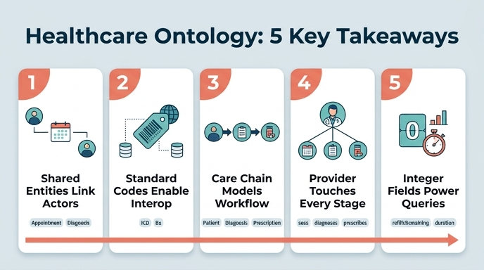

# Healthcare 온톨로지의 5가지 핵심 교훈

## 카드 정리

**Question** — Healthcare 온톨로지의 5가지 핵심 교훈(key takeaways)은 무엇인가?

**Answer** — ① 공유 엔티티(Appointment, Diagnosis)가 복수 행위자를 연결한다 ② 표준화된 코드(ICD, Rx)가 시스템 간 상호운용성을 만든다 ③ care chain이 임상 워크플로를 모델링한다 ④ Provider가 모든 단계에 연결된다 ⑤ 정수 속성(refillsRemaining, duration)이 운영 쿼리를 가능하게 한다.

원문 근거는 `healthcare-path.md`의 마지막 문서 **Complete Care Model → `## Key takeaways`** (258–264행)에 번호 목록으로 그대로 나열되어 있다. 다만 이 5개는 갑자기 등장한 것이 아니라, 앞선 세 문서의 `## What we learned` 절에서 단계적으로 쌓아 올린 결론을 압축한 것이다. 아래 표가 그 대응 관계다.

## 전체 대응표

| # | 교훈 (원문) | 원문 근거 위치 | 이 온톨로지의 구체적 사례 |
|---|---|---|---|
| 1 | **Shared entities** (Appointment, Diagnosis) connect multiple actors | 260행 / 근거: 112행 "Shared entity pattern", 120행, 171행 "Dual authorship", 180행 | `Patient -has_appointment-> Appointment <-sees- Provider`, `Patient -diagnosed_with-> Diagnosis <-diagnoses- Provider` |
| 2 | **Standardized codes** (ICD, Rx) enable cross-system interoperability | 261행 / 근거: 46행, 161행, 179행, 215행 | `Diagnosis.icdCode`(ICD), `Prescription.rxNumber`(식별자), `Patient.mrn` |
| 3 | **Care chains** (Patient → Diagnosis → Prescription) model clinical workflows | 262행 / 근거: 45행, 203행 "appointment → diagnosis → treatment", 225행, 229행 | `treated_by` 관계가 체인의 마지막 링크를 채워 3-hop 경로 완성 |
| 4 | **Provider connects at every stage** | 263행 / 근거: 225행, 272행 퀴즈 해설 | `sees`(Appointment), `diagnoses`(Diagnosis), `prescribes`(Prescription) — 3개 out-edge |
| 5 | **Integer properties** (refillsRemaining, duration) enable operational queries | 264행 / 근거: 102행, 121행, 215행 | `Appointment.duration`(minutes), `Prescription.refillsRemaining` |

전체 모델은 **5 엔티티 / 6 관계**(39행, 229행)다. 6개 관계를 교훈별로 다시 묶으면 다음과 같다.

| 관계 | From → To | 카디널리티 | 어느 교훈을 뒷받침하나 |
|---|---|---|---|
| `has_appointment` | Patient → Appointment | 1:N | ①(공유 엔티티) |
| `sees` | Provider → Appointment | 1:N | ①, ④ |
| `diagnosed_with` | Patient → Diagnosis | 1:N | ①, ③ |
| `diagnoses` | Provider → Diagnosis | 1:N | ①, ④ |
| `treated_by` | Diagnosis → Prescription | 1:N | ③ |
| `prescribes` | Provider → Prescription | 1:N | ④ |

Provider가 6개 관계 중 3개의 시작점이라는 사실이 교훈 ④를 구조적으로 증명한다.

---

## 교훈 1 — 공유 엔티티가 복수 행위자를 연결한다

### 원문 근거

> **Shared entity pattern:** Appointment connects to *both* Patient and Provider. It's the meeting point where two independent entities interact. This pattern is common whenever two actors participate in the same event. (112행)

> **Dual authorship:** Diagnosis connects to both Patient (who has the condition) and Provider (who identified it). (171행)

### 왜 중요한가

핵심은 **양방향 조회 가능성**이다. Appointment가 Patient에만 연결되어 있으면 "이 환자의 다음 방문은 언제인가?"만 답할 수 있다. Provider까지 연결되면 같은 노드 하나로 "이 의사는 하루에 몇 명을 보는가?"라는 반대 관점의 질문도 답할 수 있다(131행 퀴즈 해설). 즉 공유 엔티티는 관계를 하나 더 붙이는 비용으로 쿼리 관점을 2배로 늘린다.

주의할 점은 **Patient와 Provider 사이에 직접 관계가 없다**는 것이다. 두 행위자의 연결은 언제나 Appointment 또는 Diagnosis를 경유한다. 269–271행 퀴즈의 오답 선택지 "Provider connects to Patient directly"가 정확히 이 오해를 겨냥한다. 상호작용을 노드로 승격시키면 그 상호작용 자체의 속성(`scheduledTime`, `duration`, `status`)을 실을 자리가 생기는데, 이는 직접 엣지로는 불가능한 일이다.

### 다른 도메인으로의 일반화

| 도메인 | 공유 엔티티 | 연결하는 행위자 | 상호작용 고유 속성 |
|---|---|---|---|
| Healthcare | Appointment, Diagnosis | Patient, Provider | `scheduledTime`, `severity` |
| E-commerce | Order, Review | Buyer, Product | `orderDate`, `rating` |
| Finance | Transaction, Loan | Customer, Account | `amount`, `apr` |
| Cosmic Coffee | Shipment | Supplier, Store, Product | 배송 상태/일자 |

E-commerce 경로에서 Review는 `Buyer -writes-> Review -reviews-> Product`로 Buyer와 Product를 잇고, Cosmic Coffee 경로에서는 이 패턴을 **hub entity**라고 부른다("Hub entities like Shipment bridge different business domains"). Shipment는 행위자가 셋(Supplier, Store, Product)이라 Appointment보다 한 단계 더 확장된 사례다. 이름은 shared entity / dual-connected entity / hub entity로 다르지만 구조는 같다: **N개 독립 엔티티가 만나는 지점을 노드로 승격시킨 것.** 관계형 모델의 조인 테이블(associative entity)이 온톨로지에서 일급 엔티티가 된 형태로 이해하면 된다.

---

## 교훈 2 — 표준화된 코드가 상호운용성을 만든다

### 원문 근거

> The `icdCode` property holds the standardized ICD (International Classification of Diseases) code — a globally recognized coding system. This makes the ontology interoperable with insurance, billing, and research systems. (161행)

> ICD codes are the universal standard ... the same code means the same condition across EHRs, insurance claims, clinical trials, and public health systems. (190행 퀴즈 해설)

### 이 온톨로지의 세 층위

이 경로는 식별자를 세 층으로 구분해 다룬다.

| 층위 | 예시 | 역할 |
|---|---|---|
| 온톨로지 식별자 | `patientId`, `providerId`, `appointmentId`, `diagnosisId` | 그래프 내부의 노드 고유 키 |
| 도메인 표준 식별자 (식별자로 승격) | `rxNumber` (Prescription의 ✓) | 약국 표준이 곧 노드 키 |
| 도메인 표준 코드/식별자 (속성) | `mrn`, `icdCode`, `licenseNumber` | 외부 시스템과의 조인 키 |

78행이 이 구분을 명시한다: "The `patientId` is used as the ontology identifier, while `mrn` is a domain-specific property that maps to the EHR system." 반대로 Prescription은 `rxNumber`를 식별자로 **승격**시켰다(215행) — 도메인 표준이 이미 전역 유일하면 인공 키를 새로 만들 이유가 없다.

이 교훈의 실질적 의미는 온톨로지가 **데이터를 소유하지 않고 데이터의 모양만 기술한다**는 점과 연결된다. 데이터는 EHR, 스케줄링, 약국 DB, 청구 플랫폼에 흩어져 있다(23행). 표준 코드가 없다면 각 시스템의 로컬 코드를 매핑하는 변환 계층이 필요하고, 매핑 테이블 수는 시스템 수의 제곱으로 늘어난다. ICD 같은 공용 어휘를 속성으로 박아 두면 모든 시스템이 같은 허브 어휘를 참조하므로 매핑이 선형으로 줄어든다.

### 다른 도메인으로의 일반화

| 도메인 | 표준 식별자/코드 | 상호운용 대상 |
|---|---|---|
| Healthcare | ICD (진단), Rx number (처방), MRN (환자), license number (의사) | 보험 청구, 빌링, 임상연구, 공공보건 |
| E-commerce | **SKU** (Stock Keeping Unit) | 재고 관리, 창고, 마켓플레이스 |
| Finance | account number, `symbol`(MSFT, AAPL 같은 티커) | 은행 간 정산, 거래소, 규제 보고 |

E-commerce 경로는 이 패턴을 퀴즈로 못 박는다: Product의 식별자는 `productId`가 아니라 `sku`이며, 이유는 "SKU is the standard product identifier in e-commerce and retail systems"(125행). Finance 경로의 `symbol`도 같다 — 티커는 어느 브로커에서든 같은 종목을 가리킨다. 세 도메인 모두 **"내가 만든 ID"보다 "업계가 이미 합의한 ID"를 선택하면 통합 비용이 사라진다**는 동일한 결론에 도달한다.

---

## 교훈 3 — care chain이 임상 워크플로를 모델링한다

### 원문 근거

> **Care chain:** The complete path is now `Patient → Diagnosis → Prescription`, with `Provider` connecting at every stage. This reflects the real clinical workflow. (225행)

> The final piece ... is **Prescription** — the treatment response to a diagnosis. This closes the care cycle: appointment → diagnosis → treatment. (203행)

### 체인이 만드는 쿼리 능력

체인의 가치는 **다중 홉 탐색**이다. 각 링크를 따로 보면 평범한 1:N 관계지만, 이어 붙이면 원문 235행의 질문이 성립한다.

```gql
MATCH (p:Patient)-[:diagnosed_with]->(d:Diagnosis)-[:treated_by]->(rx:Prescription)
WHERE d.severity = 'severe' AND rx.refillsRemaining <= 1
RETURN p.patientId, d.description, rx.medication, rx.refillsRemaining
```

Patient는 Prescription과 직접 연결되어 있지 않은데도 "약이 떨어져 가는 중증 환자"를 찾아낸다. 체인의 각 노드가 자기 단계의 필터 조건(`severity`, `refillsRemaining`)을 제공하므로, 조건을 **여러 홉에 걸쳐 교차**시키는 것이 가능해진다. 27행의 동기 질문 "Which patients diagnosed with severe conditions by cardiology providers still have prescriptions with zero refills remaining?"이 바로 이 형태다.

체인은 또한 **부재(absence)를 질문할 수 있게** 한다. 237행 "Which severe diagnoses have no treatment yet? → Diagnosis (severity=severe) with no → Prescription". 워크플로 단계가 노드로 명시되어 있으면 "다음 단계로 넘어가지 않은 것"이 곧 이탈/미처리 케이스가 된다.

### 다른 도메인으로의 일반화

| 도메인 | 체인 | 원문의 명칭 |
|---|---|---|
| Healthcare | Patient → Diagnosis → Prescription (앞단에 Appointment) | care chain |
| Finance | Customer → Account → Transaction / Loan / Investment | **ownership chain** ("enable compliance queries") |
| E-commerce | Buyer → Cart → Order → Review | **purchase flow / funnel analysis** |

세 경로 모두 마지막 문서에서 체인을 핵심 교훈으로 꼽는다. 목적만 다르다 — Healthcare는 임상 워크플로 추적, Finance는 컴플라이언스("이 고객의 모든 자금 흐름을 소유권으로 거슬러 올라가기"), E-commerce는 퍼널 분석(단계별 전환율/이탈). 공통 원리는 **시간 순서를 가진 비즈니스 프로세스의 각 단계를 엔티티로 만들고 방향 관계로 이어 붙이면, 프로세스 분석이 그래프 순회로 환원된다**는 것.

한 가지 대비 포인트: E-commerce 경로는 여기서 한 걸음 더 나아가 Review로 **feedback loop**를 만든다 — "Feedback loops create richer query paths than linear chains"(263행). Healthcare의 care chain은 선형(linear)이다. 선형 체인은 워크플로 추적에 충분하지만, 루프가 생기면 우회 경로를 통한 비교 쿼리(구매 경로 vs 리뷰 경로)가 가능해진다는 차이를 알아두면 좋다.

---

## 교훈 4 — Provider가 모든 단계에 연결된다

### 원문 근거

> Provider is the most connected entity in this ontology — they see appointments, make diagnoses, and write prescriptions. This reflects the real-world workflow where healthcare providers are involved at every stage of the care delivery chain. (272행 퀴즈 해설)

### 구조적 확인

Provider는 6개 관계 중 3개의 출발점이다: `sees` → Appointment, `diagnoses` → Diagnosis, `prescribes` → Prescription. 반면 Patient는 2개(`has_appointment`, `diagnosed_with`)다. **Provider가 이 그래프의 최고 차수 노드**이며, 이것이 "누가 진료하는가"라는 현실의 중심성을 그래프 위상으로 그대로 재현한다.

여기서 중요한 점은 교훈 3과의 결합이다. care chain(Patient → Diagnosis → Prescription)은 환자 축의 **수직 경로**이고, Provider는 그 모든 단계를 **수평으로 가로지른다**. 두 축이 교차하기 때문에 원문 238행 같은 질문이 성립한다.

| 질문 | 그래프 경로 |
|---|---|
| Which providers prescribe the most medications? | `Provider → Prescription` (count) |
| Which specialists diagnose conditions they also prescribe for? | `Provider → Diagnosis` **AND** `Provider → Prescription` |
| Which provider identified the most severe conditions last quarter? | `Provider → Diagnosis (severity=severe)` (148행) |

세 번째 질문은 Provider의 두 out-edge를 **교집합**으로 쓴다 — 한 엔티티가 여러 단계에 걸쳐 있을 때만 나오는 쿼리 형태다. 여기에 `Provider.specialty`/`department`(90행)를 필터로 얹으면 "cardiology 소속 의사가 내린 중증 진단" 같은 27행의 원래 동기 질문이 완성된다. 즉 교훈 4는 관계뿐 아니라 **Provider의 속성이 그래프 전역의 필터로 쓰인다**는 뜻도 포함한다.

### 다른 도메인으로의 일반화

| 도메인 | 전 단계 관통 엔티티 | 연결 지점 |
|---|---|---|
| Healthcare | Provider | Appointment, Diagnosis, Prescription |
| Finance | Customer / Account | Customer→Account, Customer→Loan, Customer→Investment; Account→Transaction, Account→Loan(`funds`), Account→Investment(`linked_to`) |
| E-commerce | Buyer | Cart(`has_cart`), Order(`places`), Review(`writes`) |

Finance 경로의 Account가 가장 좋은 대응 사례다. Account는 Transaction/Loan/Investment 모두에 연결되어 "자금 원천"으로서 전 단계를 관통한다. 그 경로는 Investment가 Customer(`holds`, 소유)와 Account(`linked_to`, 자금원) 양쪽에 붙는 것을 **multi-path relationships** — "Each relationship models a different aspect: ownership vs. funding source"(285행) — 로 정리한다. Healthcare의 Provider도 마찬가지로 Diagnosis에는 "판단 주체"로, Prescription에는 "처방 주체"로 붙는다.

실무 팁: 모델링을 시작할 때 **"이 도메인에서 모든 단계에 개입하는 행위자는 누구인가?"**를 먼저 물으면 허브 노드를 조기에 식별할 수 있다. 그 노드의 속성(specialty, department, loyaltyTier, riskProfile)은 나중에 전역 세그멘테이션 축이 되므로 설계 초기에 신중히 고를 가치가 있다.

---

## 교훈 5 — 정수 속성이 운영 쿼리를 가능하게 한다

### 원문 근거

> The `duration` property uses an integer with a minutes unit — enabling scheduling calculations and utilization analysis. (102행)

> The `refillsRemaining` integer enables refill tracking and medication adherence monitoring. (215행)

> **Duration properties** use integers with units (minutes, hours, days) (121행)

### 타입 선택이 쿼리 능력을 결정한다

`refillsRemaining`이 문자열 `"0"`이면 `rx.refillsRemaining <= 1` 같은 **범위 비교**를 쓸 수 없다. 정수 타입은 쿼리 엔진에 "이 속성은 비교·정렬·집계·임계값 필터를 지원한다"고 선언하는 신호다. Finance 경로의 퀴즈 해설이 이를 가장 명확히 말한다(117행):

> By using an integer type, the ontology signals that creditScore supports numeric operations — comparisons, ranges, averages, and thresholds. A string property wouldn't convey this capability to query engines.

`duration`(minutes)과 `refillsRemaining`은 성격이 조금 다르다.

| 속성 | 성격 | 가능해지는 운영 쿼리 |
|---|---|---|
| `Appointment.duration` (integer, minutes) | **단위를 가진 측정값** | 진료실 가동률, 스케줄 슬롯 계산, 평균 진료 시간 |
| `Prescription.refillsRemaining` (integer) | **카운트다운 카운터** | 리필 필요 환자 알림(`<= 1`), 복약 순응도 모니터링 |

두 번째 유형이 특히 실무적이다. 0에 수렴하는 카운터는 그 자체로 **운영 액션 트리거**가 된다 — "0이 되기 전에 연락하라". 235행 "Which patients need prescription refills? → Prescription (refillsRemaining=0)"이 그 예다.

`duration`에서 놓치기 쉬운 점은 **단위를 모델에 명시**해야 한다는 것이다. 정수 `30`만 있으면 30분인지 30일인지 알 수 없다. 원문이 일관되게 `integer (minutes)`처럼 단위를 병기하는 이유다.

### 다른 도메인으로의 일반화

| 도메인 | 정수 속성 | 단위 | 운영 쿼리 |
|---|---|---|---|
| Healthcare | `Appointment.duration` | minutes | 가동률 분석 |
| Healthcare | `Prescription.refillsRemaining` | (count) | 리필 알림 |
| Finance | `Loan.term` | months | 만기 스케줄, 상환 계획 |
| Finance | `Customer.creditScore` | (300–850) | 대출 심사 임계값 필터 |
| E-commerce | `Product.stockQty` | (count) | 재고 부족 알림 |
| E-commerce | `Review.rating` | (1–5) | 평균 평점, 저평점 상품 탐지 |
| E-commerce | `Shopping-Cart.itemCount` | (count) | 장바구니 규모 분석 |

Finance 경로는 `term`(months)을 "a common pattern for duration properties"(207행)라고 부르며 Healthcare의 `duration`(minutes)과 동일한 패턴으로 취급한다. E-commerce의 `stockQty`는 `refillsRemaining`과 정확히 같은 역할이다 — 0에 가까워지면 액션이 필요한 카운터.

한 가지 구분: 이 세 경로에서 **금액은 정수가 아니라 `decimal`**이다(`price`, `balance`, `amount`, `total`). 정밀도가 중요한 값은 decimal, 셀 수 있는 개수와 시간 단위는 integer라는 관례를 함께 기억하면 좋다.

---

## 암기 보조

교훈 5개를 **"공-표-체-허-수"** 로 묶어 외울 수 있다.

| 축약 | 교훈 | 대표 키워드 |
|---|---|---|
| **공**유 엔티티 | Shared entities | Appointment, Diagnosis |
| **표**준 코드 | Standardized codes | ICD, Rx |
| **체**인 | Care chains | Patient → Diagnosis → Prescription |
| **허**브 행위자 | Provider at every stage | sees / diagnoses / prescribes |
| **수**(정수) 속성 | Integer properties | refillsRemaining, duration |

구조적으로도 정리된다: **① 노드를 어떻게 놓을까(공유 엔티티) → ③④ 노드를 어떻게 이을까(체인, 허브) → ②⑤ 속성을 어떻게 쓸까(표준 코드, 정수 타입)**. 즉 5개 교훈은 "엔티티 / 관계 / 속성"이라는 온톨로지 3요소를 각각 1~2개씩 커버한다.

## 인포그래픽


