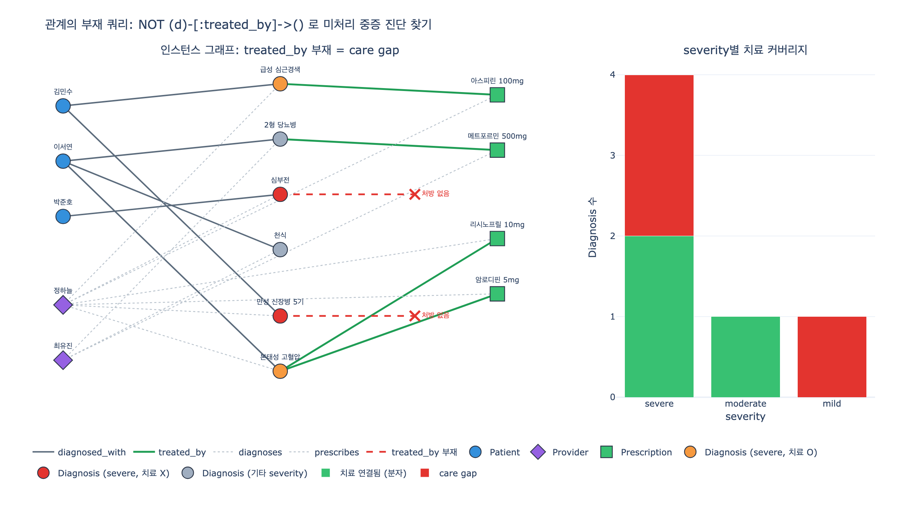

# 관계의 부재를 조건으로 쓰는 쿼리는 왜 유용한가

**Q.** 관계의 부재를 조건으로 쓰는 쿼리(예: 치료 없는 severe 진단)가 온톨로지에서 유용한 이유는?

**A.** 누락(gap)을 찾아낼 수 있기 때문이다. 진단은 있으나 처방이 연결되지 않은 케이스를 골라내면 미처리 중증 환자를 임상적으로 식별할 수 있다.

---

## 1. 출발점: Healthcare 온톨로지의 care chain

학습 경로에서 완성한 모델은 5 entity / 6 relationship이고, 핵심 흐름은 **care chain**이다.

```
Patient --diagnosed_with--> Diagnosis --treated_by--> Prescription
                               ^                          ^
                        diagnoses |                 prescribes |
                               Provider ------------------+
```

원문의 "What the complete model enables" 표에는 네 개의 질문이 나오는데, 그중 하나만 성격이 다르다.

| 질문 | Graph path |
|---|---|
| Which patients need prescription refills? | Patient → Diagnosis → Prescription (refillsRemaining=0) |
| Which providers prescribe the most medications? | Provider → Prescription (count) |
| **Which severe diagnoses have no treatment yet?** | **Diagnosis (severity=severe) with no → Prescription** |
| Which specialists diagnose conditions they also prescribe for? | Provider → Diagnosis AND Provider → Prescription |

앞의 세 개는 **경로가 존재하는 것**을 세거나 필터링한다. 세 번째만 **경로가 존재하지 않는 것**을 묻는다. 이 차이가 이 카드의 전부다.

## 2. 왜 "있는 것"만 보면 위험한가 — inner join의 침묵

원문의 GQL 예제를 보자.

```gql
MATCH (p:Patient)-[:diagnosed_with]->(d:Diagnosis)-[:treated_by]->(rx:Prescription)
WHERE d.severity = 'severe' AND rx.refillsRemaining <= 1
RETURN p.patientId, d.description, rx.medication, rx.refillsRemaining
```

이 쿼리는 **inner join**이다. `treated_by` 엣지가 없는 Diagnosis는 결과 집합에 아예 등장하지 않는다.

여기서 무서운 점은 "0건이 리턴됐다"가 아니라 **문제가 조용히 사라진다**는 것이다.

- 처방이 곧 소진될 환자(refill 위험) → 이 쿼리가 잡는다.
- 처방이 아예 없는 중증 환자(치료 미시작) → **더 위험한데, 이 쿼리에는 보이지 않는다.**

가장 심각한 케이스가 가장 안 보이는 구조다. `refillsRemaining <= 1` 같은 속성 필터를 아무리 정교하게 짜도 이 사각지대는 사라지지 않는다. 사각지대를 없애는 유일한 방법은 조건을 **관계의 부재**로 뒤집는 것이다.

## 3. 관계대수: anti-join과 semi-join

$D$ 를 Diagnosis 집합, $R \subseteq D \times P$ 를 `treated_by` 관계, $\pi_d(R)$ 을 $R$ 에 소스로 등장하는 Diagnosis 집합이라 하자.

| 이름 | 기호 | 의미 |
|---|---|---|
| semi-join | $D \ltimes R$ | $R$ 에 짝이 **있는** $D$ 의 원소 |
| anti-join | $D \triangleright R$ | $R$ 에 짝이 **없는** $D$ 의 원소 |

$$D \ltimes R = \{\, d \in D : \exists p.\ (d,p) \in R \,\}, \qquad
  D \triangleright R = D \setminus \pi_d(R)$$

두 집합은 $D$ 의 **분할(partition)** 을 이룬다.

$$D \;=\; (D \ltimes R) \;\uplus\; (D \triangleright R)$$

여기에 severity 조건을 얹으면 우리가 찾는 집합이다.

$$\text{CareGap} \;=\; \sigma_{\text{severity}=\text{severe}}(D) \;\triangleright\; R$$

anti-join의 중요한 특징: **결과 스키마가 왼쪽과 같다.** 오른쪽 테이블의 컬럼이 결과에 붙지 않는다(붙일 값이 없으니까). 그래서 `RETURN` 절에 `rx.*` 를 쓸 수 없다 — 이건 문법 실수가 아니라 anti-join의 본질이다.

## 4. 세 가지 표현법 — 모두 같은 anti-join

### (a) GQL / Cypher: 패턴 부정

```gql
MATCH (p:Patient)-[:diagnosed_with]->(d:Diagnosis)
WHERE d.severity = 'severe'
  AND NOT (d)-[:treated_by]->()
RETURN p.mrn, p.patientId, d.icdCode, d.description
```

`(d)-[:treated_by]->()` 는 **존재 검사 서브쿼리**로 컴파일된다. 익명 노드 `()` 는 "타깃이 무엇이든 상관없다"는 뜻이다. 그래프 DB에서 관계 부재를 표현하는 가장 자연스러운 방식이고, 엣지 리스트를 첫 번째 엣지에서 즉시 끊을 수 있으므로 보통 가장 빠르다.

### (b) GQL / Cypher: OPTIONAL MATCH + IS NULL

```gql
MATCH (p:Patient)-[:diagnosed_with]->(d:Diagnosis)
WHERE d.severity = 'severe'
OPTIONAL MATCH (d)-[:treated_by]->(rx:Prescription)
WITH p, d, rx
WHERE rx IS NULL
RETURN p.mrn, d.icdCode, d.description
```

`OPTIONAL MATCH` 는 SQL의 **LEFT OUTER JOIN**이다. 매칭이 없으면 `rx` 를 `NULL` 로 채운 행을 하나 만든다. 그다음 `rx IS NULL` 로 걸러내면 anti-join과 같다.

$$\text{AntiJoin} \;=\; \sigma_{rx=\text{NULL}}\bigl(D \mathbin{⟕} R\bigr)$$

패턴 부정 대신 이 형태를 쓰는 실익은 **한 쿼리에서 있는 것과 없는 것을 동시에** 볼 수 있다는 점이다. gap 목록과 커버리지 비율을 한 번에 계산할 때 유용하다(아래 6절).

### (c) SQL: NOT EXISTS

```sql
SELECT p.mrn, d.icd_code, d.description
FROM patient p
JOIN diagnosed_with dw ON dw.patient_id = p.patient_id
JOIN diagnosis d       ON d.diagnosis_id = dw.diagnosis_id
WHERE d.severity = 'severe'
  AND NOT EXISTS (
        SELECT 1 FROM treated_by t
        WHERE t.diagnosis_id = d.diagnosis_id
  );
```

`NOT EXISTS` 가 정석이다. `NOT IN` 은 피하는 게 좋다 — 서브쿼리 결과에 `NULL` 이 하나라도 섞이면 3값 논리 때문에 조건이 `UNKNOWN` 이 되어 **결과가 전부 사라진다**. 즉 care gap이 0건으로 보고되는, 가장 나쁜 종류의 버그가 난다.

### 성능

DB 엔진은 anti-join을 보통 **hash anti-join**으로 실행한다. 오른쪽($R$)으로 해시 테이블을 한 번 만들고 왼쪽을 훑으며 미스만 통과시킨다. 중첩 루프 $O(|D| \cdot |R|)$ 가 $O(|D| + |R|)$ 로 떨어진다. `expy.py`에서 `treated_index` 를 집합으로 미리 만드는 것이 정확히 이 전략이다.

## 5. 왜 하필 **온톨로지**에서 유용한가

부재 쿼리 자체는 SQL에도 있다. 온톨로지가 더해 주는 것은 세 가지다.

1. **"있어야 할 관계"가 스키마로 선언되어 있다.**
   `treated_by: Diagnosis → Prescription` 이라는 관계가 온톨로지에 정의되어 있으므로, *무엇의 부재를 물어야 하는지* 가 명확하다. 스키마 없는 데이터 레이크에서는 "처방 테이블에 조인 키가 뭐였지"부터 시작해야 하고, 애초에 그런 연결이 기대된다는 사실 자체를 모른다.

2. **부재 검사가 물리적 스키마가 아니라 의미 층에서 이루어진다.**
   원문이 지적하듯 데이터는 EHR / 스케줄링 / 약국 DB / 청구 시스템에 흩어져 있다. `NOT (d)-[:treated_by]->()` 한 줄이 EHR의 진단 테이블과 pharmacy DB의 처방 레코드 사이의 부재를 묻는다. 시스템 경계를 넘는 누락은 각 시스템 안에서는 원리적으로 보이지 않는다 — 약국 DB만 봐서는 "처방이 없어야 했던 진단"을 알 수 없다.

3. **속성이 모집단(분모)을 정의해 준다.**
   부재만으로는 부족하다. `treated_by` 가 없는 Diagnosis는 `mild` 감기에도 얼마든지 있다(그건 정상이다). `severity = 'severe'` 라는 속성 필터가 있어야 부재가 **비정상**이 된다. 여기에 `Provider.specialty`, `Diagnosis.icdCode` 를 붙이면 "심장내과가 내린 I50.x 진단 중 처방이 없는 것"처럼 진료지침 단위로 정밀해진다.

즉 온톨로지는 **부재를 물을 자격**을 만들어 준다. 관계 정의(무엇이 있어야 하는가) + 속성(누구에게 있어야 하는가)이 둘 다 있어야 gap이 의미를 가진다.

## 6. care gap analysis — 실제 임상 품질 지표

이 패턴은 학습용 트릭이 아니라 의료 질 측정의 표준 형태다. 미국의 **HEDIS**(NCQA), **CMS Star Ratings**, 각종 pay-for-performance 프로그램의 품질 지표는 예외 없이 다음 구조로 정의된다.

- **denominator (분모)** — 특정 케어를 받아야 하는 대상 모집단. 진단 코드, 연령, 기간 등으로 정의.
- **numerator (분자)** — 그중 실제로 케어가 이루어진 사람.
- **care gap** — 분모에는 있는데 분자에는 없는 사람. 정확히 $\text{분모} \triangleright \text{분자}$ 다.

$$\text{GapRate} \;=\; \frac{|D_{\text{severe}} \triangleright R|}{|D_{\text{severe}}|}
  \;=\; 1 - \frac{|D_{\text{severe}} \ltimes R|}{|D_{\text{severe}}|}$$

전형적인 gap 측정들도 모두 같은 anti-join이다.

| 지표 | 분모 (denominator) | 부재 검사 |
|---|---|---|
| 심부전 환자 베타차단제 처방률 | `Diagnosis(icd~I50.*)` | `NOT (d)-[:treated_by]->(rx {class:'beta-blocker'})` |
| 당뇨 환자 HbA1c 검사 시행률 | `Diagnosis(icd~E11.*)` | 기간 내 `LabTest` 관계 부재 |
| 만성 신장병 환자 신장내과 의뢰율 | `Diagnosis(icd~N18.*)` | `Referral` 관계 부재 |
| 처방 후 추적관찰 누락 | `Prescription` | 후속 `Appointment` 관계 부재 |

임상 현장에서 이 결과가 쓰이는 방식이 두 가지라는 점이 중요하다.

- **워크리스트(개별 조치)** — 미처리 환자 목록이 담당 provider에게 알림으로 간다. `expy.py`의 anti-join 결과가 `Provider` 까지 함께 뽑아내는 이유가 이것이다. 부재 쿼리가 유용한 것은 "찾아서" 끝이 아니라 **누구에게 무엇을 시킬지**가 함께 나오기 때문이다.
- **지표(집단 개선)** — GapRate를 시계열로 추적해 케어 프로세스 자체를 고친다. 목록이 아니라 **측정 가능한 수치**로 승격된다.

여기서 "gap closure"라는 운영 개념이 나온다. 부재 쿼리 → 워크리스트 → 조치 → 엣지 생성 → 다음 실행에서 gap 소멸. 즉 anti-join의 출력이 줄어드는 것이 곧 임상 품질 개선의 정의가 된다.

## 7. 함정과 주의점

### (a) 부재 ≠ 진짜 누락 (데이터 품질 vs 임상 사건)

`treated_by` 엣지가 없다는 사실에는 최소 세 가지 원인이 섞여 있다.

1. 정말로 치료가 시작되지 않았다 → **임상 gap** (원하는 것)
2. 처방은 있었지만 pharmacy DB 연동이 끊겨 엣지가 적재되지 않았다 → **데이터 파이프라인 gap**
3. 의도적으로 치료하지 않았다 (환자 거부, 금기, 호스피스 등) → **정당한 예외**

품질 지표는 3번을 위해 명시적인 **exclusion(제외 기준)** 을 둔다. 온톨로지에서는 `refusedTreatment` / `contraindication` 같은 관계나 속성을 추가해 anti-join에서 빼주는 형태가 된다.

```gql
WHERE d.severity = 'severe'
  AND NOT (d)-[:treated_by]->()
  AND NOT (d)-[:has_exclusion]->()
```

즉 **부재 쿼리는 보통 하나로 끝나지 않고, "있어야 할 것의 부재" + "예외의 부재"로 겹쳐 쓴다.**

### (b) closed world vs open world

property graph(Neo4j, GQL)는 **닫힌 세계 가정(closed-world assumption)** 으로 동작한다. 그래프에 없으면 거짓이다. 이것이 `NOT (d)-[:treated_by]->()` 가 곧바로 "치료 없음"을 뜻하는 근거다. 논리 프로그래밍에서는 이를 **negation as failure**라고 부른다.

반면 OWL/RDF 계열의 기술 논리(description logic)는 **열린 세계 가정(open-world assumption)** 을 쓴다. 여기서는 "명시되지 않았다"가 "없다"를 의미하지 않으므로, 부재를 그대로 결론으로 쓸 수 없다. 부재를 주장하려면 `owl:maxCardinality 0` 같은 제약이나 negative property assertion을 명시해야 하고, 실무에서는 보통 SPARQL의 `FILTER NOT EXISTS` / `MINUS` 로 닫힌 세계식 질의를 하거나 SHACL 제약으로 검증한다.

이 구분이 실무에서 중요한 이유: 데이터 커버리지를 확인하지 않고 부재를 임상 결론으로 발표하면, 실제로는 파이프라인 장애 리포트를 임상 리포트로 오해하는 사고가 난다.

### (c) 관계 이름과 방향을 흘리면 오탐/미탐

부재 쿼리에서 패턴을 느슨하게 쓰면 **거짓 음성(false negative)** 이 난다. 있는 것을 찾을 때는 느슨함이 결과를 늘리지만, 없는 것을 찾을 때는 느슨함이 결과를 **줄인다** — 즉 위험한 환자를 놓친다.

| 잘못된 표현 | 결과 |
|---|---|
| `NOT (d)-->()` (관계명 생략) | `comorbid_with` 같은 다른 out-edge만 있어도 "치료됨"으로 오판 |
| `NOT (d)-[:treated_by]-()` (방향 생략) | in-edge(`diagnosed_with`, `diagnoses`)까지 세어 gap 전멸 |
| `NOT (d)-[:treated_by]->(rx)` 후 `rx` 참조 | anti-join 결과에는 `rx` 바인딩이 없다 |
| `WHERE rx IS NULL` 를 `OPTIONAL MATCH` 없이 사용 | 아무것도 걸러지지 않음 |

`expy.py`의 6절 셀이 이 두 실수를 실제 숫자로 재현한다. 방향을 흘리면 gap 2건이 0건이 되고, 관계명을 흘리면 `D3`(심부전)를 놓친다.

### (d) severity의 성격

`severity` 는 문자열이므로 `'severe'` / `'Severe'` / `'SEVERE'` 가 섞이면 분모가 조용히 줄어든다. 분모가 줄면 gap도 줄어 보인다. 부재 쿼리에서는 **분모 정의의 오류가 곧 안전 문제**가 된다. 실무에서는 severity를 enum/코드 체계로 승격시키는 것이 정답이다.

## 8. 한 줄 정리

`MATCH`는 존재를 세고, anti-join은 **부재를 센다**. 온톨로지가 "있어야 할 관계"를 선언해 주기 때문에 부재가 비로소 질문할 수 있는 대상이 되고, `severity` 같은 속성이 그 부재를 임상적으로 의미 있는 모집단으로 좁혀 준다. 그 결과가 care gap analysis — 미처리 중증 환자 워크리스트이자, 개선 목표로 삼을 수 있는 품질 지표다.

## 시각화



왼쪽 그래프에서 초록 실선이 존재하는 `treated_by` 엣지, 빨간 점선 + X는 **존재하지 않는 엣지**(anti-join이 잡아낸 gap)다. 심부전(박준호)과 만성 신장병 5기(김민수)는 `severe` 진단이지만 Prescription으로 가는 엣지가 없다. `MATCH` 만 쓰는 쿼리에서는 이 두 노드가 결과에서 완전히 사라진다. 오른쪽은 severity별 분모/분자 스택 — `severe` 4건 중 2건이 gap이므로 GapRate는 50%다. `mild` 도 부재가 1건이지만 분모 정의에서 제외되므로 gap이 아니다.
