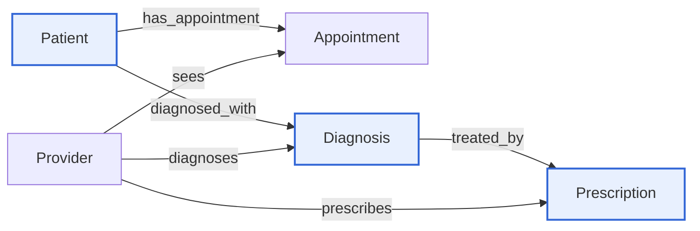
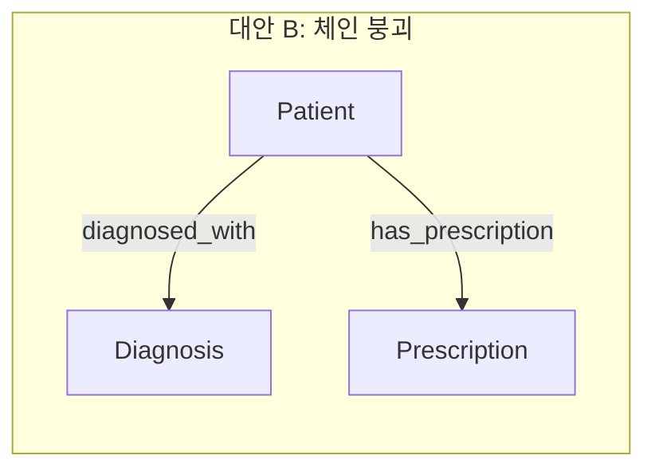

# care chain을 명시적으로 모델링하는 이유

**Q.** Healthcare 온톨로지에서 care chain을 명시적으로 모델링하는 것이 중요한 이유는?

**A.** 실제 임상 워크플로(clinical workflow)를 그래프 구조로 그대로 반영하기 때문이다. `Patient → Diagnosis → Prescription` 경로가 있으면 진료 사이클 전체를 한 번의 탐색으로 질의할 수 있다.

---

## 1. care chain이란 무엇인가

원문(`Complete Care Model`)은 Prescription을 추가하며 이렇게 정리한다.

> **Care chain:** The complete path is now `Patient → Diagnosis → Prescription`, with `Provider` connecting at every stage (sees appointments, makes diagnoses, writes prescriptions). This reflects the real clinical workflow.

즉 care chain은 **"진료 사이클(care cycle)의 시간·인과 순서를 엣지의 연쇄로 그대로 옮겨놓은 것"** 이다.

| 현실 임상 워크플로 | 그래프 |
|---|---|
| 환자가 내원해 진료를 받는다 | `Patient -[has_appointment]-> Appointment <-[sees]- Provider` |
| 그 진료에서 의사가 상태를 판단한다 | `Patient -[diagnosed_with]-> Diagnosis <-[diagnoses]- Provider` |
| 그 판단에 대한 치료(약)를 낸다 | `Diagnosis -[treated_by]-> Prescription <-[prescribes]- Provider` |



파란 노드 `Patient → Diagnosis → Prescription`이 care chain의 척추다. 여기서 결정적인 점은 **`Prescription`이 `Patient`에 직접 붙어 있지 않다는 것** — 처방은 반드시 **진단을 경유해서만** 환자에게 도달한다. 이것이 "우연한 모델링 취향"이 아니라 임상 사실(모든 처방에는 적응증/indication이 있다)의 인코딩이다.

## 2. 대안 설계 A — Patient에 진단·처방을 평면 속성으로 담기

가장 흔한 반(反)패턴. 엔티티를 하나만 두고 값을 늘리는 방식이다.

```
Patient
  patientId      : string  (id)
  mrn            : string
  diagnosisList  : string   "E11.9; I10; J45.909"
  medicationList : string   "Metformin 500mg BID; Lisinopril 10mg QD; Albuterol PRN"
  refillsLeft    : string   "2; 0; 3"
```

무엇을 잃는가:

| 잃는 것 | 구체적 증상 |
|---|---|
| **짝짓기(pairing) 정보** | 3개 진단과 3개 약이 있을 때 "어느 약이 어느 진단 때문인가"를 복원할 수 없다. 리스트 순서가 우연히 맞는 것에 의존하는 암묵적 계약이 생기고, 진단 하나가 삭제되면 전체 정렬이 어긋난다. |
| **속성을 걸 자리** | `icdCode`, `severity`, `diagnosedDate`는 Diagnosis 고유 속성이고 `dosage`, `frequency`, `refillsRemaining`은 Prescription 고유 속성이다. 평면화하면 이들을 문자열 안에 파싱 대상으로 밀어넣거나 `diagnosis1Severity`, `diagnosis2Severity` … 처럼 컬럼을 증식시켜야 한다. |
| **타입 정보** | `refillsRemaining`은 integer여야 `<= 1` 같은 비교·집계가 가능하다. `"2; 0; 3"`은 문자열이라 `WHERE`도 `SUM`도 불가능하다. 원문의 핵심 takeaway("integer 속성이 운영 질의를 가능하게 한다")가 무너진다. |
| **표준 코드의 상호운용성** | ICD 코드는 Diagnosis라는 **노드의 식별 가능한 속성**일 때 보험·청구·연구 시스템과 조인된다. 자유 텍스트 리스트 안의 부분 문자열로는 조인 키가 되지 못한다. |
| **Provider와의 연결** | 누가 그 진단을 내렸고 누가 그 약을 썼는지 붙일 대상이 없다. Provider는 `diagnoses` / `prescribes`로 **중간 노드에** 연결되므로, 중간 노드를 없애면 Provider의 임상 기여 전체가 소실된다. |
| **카디널리티 표현** | `treated_by`는 one-to-many(한 진단 → 여러 약)다. 평면 속성은 이 다중성을 구조로 표현할 수 없어 delimiter 파싱 규약으로 대체된다. |

한 문장 요약: **평면 속성은 데이터를 보존하지만 관계를 파괴한다.** 값은 다 있는데 "무엇이 무엇 때문인지"가 사라진다.

## 3. 대안 설계 B — Prescription을 Patient에 직결 (`Patient → Prescription`)

엔티티는 제대로 쪼갰지만 체인을 건너뛰고 지름길 엣지를 놓는 설계다.



값은 전부 살아 있고 각 엔티티도 정규화되어 있다. 그런데도 잃는 것이 있다.

### 3-1. 적응증(indication)이 끊긴다 — "왜 이 약을 처방했나"에 답할 수 없다

환자에게 진단 3개(당뇨 E11.9, 고혈압 I10, 천식 J45.909)와 처방 3개(Metformin, Lisinopril, Albuterol)가 있다고 하자.

- **대안 B의 그래프가 아는 것:** 이 환자는 진단 3개를 갖고 있고, 처방 3개를 갖고 있다.
- **대안 B의 그래프가 모르는 것:** Metformin이 **어느** 진단에 대한 치료인지.

`Patient`를 경유해 Diagnosis와 Prescription을 이으면 3 × 3 = 9개의 가짜 조합이 나온다(카티션 폭발). 즉 대안 B에서 "당뇨 진단에 대한 처방"을 물으면 **Lisinopril과 Albuterol도 답에 섞여 들어온다.**

체인이 있으면 `Diagnosis -[treated_by]-> Prescription` 엣지가 정답 짝을 못박아 준다.

```gql
-- 이 처방의 임상적 근거(적응증)를 역추적
MATCH (rx:Prescription {rxNumber: 'RX-88213'})<-[:treated_by]-(d:Diagnosis)<-[:diagnosed_with]-(p:Patient)
OPTIONAL MATCH (pr:Provider)-[:diagnoses]->(d)
RETURN rx.medication, d.icdCode, d.description, d.severity, d.diagnosedDate,
       pr.name AS diagnosingProvider, p.patientId
```

이 질의가 반환하는 것이 곧 **감사 추적(audit trail)** 이다. 처방 → 진단 → 진단자 → 환자. 대안 B에서는 두 번째 홉이 존재하지 않아 임상 근거란이 영구히 빈다.

### 3-2. 부작용·상호작용 검토의 기준선이 사라진다

`allergies`(Patient)와 `medication`(Prescription)만으로는 "이 약이 애초에 필요했는가"를 판단할 수 없다. 처방 적정성 검토는 항상 **적응증 대비**로 이뤄지므로, 적응증 엣지가 없으면 "근거 없는 처방(unsupported prescription)" 탐지가 불가능하다.

### 3-3. 지름길 엣지는 검증할 수 없다

`Patient → Prescription`은 어떤 무결성 규칙도 걸 수 없는 엣지다. 반면 `Diagnosis → Prescription`은 "진단 없는 처방은 존재할 수 없다"는 임상 제약을 그래프 스키마 수준에서 강제한다. 체인은 질의 편의를 넘어 **불변식(invariant)** 이다.

> 요약: 대안 A는 **속성을 잃고**, 대안 B는 **인과를 잃는다.** care chain은 후자를 지키는 장치다.

## 4. 체인이 열어주는 질의 종류

### (1) 다중 홉 순회 — 한 번의 탐색으로 사이클 전체

원문의 대표 GQL:

```gql
MATCH (p:Patient)-[:diagnosed_with]->(d:Diagnosis)-[:treated_by]->(rx:Prescription)
WHERE d.severity = 'severe' AND rx.refillsRemaining <= 1
RETURN p.patientId, d.description, rx.medication, rx.refillsRemaining
```

체인이 있어서 **하나의 `MATCH` 패턴**으로 환자–진단–처방을 관통한다. 조건은 서로 다른 세 엔티티에 걸려 있지만(진단의 severity, 처방의 refill) 경로가 이들을 하나로 묶어준다. 이것이 답의 "한 번의 탐색으로 질의할 수 있다"의 의미다.

체인이 없다면 이 질문은 (a) 심각 진단 환자 목록 조회 → (b) 처방 잔량 조회 → (c) 애플리케이션 코드에서 환자ID로 조인 → (d) 어느 처방이 어느 진단 것인지 **추측** 하는 절차로 흩어진다. 마지막 (d)는 정답이 없으므로 결과가 부정확해진다.

### (2) 관계 부재(absence) 질의 — 치료 공백 탐지

원문 표에 있는 질문: *"Which severe diagnoses have no treatment yet?"* → `Diagnosis (severity=severe) with no → Prescription`

```gql
-- 심각한데 아직 치료가 없는 진단 (치료 공백)
MATCH (p:Patient)-[:diagnosed_with]->(d:Diagnosis)
WHERE d.severity = 'severe'
  AND NOT EXISTS { MATCH (d)-[:treated_by]->(:Prescription) }
RETURN p.patientId, d.icdCode, d.description, d.diagnosedDate
```

여기서 중요한 사실: **부재 질의는 "있어야 할 엣지"가 스키마에 정의돼 있을 때만 성립한다.** `treated_by`라는 관계가 존재해야 "그 관계가 없는 진단"을 물을 수 있다. 대안 B에서는 환자 단위로 "처방이 하나도 없는 환자"만 물을 수 있고, **진단 단위의 미치료 여부**는 표현 자체가 불가능하다. 진단 3개 중 1개만 치료된 환자는 "처방 있음"으로 분류되어 공백이 은폐된다.

반대 방향의 부재 질의도 열린다.

```gql
-- 적응증 없는 처방 (근거 미상 처방)
MATCH (rx:Prescription)
WHERE NOT EXISTS { MATCH (:Diagnosis)-[:treated_by]->(rx) }
RETURN rx.rxNumber, rx.medication
```

### (3) 다중 홉 집계 — 경로를 축으로 한 롤업

체인은 집계의 **그룹 키를 다른 홉에서 가져올 수 있게** 해준다.

```gql
-- 진단(ICD 코드)별로 실제 처방된 약 분포 = 치료 패턴 분석
MATCH (d:Diagnosis)-[:treated_by]->(rx:Prescription)
RETURN d.icdCode, rx.medication, count(*) AS n
ORDER BY d.icdCode, n DESC
```

```gql
-- 진료과별 · 심각도별 처방 부담 (Provider의 department를 축으로 3홉 롤업)
MATCH (pr:Provider)-[:diagnoses]->(d:Diagnosis)-[:treated_by]->(rx:Prescription)
RETURN pr.department, d.severity, count(DISTINCT rx) AS rxCount, avg(rx.refillsRemaining) AS avgRefills
```

```gql
-- 진단당 평균 처방 개수 (다약제 복용/polypharmacy 지표)
MATCH (p:Patient)-[:diagnosed_with]->(d:Diagnosis)
OPTIONAL MATCH (d)-[:treated_by]->(rx:Prescription)
RETURN p.patientId, count(DISTINCT d) AS dxCount, count(rx) AS rxCount,
       1.0 * count(rx) / count(DISTINCT d) AS rxPerDx
```

마지막 질의는 대안 B에서 계산 자체가 불가능하다. 분모(진단)와 분자(처방)를 잇는 엣지가 없으니 비율이 정의되지 않는다.

### (4) 진단자 ≠ 처방자 교차 검증

Provider가 체인의 **모든 단계**에 붙어 있기 때문에, 체인의 각 홉에서 Provider를 비교할 수 있다.

```gql
-- 진단한 의사와 처방한 의사가 다른 케이스 (인수인계 / 대리 처방 추적)
MATCH (dxDoc:Provider)-[:diagnoses]->(d:Diagnosis)-[:treated_by]->(rx:Prescription)<-[:prescribes]-(rxDoc:Provider)
WHERE dxDoc.providerId <> rxDoc.providerId
RETURN dxDoc.name, dxDoc.specialty, rxDoc.name, rxDoc.specialty, d.icdCode, rx.medication
```

원문의 *"Which specialists diagnose conditions they also prescribe for?"* (`Provider → Diagnosis AND Provider → Prescription`)와 같은 계열의 질문인데, **체인 엣지 `treated_by`가 있어야 두 Provider 연결이 "같은 임상 사건"에 대한 것임을 보장** 할 수 있다.

## 5. 정리표 — 세 가지 설계 비교

| 질문 | A. 평면 속성 | B. Patient→Prescription 직결 | C. care chain (정답) |
|---|---|---|---|
| 이 환자가 먹는 약 목록 | ○ (파싱 필요) | ○ | ○ (2홉) |
| 이 약을 왜 처방했나 (적응증) | ✕ | ✕ | ○ |
| 당뇨 진단에 대한 처방만 | ✕ | ✕ (카티션 오염) | ○ |
| 심각 진단 중 미치료 건 | ✕ | ✕ (환자 단위만) | ○ (`NOT EXISTS`) |
| 근거 없는 처방 탐지 | ✕ | ✕ | ○ |
| 진단당 평균 처방 수 | ✕ | ✕ | ○ |
| ICD 코드별 치료 패턴 | ✕ | ✕ | ○ |
| refill 임박 + severe 필터 동시 | ✕ (타입 없음) | △ (짝짓기 부정확) | ○ (단일 MATCH) |
| 진단자 ≠ 처방자 검증 | ✕ | ✕ | ○ |

## 6. 일반화 — 도메인 워크플로를 엣지 연쇄로 옮겨라

care chain은 healthcare에 국한된 트릭이 아니라 **"현실의 순차적 워크플로는 지름길 엣지 대신 연쇄로 모델링한다"** 는 일반 원칙의 사례다.

- e-commerce: `Customer → Order → OrderItem → Product` (Customer→Product 직결이면 "어느 주문에서 산 것인지"가 사라진다)
- finance: `Account → Transaction → Counterparty`
- healthcare: `Patient → Diagnosis → Prescription`

판단 기준: **중간 단계가 자기만의 속성(`icdCode`, `severity`, `diagnosedDate`)과 자기만의 참여자(진단을 내린 Provider)를 가지는가?** 가진다면 그것은 노드여야 하고, 앞뒤는 엣지로 이어져야 한다. 지름길 엣지를 추가하고 싶어지면 그것은 보통 "질의가 귀찮다"는 신호일 뿐이고, 대가는 인과 정보의 영구 손실이다.

## 7. 암기 포인트

- care chain = `Patient → Diagnosis → Prescription`, 관계는 `diagnosed_with` + `treated_by`. **Prescription은 Patient에 직결되지 않는다.**
- 존재 이유 = **실제 임상 워크플로(appointment → diagnosis → treatment)를 그래프 구조로 그대로 반영** 하기 위함. 구조가 현실과 같으므로 질문도 경로 하나로 번역된다.
- **평면 속성(대안 A)** 은 속성·타입·짝짓기를 잃는다. **직결(대안 B)** 은 적응증(왜 이 약인가)을 잃고 카티션 오염을 낳는다.
- 체인이 열어주는 질의 3종: **① 다중 홉 순회**(한 번의 MATCH로 사이클 관통) **② 관계 부재 질의**(`NOT EXISTS` — 미치료 severe 진단, 근거 없는 처방) **③ 다중 홉 집계**(ICD별 치료 패턴, 진단당 처방 수, 진료과별 처방 부담).
- 부재 질의는 **엣지가 스키마에 정의되어 있을 때만** 물을 수 있다 — 없는 관계를 묻기 위해 그 관계가 먼저 있어야 한다.
- **Provider는 체인의 모든 단계에 연결**(`sees` / `diagnoses` / `prescribes`)되므로, 홉별 Provider 비교(진단자 vs 처방자)라는 추가 질의 축이 생긴다.
