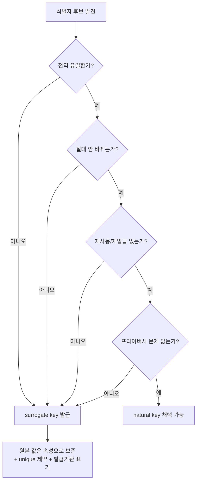

# 도메인 표준 식별자를 쓸까, 새로 만들까 (rxNumber vs patientId)

> **Q.** 온톨로지 식별자를 도메인 표준 식별자(`rxNumber`)로 삼는 것과 새로 만드는 것(`patientId`)의 차이는?
>
> **A.** 도메인 표준이 이미 전역적으로 유일하면 그대로 식별자로 쓰는 것이 외부 시스템 연계에 유리하다(`rxNumber`). 반대로 MRN처럼 병원 내부 한정 식별자라면 온톨로지 식별자는 별도로 두고(`patientId`) 원래 식별자는 속성으로 보존한다.

---

## 1. 두 가지 선택지의 이름부터

| 방식 | 데이터 모델링 용어 | Healthcare 예시 | 한 줄 정의 |
|---|---|---|---|
| 도메인 표준을 그대로 식별자로 | **natural key / business key** | `rxNumber`, `icdCode`, `licenseNumber`, `NPI` | 현실 세계에서 이미 통용되는 값을 키로 재사용 |
| 온톨로지 전용 식별자를 새로 발급 | **surrogate key** | `patientId`, `providerId`, `appointmentId`, `diagnosisId` | 의미 없는(opaque) 값을 시스템이 새로 만들어 부여 |

핵심 차이는 **"식별자가 누구의 소유인가"** 입니다.

- natural key를 쓰면 식별자의 수명·형식·유일성 정책을 **외부 기관**(약국, 병원, 면허청)이 통제합니다. 외부가 정책을 바꾸면 내 그래프가 흔들립니다.
- surrogate key를 쓰면 통제권이 **내 온톨로지**에 있습니다. 대신 외부 시스템과 붙일 때마다 매핑 계층이 필요합니다.

> **온톨로지에서 특히 중요한 이유:** 식별자는 그래프의 **엣지 종점**입니다. 관계형 DB에서 PK를 바꾸면 FK만 갱신하면 되지만, 온톨로지/그래프에서 식별자가 바뀌면 그 노드를 향한 모든 관계, 캐시된 링크, 외부에서 인용한 IRI가 전부 깨집니다. 그래서 **불변성이 유일성보다 더 중요한 경우가 많습니다.**

---

## 2. 판단 기준표 (5가지 축)

식별자 후보를 만나면 아래 5개를 순서대로 물어보세요.

| # | 기준 | 물어볼 질문 | natural key 채택 조건 | 위반 시 결론 |
|---|---|---|---|---|
| 1 | **전역 유일성** | 발급 기관이 하나뿐이고, 전 세계/전 도메인에서 값이 겹치지 않는가? | 단일 권한 기관이 중앙에서 발급 (NPI, ISBN, NDC) | 발급 기관 namespace를 붙인 **복합키**로 만들거나 surrogate로 전환 |
| 2 | **불변성** | 개체의 수명 동안 값이 절대 바뀌지 않는가? | 정정·이관·갱신이 있어도 값 유지 | surrogate 필수 (엣지 전면 재작성 방지) |
| 3 | **재사용/재발급 위험** | 폐기된 값이 다른 개체에 다시 배정될 수 있는가? | "재사용 금지"가 표준에 **명문화**되어 있음 | surrogate 필수 (과거 데이터가 다른 개체에 오결합) |
| 4 | **프라이버시** | 값 자체가 개인을 직접 식별하거나 민감 정보를 유출하는가? | 값이 공개 가능 정보 (면허번호, 기관 코드) | surrogate + 원본은 접근 통제된 속성으로 격리 |
| 5 | **외부 연계 편의** | 이 값을 그대로 조인 키로 쓰는 외부 시스템이 많은가? | 청구·보험·연구 시스템이 공통으로 이 값을 사용 | surrogate여도 무방하나 **원본은 반드시 속성으로 보존** |

### 기준 간 우선순위

1~3번(유일성·불변성·재사용)은 **하드 게이트**입니다. 하나라도 위반하면 natural key는 탈락합니다.
4번(프라이버시)은 규제 요건이므로 대개 하드 게이트로 승격됩니다.
5번(연계 편의)만 만족해도 natural key를 채택할 이유는 되지 못합니다 — 5번은 "속성으로 보존"으로 거의 대부분 해결됩니다.

---

## 3. Healthcare 온톨로지 5개 엔티티에 적용

학습 경로에서 정한 식별자는 다음과 같았습니다.

| 엔티티 | 학습 경로의 식별자 | 분류 | 경쟁했던 natural key 후보 |
|---|---|---|---|
| Patient | `patientId` | **surrogate** | `mrn` |
| Provider | `providerId` | **surrogate** | `licenseNumber` (실무에선 NPI) |
| Appointment | `appointmentId` | **surrogate** | (환자, 제공자, 예약시각) 복합 |
| Diagnosis | `diagnosisId` | **surrogate** | `icdCode` |
| Prescription | `rxNumber` | **natural key** | — |

### 3-1. Patient → surrogate (`patientId`), `mrn`은 속성 보존

| 기준 | `mrn` 평가 |
|---|---|
| 전역 유일성 | ✗ MRN은 **한 의료기관(또는 한 네트워크) 안에서만** 유일. 같은 환자가 병원 A와 B를 다니면 MRN이 2개, 서로 다른 환자가 다른 병원에서 동일 MRN을 가질 수 있음. 이 문제를 풀기 위해 존재하는 게 EMPI(Enterprise Master Patient Index) |
| 불변성 | ✗ 중복 레코드 병합(merge)/분리(unmerge), 병원 합병, EHR 교체 시 MRN이 재배정됨 |
| 재사용 위험 | ✗ 오래된 시스템에서 번호 회수·재배정 사례 존재 |
| 프라이버시 | ✗ MRN은 직접 식별자. HIPAA de-identification safe harbor의 제거 대상 항목이며, 외부 공유 데이터셋에 그대로 노출하면 안 됨 |
| 연계 편의 | △ 해당 병원 EHR과 붙일 때만 유용 |

5개 축 중 4개 위반 → **surrogate 확정**. 학습 경로 문서가 "`mrn`은 EHR 시스템에 매핑되는 도메인 속성"이라고 말한 게 바로 이 처리입니다.

실무 보강:

- `mrn` 하나만 두지 말고 **발급 기관을 함께 기록**하세요 (HL7 v2의 `CX` 데이터타입에 assigning authority가 있는 이유). 예: `mrnAssigningAuthority = "HOSPITAL_A"`, 또는 값 자체를 `urn:mrn:hospital-a:0012345`로 namespacing.
- 환자가 여러 기관을 다니면 MRN은 **1:N**입니다. 단일 문자열 속성으로는 부족하고 별도의 `PatientIdentifier` 엔티티로 승격해야 할 수 있습니다.
- 조회 성능을 위해 `(assigningAuthority, mrn)`에 unique 인덱스를 걸어두면 surrogate를 쓰면서도 외부 조인이 빠릅니다.

### 3-2. Provider → surrogate (`providerId`)

- `licenseNumber`는 **면허 발급 주(state)/국가별로 독립 발급**됩니다. 미국 기준 한 의사가 여러 주 면허를 동시 보유하고, 갱신·재발급으로 번호가 바뀔 수도 있습니다 → 전역 유일성·불변성 모두 불충분.
- 반면 **NPI(National Provider Identifier)** 는 CMS가 전국 단일로 발급하고 재사용하지 않는 10자리 번호이므로 natural key 조건에 훨씬 가깝습니다. 미국 청구 시스템과 연계가 주 목적이라면 NPI를 식별자로 쓰는 설계도 정당합니다.
- 학습 경로가 `providerId`를 택한 이유: 병원 네트워크에는 NPI가 없는 인력(수련의, 간호사, 외부 계약 인력)도 있고, 국가마다 제도가 달라 **모든 인스턴스가 값을 가진다는 보장(totality)** 이 없습니다. natural key는 "전원이 반드시 값을 가짐"까지 만족해야 합니다.

### 3-3. Appointment → surrogate (`appointmentId`) — 자연키가 아예 존재하지 않는 사례

- 자연키 후보는 `(patientId, providerId, scheduledTime)` 복합키뿐인데, **예약 변경(reschedule)** 이 일상적으로 일어납니다. `scheduledTime`이 바뀌면 식별자가 바뀌고, `has_appointment`·`sees` 엣지가 모두 무효화됩니다 → 불변성 정면 위반.
- 게다가 `status`가 `cancelled → rebooked`로 흐르는 이벤트성 엔티티는 "같은 예약이 시간만 옮겨간 것"과 "취소 후 새 예약"을 구분해야 하는데, 자연키로는 표현이 불가능합니다.
- **교훈:** 이벤트/트랜잭션 엔티티는 거의 항상 surrogate입니다. 속성이 전부 mutable하기 때문입니다.

### 3-4. Diagnosis → surrogate (`diagnosisId`) — "표준 코드 ≠ 개체 식별자"

이 카드에서 가장 헷갈리기 쉬운 지점입니다.

`icdCode`는 명백히 **전역 표준**이고 불변이며 재사용도 없습니다. 그런데도 식별자가 아닌 이유는 **유일성 축이 아니라 카디널리티 축에서 탈락**하기 때문입니다.

- ICD 코드는 **클래스(분류) 코드**입니다. `E11.9`(2형 당뇨)는 "이 진단이 무엇인가"를 말할 뿐, "어느 환자의 몇 번째 진단인가"를 말하지 않습니다.
- 같은 코드로 진단받은 환자가 수백만 명이고, **한 환자가 같은 코드로 여러 번** 진단받을 수도 있습니다 (재발, 다른 제공자의 재확인).
- 즉 `icdCode`는 **type-level 식별자**, `diagnosisId`는 **instance-level 식별자**입니다. 온톨로지 식별자로 필요한 건 후자입니다.

> 일반화: "표준 코드"라고 다 식별자 후보가 아닙니다. **분류 코드**(ICD, NDC 약품 코드, SNOMED 개념)는 속성/타입으로, **거래 번호**(rxNumber, claimId, orderId)만 식별자 후보로 검토하세요.
>
> 참고로 `icdCode`가 식별자가 아니어도 "표준 코드로 상호운용성 확보"라는 이득은 그대로 유지됩니다. 이것이 기준 5번(연계 편의)이 **속성 보존만으로 충족된다**는 증거입니다.

### 3-5. Prescription → natural key (`rxNumber`) — 그리고 그 한계

학습 경로는 `rxNumber`를 "pharmacy-standard identifier"라며 식별자로 채택했습니다. 논리는 이렇습니다.

- 약국 시스템·PBM·보험 청구가 모두 Rx 번호로 처방을 지목한다 → 기준 5번 만족.
- 처방이라는 **거래 문서** 자체의 번호이므로 instance-level이다 → Diagnosis의 함정을 피함.
- 발급 후 값이 바뀌지 않는다 → 기준 2번 만족.

문제는 기준 1·3번입니다. 다음 절에서 정면으로 다룹니다.

---

## 4. 반례: `rxNumber`는 실제로 전역 유일하지 않다

교재의 설명은 교육용으로는 타당하지만, 프로덕션 온톨로지라면 다음을 알고 있어야 합니다.

### 4-1. Rx 번호의 유일성 범위는 "조제 약국 단위"

- Rx 번호는 중앙 기관이 발급하지 않습니다. **조제한 약국이 자기 시퀀스로 자체 부여**합니다. NCPDP 청구 표준에서도 이 값은 `402-D2 Prescription/Service Reference Number`라는 **참조 번호** 필드이고, 유일성은 전송 문맥(약국 + 날짜 + 청구)에 의존합니다.
- 따라서 서로 다른 약국이 동일한 `1234567`을 동시에 보유하는 게 정상입니다. 청구 시스템이 처방을 특정할 때는 사실상 **`(약국 식별자(NCPDP ID/NPI), rxNumber, 조제 회차)`** 복합키를 씁니다.

### 4-2. 같은 값이 재사용/재발급된다

- 시퀀스가 자리수 한계에 도달하거나 연도/회계기간마다 리셋되는 약국 관리 시스템(PMS)에서는 **번호 롤오버로 과거 값이 재등장**합니다.
- 체인 약국은 매장별로 독립 시퀀스를 돌리는 경우가 흔해, 체인 내부에서도 값이 중복됩니다. 반대로 체인이 중앙 시퀀스로 통합/마이그레이션하면 **기존 처방의 Rx 번호가 재부여**되기도 합니다 (불변성까지 흔들림).

### 4-3. 처방 이관(transfer) 시 식별자가 갈라진다

- 환자가 처방을 A약국에서 B약국으로 옮기면, B약국은 **새 Rx 번호를 부여**합니다. 현실의 처방 1건이 그래프에서 노드 2개가 됩니다.
- 전자처방(eRx)에서는 처방자 EHR의 처방 ID와 약국의 Rx 번호가 **애초에 다른 값**입니다. `prescribes`(Provider→Prescription) 엣지는 처방자 관점, `rxNumber`는 조제자 관점이라 두 관점의 키가 어긋납니다.

### 4-4. 카디널리티 함정: 처방(prescription) vs 조제(fill/dispense)

- `rxNumber` 하나에 리필마다 조제 이벤트가 붙습니다(fill number 1, 2, 3...). `refillsRemaining`은 처방 단위 상태값이라 현재 모델에서 문제가 없지만, "언제 몇 개를 실제로 수령했는가"를 모델링하려면 `DispenseEvent`를 별도 엔티티로 분리해야 합니다. 이때 `rxNumber`만으로는 조제 이벤트를 식별할 수 없습니다.

### 4-5. 그래서 어떻게 고치나

| 옵션 | 형태 | 장단점 |
|---|---|---|
| A. 복합 자연키 | 식별자 = `(pharmacyId, rxNumber)`, 또는 `(pharmacyId, rxNumber, fillNumber)` | 외부 조인 편의 유지. 단 구성 요소 중 하나라도 바뀌면 여전히 취약하고, 그래프 IRI가 길어짐 |
| B. surrogate 전환 | 식별자 = `prescriptionId`, `rxNumber`·`pharmacyId`는 속성 + unique 제약 | 가장 견고. Patient/`mrn`과 동일한 패턴으로 일관성 확보 |
| C. namespacing | `rxNumber` 값을 `urn:rx:ncpdp-1234567:0009988`처럼 발급 기관 접두어로 확장 | A의 문자열 인코딩 버전. 파싱 규칙을 팀 전체가 지켜야 함 |

교육용 모델이라면 A/현행 유지가 무해하지만, 여러 약국·체인 데이터를 통합하는 순간 **B가 정답**입니다. 즉 이 카드의 답은 "`rxNumber`는 natural key의 **교과서적 예시**"로 기억하되, "실제 전역 유일성은 검증해야 하는 가정"임을 함께 기억하는 것이 정확합니다.

---

## 5. 요약 판정표 (5개 엔티티 × 5개 기준)

| 후보 식별자 | 전역 유일성 | 불변성 | 재사용 위험 없음 | 프라이버시 안전 | 외부 연계 편의 | 판정 |
|---|:--:|:--:|:--:|:--:|:--:|---|
| `mrn` (Patient) | ✗ | ✗ | ✗ | ✗ | △ | surrogate `patientId` + 속성 보존 |
| `licenseNumber` (Provider) | ✗ | △ | ✓ | ✓ | △ | surrogate `providerId` |
| `NPI` (Provider, 실무) | ✓ | ✓ | ✓ | ✓ | ✓ | natural key 채택 가능 (단, 전원 보유 여부 확인) |
| `(patient, provider, time)` (Appointment) | △ | ✗ | — | ✗ | ✗ | surrogate `appointmentId` |
| `icdCode` (Diagnosis) | ✓ | ✓ | ✓ | △ | ✓ | **식별자 아님 (type-level 분류 코드)** → surrogate `diagnosisId` + 속성 |
| `rxNumber` (Prescription) | △ (약국 범위) | △ | △ | △ | ✓ | 교재는 natural key 채택 / 실무는 `(pharmacyId, rxNumber)` 또는 surrogate |

---

## 6. 한 문장으로 남길 규칙

**"식별자를 물려받을지(natural) 만들지(surrogate)는 '전역 유일 + 불변 + 재사용 없음 + 공개 가능'을 전부 통과하는지로 결정한다. 통과하면 물려받아 외부 연계 비용을 줄이고, 하나라도 실패하면 새로 만들고 원본은 속성으로 보존한다 — 외부 연계 편의는 속성 보존만으로도 대부분 살아남기 때문에, 그것만으로 natural key를 정당화하지 않는다."**

부가 체크리스트:

- [ ] 이 값이 **인스턴스**를 지목하는가, **타입/분류**를 지목하는가? (ICD 함정)
- [ ] 모든 인스턴스가 이 값을 **반드시** 갖는가? (NPI 없는 수련의)
- [ ] 발급 기관이 여러 개면 `(발급기관, 값)`을 함께 다루고 있는가?
- [ ] 원본 식별자를 속성으로 보존할 때 **unique 제약**과 **접근 통제**를 걸었는가?
- [ ] 식별자가 바뀌면 깨지는 **엣지·외부 인용**의 규모를 계산해봤는가?

---

### Sources

- [Are MRN numbers unique? The surprising truth about patient identification](https://welly.it.com/are-mrn-numbers-unique-the-surprising-truth-about-patient-identification)
- [Enterprise master patient index — Wikipedia](https://en.wikipedia.org/wiki/Enterprise_master_patient_index)
- [EMPI Explained: What It Is, How It Works & Why It Matters — Medblocks](https://medblocks.com/blog/what-is-an-enterprise-master-index-empi)
- [What Is an Enterprise Master Patient Index in Healthcare? — Jelvix](https://jelvix.com/blog/empi-healthcare-meaning-usage-and-steps-to-integrate)
- [HL7 Identifiers (Person, Patient, Account, Visit)](https://www.j4jayant.com/2013/02/hl7-identifiers-person-patient-account.html)
- [NCPDP Payer Sheet Template (field 402-D2 Prescription/Service Reference Number)](https://ncpdp.org/NCPDP/media/pdf/Payer_Sheet_Template_1.pdf)
- [NCPDP Pharmacy Identifier — ResDAC](https://resdac.org/cms-data/variables/ncpdp-pharmacy-identifier)
- [NCPDP Provider Identification Number — HL7 Terminology](https://terminology.hl7.org/en/NamingSystem-NCPDPProviderIdentificationNumber.html)
- [How to Find Your Prescription Number — GoodRx](https://www.goodrx.com/drugs/medication-basics/how-to-find-prescription-number)
