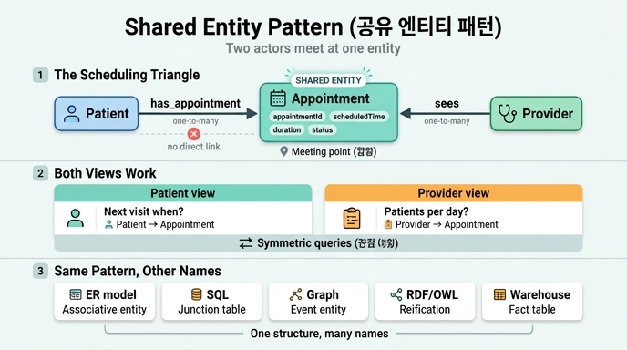

# shared entity pattern (공유 엔티티 패턴)

## 한 줄 정의

**두 개의 독립적인 엔티티가 각각 같은 제3의 엔티티를 향해 관계를 뻗을 때, 그 제3의 엔티티를 "공유 엔티티"라 부른다.** 공유 엔티티는 두 행위자가 만나는 **접점(meeting point)** 이 된다.

원문(asset)의 정의:

> **Shared entity pattern:** Appointment connects to *both* Patient and Provider. It's the meeting point where two independent entities interact. This pattern is common whenever two actors participate in the same event.

---

## Healthcare 온톨로지에서의 실제 모습

### 스케줄링 삼각형 (scheduling triangle)

```
   Patient ────has_appointment────▶ ┌─────────────┐
                                    │ Appointment │  ← 공유 엔티티
   Provider ──────sees─────────────▶ └─────────────┘
```

| 관계 | 방향 | 카디널리티 | 의미 |
|---|---|---|---|
| `has_appointment` | `Patient` → `Appointment` | one-to-many | 한 환자는 시간에 걸쳐 여러 예약을 가진다 |
| `sees` | `Provider` → `Appointment` | one-to-many | 한 의료진은 여러 예약을 처리한다 |

핵심은 **Patient와 Provider 사이에 직접 관계가 없다는 점**이다. 둘은 서로를 직접 참조하지 않고, `Appointment`라는 공유 엔티티를 매개로 연결된다. Appointment는 단순한 연결선이 아니라 자기 자신의 속성(`scheduledTime`, `duration`, `type`, `status`)을 가진 1급 엔티티다.

### 왜 Appointment를 한쪽에만 붙이지 않는가?

예약은 본질적으로 **두 당사자가 함께 참여하는 협업 이벤트**다. 양쪽 관계를 모두 모델링하면 **어느 쪽 관점에서든 질의가 가능**해진다.

- 환자 관점: "이 환자의 다음 방문은 언제인가?"
- 의료진 관점: "이 의료진은 하루에 몇 명의 환자를 보는가?"

한쪽 관계만 두면 나머지 관점의 질의는 우회 경로를 타야 하거나 아예 불가능해진다.

### 같은 경로에서 반복되는 같은 패턴

이 학습 경로에서 공유 엔티티는 Appointment 하나로 끝나지 않는다.

| 공유 엔티티 | 연결되는 두 행위자 | 관계 |
|---|---|---|
| `Appointment` | Patient, Provider | `has_appointment`, `sees` |
| `Diagnosis` | Patient(조건을 가진 쪽), Provider(식별한 쪽) | `diagnosed_with`, `diagnoses` |
| `Prescription` | Patient/Diagnosis, Provider | `treated_by`, 처방 작성 |

원문은 Diagnosis의 경우를 **dual authorship(이중 귀속)** 이라 따로 이름 붙인다. "누가 그 병을 가졌는가(Patient)"와 "누가 그것을 진단했는가(Provider)"가 동시에 기록되므로, 환자 중심 뷰("내 모든 질환")와 의료진 중심 뷰("내가 진단한 모든 질환")가 둘 다 성립한다.

그 결과 **Provider는 이 온톨로지에서 가장 많이 연결된 엔티티**가 된다 — 예약을 보고(sees), 진단을 내리고(diagnoses), 처방을 작성한다. 이는 의료진이 케어 전달 사슬의 모든 단계에 개입하는 현실을 그대로 반영한다.

---

## 어떻게 알아보는가 — 패턴의 신호

다음 조건이 함께 나타나면 공유 엔티티 패턴이다.

1. **둘 이상의 독립적 행위자(actor)** 가 존재한다. 각자 독립적으로 존재할 수 있어야 한다(Patient는 예약 없이도 환자이고, Provider도 마찬가지).
2. 그 행위자들이 **같은 사건/거래/상호작용에 참여**한다.
3. 그 사건 자체가 **고유 식별자와 속성을 가질 만한 무게**를 갖는다 (`appointmentId`, `scheduledTime`, `status` …).
4. 행위자들 사이의 직접 관계로는 그 사건의 정보를 담을 곳이 없다.

반대로, 사건에 속성이 전혀 없고 단순 소속만 표현한다면 굳이 별도 엔티티로 승격할 필요가 없을 수도 있다. 이 판단이 아래에서 말하는 "관계의 실체화(reification)"다.

---

## 데이터 모델링 일반 패턴과의 관계

공유 엔티티 패턴은 온톨로지 고유의 발명이 아니라, 여러 모델링 전통에서 각기 다른 이름으로 불려온 **같은 구조**다.

| 전통 / 문맥 | 명칭 | 대응 방식 |
|---|---|---|
| ER 모델링 (Chen) | **associative entity** (연관 엔티티) | 관계 자체가 속성을 가질 때 엔티티로 승격 |
| 관계형 DB 스키마 | **junction / bridge / join table** | 다대다를 두 개의 일대다로 분해하는 교차 테이블 |
| 이벤트 중심 모델링 | **event entity** | 시점·기간을 가진 사건을 1급 엔티티로 모델링 |
| RDF / OWL | **reification**, n-ary relation 패턴 | 이항 트리플로 표현 못 하는 n항 관계를 중간 노드로 구현 |
| 데이터 웨어하우스 (Kimball) | **fact table** (+ conformed dimensions) | 여러 차원(Patient, Provider, Time)이 만나는 사실 레코드 |
| DDD / 이벤트 소싱 | domain event, interaction object | 두 애그리게이트의 상호작용을 별도 개념으로 포착 |

### associative / junction entity 로서의 Appointment

관계형 관점에서 보면 Patient와 Provider는 **다대다** 관계다(한 환자는 여러 의료진을 만나고, 한 의료진은 여러 환자를 본다). 다대다는 직접 저장할 수 없으므로 교차 테이블이 필요하다:

```
appointments(appointment_id PK, patient_id FK, provider_id FK,
             scheduled_time, duration, type, status)
```

즉 `Appointment`는 **다대다를 두 개의 일대다(`Patient 1—N Appointment`, `Provider 1—N Appointment`)로 분해하는 교차점**이다. 온톨로지에서 이 교차점이 자기 이름·식별자·속성을 갖는 정식 엔티티로 등장한 것이 공유 엔티티 패턴이다.

### 순수 junction table과 다른 점

교차 테이블 중에는 두 개의 FK 외에 아무 정보도 없는 것들이 있다(예: `student_course`). 그런 경우는 "연결" 이상의 의미가 없다. 반면 `Appointment`는

- 자체 식별자(`appointmentId`)를 갖고
- 상태를 갖고(`status`: scheduled / completed / cancelled …)
- 시간축을 갖고(`scheduledTime`, `duration`)
- **다시 다른 엔티티의 출발점이 된다** (예약 → 진단 → 처방)

이 때문에 Appointment는 단순 junction이 아니라 **의미 있는 도메인 개념으로 승격된 이벤트 엔티티**에 가깝다. 원문이 "the meeting point where two independent entities interact"라 표현한 것이 바로 이 지점이다.

### 왜 "공유(shared)"라는 단어인가

Patient와 Provider **어느 쪽도 Appointment를 소유하지 않는다**. 두 엔티티가 함께 참조하는, 공동으로 소유되는 대상이다. 만약 한쪽이 소유하는 구조(예: Provider 밑에 종속된 슬롯)라면 다른 쪽 관점의 질의가 비대칭적으로 불리해진다. "공유"는 곧 **관점 대칭성(perspective symmetry)** 의 보장이다.

---

## GQL 질의로 보는 실익

공유 엔티티가 있으면 두 방향의 순회가 모두 자연스럽다.

```gql
-- 환자 관점: 다음 예약
MATCH (p:Patient)-[:has_appointment]->(a:Appointment)
WHERE p.patientId = 'P-001' AND a.status = 'scheduled'
RETURN a.scheduledTime, a.type
ORDER BY a.scheduledTime

-- 의료진 관점: 일일 진료량
MATCH (pr:Provider)-[:sees]->(a:Appointment)
WHERE a.scheduledTime >= date('2026-08-11')
RETURN pr.providerId, count(a)

-- 접점을 경유한 행위자 간 연결 (직접 관계 없이도 도달)
MATCH (p:Patient)-[:has_appointment]->(a:Appointment)<-[:sees]-(pr:Provider)
RETURN p.patientId, pr.name, a.scheduledTime
```

세 번째 질의가 핵심이다. Patient와 Provider 사이에 직접 엣지가 없어도, 공유 엔티티를 **경유(via)** 해 서로 도달할 수 있다. 게다가 그 경유 지점에서 "언제 만났는가"라는 맥락까지 함께 얻는다 — 직접 엣지만 있었다면 잃어버릴 정보다.

---

## 흔한 오해와 주의점

- **"그래프를 풍성하게 보이려고 양쪽에 붙인 것"이 아니다.** 퀴즈의 오답 선택지가 지적하듯, 장식이 아니라 도메인의 실제 구조(협업 이벤트)를 반영한 결과다.
- **"모든 엔티티는 관계가 2개 이상 있어야 한다"는 규칙 때문이 아니다.** 그런 규칙은 없다.
- **Patient와 Provider의 직접 관계로 대체할 수 없다.** 직접 엣지에는 예약 시각·상태·유형을 담을 자리가 없고, 같은 두 사람의 반복 방문을 구별할 수도 없다.
- **행위자가 3개 이상이어도 된다.** 두 개는 최소 사례일 뿐이다. 예: `Appointment`에 `Location`, `InsurancePlan`이 더 붙으면 n항 관계의 실체화가 된다.

---

## 한 줄 요약

두 독립 행위자가 같은 사건에 참여하면, 그 사건을 속성 있는 독립 엔티티로 승격해 양쪽에서 각각 관계를 걸어라. 그것이 **공유 엔티티** 이고, 그 지점이 상호작용의 **접점** 이며, 그 덕분에 **양쪽 관점의 질의가 모두 대칭적으로 성립**한다.

## 인포그래픽


