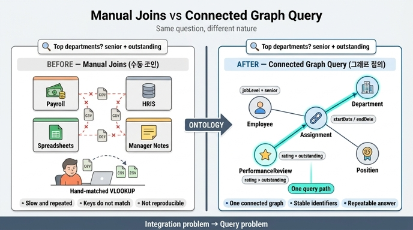

# 온톨로지 도입 시 질문의 성격 변화

## 카드 내용

- **Question**: 온톨로지를 도입하면 이 질문의 성격이 어떻게 바뀌는가?
- **Answer**: 단절된 시스템 간 manual joins(수동 조인) 대신 connected graph query(연결된 그래프 질의) 하나로 바뀐다.

## 여기서 "이 질문"이 가리키는 것

HR System 학습 경로의 Scenario Overview에서 제시된 대표 질문이다.

> **"Which departments have the highest number of senior employees rated outstanding in the last review cycle?"**
> (지난 리뷰 사이클에서 outstanding 평가를 받은 senior 직원이 가장 많은 부서는 어디인가?)

이 한 문장은 겉보기엔 단순하지만, 실제로는 서로 다른 네 가지 정보 영역을 동시에 가로지른다.

| 질문 조각 | 필요한 정보 영역 | 대응 엔티티 |
|---|---|---|
| "Which departments" | 조직 구조 (org structure) | Department |
| "senior employees" | 직원 레코드 + 직급 정의 | Employee (`jobLevel`), Position (`level`) |
| "in the last review cycle" | 리뷰 사이클(시간) | PerformanceReview (`reviewPeriod`, `reviewDate`) |
| "rated outstanding" | 평가 결과 | PerformanceReview (`rating`) |
| (부서 소속을 어떻게 아는가) | 시점별 배치 이력 | Assignment (`startDate`, `endDate`) |

## Before: 단절된 시스템 + manual joins

학습 자료가 명시한 현실은 이렇다.

> Data currently lives across **payroll tools, HRIS, spreadsheets, and manager notes**.

즉 데이터가 급여 도구 / HRIS / 스프레드시트 / 매니저 메모라는 **사일로(silo)** 에 흩어져 있다. 이 상태에서 위 질문에 답하려면 사람이 다음을 손으로 해야 한다.

1. HRIS에서 직원 목록과 직급을 추출한다.
2. 급여 시스템에서 부서/코스트센터 정보를 추출한다.
3. 스프레드시트에서 리뷰 사이클과 평가 등급을 찾아낸다.
4. 매니저 메모에서 누락된 부서 이동 내역을 보충한다.
5. 이름·이메일·사번이 시스템마다 다르게 적혀 있으므로 **키를 맞춰 가며 VLOOKUP / CSV 병합**을 반복한다.
6. 결과를 피벗해서 부서별로 집계한다.

이 과정이 바로 **manual joins**다. 문제점은 단순히 "느리다"가 아니다.

- **재현 불가능**: 같은 질문을 다음 분기에 다시 물으면 사람이 처음부터 다시 짜맞춰야 한다.
- **키 불일치(identity resolution)**: 시스템마다 식별자가 달라 조인이 깨진다. 그래서 학습 자료가 `employeeId` 같은 **stable identifier**를 강조하고, email처럼 변하는 값을 키로 쓰지 말라고 한다.
- **시점 정보 소실**: "지난 사이클에 그 사람이 어느 부서였는가"는 현재 스냅샷만 있는 시스템에서는 답이 안 나온다. 그래서 `Assignment`가 `startDate`/`endDate`를 갖는다.
- **의미 불일치**: 어떤 시트는 "우수", 어떤 시트는 "A", 어떤 곳은 "5점". 그래서 **enum**으로 통제된 값(rating, employmentStatus, jobLevel)이 필요하다.
- **답이 사람의 머릿속에만 남는다**: 조인 로직이 코드나 모델이 아니라 담당자의 엑셀 파일에 있다.

## After: 하나의 connected graph query

온톨로지를 도입하면 5개 엔티티가 **명시적 관계로 연결된 하나의 그래프**가 된다.

- `Employee` -> `Assignment` (one-to-many)
- `Assignment` -> `Department` (many-to-one)
- `Assignment` -> `Position` (many-to-one)
- `Employee` -> `PerformanceReview` (one-to-many)

그러면 위 질문은 **그래프를 따라가는 하나의 경로 탐색**으로 환원된다. 학습 자료가 제시한 경로 표기 그대로:

```
Department <- Assignment <- Employee -> PerformanceReview
             (기간 필터)   (jobLevel=senior)  (rating=outstanding,
                                              reviewPeriod=last cycle)
```

읽는 방법: PerformanceReview에서 `rating=outstanding`이고 해당 사이클인 리뷰를 고르고 → 그 리뷰가 달린 Employee 중 `jobLevel=senior`인 사람을 고르고 → 그 Employee의 Assignment를 따라가 → Department로 도달해 부서별로 센다.

자료의 다른 예시들도 같은 방식이다.

| 질문 | 그래프 경로 |
|---|---|
| Which departments have the most senior employees? | Department <- Assignment <- Employee (`jobLevel=senior`) |
| Which employees changed roles in the last year? | Employee -> Assignment (날짜별 다중 레코드) -> Position |
| Which teams have many outstanding reviews? | Department <- Assignment <- Employee -> PerformanceReview (`rating=outstanding`) |
| Which assignments are no longer active? | Assignment (`endDate` 존재 또는 `isPrimary=false`) |

## 왜 "질문의 성격이 바뀐다"고 표현하는가

핵심은 답을 빨리 얻는다는 게 아니라, **질문이 속한 범주 자체가 바뀐다**는 점이다.

| 축 | Before (manual joins) | After (graph query) |
|---|---|---|
| 작업의 종류 | 데이터 취합 프로젝트 | 모델에 대한 질의 |
| 수행 주체 | 사람(분석가)의 반복 노동 | 시스템이 실행 |
| 조인 로직 위치 | 개인 스프레드시트 | 온톨로지의 관계 정의 |
| 재현성 | 매번 새로 작업 | 같은 질의를 재실행 |
| 신뢰 근거 | "누가 만들었나" | 공유된 모델 + stable identifier |
| 확장 | 새 질문 = 새 취합 작업 | 새 질문 = 새 경로 조합 |

즉 **integration 문제(시스템을 어떻게 붙일까)** 였던 것이 **query 문제(모델을 어떻게 따라갈까)** 로 바뀐다. 통합 작업은 온톨로지를 만들 때 한 번 선행되고, 그 이후의 모든 질문은 이미 연결된 그래프 위에서 값싸게 물어볼 수 있게 된다.

## 이 변환을 가능하게 하는 모델링 장치

질문이 "하나의 그래프 질의"가 되는 것은 마법이 아니라, Scenario Overview의 Key concepts가 갖춰져 있기 때문이다.

1. **Stable identifiers** — `employeeId`, `departmentId`, `positionId`, `assignmentId`, `reviewId`. 조인 키가 흔들리지 않는다.
2. **Junction entities** — `Assignment`가 Employee-Department-Position의 다대다를 흡수하고, 관계 자체의 속성(`startDate`, `endDate`, `isPrimary`)을 담는다.
3. **Temporal properties** — `startDate`, `endDate`, `reviewDate`, `reviewPeriod`로 "last review cycle", "Q2에 Finance에 있던 사람" 같은 시점 질문이 가능해진다.
4. **Enum values** — `employmentStatus`, `jobLevel`, `rating`이 통제된 값이므로 "senior", "outstanding" 같은 필터가 정확히 작동한다.
5. **개념 분리** — person(Employee) / org unit(Department) / role(Position)을 하나의 "EmployeeProfile"로 합치지 않는다. 합치면 이력, 역할 전환, 미충원 포지션을 표현할 수 없다.

## 암기 포인트

- Before: **disconnected systems + manual joins** (payroll, HRIS, spreadsheets, manager notes)
- After: **one connected graph query**
- 전환의 본질: **통합 문제 → 질의 문제**

## 인포그래픽


