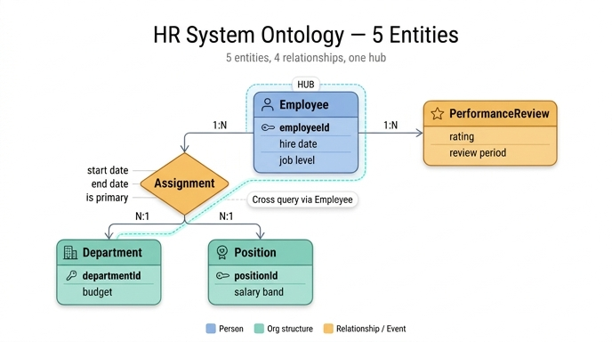

# 완성된 HR System 온톨로지의 5개 엔티티

## 카드 내용

- **Question**: 완성된 HR System 온톨로지의 5개 엔티티는?
- **Answer**: Employee, Department, Position, Assignment, PerformanceReview.

학습 자료의 마지막 아티클(Complete HR Model)이 직접 명시하는 문장이다.

> *HR System ontology with 5 entities: Employee, Department, Position, Assignment, PerformanceReview.*

## 5개를 세 부류로 묶어서 외우기

5개를 나열식으로 암기하면 순서가 헷갈린다. **"사람 / 조직 구조 / 관계·사건"** 세 부류로 묶으면 개수와 역할이 함께 기억된다.

| 부류 | 엔티티 | 무엇을 대표하는가 |
|---|---|---|
| ① 사람 (person) | **Employee** | 워크포스에 속한 개인 그 자체 |
| ② 조직 구조 (org structure) | **Department**, **Position** | 일이 조직되는 단위(부서)와 역할 정의(직무) |
| ③ 관계·사건 (relationship / event) | **Assignment**, **PerformanceReview** | 사람과 구조를 잇는 배치, 사람에게 붙는 평가 사건 |

핵심 감각: **사람 1 + 구조 2 + 연결/사건 2 = 5**.

그리고 ①②는 "명사(실체)", ③은 "무엇이 일어났는가"다. Assignment는 관계 자체를 엔티티로 승격시킨 **junction entity**, PerformanceReview는 시점에 발생한 **이벤트 엔티티**다.

## 엔티티별 역할과 속성표

asset의 속성 타입과 식별자 표시를 그대로 반영한다.

### 1. Employee — 사람

워크포스의 개인. 이름·입사일·재직 상태·직급을 갖는다.

| Property | Type | Identifier? |
|---|---|---|
| `employeeId` | string | ✓ |
| `name` | string | |
| `hireDate` | date | |
| `employmentStatus` | enum | |
| `jobLevel` | enum | |

`employeeId`는 안정적인 business identifier다. email처럼 바뀔 수 있는 속성을 주 키로 쓰지 않는다.

### 2. Department — 조직 구조 (business unit)

일이 조직되는 사업 단위. `budget`이 있어서 같은 그래프에서 리소스 계획과 코스트센터 분석이 가능하다.

| Property | Type | Identifier? |
|---|---|---|
| `departmentId` | string | ✓ |
| `name` | string | |
| `budget` | decimal | |
| `status` | enum | |

### 3. Position — 조직 구조 (role definition)

책임과 레벨을 서술하는 **역할 정의**. 지금 그 자리에 앉아 있는 사람과 분리된다. 그래서 사람이 없는 **open position**도 표현할 수 있다.

| Property | Type | Identifier? |
|---|---|---|
| `positionId` | string | ✓ |
| `title` | string | |
| `level` | enum | |
| `salaryBand` | string | |

### 4. Assignment — 관계 (junction entity)

Employee를 Department와 Position에 **시점과 함께** 배치하는 연결 엔티티. 관계 자체가 속성을 가져야 하므로 독립 엔티티가 된다.

| Property | Type | Identifier? |
|---|---|---|
| `assignmentId` | string | ✓ |
| `startDate` | date | |
| `endDate` | date | |
| `isPrimary` | boolean | |

`startDate`/`endDate` 덕분에 "Q2에 Finance에 있던 사람은 누구인가", "올해 부서를 옮긴 직원은 누구인가" 같은 이력 질문에 답할 수 있다.

### 5. PerformanceReview — 사건 (event)

리뷰 사이클마다 직원에게 붙는 평가 결과. people analytics 계층을 완성한다.

| Property | Type | Identifier? |
|---|---|---|
| `reviewId` | string | ✓ |
| `reviewPeriod` | string | |
| `rating` | enum | |
| `reviewDate` | date | |

## 4개 관계로 이루어진 전체 그래프

엔티티가 5개일 때 관계는 **정확히 4개**다.

- `Employee` -> `Assignment` — one-to-many (1:N)
- `Assignment` -> `Department` — many-to-one (N:1)
- `Assignment` -> `Position` — many-to-one (N:1)
- `Employee` -> `PerformanceReview` — one-to-many (1:N)

```
                            ┌─────────────────────────┐
                            │       Employee          │  ← 사람
                            │  employeeId ✓  (string) │
                            │  name / hireDate        │
                            │  employmentStatus(enum) │
                            │  jobLevel (enum)        │
                            └───┬─────────────────┬───┘
                     1:N        │                 │        1:N
              ┌─────────────────┘                 └─────────────────┐
              │                                                     │
              ▼                                                     ▼
   ╔═══════════════════════╗                        ┌─────────────────────────┐
   ║   Assignment          ║  ← junction            │   PerformanceReview     │  ← event
   ║   assignmentId ✓      ║                        │   reviewId ✓            │
   ║   startDate (date)    ║                        │   reviewPeriod (string) │
   ║   endDate   (date)    ║                        │   rating (enum)         │
   ║   isPrimary (boolean) ║                        │   reviewDate (date)     │
   ╚═══╦═══════════════╦═══╝                        └─────────────────────────┘
   N:1 ║               ║ N:1
       ▼               ▼
┌──────────────┐  ┌──────────────────┐
│  Department  │  │    Position      │   ← 조직 구조
│ deptId ✓     │  │  positionId ✓    │
│ name         │  │  title (string)  │
│ budget(dec.) │  │  level (enum)    │
│ status(enum) │  │  salaryBand(str) │
└──────────────┘  └──────────────────┘
```

관계 방향을 읽는 법: **Assignment는 "많은 쪽"에 있다.** 한 직원이 여러 Assignment를 갖고(1:N), 여러 Assignment가 하나의 Department와 하나의 Position을 가리킨다(N:1). 그래서 Department 기준으로 뒤집어 읽으면 `Department <- Assignment <- Employee`가 된다.

## 구조적 핵심: Employee만이 유일한 hub다

그래프에서 **두 갈래로 뻗어 나가는 엔티티는 Employee 하나뿐**이다.

| 엔티티 | 연결된 관계 수 | 성격 |
|---|---|---|
| **Employee** | 2 (→ Assignment, → PerformanceReview) | **hub** — 유일하게 두 갈래로 분기 |
| Assignment | 3 (← Employee, → Department, → Position) | 3-way junction, 그러나 상위 갈래는 Employee 하나 |
| Department | 1 (← Assignment) | leaf |
| Position | 1 (← Assignment) | leaf |
| PerformanceReview | 1 (← Employee) | leaf |

Assignment는 관계가 3개 붙어 있어 차수는 더 높지만, **위로 올라가는 경로가 Employee 하나뿐인 종착 구조**다. 반면 Employee는 "조직 구조 쪽 가지"와 "평가 쪽 가지" 두 개의 서로 다른 서브그래프를 동시에 소유한다.

### 왜 이 사실이 중요한가 — 부서×평가 교차 질의는 Employee를 경유해야 한다

Department와 PerformanceReview 사이에는 **직접 관계가 없다.** PerformanceReview는 Employee에만 붙고, Department는 Assignment에만 붙는다. 따라서 "어느 부서에 outstanding 평가가 많은가" 같은 질문은 반드시 Employee를 지나야 한다.

```
Department <- Assignment <- Employee -> PerformanceReview
                              ▲
                    유일한 경유지(hub)
```

여기서 파생되는 실무적 함의:

- **평가는 부서가 아니라 사람에게 붙는다.** 리뷰 시점의 부서를 알려면 `PerformanceReview.reviewDate`가 `Assignment.startDate ~ endDate` 구간에 들어가는지 따져야 한다. 부서별 평가 집계가 단순 조인이 아닌 이유다.
- **한 직원이 여러 Assignment를 가질 수 있으므로**(부서 이동, 겸직) `isPrimary`로 대표 배치를 고르거나 날짜로 필터해야 중복 집계를 피한다.
- Employee가 끊기면 그래프가 두 조각으로 갈라진다. 즉 `employeeId`의 안정성이 **모델 전체의 연결성**을 지탱한다.

## 어느 학습 단계에서 무엇이 추가됐는가

5개가 한 번에 등장하지 않는다. 단계별로 쌓인 순서를 기억하면 목록이 자연스럽게 복원된다.

| Step | 추가된 엔티티 | 누적 개수 | 그 단계의 학습 포인트 |
|---|---|---|---|
| 1 | **Employee, Department, Position** | 3 | 조직 기반과 식별자 (organizational foundation and identifiers) |
| 2 | **+ Assignment** | 4 | 스태핑 이력을 위한 junction entity 패턴 |
| 3 | **+ PerformanceReview** | 5 | 리뷰 사이클, 등급, people analytics |
| 4 | (추가 없음) 완성 모델 | 5 | end-to-end HR 질문과 그래프 추론 |

Step 4는 새 엔티티를 더하지 않고 완성된 5개 모델을 질의에 적용하는 단계다.

## 예시 질의 ↔ 엔티티 매핑

asset이 제시한 4개 예시 질의를 어떤 엔티티가 관여하는지로 정리했다.

| 예시 질의 | 그래프 경로 | Employee | Department | Position | Assignment | PerformanceReview |
|---|---|:--:|:--:|:--:|:--:|:--:|
| Which departments have the most senior employees? | `Department <- Assignment <- Employee (jobLevel=senior)` | ● | ● | | ● | |
| Which employees changed roles in the last year? | `Employee -> Assignment (여러 레코드, 날짜순) -> Position` | ● | | ● | ● | |
| Which teams have many outstanding reviews? | `Department <- Assignment <- Employee -> PerformanceReview (rating=outstanding)` | ● | ● | | ● | ● |
| Which assignments are no longer active? | `Assignment (endDate 존재 또는 isPrimary=false)` | | | | ● | |

읽어낼 수 있는 것:

- **Assignment는 4개 질의 전부에 등장한다.** 시간·배치가 걸린 거의 모든 질문의 통로다.
- **3번 질의만 5개 중 4개를 동시에 쓴다.** 이것이 Scenario Overview의 대표 질문("지난 리뷰 사이클에서 outstanding을 받은 senior 직원이 가장 많은 부서는?")과 같은 계열이며, hub인 Employee를 반드시 경유한다.
- **4번 질의는 Assignment 단독으로 끝난다.** 관계에 속성을 부여했기 때문에 Assignment 자체가 질의 대상이 될 수 있다는 증거다.

## 흔한 혼동 정리

- **Position vs jobLevel**: `Position.level`은 역할 정의의 레벨, `Employee.jobLevel`은 사람의 직급이다. 둘 다 enum이며 별개 엔티티에 있다.
- **Department vs Team**: asset의 예시 질의에서 "teams"라는 표현이 나오지만 모델상 엔티티는 **Department**다. Team이라는 별도 엔티티는 없다.
- **Manager / Employee 자기참조**: 보고 라인(manager)은 이 모델의 4개 관계에 포함되지 않는다. 관계는 정확히 4개다.
- **6번째 엔티티를 만들지 말 것**: Salary, Review Cycle, Cost Center 등은 각각 `Position.salaryBand`, `PerformanceReview.reviewPeriod`, `Department.budget` **속성**으로 흡수되어 있다.

## 한 줄 회상 장치

> **사람 하나(Employee), 구조 둘(Department·Position), 연결과 사건 둘(Assignment·PerformanceReview).**
> 엔티티 5개, 관계 4개, 그리고 hub는 Employee 하나.

## 인포그래픽


