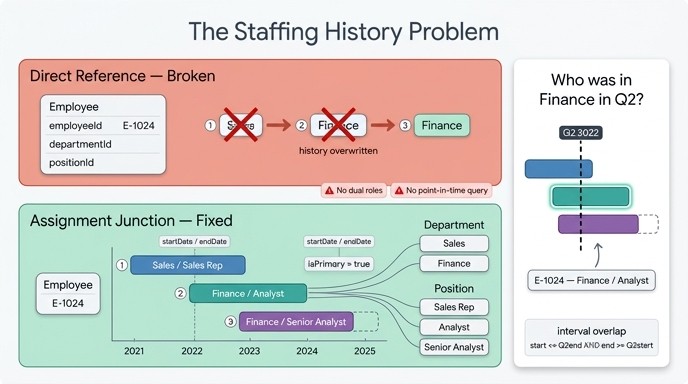

# staffing history problem (배치 이력 문제)

> **Q.** staffing history problem(배치 이력 문제)이란?
>
> **A.** 직원은 시간에 따라 부서·직무를 옮기고, 한 부서는 여러 직원을 수용하며, 한 직무는 시기별로 다른 사람이 채운다. 단순 one-to-one 구조로 표현할 수 없는 상황이다.

asset 원문(`Assignments` 아티클)은 이 문제를 세 문장으로 요약한다.

- An employee can move between departments or positions over time.
- A department can host many employees.
- A position can be filled by different people over time.
- → **This is not a simple one-to-one structure.**

이 짧은 문장 안에 서로 다른 성질의 어려움이 **세 축**으로 겹쳐 있다. 축을 분리해서 봐야 왜 `Employee.departmentId` 같은 직접 참조가 실패하고, 왜 `Assignment` junction entity가 필요한지가 선명해진다.

---

## 1. 문제의 세 축 분해

### (a) 시간축 — 배치는 "점"이 아니라 "구간(interval)"이다

한 직원의 배치 상태는 특정 시점의 값 하나가 아니라, **시작과 끝을 가진 구간**이다. 그리고 경력이 이어지면서 그 구간들이 연달아 붙는다.

```
김OO의 실제 배치 이력
2021-03 ─────── 2022-06        Sales / Sales Rep
                2022-06 ─────── 2024-01   Finance / Analyst
                                2024-01 ─────── (진행 중)  Finance / Senior Analyst
```

핵심은 마지막 구간만이 "현재"이고 앞의 구간들도 **여전히 참(true)이었던 사실**이라는 점이다. 즉 배치는 덮어써야 하는 값이 아니라 **누적되어야 하는 레코드**다. 스칼라 필드 하나는 구조적으로 "현재 값 1개"만 담을 수 있으므로 이 성질을 표현할 그릇이 되지 못한다.

### (b) 다중성 — 양방향 모두 many

| 관계 | 다중성 | 근거 |
|---|---|---|
| Employee ↔ Department | **many-to-many** | 한 부서는 여러 직원을 수용(a department can host many employees), 한 직원은 시간에 따라 여러 부서를 거침(그리고 겸직이면 동시에 여러 부서) |
| Employee ↔ Position | **many-to-many** | 한 직원은 여러 직무를 거치고, 한 직무는 시기별로 다른 사람이 채움(filled by different people over time) |

여기서 many가 두 가지 이유로 발생하는 걸 구분하는 게 중요하다.

- **시간에 걸친 many**: 2021년엔 Sales, 2022년엔 Finance. 시점을 고정하면 하나지만 이력 전체로는 여럿.
- **동시적 many(겸직/파견)**: 같은 시점에 Finance 80% + PMO TF 20%. 이때 "주 배치가 어디냐"는 별도 정보가 필요하다 → `isPrimary`.

one-to-one이나 many-to-one 구조는 이 둘 중 어느 것도 담지 못한다.

### (c) 관계 자체의 속성 — 어느 엔티티에도 귀속되지 않는 데이터

"2022-06에 시작했다"라는 사실은 누구의 속성인가?

- `Employee`의 속성? → 아니다. 직원은 배치를 여러 번 하고, 배치마다 시작일이 다르다. `hireDate`(입사일)와도 다른 값이다.
- `Department`의 속성? → 아니다. 부서는 수백 명을 수용하고 각자 시작일이 다르다.
- `Position`의 속성? → 아니다. 직무는 사람이 바뀌어도 존재한다(공석 포함).

`startDate`, `endDate`, `isPrimary`는 **Employee-Department-Position 세 개가 만나는 그 조합 하나에만 성립하는 사실**이다. 이것이 junction entity가 필요한 결정적 신호다. asset의 표현: *"Use junction entities when relationships need their own attributes."*

---

## 2. 직접 참조로 모델링하면 무엇이 깨지는가

`Employee`에 외래키를 직접 박은 안티패턴을 보자.

```
Employee
  employeeId    "E-1024"
  name          "김OO"
  hireDate      2021-03-01
  departmentId  "D-FIN"      ← 직접 참조
  positionId    "P-ANL-SR"   ← 직접 참조
```

### 깨짐 1 — 덮어쓰기로 이력 소멸 (history overwritten)

2022-06 부서 이동 시 UPDATE가 일어난다.

```
UPDATE Employee SET departmentId='D-FIN' WHERE employeeId='E-1024'
-- 이전 값 'D-SALES'는 어디에도 남지 않음
```

`departmentId`가 담을 수 있는 값은 언제나 1개이므로, 새 배치를 쓰는 순간 과거 배치는 **물리적으로 소멸**한다. "이 사람이 예전에 Sales였다"는 사실을 복원할 방법이 없다. asset의 `Organization Core` 아티클이 경고한 "you lose flexibility for historical staffing changes"가 정확히 이 지점이다.

### 깨짐 2 — 겸직·다중 배치 표현 불가

같은 시점에 두 부서에 속하려면 `departmentId`에 값 두 개를 넣어야 한다. 스칼라 필드로는 불가능하다. 배열로 바꿔도 "각 부서마다 시작일이 언제이고 어느 쪽이 주 배치인지"를 담을 자리가 없다 — (c)축이 해결되지 않는다.

### 깨짐 3 — 특정 시점 질의 불가

`"Who was in Finance during Q2 (2022-04-01 ~ 2022-06-30)?"`를 물어보면, 직접 참조 모델은 **"지금 Finance인 사람"**만 답할 수 있다. 시점 파라미터를 받을 데이터가 없기 때문이다. 2022 Q2엔 Finance였지만 지금 퇴사했거나 다른 부서로 간 사람은 영원히 누락되고, 반대로 2024년에 합류한 사람은 잘못 포함된다. 과거 시점의 조직도, 부서별 인건비 추이, 이동률(turnover) 분석이 전부 불가능해진다.

### 깨짐 4 — 공석(open position) 표현 불가

배치가 Employee 쪽에만 존재하면, 사람이 붙지 않은 Position은 관계 그래프에서 고립된다. 채용 전에 존재하는 열린 자리를 모델링할 수 없다.

---

## 3. 해법: Assignment junction entity

asset이 제시하는 구조는 관계를 **엔티티로 승격(reify)**시키는 것이다.

```
Employee ──1:N──> Assignment ──N:1──> Department
                       │
                       └────N:1──────> Position
```

| 관계 | 다중성 |
|---|---|
| `Employee` → `Assignment` | one-to-many |
| `Assignment` → `Department` | many-to-one |
| `Assignment` → `Position` | many-to-one |

### Assignment 속성

| Property | Type | Identifier? | 역할 |
|---|---|---|---|
| `assignmentId` | string | ✓ | 배치 레코드 자체의 안정적 식별자 |
| `startDate` | date | | 구간 시작 |
| `endDate` | date | | 구간 종료 (null이면 현재 진행 중) |
| `isPrimary` | boolean | | 동시 배치 중 주 배치 여부 |

### 세 축이 어떻게 해소되는지

| 축 | 해소 방식 |
|---|---|
| **(a) 시간축 = 구간** | `startDate`/`endDate` 쌍이 구간 하나를 표현한다. 배치가 바뀌면 UPDATE가 아니라 **기존 레코드의 `endDate`를 채우고 새 Assignment를 INSERT** — 덮어쓰기가 append로 바뀌므로 이력이 보존된다. `endDate IS NULL`이 곧 활성 배치의 정의가 된다. |
| **(b) 다중성 = many-to-many** | Employee 하나가 Assignment N개를 가지고 각 Assignment가 Department/Position 하나를 가리킨다. 두 개의 one-to-many/many-to-one을 경유해 many-to-many가 성립한다. 시간에 걸친 many(구간이 이어짐)와 동시적 many(구간이 겹침)를 **같은 구조로** 표현하고, 겹칠 때의 우선순위는 `isPrimary`가 처리한다. |
| **(c) 관계의 속성** | `startDate`/`endDate`/`isPrimary`가 Assignment의 속성으로 자연스럽게 자리를 잡는다. Employee·Department·Position은 각자 자기 것만 가진 깨끗한 엔티티로 남는다(Employee는 `hireDate`·`jobLevel`, Department는 `budget`, Position은 `title`·`salaryBand`). |

또한 Position이 Assignment 없이도 독립 존재할 수 있으므로 **공석**이 자연스럽게 표현된다(깨짐 4 해소). asset의 표현대로 *"Position separates role definition from the person currently assigned to it."*

### 데이터로 본 모습

```
Assignment
A-001  E-1024  D-SALES  P-SALES-REP   2021-03-01 ~ 2022-06-01   isPrimary=true
A-002  E-1024  D-FIN    P-ANL         2022-06-01 ~ 2024-01-01   isPrimary=true
A-003  E-1024  D-FIN    P-ANL-SR      2024-01-01 ~ null         isPrimary=true
```

세 줄 모두 살아 있다. 어느 것도 다른 것을 지우지 않는다.

---

## 4. 시점 질의는 구간 겹침(interval overlap) 계산이다

`"Who was in Finance during Q2?"`는 이제 **질의 구간 [Q2start, Q2end]와 Assignment 구간 [startDate, endDate]이 겹치는가**를 판정하는 문제로 환원된다.

표준 겹침 조건(Allen의 시간 구간 대수에서 쓰이는 형태):

```
startDate <= queryEnd  AND  (endDate IS NULL OR endDate >= queryStart)
```

- `endDate IS NULL` 분기가 "아직 진행 중인 배치"를 자동으로 포함시킨다.
- 두 개의 부등식만으로 판정된다 — 구간이 앞에서 걸치든 뒤에서 걸치든 완전히 포함하든 포함되든 모두 커버된다.

그래프 경로로는 다음과 같다.

```
Department(name='Finance')
  <- Assignment (구간이 Q2와 겹침)
  <- Employee
```

특정 **시점**(구간이 아닌 한 날짜 `d`)을 물으면 조건이 더 단순해진다.

```
startDate <= d  AND  (endDate IS NULL OR endDate > d)
```

이 한 줄이 곧 **"임의 시점의 조직도를 재구성하는 함수"**다. 직접 참조 모델에는 존재할 수 없었던 능력이다.

asset이 제시한 다른 질의들도 같은 원리에 얹힌다.

| 질문 | 계산 방식 |
|---|---|
| "Who was in Finance during Q2?" | 구간 겹침 조건 + Department 필터 |
| "Which employees changed departments this year?" | 같은 Employee의 Assignment 2개 이상이 올해에 인접(앞의 `endDate` ≈ 뒤의 `startDate`)하고 Department가 다름 |
| "Which assignments are no longer active?" | `endDate`가 설정됨 (또는 `isPrimary=false`) |
| "Which departments have the most senior employees?" | Department ← Assignment ← Employee(`jobLevel=senior`), 활성 Assignment만 |

---

## 5. 같은 패턴의 다른 이름들

asset은 이 구조가 도메인을 넘나드는 일반 패턴임을 명시한다.

| 도메인 | 두 엔티티 | junction entity | 관계 고유 속성 |
|---|---|---|---|
| HR | Employee, Department/Position | **Assignment** | startDate, endDate, isPrimary |
| 교육 | Student, Course | **Enrollment** | 수강 시점, 성적, 상태 |
| 커머스 | Customer(Order), Product | **Order line item** | 수량, 단가, 할인 |

판별 기준을 한 문장으로: **관계에 속성이 붙거나(특히 시간), 관계가 양방향 many이면 junction entity로 승격한다.**

---

## 6. 한 줄 정리

staffing history problem은 (a) 배치가 시간 구간이고, (b) Employee-Department·Employee-Position이 양쪽 모두 many이며, (c) 시작·종료·주배치 여부가 어느 한 엔티티에도 귀속되지 않는다는 세 가지가 동시에 성립하는 상황이다. 직접 참조로는 덮어쓰기 때문에 이력이 사라지고 겸직도 시점 질의도 불가능하지만, `assignmentId`/`startDate`/`endDate`/`isPrimary`를 가진 `Assignment` junction entity로 관계를 엔티티화하면 세 축이 한꺼번에 해소되고 시점 질의가 구간 겹침 조건으로 계산 가능해진다.

## 인포그래픽


