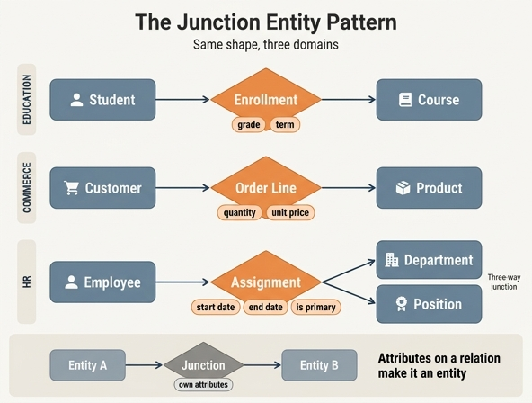

# junction entity 패턴은 어떤 도메인들에서 같은 형태로 나타나는가?

**답**: Student-Course를 잇는 Enrollment, Customer-Product를 잇는 Order line items, Employee-Department-Position을 잇는 Assignment. 모두 동일한 일반 패턴이다.

---

## 1. 세 도메인을 같은 표에 올려보기

도메인 이름만 다르고 골격은 완전히 똑같다. 좌측 엔티티 / 우측 엔티티 / 가운데 junction / junction만 가질 수 있는 고유 속성으로 나란히 놓으면 한눈에 보인다.

| 도메인 | 좌측 엔티티 | junction 엔티티 | 우측 엔티티 | junction 고유 속성 |
|---|---|---|---|---|
| 교육 | `Student` | **`Enrollment`** | `Course` | `grade`, `enrolledAt`, `term` |
| 커머스 | `Customer` (또는 `Order`) | **`OrderLineItem`** | `Product` | `quantity`, `unitPrice`, `discount` |
| HR | `Employee` | **`Assignment`** | `Department` + `Position` | `startDate`, `endDate`, `isPrimary` |

관계 방향도 동일한 형태로 반복된다.

```
Student   1 --- * Enrollment   * --- 1 Course
Customer  1 --- * OrderLine    * --- 1 Product
Employee  1 --- * Assignment   * --- 1 Department
                Assignment     * --- 1 Position
```

즉 junction은 **양쪽 모두에 대해 many-to-one**이고, 양쪽 엔티티는 junction에 대해 one-to-many다. 이 "1-*-*-1" 샌드위치가 패턴의 골격이다.

### 골격을 문장으로 추출하면

> A와 B 사이에 many-to-many 관계가 있고, **그 관계 자체에 붙어야 하는 사실**이 존재할 때, 관계를 엔티티 J로 승격시켜 `A 1-* J *-1 B` 로 분해한다.

- `grade`는 Student의 속성이 아니다(학생은 과목마다 성적이 다르다). Course의 속성도 아니다. **"이 학생이 이 과목을 수강한 사건"의 속성**이다.
- `quantity`는 Customer의 속성도 Product의 속성도 아니다. **"이 주문에서 이 상품을 담은 줄"의 속성**이다.
- `startDate`/`endDate`는 Employee의 속성도 Department의 속성도 아니다. **"이 사람이 이 부서의 이 직무를 맡았던 기간"의 속성**이다.

---

## 2. 왜 이 패턴이 도메인을 가리지 않고 반복되는가

### 관계에 속성이 붙는 순간, 관계는 그 자체로 개체가 된다

기본 관계 모델에서 관계는 "두 개체를 잇는 선"일 뿐이고, 선에는 속성을 걸 곳이 없다. 그런데 현실은 거의 항상 관계에 대해서도 무언가를 기록하고 싶어한다. 언제 시작됐는지, 몇 개인지, 결과가 어땠는지.

이 요구가 생기면 선을 **개체로 구체화(reify)** 하는 수밖에 없다. 이것이 데이터 모델링에서 부르는 이름들이다.

- **reified relationship** (구체화된 관계) — 추상적 관계를 1급 객체로 끌어내린 것
- **associative entity** (연관 엔티티) — Chen ER 모델 용어
- **junction / bridge / link entity** — 실무에서 흔히 쓰는 이름
- RDF/OWL 세계에서는 **n-ary relation 패턴** 또는 (RDF-star 이전엔) reification 으로 같은 문제를 해결한다.

관계형 DB에서 many-to-many를 물리적으로 표현할 방법이 애초에 없다는 제약도 같은 방향으로 밀어붙인다. 도메인이 교육이든 커머스든 HR이든, "관계에 속성이 필요하다 + many-to-many다"라는 두 조건이 동시에 성립하는 상황은 어디에나 있으므로 패턴이 반복될 수밖에 없다.

### 승격되고 나면 관계가 아니라 "사건/사실"의 이름을 얻는다

좋은 junction 이름은 대부분 **명사화된 사건**이다. Enrollment(등록했다), Order line(주문에 담았다), Assignment(배치했다), Reservation, Shipment, Membership, Authorship. 이름이 동사에서 왔다는 게 "이건 원래 관계였다"의 흔적이다.

---

## 3. 단순 many-to-many 링크 테이블 vs junction entity

둘 다 두 테이블 사이에 끼는 중간 구조지만, 온톨로지/개념 모델 관점에서는 등급이 다르다.

| 구분 | 순수 링크(join) 테이블 | junction **entity** |
|---|---|---|
| 속성 | 두 외래키뿐 | 외래키 + 고유 속성(`grade`, `quantity`, `startDate`…) |
| 식별자 | 없음. 두 FK의 조합이 곧 키 | **자기 식별자를 가진다** (`assignmentId`, `enrollmentId`) |
| 수명 | 양쪽이 연결된 동안만 존재하는 부수물 | **자체 수명주기**를 가짐 (생성→변경→종료, endDate로 마감) |
| 중복 허용 | 같은 쌍은 한 번만 (쌍이 키니까) | 같은 쌍이 **여러 번** 존재 가능 (재입사, 재수강, 같은 상품 두 줄) |
| 다른 엔티티의 참조 대상 | 참조 대상이 될 수 없음 | **다른 엔티티가 이것을 가리킬 수 있다** (Assignment→ApprovalRecord, OrderLine→ReturnRequest) |
| 온톨로지 표기 | 관계(edge)로 접혀도 됨 | 독립 엔티티(node)로 그려야 함 |

핵심 분기점은 **"자기 식별자가 있는가"** 다. `assignmentId`가 있다는 것은 이 레코드가 두 끝점의 조합으로 환원되지 않는, 스스로 지목 가능한 개체라는 선언이다. 그래서 다른 엔티티가 그것을 참조할 수 있고, 같은 (Employee, Department, Position) 조합이 시점을 달리해 여러 번 나타날 수도 있다.

HR 예시에서 이 차이가 실제로 문제를 만든다. 링크 테이블이라면 (사원, 부서) 쌍은 한 번뿐이라 "2년 전 재무팀에 있다가 개발팀으로 갔고 올해 다시 재무팀으로 복귀"를 표현할 수 없다. Assignment는 세 개의 별개 레코드로 이력 전체를 남긴다.

---

## 4. Assignment는 3-way 사례 — 두 개의 many-to-many를 동시에 분해한다

Enrollment와 OrderLine은 양쪽에 엔티티가 하나씩 있는 **binary** junction이다. Assignment는 한 발 더 나간다.

```
                    ┌──> Department
Employee --> Assignment
                    └──> Position
```

Assignment 하나가 동시에 두 개의 many-to-many를 흡수한다.

- Employee ↔ Department (한 사람이 여러 부서를 거치고, 한 부서에 여러 사람)
- Employee ↔ Position (한 사람이 여러 직무를 거치고, 한 직무를 여러 사람이 순차로 맡음)

만약 junction 없이 `EmployeeDepartment`, `EmployeePosition` 두 개의 링크 테이블로 쪼갰다면, **"어느 부서에서 어느 직무였는지"의 짝이 끊어진다**. 개발팀 시절엔 주니어, 재무팀 시절엔 시니어였다는 조합 정보가 두 테이블로 흩어지면 복원할 수 없다. 3-way junction은 세 참여자를 하나의 사실로 묶어 조합을 보존한다.

여기에 `startDate`/`endDate`/`isPrimary`가 붙어 시간축과 겸직까지 다룬다. 그래서 `Assignment(endDate 있음)`은 종료된 배치, `isPrimary=false`는 부(副)겸직이라는 식으로 질의가 가능해진다.

일반화하면 junction은 **n-ary**로 확장된다. 예: Doctor-Patient-Clinic-Time을 묶는 Appointment, Supplier-Warehouse-Product를 묶는 SupplyContract.

---

## 5. 판단 기준 요약 — junction으로 승격시킬지 결정하는 체크리스트

아래 중 하나라도 "예"면 junction entity로 만든다.

1. **속성**: 관계에 대해 기록할 사실이 있는가? (수량, 성적, 금액, 등급, 플래그)
2. **이력/시간**: 언제 시작·종료됐는지, 시점에 따라 달라지는지를 물어볼 일이 있는가? (`startDate`, `endDate`)
3. **중복**: 같은 두(세) 엔티티 쌍이 시점이나 맥락을 달리해 **두 번 이상** 발생할 수 있는가?
4. **참조**: 다른 엔티티가 "그 관계"를 가리켜야 하는가? (승인, 반품, 첨부, 감사 로그)
5. **차수**: 관계에 참여자가 셋 이상인가? (조합이 끊기면 안 되는 경우)

반대로 전부 "아니오" — 순수한 소속/태깅이고 속성도 이력도 없다면 굳이 엔티티로 만들지 말고 관계(edge)로 둔다. `Article ↔ Tag` 같은 것이 그 예다.

> 한 줄 요약: **관계에 속성·이력·중복 가능성이 붙으면, 그 관계는 이미 엔티티다.** Enrollment, Order line item, Assignment는 서로 다른 도메인에서 이 한 문장이 각각 실현된 사례일 뿐이다.

## 인포그래픽


