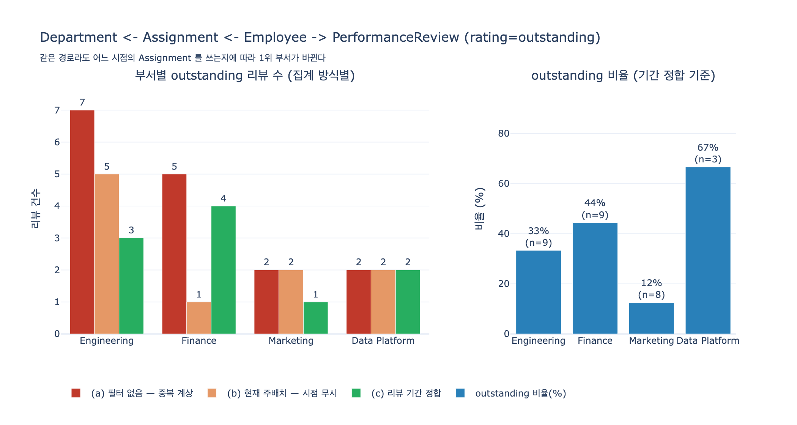

# "Which teams have many outstanding reviews?" 의 그래프 경로

**Q.** "Which teams have many outstanding reviews?"의 그래프 경로는?

**A.** `Department <- Assignment <- Employee -> PerformanceReview`에서 `rating=outstanding`으로 필터링한다. 배치를 거쳐 부서로, 리뷰로 각각 뻗는 두 갈래를 함께 쓴다.

---

## 1. 출처 맥락

학습 경로의 마지막 아티클 **Complete HR Model** 은 5개 엔티티가 완성된 뒤 예시 질의 4개를 표로 제시한다.

| Question | Graph path |
|---|---|
| Which departments have the most senior employees? | `Department <- Assignment <- Employee` (`jobLevel=senior`) |
| Which employees changed roles in the last year? | `Employee -> Assignment` (multiple records by date) `-> Position` |
| **Which teams have many outstanding reviews?** | **`Department <- Assignment <- Employee -> PerformanceReview`** (`rating=outstanding`) |
| Which assignments are no longer active? | `Assignment` (`endDate` set or `isPrimary=false`) |

그리고 스키마상의 관계는 세 줄뿐이다.

```
Employee   -> Assignment          (one-to-many)
Assignment -> Department          (many-to-one)
Assignment -> Position            (many-to-one)
Employee   -> PerformanceReview   (one-to-many)
```

핵심 사실 하나를 먼저 못 박아 두자. **PerformanceReview 는 Department 를 모른다.**
리뷰 레코드에는 `reviewId`, `reviewPeriod`, `rating`, `reviewDate` 와 `employeeId` 만 있다.
"어느 팀의 성과인가"라는 정보는 리뷰 안에 존재하지 않는다. 그래서 부서까지 가려면 사람을 거쳐,
다시 배치를 거쳐야 한다. 이것이 경로가 4개 엔티티로 늘어나는 유일한 이유다.

---

## 2. 경로 단계별 분해

질문은 `rating=outstanding` 이라는 **PerformanceReview 쪽 조건**으로 시작한다.
그래서 실제 순회는 경로 문자열의 오른쪽 끝에서 왼쪽으로 흐른다.

### 스텝 1 — PerformanceReview 에서 `rating = outstanding` 필터

가장 선택도(selectivity)가 높은 조건을 먼저 적용해 후보 집합을 줄인다.

```
R = { r ∈ PerformanceReview : r.rating = outstanding }
```

`rating` 은 enum 이라 값 집합이 통제돼 있다(`outstanding` / `exceeds` / `meets` / …).
문자열 자유입력이면 `"Outstanding"`, `"OUTSTANDING"`, `"최우수"` 가 섞여 이 필터 자체가 새기 시작한다.
아티클이 `rating` 을 enum 으로 둔 이유가 여기서 드러난다.

이때 `reviewPeriod` 필터도 보통 함께 붙는다. 원래의 비즈니스 질문은
"…rated outstanding **in the last review cycle**" 이었다. 주기를 안 자르면 입사 오래된 직원이
쌓아둔 리뷰가 전부 합산된다.

### 스텝 2 — 리뷰를 Employee 로 되짚기 (`Employee -> PerformanceReview` 의 역방향)

```
E = { emp(r) : r ∈ R }
```

`Employee -> PerformanceReview` 는 1:N 이므로, 역방향은 N:1 이다. **팬아웃이 없다** —
리뷰 1건에는 직원이 정확히 1명 대응한다. 이 스텝은 안전하다.

### 스텝 3 — Employee 의 Assignment 로 (`Employee -> Assignment`, 정방향)

```
A = { a ∈ Assignment : a.employeeId ∈ E }
```

여기가 위험한 스텝이다. `Employee -> Assignment` 는 **1:N** 이므로 직원 1명이 배치 여러 건을 갖는다.
아티클이 Assignment 를 만든 이유가 바로 그것이었다.

> An employee can move between departments or positions over time.

즉 이동 이력이 있는 직원은 배치가 2건, 3건이다. 겸직이면 동시에 유효한 배치가 2건이다.
필터 없이 이 스텝을 밟으면 **리뷰 1건이 여러 부서로 복제된다.**

### 스텝 4 — Assignment 에서 Department 로 (`Assignment -> Department`, 정방향)

```
D = { dept(a) : a ∈ A }
```

many-to-one 이라 배치 1건은 부서 1개로 확정된다. 이 스텝도 안전하다.

### 스텝 5 — 부서별 집계

```
count(D) = |{ (r, a) : dept(a) = D }|
```

`GROUP BY department` 후 `COUNT`. 여기서 "many"의 정의(개수냐 비율이냐)를 정해야 한다.

---

## 3. 화살표 방향 vs 순회 방향

경로 표기에 `<-` 와 `->` 가 섞여 있는 것이 처음엔 혼란스럽다. 두 가지가 다른 것이기 때문이다.

| | 의미 | 결정 주체 |
|---|---|---|
| **화살표 방향** (`->`) | 스키마상 관계의 선언 방향. 외래 참조를 들고 있는 쪽이 출발점 | 모델링 시점에 고정 |
| **순회 방향** | 질의가 실제로 노드를 밟는 순서 | 필터 위치와 선택도에 따라 매번 달라짐 |

Assignment 행이 `employeeId` 와 `departmentId` 를 들고 있으니
스키마 화살표는 `Employee -> Assignment -> Department` 다.
경로 표기 `Department <- Assignment <- Employee` 의 `<-` 는
**"이 구간은 스키마 화살표를 거슬러 읽는다"** 는 표시일 뿐, 새로운 관계가 아니다.

그래서 구현할 때는 **양방향 인덱스**를 모두 준비해야 한다.

```
정방향 (선언 방향)                   역방향 (질의가 실제로 타는 방향)
Employee   -> [Assignment]          Assignment -> Employee
Employee   -> [PerformanceReview]   PerformanceReview -> Employee
Assignment -> Department            Department -> [Assignment]
```

RDB 라면 `assignment.employee_id`, `assignment.department_id`, `review.employee_id` 에
인덱스가 있어야 역방향 탐색이 스캔으로 퇴화하지 않는다. 그래프 DB 라면 엣지가 양방향 순회 가능해야 한다.

그리고 실제 순회 순서는 표기 순서와도 다르다. 표기는 `Department` 에서 시작하지만,
필터가 PerformanceReview 에 걸려 있으므로 옵티마이저는 **리뷰에서 시작**한다.

```
표기:  Department <- Assignment <- Employee -> PerformanceReview
순회:  PerformanceReview(filter) → Employee → Assignment → Department
       (4)                          (3)        (2)          (1)
```

---

## 4. V자 구조 — Employee 가 유일한 교차점

이 경로가 앞의 세 질의와 근본적으로 다른 점은 **선형이 아니라는 것**이다.

```
                    Employee                      ← pivot (교차점)
                   ↙        ↘
           Assignment        PerformanceReview     ← 두 갈래
                ↓                    ↓
           Department          rating = outstanding
```

화살표가 Employee 에서 **양쪽으로 나간다**. `Employee -> Assignment` 와
`Employee -> PerformanceReview` 는 둘 다 정방향 out-edge 다. 그래서 모양이 **V** 다
(혹은 위가 열린 Λ 로 그려도 같다).

여기서 중요한 것은 **Assignment 와 PerformanceReview 사이에 직접 관계가 없다**는 사실이다.
리뷰는 "어느 배치에 대한 평가"로 모델링되지 않았고, 배치는 "어떤 평가를 받았는지" 모른다.
둘을 잇는 접착제는 오직 `employeeId` 하나다.

이 구조가 만드는 세 가지 결과:

1. **Employee 를 반드시 통과해야 한다.** 우회로가 없다. 부서-평가를 직접 잇는 지름길을 만들려면
   비정규화(리뷰에 `departmentId` 를 복제)를 해야 하는데, 그러면 이동 이력이 깨진다.
2. **두 갈래가 독립이므로 곱집합이 생긴다.** 배치 $m$ 건 × 해당하는 outstanding 리뷰 $k$ 건이면
   순회 결과가 $m \times k$ 개의 (배치, 리뷰) 쌍이 된다. 중복 계상의 수학적 원인이다.
3. **정합 조건을 사람이 넣어야 한다.** 스키마가 "이 리뷰는 이 배치 기간의 것"이라고 말해주지 않으므로,
   `Assignment.startDate/endDate` 와 `PerformanceReview.reviewPeriod` 를 질의에서 직접 맞춰야 한다.

---

## 5. 실무 함정 1 — 어느 시점의 배치를 쓸 것인가

가장 흔하고 가장 조용한 버그다. 같은 경로로 집계하는데 **답이 부서 순위째로 바뀐다.**

### 선택지

| 방식 | 필터 | 답하는 질문 |
|---|---|---|
| (a) 필터 없음 | 없음 | 경로 문자 그대로. 중복 계상 |
| (b) 현재 주배치 | `isPrimary = true AND endDate IS NULL` | "**지금** 이 팀에 있는 사람들의 과거 성적" |
| (c) 리뷰 기간 정합 | Assignment 구간 ∩ `reviewPeriod` 구간 ≠ ∅, `isPrimary` | "그 성과가 **실제로 난** 팀" |
| (d) `reviewDate` 기준 | `startDate ≤ reviewDate ≤ endDate` | 흔한 실수 (아래) |

### (b)의 오류: 이동한 직원의 성과가 새 부서로 따라간다

동봉한 `expy.py` 의 데이터에서 E005(정민재)는 2024년 내내 Finance 소속이었고,
2024-H1·2024-H2 리뷰에서 outstanding 을 받았다. 그리고 **2025-01-01 에 Engineering 으로 이동**했다.

`isPrimary=true AND endDate IS NULL` 로 잡으면 이 두 건이 모두 Engineering 실적이 된다.

```
R013 정민재(E005) 2024-H1   Engineering    ->  Finance
R014 정민재(E005) 2024-H2   Engineering    ->  Finance
R016 강수아(E006) 2024-H1   Marketing      ->  Finance
        ↑ (b)현재 주배치 기준          ↑ (c)리뷰 기간 정합 기준
```

집계 결과가 이렇게 바뀐다.

| 부서 | (a) 필터 없음 | (b) 현재 주배치 | (c) 기간 정합 | (d) reviewDate |
|---|---|---|---|---|
| Engineering | 7 | **5** | 3 | 4 |
| Finance | 5 | 1 | **4** | 2 |
| Marketing | 2 | 2 | 1 | 2 |
| Data Platform | 2 | 2 | 2 | 2 |
| 합계 | 16 | 10 | 10 | 10 |

outstanding 리뷰는 총 10건인데 (a)는 16건을 만든다. 그리고 **1위 부서가 (b)에서는 Engineering,
(c)에서는 Finance** 다. 같은 경로, 같은 데이터, 다른 답이다.

(b)로 만든 대시보드가 말하는 "Engineering 이 성과가 좋다"는 사실은
"Engineering 이 성과 좋은 사람을 데려왔다"일 수 있다. 인재 유출 부서(Finance)의 육성 성과가
영입 부서의 실적으로 계상되는 것이고, 조직 평가·보상 배분에 쓰이면 그대로 잘못된 인센티브가 된다.

### (d)의 오류: `reviewDate` 는 평가 구간보다 뒤에 있다

`reviewPeriod` 는 평가 **대상 구간**이고 `reviewDate` 는 리뷰가 **확정된 날**이다.
2024-H2 평가는 보통 2025-01 에 확정된다. 그 사이에 이동이 일어나면 `reviewDate` 기준은 새 부서를 가리킨다.

```
R014 정민재: 평가구간 2024-07-01~2024-12-31, 확정일 2025-01-20
             | 기간정합 = Finance  /  reviewDate = Engineering
R016 강수아: 평가구간 2024-01-01~2024-06-30, 확정일 2024-07-15
             | 기간정합 = Finance  /  reviewDate = Marketing
```

그래서 시점 정합의 기준은 `reviewDate` 가 아니라 **`reviewPeriod` 구간**이어야 한다.
아티클이 Assignment 에 `startDate`/`endDate` 를 둔 이유가 이 구간 겹침(interval overlap) 판정이다.

```sql
-- (c) 리뷰 기간 정합
JOIN assignment a
  ON a.employee_id = r.employee_id
 AND a.is_primary
 AND a.start_date <= period_end(r.review_period)
 AND COALESCE(a.end_date, DATE '9999-12-31') >= period_start(r.review_period)
```

구간이 여러 배치에 걸치면(예: 반기 중간에 이동) 겹치는 일수가 가장 긴 배치를 택하거나,
일수 비례로 0.5건씩 쪼개 배분한다. 어느 쪽이든 **정책을 명시**해야 한다.

> 아티클이 예고했던 "Who was in Finance during Q2?" 가 바로 이 판정이다.
> 그 질문을 답할 수 있는 모델이면 이 정합도 답할 수 있다.

---

## 6. 실무 함정 2 — 겸직 중복 계상

`isPrimary` 는 boolean 이고, 아티클은 "Which assignments are no longer active?" 에서
`isPrimary=false` 를 비활성 신호로 언급한다. 하지만 실제 겸직에서는
**동시에 유효한 배치 2건 중 하나가 주(primary), 하나가 부**인 형태로 쓰인다.

`expy.py` 의 E007(윤채원)은 Data Platform 주배치 + Engineering 겸직이다.
필터 없이 경로를 밟으면 리뷰 1건이 두 부서에 동시에 잡힌다.

```
R013 정민재(E005) 2024-H1: [('Finance','primary'), ('Engineering','primary')]   ← 이동
R014 정민재(E005) 2024-H2: [('Finance','primary'), ('Engineering','primary')]   ← 이동
R016 강수아(E006) 2024-H1: [('Finance','primary'), ('Marketing','primary')]     ← 이동
R018 강수아(E006) 2025-H1: [('Finance','primary'), ('Marketing','primary')]     ← 이동
R020 윤채원(E007) 2024-H2: [('Data Platform','primary'), ('Engineering','겸직')] ← 겸직
R021 윤채원(E007) 2025-H1: [('Data Platform','primary'), ('Engineering','겸직')] ← 겸직
```

**두 원인은 다르고, 처방도 다르다.**

* 이동 중복 = 같은 primary 인데 **시점이 다름** → 날짜 정합(`startDate`/`endDate` × `reviewPeriod`)
* 겸직 중복 = 같은 시점인데 **배치가 둘** → `isPrimary` 로 하나만 인정, 또는 가중치 배분

겸직 정책의 선택지:

1. **주배치만 인정** — 가장 단순하고 합계가 보존된다($\sum_D O_D = |R|$). 겸직 부서의 기여는 안 보인다.
2. **가중 배분** — 리뷰 1건을 배치 수로 나눠 0.5건씩. 합계는 보존되지만 정수가 아니게 된다.
3. **둘 다 인정(중복 허용)** — "이 팀에 outstanding 인 사람이 몇 명 관여했나"를 물을 때는 이게 맞다.
   단 합계가 리뷰 수를 넘으므로 **부서 간 합을 전사 총계로 읽어선 안 된다**.

어느 쪽이든 대시보드 각주에 정책을 적어야 한다. 안 적으면 "부서 합이 전사 총계와 안 맞는다"는
문의가 반드시 들어온다.

---

## 7. 실무 함정 3 — 개수가 아니라 비율

질문의 "many"를 절대 개수로 읽으면 **인원이 많은 부서가 자동으로 이긴다.**
Engineering 이 100명, Data Platform 이 5명이면 outstanding 개수는 볼 필요도 없이 Engineering 이다.
그건 성과 정보가 아니라 규모 정보다.

규모에 중립적인 지표는 비율이다.

$$\text{outstanding 비율}(D) = \frac{O_D}{N_D}$$

여기서 $N_D$ 는 그 부서에 귀속된 **전체 리뷰 수**(또는 재직 인원 수),
$O_D$ 는 그중 outstanding 건수다. 분모도 같은 정합 규칙으로 귀속시켜야 일관된다.

`expy.py` 결과:

| 부서 | 현재 인원 | 귀속 리뷰 $N_D$ | outstanding $O_D$ | 비율 |
|---|---|---|---|---|
| Engineering | 4 | 9 | 3 | 33.3% |
| Finance | 2 | 9 | 4 | 44.4% |
| Marketing | 3 | 8 | 1 | 12.5% |
| Data Platform | 1 | 3 | 2 | 66.7% |

```
절대 개수 순위: Finance(4) > Engineering(3) > Data Platform(2) > Marketing(1)
비율 순위    : Data Platform(67%) > Finance(44%) > Engineering(33%) > Marketing(12%)
```

**같은 경로로 세 가지 답이 나왔다.**

* 시점 무시 + 개수 → Engineering
* 시점 정합 + 개수 → Finance
* 시점 정합 + 비율 → Data Platform

비율도 만능은 아니다. Data Platform 은 $N_D = 3$ 이라 리뷰 1건만 뒤집혀도 33%p 가 흔들린다.
실무에서는 최소 표본 컷(예: $N_D \ge 10$)이나 이항 비율 신뢰구간의 하한으로 정렬한다.

$$\text{Wilson 하한} = \frac{\hat{p} + \frac{z^2}{2n} - z\sqrt{\frac{\hat{p}(1-\hat{p})}{n} + \frac{z^2}{4n^2}}}{1 + \frac{z^2}{n}}$$

여기에 등급 분포 정책(강제 배분 커브가 있는 조직인가, 부서장 재량인가)까지 고려하면
"부서 간 비율 비교"가 애초에 정당한가라는 질문으로 넘어간다. 온톨로지가 답해 주는 부분이 아니다.

---

## 8. 왜 이 질문이 4개 예시 중 가장 긴 경로인가

경로에 등장하는 엔티티 수로 세어 보자.

| 질문 | 경로 | 엔티티 수 | Employee 통과? |
|---|---|---|---|
| Which assignments are no longer active? | `Assignment` | 1 | 아니오 (속성 필터만) |
| Which employees changed roles? | `Employee -> Assignment -> Position` | 3 | 시작점 |
| Which departments have the most senior employees? | `Department <- Assignment <- Employee` | 3 | 끝점 |
| **Which teams have many outstanding reviews?** | `Department <- Assignment <- Employee -> PerformanceReview` | **4** | **중간 교차점** |

이유는 세 겹이다.

1. **필터 대상과 집계 대상이 그래프의 양 끝에 있다.**
   필터는 PerformanceReview 의 `rating` 에, 집계 키는 Department 에 있다.
   1번 질문은 둘이 같은 엔티티에 있어 경로가 1이다. 3번 질문은 필터(`jobLevel`)가
   Employee 에, 집계가 Department 에 있어 사이에 Assignment 하나만 낀다.

2. **Employee 가 중간 교차점이라 경로가 선형이 아니다.**
   다른 세 질문은 한 방향으로 쭉 뻗는 사슬이다. 이 질문만 pivot 에서 갈라지는 V 자다.
   그래서 "합치는(join) 스텝"이 추가로 필요하고, 곱집합·중복 계상이 발생한다.

3. **경로 가운데에 junction entity 가 놓여 있다.**
   Assignment 는 관계를 대신하는 엔티티라 그 자체로 한 홉을 소비한다. 그리고 시간 축
   (`startDate`/`endDate`)을 들고 있어서, 통과할 때마다 "언제의 소속인가"를 결정해야 한다.
   PerformanceReview 도 `reviewPeriod` 라는 시간 축을 갖는다. **시간 축을 가진 엔티티가 두 개인
   유일한 질의**라, 두 시간 축을 서로 맞추는 문제까지 생긴다.

정리하면 이 질문은 학습 경로의 요약 문제다. 5개 엔티티 중 4개를 쓰고,
junction entity 패턴, 시간 인식 속성, enum 필터, 역방향 순회를 한 번에 요구한다.
아티클이 도입부에서 던진 질문

> "Which departments have the highest number of senior employees rated outstanding in the last review cycle?"

이 바로 이 경로에 `jobLevel=senior` 와 `reviewPeriod` 필터를 더 얹은 형태다.
개별 시스템(HRIS, 스프레드시트, 매니저 노트)에 흩어져 있으면 수동 조인이지만,
온톨로지에서는 **한 줄의 경로**가 된다. 다만 그 한 줄이 짧아 보이는 것과
구현이 쉬운 것은 다른 얘기다 — 시점 정합·겸직·정규화라는 세 가지 정책은 여전히 사람이 정한다.

---

## 9. 한 문장 요약

```
PerformanceReview(rating=outstanding) → Employee → Assignment → Department → GROUP BY
       필터 시작점            역방향   교차점  정방향   +시점정합  정방향     비율 정규화
```

Employee 를 교차점으로 하는 V 자 경로이며, `<-` 는 스키마 화살표를 거스른다는 표시이고,
Assignment 의 `startDate`/`endDate` 를 리뷰의 `reviewPeriod` 와 맞추지 않으면
이동한 직원의 성과가 새 부서 실적으로 새어 들어간다.

## 시각화



왼쪽은 부서별 outstanding 개수를 (a) 필터 없음 / (b) 현재 주배치 / (c) 리뷰 기간 정합
세 방식으로 나란히 둔 것이다. (a)의 합이 16 으로 실제 리뷰 10건을 초과하는 것이 중복 계상,
(b)와 (c)에서 Engineering 과 Finance 의 막대가 뒤집히는 것이 시점 정합 누락의 효과다.
오른쪽은 규모를 보정한 outstanding 비율이며, $n$ 을 함께 표기해 Data Platform 의 66.7% 가
리뷰 3건에서 나온 값이라는 점을 드러낸다.
