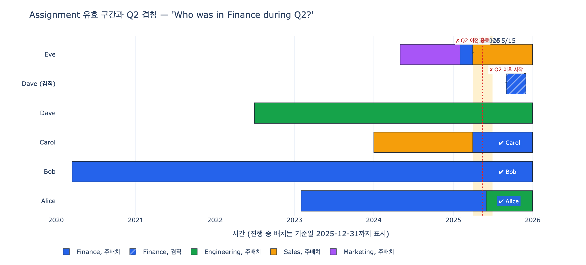

# `startDate` / `endDate`가 가능하게 하는 historical questions

## 질문과 정답

**Q.** `startDate`와 `endDate`가 가능하게 하는 historical questions 예는?

**A.** "Who was in Finance during Q2?"(2분기에 Finance에 있던 사람), "Which employees changed departments this year?"(올해 부서를 옮긴 직원) 같은 질문이다.

원문(Assignments 아티클)의 표현 그대로:

> With `startDate` and `endDate`, you can answer historical questions like:
> - "Who was in Finance during Q2?"
> - "Which employees changed departments this year?"

---

## 1. 왜 Assignment에 날짜가 붙는가

Assignment는 `Employee`, `Department`, `Position` 세 엔티티를 잇는 **junction entity**다.

```
Employee ──1:N──> Assignment ──N:1──> Department
                       │
                       └──N:1──> Position
```

| Property | Type | Identifier? |
|---|---|---|
| `assignmentId` | string | ✓ |
| `startDate` | date | |
| `endDate` | date | |
| `isPrimary` | boolean | |

핵심은 `startDate`/`endDate`가 **Employee의 속성도, Department의 속성도 아니라는 것**이다. "언제부터 언제까지"는 사람의 성질도 조직의 성질도 아니고, **그 둘이 연결된 사건(relationship)의 성질**이다. 그래서 관계 자체를 엔티티로 승격시키고 거기에 날짜를 붙인다.

만약 Employee에 `departmentId` 컬럼 하나만 두면, 부서를 옮기는 순간 이전 값은 덮어써져 사라진다. 그 모델이 답할 수 있는 질문은 오직 "지금 이 사람은 어디 소속인가?" 하나뿐이다.

## 2. 유효 구간(validity interval)

`startDate`와 `endDate`가 한 쌍이 되면 각 Assignment는 시간축 위의 **선분(구간)** 이 된다.

$$
a = [\,a.\text{start},\; a.\text{end}\,]
$$

이 구간을 **valid time**(유효 시간) 또는 **validity interval**이라 부른다. "이 배치가 현실에서 참이었던 기간"이라는 뜻이다. 이 한 가지 구조가 아래 세 종류의 질의를 전부 열어준다.

### 관례 1 — `endDate IS NULL` = 현재 진행 중

`endDate`가 비어 있으면 "아직 끝나지 않았다 = 지금도 유효하다"를 의미한다. 미래의 큰 날짜(`9999-12-31`)를 넣는 구현도 있지만, NULL은 "종료일을 아직 모른다"는 의미를 정직하게 표현한다. 대신 모든 비교식에서 NULL을 별도로 처리해야 한다(뒤의 조건식 참고).

원문의 표 "Which assignments are no longer active? → Assignment (`endDate` set ...)"가 바로 이 관례를 쓰고 있다. **`endDate`가 채워졌다 = 종료됐다.**

### 관례 2 — 반열린 구간 $[\text{start}, \text{end})$

닫힌 구간 $[\text{start}, \text{end}]$을 쓰면 A의 종료일과 B의 시작일이 같은 날 겹쳐 보인다. 3월 31일 퇴사 + 4월 1일 이동이면 문제없지만, 실무 데이터에서는 "3월 31일 종료, 3월 31일 시작"이 흔하다. 그러면 그 하루 동안 한 사람이 두 부서에 동시 소속인 것처럼 집계된다.

**반열린 구간**을 쓰면 이 경계 중복이 구조적으로 사라진다.

$$
[\,\text{start},\, \text{end}\,) = \{\, t \mid \text{start} \le t < \text{end} \,\}
$$

이렇게 하면 연속된 배치는 `prev.end == next.start`로 딱 맞물리고 겹치는 날이 하루도 없다. 대신 겹침 조건식의 등호가 빠진다(§3의 각주 참고). 어느 쪽을 쓰든 **모델 전체에서 하나로 통일**하는 것이 중요하다. 섞이면 경계 하루가 조용히 틀리고, 이런 오차는 테스트를 잘 통과한다.

## 3. 도출되는 질의 유형 세 가지

### (1) 시점 질의 — as-of

"**2025년 5월 15일 기준** 조직도를 보여줘."

특정 시점 $t$를 포함하는 Assignment만 고른다.

$$
a.\text{start} \le t \;\land\; (a.\text{end} = \text{NULL} \;\lor\; a.\text{end} \ge t)
$$

```sql
SELECT * FROM assignment
WHERE start_date <= '2025-05-15'
  AND (end_date IS NULL OR end_date >= '2025-05-15');
```

$t$ = 오늘이면 "현재 조직도", $t$ = 과거 날짜면 **그 시점의 조직 스냅샷**이다. 스냅샷을 따로 저장하지 않고도 임의 과거 시점을 재구성할 수 있다는 것이 이 구조의 값어치다.

### (2) 기간 겹침 질의 — period overlap

"**Who was in Finance during Q2?**" — 이 질문은 시점이 아니라 **기간** $[\,p_s,\, p_e\,]$(2025-04-01 ~ 2025-06-30)에 대한 것이다.

"during Q2"의 의미가 두 갈래로 갈린다는 점을 먼저 짚어야 한다.

- **겹침(overlap)**: Q2 중 단 하루라도 Finance에 있었으면 포함 — 보통 이쪽을 의도한다
- **포함(containment)**: Q2 전체를 Finance에서 보냈어야 포함 — 더 엄격

겹침 조건은 두 구간이 만나는지를 묻는 것이고, **여집합으로 유도하는 것이 가장 쉽다.** 두 구간이 겹치지 **않는** 경우는 둘뿐이다.

1. 배치가 기간보다 완전히 앞에서 끝난다: $a.\text{end} < p_s$
2. 배치가 기간보다 완전히 뒤에서 시작한다: $a.\text{start} > p_e$

이 둘을 부정하면(드모르간) 겹침 조건이 나온다.

$$
\lnot(a.\text{end} < p_s \lor a.\text{start} > p_e)
\;\equiv\;
a.\text{end} \ge p_s \;\land\; a.\text{start} \le p_e
$$

여기에 `endDate IS NULL`(= 아직 안 끝났으므로 어떤 $p_s$보다도 뒤) 처리를 더하면 실무에서 쓰는 최종 형태가 된다.

$$
\boxed{\;a.\text{start} \le p_e \;\land\; (a.\text{end} = \text{NULL} \;\lor\; a.\text{end} \ge p_s)\;}
$$

```sql
SELECT DISTINCT e.name
FROM assignment a
JOIN employee   e ON e.employee_id = a.employee_id
JOIN department d ON d.department_id = a.department_id
WHERE d.name = 'Finance'
  AND a.start_date <= '2025-06-30'                      -- p_e
  AND (a.end_date IS NULL OR a.end_date >= '2025-04-01'); -- p_s
```

기억할 짝: **시작은 기간 끝과, 끝은 기간 시작과 비교한다** (교차 비교). 같은 쪽끼리 비교하는 실수(`start >= p_s AND end <= p_e`)를 하면 그건 겹침이 아니라 **포함** 질의가 되어, Q2 도중에 들어온 사람과 Q2 전부터 계속 있던 사람이 조용히 빠진다.

> 반열린 구간 $[\text{start}, \text{end})$을 쓴다면 조건은 `a.start < p_e AND (a.end IS NULL OR a.end > p_s)`가 되고, 기간도 $[\,p_s,\, p_e\,) = $ `2025-04-01 ~ 2025-07-01`로 표기한다. 등호 위치만 다르고 유도 논리는 동일하다.

시점 질의는 $p_s = p_e = t$인 겹침 질의의 특수한 경우다. 즉 (1)은 (2)에 포함된다.

### (3) 변화 감지 질의 — change detection

"**Which employees changed departments this year?**" — 이건 한 레코드만 봐서는 답할 수 없다. **같은 직원의 Assignment를 시간순으로 줄 세워 이웃끼리 비교**해야 한다.

절차:

1. `employeeId`로 묶고 `startDate` 오름차순 정렬
2. 연속한 두 배치 $(a_i, a_{i+1})$에서 `departmentId`가 달라지는 지점을 찾는다
3. 그 전환 시점($a_{i+1}.\text{start}$)이 대상 연도 안에 있으면 "올해 부서를 옮긴 직원"

$$
\exists\, i:\; a_i.\text{dept} \ne a_{i+1}.\text{dept} \;\land\; a_{i+1}.\text{start} \in \text{올해}
$$

SQL에서는 윈도우 함수로 이웃을 끌어온다.

```sql
SELECT DISTINCT employee_id
FROM (
  SELECT employee_id, department_id, start_date,
         LAG(department_id) OVER (PARTITION BY employee_id ORDER BY start_date) AS prev_dept
  FROM assignment
  WHERE is_primary = TRUE          -- 겸직 노이즈 제거
) t
WHERE prev_dept IS NOT NULL
  AND prev_dept <> department_id
  AND start_date >= '2025-01-01';
```

원문의 그래프 경로 표에서 "Which employees changed roles in the last year? → Employee -> Assignment (**multiple records by date**) -> Position"이라고 쓴 것이 바로 이 "여러 레코드를 날짜로 비교"하는 패턴이다.

`isPrimary`를 걸러주는 이유: 겸직(한 시점에 두 배치가 동시 유효)이 있으면 정렬만으로는 "부서 이동"과 "부업 추가"가 구분되지 않는다. 주배치만 놓고 비교해야 조직 이동의 궤적이 하나의 선으로 나온다.

## 4. 세 유형을 한 표로

| 유형 | 입력 | 조건 | 예시 질문 |
|---|---|---|---|
| 시점 (as-of) | 날짜 $t$ | `start <= t AND (end IS NULL OR end >= t)` | 5월 15일자 조직도 |
| 기간 겹침 | 구간 $[p_s, p_e]$ | `start <= p_e AND (end IS NULL OR end >= p_s)` | Who was in Finance during Q2? |
| 변화 감지 | 대상 연도 | 직원별 정렬 후 이웃 dept 비교 | Which employees changed departments this year? |

파생 질의들도 모두 이 세 가지의 조합이다.

- "평균 재직 기간" → $\text{COALESCE}(\text{end}, \text{today}) - \text{start}$
- "부서별 월별 인원 추이" → 각 월 말일에 대해 as-of 질의 반복
- "종료된 배치" → `endDate IS NOT NULL` (원문의 "no longer active")
- "공석 기간" → Position에 대해 유효 Assignment가 없는 구간

## 5. temporal 모델링 용어와의 연결

이 패턴은 HR에만 있는 게 아니라 **temporal data modeling**의 표준 어휘를 갖고 있다.

| 용어 | 의미 | Assignment에서 |
|---|---|---|
| **valid time** | 사실이 현실 세계에서 참이었던 기간 | `startDate` ~ `endDate` |
| **transaction time** | 그 사실이 DB에 기록되어 있던 기간 | (이 모델엔 없음) |
| **bitemporal** | valid time + transaction time 둘 다 관리 | 소급 정정 이력까지 추적할 때 |
| **SCD Type 2** | 차원 변경 시 UPDATE 대신 새 행 삽입 + 유효기간 부여 | Assignment 행 추가 = 정확히 이것 |
| **temporal table** | SQL:2011 `PERIOD FOR`, `AS OF` 구문 | as-of 질의의 표준화 |

Assignment 패턴은 사실상 **차원 모델링의 SCD Type 2를 온톨로지 언어로 다시 쓴 것**이다. "직원의 부서를 UPDATE하지 말고, 이전 행에 `endDate`를 찍고 새 행을 INSERT한다" — 그게 곧 이력 보존이다.

**bitemporal**이 필요한 순간은 "3월에 소급 적용된 2월자 이동을 4월에 발견했을 때, 3월 시점의 보고서를 왜 다르게 나왔는지 설명해야 할 때"다. 그때는 `recordedAt` / `supersededAt` 같은 축이 하나 더 필요하다. 지금 모델은 valid time만 다루는 **단일 시간축(uni-temporal)** 모델이며, 대부분의 HR 질문은 이 수준으로 충분하다.

## 6. 이 구조가 없다면

`startDate`/`endDate` 없이 Employee에 현재 부서만 두면 **잃는 것은 "과거"가 아니라 "과거를 재구성할 능력"** 이다.

- "지난 분기 조직 스냅샷"을 만들 수 없다 — 현재 값만 있으므로 과거 어떤 시점의 인원 구성도 복원 불가
- **분기 마감 재현성이 깨진다** — Q2 보고서를 오늘 다시 돌리면 오늘의 조직으로 계산되어 그때와 숫자가 달라진다
- 재직 기간, 이동 빈도, 승진 리드타임 같은 **기간 기반 지표를 전혀 계산할 수 없다**
- 성과 리뷰를 부서에 귀속시킬 수 없다 — `reviewDate` 당시 어느 부서였는지 알 수 없어 "Which teams have many outstanding reviews?"가 **현재 부서로 잘못 집계**된다
- 감사·컴플라이언스 요구("이 시점에 이 데이터에 접근 권한이 있던 사람")에 답할 수 없다

특히 네 번째가 미묘하다. 부서를 옮긴 직원의 이전 부서 시절 리뷰가 **새 부서 실적으로 잡히면** 조직 성과 비교가 통째로 왜곡된다. 이걸 막으려면 리뷰를 집계할 때 `reviewDate`를 Assignment 구간에 매칭시켜야 하고, 그게 가능한 유일한 조건이 바로 `startDate`/`endDate`의 존재다.

한 줄 요약: **`startDate`/`endDate`는 두 개의 컬럼이 아니라, 시간축 전체를 질의 가능하게 만드는 하나의 좌표계다.**

## 시각화


