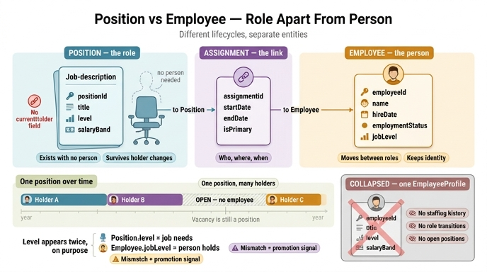

# Position이 담당하는 분리: 역할 vs 사람

## 카드 내용

- **Question**: Position 엔티티가 담당하는 분리(separation)는 무엇인가?
- **Answer**: role definition(직무 정의)을 그 직무에 현재 배치된 사람과 분리한다. Position은 역할 자체(title, level, salaryBand)를 나타내고 Employee는 사람을 나타낸다.

학습 자료의 한 문장이 이 카드의 원문이다.

> Position separates role definition from the person currently assigned to it.

## 핵심: 수명(lifecycle)이 다른 것은 같은 엔티티에 담지 않는다

"역할과 사람을 나누라"는 조언은 HR에만 국한된 규칙이 아니다. 온톨로지 설계의 일반 원칙 —
**서로 독립적으로 생성·변경·소멸하는 것은 별개의 엔티티다** — 가 HR 도메인에서 드러난 형태다.

두 개념의 수명을 나란히 놓아 보면 왜 하나로 묶을 수 없는지가 바로 보인다.

| | Position (역할) | Employee (사람) |
|---|---|---|
| 언제 생기는가 | 조직 설계·headcount 승인 시점 (사람 없이 먼저 생김) | 채용 확정·입사 시점 |
| 사람 없이 존재 가능? | **가능** — open position, 채용 요청(requisition), 미충원 headcount | 불가능 |
| 역할 없이 존재 가능? | — | **가능** — 입사 대기, 배치 전환 중, 퇴사자 이력 |
| 한 쪽이 여러 개를 가질 수 있나 | 한 Position을 시간에 따라 여러 사람이 거쳐 간다 | 한 사람이 커리어 동안 여러 Position을 거친다 |
| 사라지는 조건 | 조직 개편으로 직무가 폐지될 때 | 퇴사 (그래도 이력은 남는다) |

즉 "Senior Backend Engineer, L5, Band B3"라는 역할은 김OO이 그 자리에 있든, 공석이든, 다른 사람으로 교체되든
**같은 하나의 직무**로 남아 있어야 한다. 반대로 김OO이라는 사람은 그 자리를 떠나도 계속 같은 사람이다.
두 개념이 각자의 시계(clock)를 갖고 움직이므로, 하나의 레코드에 담으면 한쪽의 변경이 다른 쪽 정체성을 훼손한다.

## 어떤 속성이 어느 쪽에 귀속되는가 — 판별 기준

자료의 속성표를 근거로 보면 배치가 명확하다.

### Position

| Property | Type | Identifier? |
|---|---|---|
| `positionId` | string | ✓ |
| `title` | string | |
| `level` | enum | |
| `salaryBand` | string | |

### Employee

| Property | Type | Identifier? |
|---|---|---|
| `employeeId` | string | ✓ |
| `name` | string | |
| `hireDate` | date | |
| `employmentStatus` | enum | |
| `jobLevel` | enum | |

**판별 질문은 두 개다.**

1. *"그 자리에 앉은 사람이 바뀌어도 이 값이 그대로인가?"* → **그렇다면 Position 속성.**
   - `title`("Senior Backend Engineer"): 담당자가 교체돼도 직무명은 그대로 → Position.
   - `level`, `salaryBand`: 조직이 그 **자리**에 부여한 등급·보상 구간. 사람이 아니라 직무에 붙는 정책값 → Position.
2. *"그 사람이 다른 자리로 옮겨도 이 값이 따라다니는가?"* → **그렇다면 Employee 속성.**
   - `name`: 사람의 것 → Employee.
   - `hireDate`: 조직에 합류한 날. 부서·직무를 옮겨도 변하지 않는 사람의 사실 → Employee.
     (특정 자리에 앉은 날짜는 `hireDate`가 아니라 Assignment의 `startDate`다 — 이 둘을 혼동하면 안 된다.)
   - `employmentStatus`(active/on leave/terminated): 사람의 재직 상태. 직무의 상태가 아니다 → Employee.

정리하면 **"자리에 붙는 값" vs "사람에 붙는 값"** 이며, "언제부터 언제까지 그 사람이 그 자리에 있었나"는
어느 쪽에도 붙지 않고 뒤에 나오는 Assignment로 간다.

## Employee.jobLevel과 Position.level이 둘 다 있는 이유

처음 보면 중복처럼 느껴지지만, 서로 다른 것을 측정한다.

- `Position.level` = **그 직무가 요구하는 등급** (이 자리는 senior 급 일이다)
- `Employee.jobLevel` = **그 사람이 보유한 등급** (이 사람은 지금 mid 급이다)

둘을 분리해 두면 **불일치 자체가 의미 있는 신호**가 된다.

| 비교 결과 | 해석 | 실무 활용 |
|---|---|---|
| `employee.jobLevel` = `position.level` | 정상 매칭 | — |
| employee < position (사람 등급이 낮음) | senior 자리를 mid가 대행 중 | 승진 대기 후보, stretch assignment 추적, 보상 형평성 점검 |
| employee > position (사람 등급이 높음) | 과잉 배치·직무 미스매치 | 이탈 위험(flight risk), 재배치 검토 |
| Position만 있고 매칭된 Employee 없음 | 공석 | 채용 우선순위 |

만약 등급을 한 곳에만 두면 이 질문 자체를 던질 수 없다. Employee에만 두면 "이 자리가 원래 몇 급 자리인가"를
알 수 없어 공석의 채용 요건을 정의할 수 없고, Position에만 두면 "사람의 성장"을 표현할 수 없다
(자료의 예시 질의 `Department <- Assignment <- Employee (jobLevel=senior)`는 **사람 등급** 기준 집계임을 눈여겨볼 것).

## 합쳐서 "EmployeeProfile" 하나로 만들면 잃는 것

자료가 명시적으로 경고하는 세 가지다.

> If you collapse these concepts into one "EmployeeProfile" entity, you lose flexibility for:
> historical staffing changes / role transitions / open positions that exist before a hire

1. **historical staffing changes (배치 이력)** — 한 레코드에 현재 직무를 덮어쓰면 이전 값은 사라진다.
   "Who was in Finance during Q2?"에 답할 수 없다.
2. **role transitions (역할 전환)** — 승진·전배는 "같은 사람이 다른 자리로"라는 사건인데,
   합친 모델에서는 필드 UPDATE라 사건으로 남지 않는다.
3. **open positions (공석)** — 사람이 없으면 레코드가 없다. 채용 전에 존재해야 하는 직무를 표현할 방법이 사라지고,
   workforce planning(headcount 계획)이 불가능해진다. 이게 가장 치명적이다: 사람 중심 모델은
   **비어 있는 자리라는 개념 자체를 가질 수 없다.**

## 분리의 나머지 절반: 실제 배치는 Assignment가 담당한다

Position은 "역할이 무엇인가"만 정의한다. **"누가, 어디서, 언제부터 언제까지 그 역할을 수행했는가"는
Position이 아니라 Assignment의 일이다.** 그래서 Position에는 사람을 가리키는 외래키나 `currentHolder` 같은
필드가 없다 — 있다면 분리가 무너진다.

- `Employee` → `Assignment` (one-to-many)
- `Assignment` → `Department` (many-to-one)
- `Assignment` → `Position` (many-to-one)

| Assignment property | Type | Identifier? |
|---|---|---|
| `assignmentId` | string | ✓ |
| `startDate` | date | |
| `endDate` | date | |
| `isPrimary` | boolean | |

이렇게 세 층으로 나뉜 결과:

- **Position** = 역할의 정의 (사람 없이도 존재)
- **Employee** = 사람의 정체성 (직무 없이도 존재)
- **Assignment** = 둘의 **시간 구간 연결** (`startDate`/`endDate`로 이력이 누적)

Position 하나에 Assignment가 여러 개 달리면 "이 자리를 거쳐 간 사람들"이 되고,
Employee 하나에 여러 개 달리면 "이 사람의 커리어 경로"가 된다. Position에 연결된 활성 Assignment가
0개면 그게 곧 **공석**이다. 자료의 `Employee -> Assignment (multiple records by date) -> Position`
경로가 바로 역할 전환 추적이다.

## 한 줄 요약

Position은 **역할(자리)** 과 **사람** 을 분리한다. 둘의 수명이 다르기 때문이며 — 자리는 사람 없이 먼저 생기고,
사람은 여러 자리를 거친다 — 그 사이를 시간과 함께 잇는 일은 Assignment가 맡는다.

## 같이 보면 좋은 일반 패널

이 패턴은 도메인만 바꿔 반복된다: Student–Course를 Enrollment로, Customer–Product를 Order line item으로 잇는 것과 동일한
구조다. "정의(무엇)" · "주체(누구)" · "실현(언제·어떻게)"을 세 엔티티로 쪼개는 것이 재사용 가능한 설계 감각이다.

## 인포그래픽

