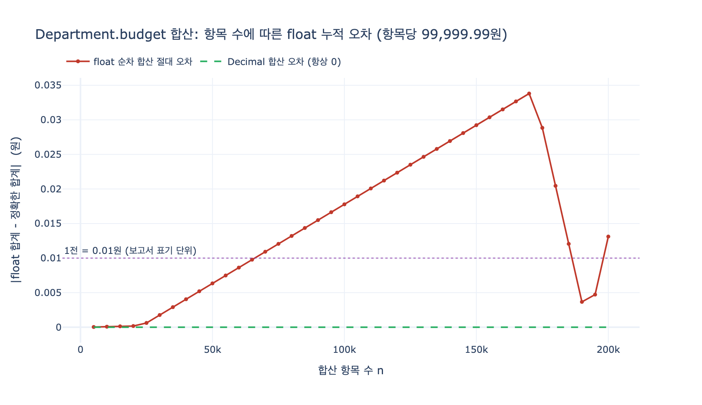

# Department의 `budget`을 decimal로 두는 이유

**Q.** Department의 `budget`을 decimal로 두는 이유는?

**A.** 금액이므로 정확한 소수 표현이 필요하다. float 계열은 반올림 오차가 누적되어 예산 집계에 부적절하다.

---

## 1. 출처 맥락: HR 온톨로지의 Department

학습 경로의 **Organization Core** 단계에서 Department는 다음과 같이 정의된다.

| Property | Type | Identifier? |
|---|---|---|
| `departmentId` | string | ✓ |
| `name` | string | |
| `budget` | **decimal** | |
| `status` | enum | |

그리고 아티클은 이 필드의 용도를 못 박아 둔다.

> Department budgets allow **resource planning** and **cost center analysis** from the same graph.

즉 `budget`은 "그냥 저장해 두는 숫자"가 아니라 **합산되고(롤업), 나눠지고(배분), 비교되는(예산 대비 실적) 숫자**다.
타입 선택의 기준은 "값을 담을 수 있는가"가 아니라 **"이 값으로 하는 산술이 회계적으로 정확한가"** 가 된다.

---

## 2. float은 왜 금액을 담지 못하는가 — 2진 분수 전개

`float`(대부분의 언어에서 IEEE 754 **binary64**)은 값을 이렇게 저장한다.

$$x = (-1)^{s} \times 1.f_{1}f_{2}\dots f_{52} \times 2^{e}$$

가수부(mantissa)가 **2진수 53비트**다. 따라서 binary64로 정확히 표현되는 값은
**분모가 2의 거듭제곱인 분수** $\dfrac{m}{2^{k}}$ 뿐이다.

금액은 십진 소수 $\dfrac{a}{10^{k}}$ 다. $10 = 2 \times 5$ 이므로 분모에 인수 **5** 가 남는다.

$$0.1 = \frac{1}{10} = \frac{1}{2 \times 5}$$

분모의 5는 어떤 $2^{k}$ 로도 나눠지지 않으므로, $0.1$ 의 2진 전개는 끝나지 않고 순환한다.

$$0.1_{10} = 0.0\,\overline{0011}_{2} = \frac{1}{16}+\frac{1}{32}+\frac{1}{256}+\frac{1}{512}+\cdots$$

53비트에서 잘린 결과, 실제로 메모리에 들어가는 값은 우리가 적은 `0.1`이 **아니다**.

```
0.1  실제 값 = 0.1000000000000000055511151231257827021181583404541015625
0.2  실제 값 = 0.200000000000000011102230246...
0.3  실제 값 = 0.299999999999999988897769754...
```

`0.1`은 살짝 크게, `0.3`은 살짝 작게 저장되므로

```
0.1 + 0.2 == 0.3   →   False        (0.1 + 0.2 는 0.30000000000000004)
```

`print(0.1)`이 `0.1`로 보이는 건 Python의 `repr`이 **"다시 읽으면 같은 float이 되는 가장 짧은 십진 표기"** 를
출력하기 때문이다. 오차는 사라진 게 아니라 표시에서 숨겨진다.

반대로 $0.5, 0.25, 0.125$ 처럼 분모가 $2^{k}$ 인 값은 float으로도 정확하다.
즉 "float은 소수를 못 담는다"가 아니라 **"float은 십진 소수를 못 담는다"** 가 정확한 진술이다.

> 참고: `float`은 **정수**는 $2^{53}$ 까지 정확하다. 그래서 `hireDate`를 epoch 초로 두거나
> headcount를 float으로 두는 것은(권장은 아니지만) 실무적으로 사고가 잘 안 난다.
> 금액만 유독 문제가 되는 이유는 금액이 **소수 두 자리를 갖는 십진 값**이라는 점 때문이다.

---

## 3. 오차가 예산 집계에서 누적되는 양상

### (a) 합산 — cost center 롤업

각 부동소수점 덧셈은 최대 $\tfrac{1}{2}\varepsilon$ 의 상대 오차를 만든다($\varepsilon = 2^{-52} \approx 2.22\times10^{-16}$).
$n$ 개 항목을 순차로 더하면 오차의 상한은 대략 다음과 같이 **항목 수에 비례해** 자란다.

$$\left|\hat{S}_{n} - S_{n}\right| \;\lesssim\; (n-1)\,\varepsilon \sum_{i}\left|x_{i}\right|$$

여기에 두 가지가 곱해져 실무에서는 생각보다 빨리 커진다.

- **금액의 절대 크기가 크다.** 예산은 억·조 단위다. $\sum|x_i|$ 가 $10^{9}$ 라면 ulp 자체가 $10^{-7}$ 수준이다.
- **항목 수가 많다.** 전사 cost center 롤업은 라인 아이템이 수만~수십만 건이다.

`expy.py` 실측: 항목당 `99,999.99`원 × 50,000건

```
float  합산 = 4999999499.99366        (오차 -0.00634...원)
Decimal 합산 = 4999999500.00           (오차 0, 정확한 값과 == True)
```

오차 0.006원은 "무시할 수 있는 크기"처럼 보인다. **그런데 표기 단위의 절반(0.005원)을 넘는 순간
반올림 결과가 바뀐다.**

```
round(float_sum, 2)  →  4999999499.99      ← 보고서에 찍히는 값
Decimal 합계          →  4999999500.00      ← 원장(ledger)의 값
```

총액 50억 원 규모의 보고서에서 **마지막 자리 1전이 안 맞는다**. 그리고 이 불일치는
`n`이 커질수록 확률이 높아진다 — 아래 시각화에서 오차가 0.01원 선을 넘는 지점이 $n \approx 70{,}000$ 이다.

`math.fsum` 같은 **보상 합산(compensated summation)** 은 합산 알고리즘의 오차만 없애 준다.
각 항목 자체가 이미 부정확한 float이라 근본 처방이 아니다. **입력 타입을 고치는 것이 처방이다.**

### (b) 비교와 등가 판정

집계 파이프라인은 늘 이런 검증을 한다.

```
sum(child.budget for child in children) == parent.budget      # 롤업 검증
allocated == budget                                            # 배분 완료 판정
budget - spent == 0                                            # 소진 판정
```

float에서는 이 `==` 들이 **정상 데이터인데도 False** 가 된다. 그러면 팀은
`abs(a - b) < 1e-6` 같은 허용 오차(epsilon) 비교를 도입하게 되고, 이 순간
"1원 차이는 오류인가 오차인가"를 코드가 판정할 수 없는 상태가 된다. 회계 시스템에서 최악의 상태다.

### (c) 배분(allocation)과 잔액

resource planning은 부서 예산을 팀·비목에 비율로 쪼갠다. 비율 합이 정확히
$\sum_i w_i = 1$ 이어도, 각 항목을 표기 단위로 반올림하면 합이 원금과 어긋난다.

$$\sum_{i} \mathrm{round}\!\left(B\,w_{i}\right) \;\ne\; B$$

100원을 3팀에 1/3씩 나누는 예:

```
Decimal:  33.33 + 33.33 + 33.33 = 99.99,   잔액 = 0.01        ← 정확히 1전
float  :  33.33 + 33.33 + 33.33         ,  잔액 = 0.010000000000005116
```

**두 방식 모두 잔액이 생긴다.** 잔액 자체는 반올림의 필연적 결과이고 타입 문제가 아니다.
차이는 그 잔액을 **다룰 수 있는지**다.

- Decimal: 잔액이 정확히 `Decimal("0.01")`. `잔액 == 0` 판정이 신뢰 가능하고,
  `quantize(Decimal("0.01"), rounding=ROUND_HALF_UP)` 로 반올림 규칙을 **명시**한 뒤
  largest-remainder 방식으로 특정 항목에 귀속시키면 `sum(alloc) == budget` 이 정확히 성립한다.
- float: 잔액이 `0.010000000000005116`. "잔액이 1전인가?"라는 질문 자체가 다시 부동소수점 비교 문제가 된다.

즉 decimal은 잔액을 없애 주는 게 아니라, **잔액을 정확히 측정하고 명시적으로 배정할 수 있게** 해 준다.

---

## 4. decimal은 어떻게 이를 회피하는가

`decimal`은 값을 **십진수로** 저장한다. 개념적으로 `(sign, 정수 계수, 10의 지수)` 삼조다.

$$x = (-1)^{s} \times c \times 10^{-q}$$

- $0.1$ 은 $(1, 10^{-1})$, 즉 계수 1 · 지수 $-1$ 로 **정확히** 표현된다. 순환도 절단도 없다.
- 두 방향의 구현이 있다.
  - **고정 소수점(fixed-point)**: SQL의 `DECIMAL(p, s)` / `NUMERIC(p, s)`.
    전체 유효숫자 $p$, 소수점 이하 자리수 $s$ 를 스키마에 고정한다. 금액에는 `DECIMAL(19, 4)` 등이 흔하다.
  - **십진 부동소수점(decimal floating point)**: IEEE 754-2008의 `decimal64` / `decimal128`,
    Python `decimal.Decimal`, Java `BigDecimal`. 지수가 움직이되 **밑이 10**이다.
- 반올림이 **명시적이고 선택 가능**하다. `ROUND_HALF_UP`(일반 상거래), `ROUND_HALF_EVEN`(banker's rounding, 통계적 편향 제거),
  `ROUND_DOWN` 등을 자리수와 함께 지정한다. float에는 이런 손잡이가 없다 — 반올림이 하드웨어에서 암묵적으로 일어난다.
- 스케일 안에서 표현되는 값끼리의 덧셈·뺄셈은 **정확**하다. 그래서 롤업 검증 `==` 이 성립한다.

주의할 점도 있다.

- `Decimal(0.1)` 은 **float을 경유하므로 오차가 그대로 들어온다**. 반드시 `Decimal("0.1")` — 문자열/정수로 만든다.
  DB 드라이버 설정에서 `NUMERIC` 컬럼이 Python `float`으로 역직렬화되지 않는지 확인해야 한다(가장 흔한 실수).
- **나눗셈은 여전히 부정확할 수 있다.** $1/3$ 은 십진으로도 순환한다. 정밀도(`getcontext().prec`)에서 잘린다.
  그래서 배분에는 반드시 `quantize` + 잔액 보정이 필요하다.
- 성능은 float보다 느리다(하드웨어 지원이 없으면 수십 배). 금액에는 정확성이 이기지만,
  대규모 통계·ML 피처 계산에는 부적합하다.

---

## 5. 대안: 통화를 정수 최소단위로 저장

또 하나의 정석은 금액을 **최소 통화 단위의 정수**로 저장하는 것이다 (USD는 cents, KRW는 원 또는 전).

```
12345.67 USD  →  1234567 (cents)
15000 KRW     →  15000   (원, minor unit = major unit)
```

- 덧셈·뺄셈·정수배가 **완전히 정확**하다. Python `int` 는 임의 정밀도라 오버플로도 없다.
- 스토리지가 작고 빠르다. Stripe 등 결제 API가 금액을 정수 minor unit으로 주고받는 이유다.
- 단점: **통화별 소수 자리수(exponent)를 애플리케이션이 알아야 한다.** JPY·KRW는 0자리, USD는 2자리,
  BHD·KWD는 3자리다. "1500"이 무슨 뜻인지 값만 봐서는 모른다 — 스키마에 통화와 단위가 함께 있어야 한다.
- 나눗셈·비율 배분에서는 여전히 반올림 정책과 잔액 보정이 필요하다. decimal과 같은 숙제가 남는다.
- **온톨로지/스키마 문서로서는 decimal이 낫다.** `budget: decimal`은 도메인의 의미(금액, 소수 표현 필요)를
  타입 자체로 선언한다. `budget: long`은 단위 규약을 주석이나 컬럼명(`budget_minor`)으로 밀어낸다.
  그래서 이 학습 경로처럼 **개념 모델 계층**에서는 `decimal`이 자연스러운 선택이다.

---

## 6. 왜 감사(audit) 관점에서 1원 차이가 문제인가

`budget`은 **cost center analysis**와 **resource planning**의 입력이다. 이 문맥에서 1원 불일치는 이렇게 번진다.

- **롤업 정합성 깨짐**: 팀 예산의 합 ≠ 부서 예산, 부서 예산의 합 ≠ 전사 예산.
  감사인이 가장 먼저 돌리는 검증이 이 tie-out이고, 여기서 어긋나면 "계산 통제(control)가 없다"는 지적이 된다.
- **재현 불가능성**: float 덧셈은 결합법칙이 성립하지 않는다($\;(a+b)+c \ne a+(b+c)$).
  집계 순서가 바뀌면(병렬 집계, 파티션 순서 변경, 인덱스 변경) **같은 데이터에서 다른 총액**이 나온다.
  감사의 핵심 요구는 "같은 입력 → 같은 출력"인데 이것이 무너진다.
- **차이의 성격을 판정할 수 없음**: 1원 차이가 반올림 오차인지 **누락된 전표나 부정 거래인지**를
  시스템이 구분하지 못한다. 오차를 허용 오차로 덮는 순간, 실제 문제도 같이 덮인다.
- **하류 파생값 오염**: 예산 소진율(`spent / budget`), 부서별 인당 예산, 승인 임계값(`budget > threshold`) 판정 등이
  경계에서 뒤집힌다. 임계값 근처에서 승인/반려가 갈리면 그것은 오차가 아니라 **잘못된 의사결정**이다.
- **외부 기록과의 대조 실패**: 예산은 결국 회계 원장·계약서·급여 대장과 맞춰져야 하는 값이다.
  그 시스템들은 decimal(또는 정수 minor unit)로 정확히 계산하므로, float 쪽만 어긋난다.

정리하면 float은 **틀린 답을 주는 것이 아니라, 답이 맞는지 검증할 수 없게 만든다.**
감사 대상 숫자에서는 그것이 실질적으로 같은 문제다.

---

## 7. 한 줄 요약과 비교표

| | `float` (binary64) | `decimal` (fixed / decimal128) | 정수 최소단위 |
|---|---|---|---|
| `0.1` 표현 | 부정확(2진 순환 절단) | 정확 | 정확(=10 cents) |
| 합산 정확도 | $O(n\varepsilon)$ 오차 누적 | 스케일 내에서 정확 | 정확 |
| 결합법칙 / 순서 무관 | 성립 안 함 | 성립 | 성립 |
| `sum == total` 검증 | 오판 발생 | 신뢰 가능 | 신뢰 가능 |
| 반올림 제어 | 암묵적, 지정 불가 | `quantize` + 규칙 명시 | 직접 구현 |
| 나눗셈/배분 | 잔액도 부정확 | 잔액이 정확 → 보정 가능 | 잔액이 정확 → 보정 가능 |
| 스키마 자기설명력 | 낮음 | 높음 (`decimal(19,4)`) | 낮음(단위 규약 필요) |
| 속도 | 가장 빠름 | 느림 | 빠름 |

**결론:** `Department.budget`은 십진 소수로 정의된 금액이고, 합산·배분·비교를 거쳐 감사 대상 숫자가 된다.
float은 십진 소수를 애초에 정확히 담지 못하고 그 오차가 항목 수에 비례해 누적되므로,
`decimal`로 선언해 표현·반올림·검증을 모두 명시적으로 통제한다.

---

## 시각화



항목당 `99,999.99`원을 순차 float 합산했을 때의 절대 오차. 오차는 반올림 방향에 따라
톱니처럼 흔들리지만 상한은 $n$ 에 비례해 자라고, $n \approx 70{,}000$ 부근에서
보고서 표기 단위인 **1전(0.01원)** 선을 넘어선다. Decimal 합산의 오차는 전 구간에서 정확히 0이다.
