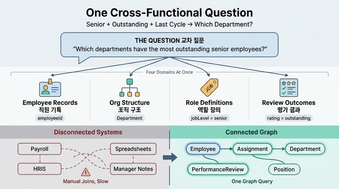

# 이 경로가 제시하는 대표적인 교차 질문(cross-functional question)

## 정답

> **"Which departments have the highest number of senior employees rated outstanding in the last review cycle?"**
>
> (마지막 평가 주기에서 outstanding 등급을 받은 senior 직원이 가장 많은 부서는?)

HR System 학습 경로의 첫 아티클 **Scenario Overview**가 "왜 온톨로지가 필요한가"를 설명하기 위해 제시하는 대표 질문이다.

---

## 왜 이 질문이 "교차(cross-functional)" 질문인가

이 한 문장을 조각내면, 서로 다른 **4개 영역**의 데이터를 동시에 요구한다.

| 질문 조각 | 참조하는 영역 | 대응 엔티티 / 속성 |
|---|---|---|
| "Which **departments**" | org structure (조직 구조) | `Department` (`departmentId`, `name`) |
| "**senior** employees" | role definitions (역할 정의) | `Employee.jobLevel` / `Position.level` |
| "**employees**" | employee records (직원 기록) | `Employee` (`employeeId`, `employmentStatus`) |
| "rated **outstanding** in the **last review cycle**" | review outcomes (평가 결과) | `PerformanceReview` (`rating`, `reviewPeriod`, `reviewDate`) |

원문 표현 그대로:

> A question like "Which departments have the highest number of senior employees rated outstanding in the last review cycle?" **crosses employee records, org structure, role definitions, and review outcomes.**

즉 어느 한 시스템(급여 도구, HRIS, 스프레드시트, 매니저 메모)만으로는 답할 수 없고, 네 영역을 모두 이어붙여야 비로소 답이 나오는 질문이다.

---

## 온톨로지가 바꿔놓는 것: manual joins → connected graph query

시나리오의 전제는 **데이터가 흩어져 있다는 것**이다.

> Data currently lives across payroll tools, HRIS, spreadsheets, and manager notes.

### Before — disconnected systems

- 직원 명부는 HRIS, 등급/레벨은 스프레드시트, 평가 결과는 매니저 메모, 부서 예산은 급여 도구
- 답을 얻으려면 사람이 직접 export → VLOOKUP/수동 조인 → 집계
- 조인 키가 시스템마다 달라(email, 사번, 이름) 매번 깨진다 → 그래서 경로 2장에서 **`employeeId` 같은 안정적 식별자(stable identifier)** 를 강조한다

### After — connected graph

온톨로지에서는 같은 질문이 **하나의 그래프 경로 탐색**이 된다.

```
Department <- Assignment <- Employee (jobLevel = senior)
                              |
                              v
                        PerformanceReview (rating = outstanding,
                                           reviewPeriod = 최근 주기)
```

원문의 표현:

> With an ontology, this becomes a **connected graph query instead of manual joins across disconnected systems**.

이 문장이 카드의 핵심 논지다. 교차 질문은 "어려운 질문"이 아니라, **모델이 연결돼 있으면 쉬워지는 질문**이다.

---

## 이 질문이 학습 경로 전체를 설계한다

대표 질문은 단순한 동기부여용 문구가 아니라, 4단계 커리큘럼의 **설계 명세서** 역할을 한다.

| Step | 추가되는 엔티티 | 대표 질문의 어느 조각을 해결하나 |
|---|---|---|
| 1 | Employee, Department, Position | "departments", "senior" — 사람 / 조직 단위 / 역할을 분리 |
| 2 | + Assignment | 직원을 부서·직무에 **시점과 함께** 연결 (staffing history) |
| 3 | + PerformanceReview | "rated outstanding in the last review cycle" |
| 4 | Complete model | 4개 조각을 한 그래프 경로로 종단 질의 |

또한 질문 안의 어휘가 곧 모델링 기법으로 직결된다.

- **"senior"**, **"outstanding"** → 값이 자유 문자열이면 집계가 불가능하다 → **enum values** 로 통제
- **"in the last review cycle"** → 시간 축이 필요하다 → **temporal properties** (`reviewDate`, `reviewPeriod`, `startDate`/`endDate`)
- **"departments … employees"** → 다대다 + 이력 → **junction entity** (`Assignment`)
- 시스템 간 결합 → **stable identifiers** (`employeeId`, `departmentId`, `positionId`)

---

## 왜 Assignment 없이는 답이 안 나오는가

"어느 부서의 senior 직원"을 세려면 직원과 부서 사이의 연결이 필요하다. 그런데 그 연결은 **시간에 따라 변한다.**

- 직원은 부서·직무를 옮긴다
- 부서는 여러 직원을 갖는다
- 하나의 직무는 시기별로 다른 사람이 채운다

따라서 `Employee.departmentName` 같은 단일 필드로는 "마지막 평가 주기 당시 어느 부서였는가"를 재현할 수 없다. `Assignment`가 `startDate` / `endDate` / `isPrimary`를 들고 있기 때문에, 평가 시점의 소속을 정확히 되짚어 집계할 수 있다.

---

## 관련된 다른 그래프 질문 (Complete HR Model)

대표 질문은 아래 질문들의 **합성판**에 가깝다.

| 질문 | 그래프 경로 |
|---|---|
| Which departments have the most senior employees? | `Department <- Assignment <- Employee (jobLevel=senior)` |
| Which employees changed roles in the last year? | `Employee -> Assignment (날짜별 복수 레코드) -> Position` |
| Which teams have many outstanding reviews? | `Department <- Assignment <- Employee -> PerformanceReview (rating=outstanding)` |
| Which assignments are no longer active? | `Assignment (endDate 존재 또는 isPrimary=false)` |

3행(`outstanding reviews`)과 1행(`senior employees`)을 겹치고 "last review cycle" 조건을 더하면 정확히 대표 질문이 된다.

---

## 암기 포인트

- 대표 교차 질문 = **"Which departments have the highest number of senior employees rated outstanding in the last review cycle?"**
- 교차하는 4개 영역 = **employee records / org structure / role definitions / review outcomes**
- 온톨로지의 효과 = **manual joins across disconnected systems → connected graph query**

## 인포그래픽


