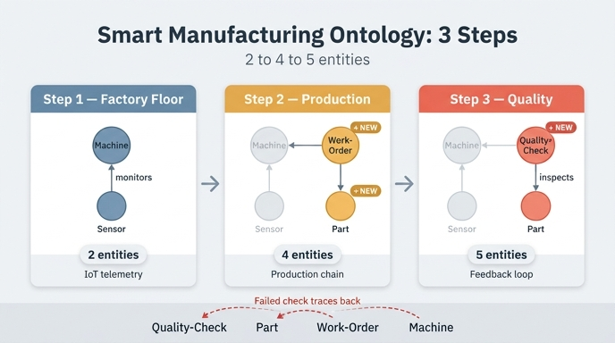

# Smart Manufacturing 경로의 3단계 구성

## 핵심 답

**3단계**로 구성되며, 각 단계마다 엔티티가 누적적으로 추가된다.

| 단계 | 추가되는 엔티티 | 누적 엔티티 수 | 핵심 개념 |
|---|---|---|---|
| 1 | Machine, Sensor | 2 | IoT 계층, 텔레메트리 |
| 2 | + Work-Order, Part | 4 | 생산 체인, 공차(tolerance) |
| 3 | + Quality-Check | 5 | 피드백 루프, 검사 |

최종 결과물은 **엔티티 5개, 관계 5개**로 이루어진 온톨로지다.

---

## 왜 이 순서인가

경로 전체는 "센서 모니터링 → 생산 추적 → 품질 검사"라는 공장의 실제 흐름을 그대로 따라간다. 한 번에 5개를 다 던지지 않고 2 → 4 → 5로 쌓아 올리는 이유는, 각 단계가 **직전 단계 없이는 성립하지 않는 관계**를 도입하기 때문이다.

### 1단계 — Factory Floor (Machine, Sensor)

공장 바닥에 "무엇이 돌아가고 있고, 그것이 무엇을 보고하는가"를 먼저 정의한다.

- **Machine**: `machineId`(식별자), `name`, `type`, `status`, `installDate`
  - `status`는 `running` / `idle` / `maintenance` / `offline` 같은 실시간 운영 상태를 추적한다. 실시간 대시보드와 정비 스케줄링의 기반.
- **Sensor**: `sensorId`(식별자), `type`, `unit`, `lastReading`, `threshold`
  - `threshold`는 경보 경계선. `lastReading > threshold`이면 알람이 발생한다 — 예지 정비(predictive maintenance)의 기본 패턴.

관계는 하나뿐이다.

- **monitors** — `Sensor` → `Machine` (다대일). 온도용·진동용 등 여러 센서가 같은 기계를 감시한다.

> IoT 온톨로지에서 센서는 기계에 **속한다**. 방향이 중요하다: 센서가 기계를 monitors 하는 것이지 그 반대가 아니다. 이 부모-자식 계층이 IoT 플랫폼이 텔레메트리를 조직하는 방식이다.

### 2단계 — Production Tracking (+ Work-Order, Part)

센서는 기계가 *어떻게* 동작하는지 알려주지만, *무엇을* 만들고 있는지는 알려주지 않는다. 여기서 생산 추적이 붙는다.

- **Work-Order**: `workOrderId`(식별자), `priority`, `status`, `startDate`, `dueDate`
  - `startDate` + `dueDate` 이중 날짜 속성으로 납기 준수(schedule adherence)를 계산할 수 있다.
- **Part**: `partId`(식별자), `name`, `material`, `weight`, `tolerance`
  - `tolerance`는 허용 가능한 제조 편차. 공차가 빡빡한 부품일수록 더 정밀한 기계가 필요하므로, 생산 계획의 핵심 제약이 된다.

추가되는 관계 3개:

- **assigned_to** — `Work-Order` → `Machine` (다대일)
- **produces** — `Work-Order` → `Part` (일대다)
- **has_part** — `Machine` → `Part` (일대다, 산출물 관점)

> **생산 체인**: `Machine ← Work-Order → Part`. 스케줄링 엔티티(Work-Order)가 장비와 산출물을 이어준다. 헬스케어 경로에서 Appointment가 Patient와 Provider를 잇던 것과 같은 구조 — 가운데 엔티티가 "사건(event)"을 표현한다.

### 3단계 — Complete Factory Model (+ Quality-Check)

부품은 만들어지는 것으로 끝나지 않고 검사되어야 한다. Quality-Check가 생산 사이클을 닫는다.

- **Quality-Check**: `checkId`(식별자), `inspector`, `checkDate`, `passed`, `defectCode`
  - `passed`(boolean)가 결정적 속성이다. 출하냐 재작업이냐를 가르는 명확한 분기점.
  - `defectCode`는 실패를 유형화해 근본 원인 분석(root cause analysis)을 가능하게 한다.

추가되는 관계 1개:

- **inspects** — `Quality-Check` → `Part` (다대일). 한 부품이 여러 번 검사받을 수 있다(최초 검사, 재작업 후 재검사).

> **피드백 루프**: 검사가 실패하면 생산 체인이 역방향으로 추적된다. `Quality-Check (passed=false) → Part → Work-Order → Machine`. 이것이 스마트 팩토리가 문제 있는 기계를 찾아내고 품질을 개선하는 방식이다.

---

## 관계 5개 정리

| # | 관계 | 방향 | 카디널리티 | 도입 단계 |
|---|---|---|---|---|
| 1 | monitors | Sensor → Machine | 다대일 | 1 |
| 2 | assigned_to | Work-Order → Machine | 다대일 | 2 |
| 3 | produces | Work-Order → Part | 일대다 | 2 |
| 4 | has_part | Machine → Part | 일대다 | 2 |
| 5 | inspects | Quality-Check → Part | 다대일 | 3 |

---

## 완성 모델이 답할 수 있는 질문

시나리오 도입부의 동기 질문이 바로 **"지난주 이상 센서 값을 보인 기계 중, 품질 검사에 실패한 부품을 생산한 기계는?"** 이었다. 이 질문은 IoT 텔레메트리 · 생산 스케줄 · 부품 추적 · 검사 기록을 모두 가로지른다.

| 질문 | 그래프 경로 |
|---|---|
| 검사 실패 부품을 만든 기계는? | Machine → Part ← Quality-Check (passed=false) |
| 불량 생산 시점에 이상했던 센서는? | Sensor → Machine → Part ← Quality-Check (passed=false) |
| 작업지시 우선순위별 불량률은? | Work-Order (priority) → Part ← Quality-Check |
| 재검사가 필요한 부품은? | Part ← Quality-Check (passed=false, count > 1) |

GQL로 센서 이상과 품질 실패를 상관 분석하면:

```gql
MATCH (s:Sensor)-[:monitors]->(m:Machine)-[:has_part]->(p:Part)<-[:inspects]-(qc:QualityCheck)
WHERE s.lastReading > s.threshold AND qc.passed = false
RETURN m.name, s.type, s.lastReading, p.name, qc.defectCode
```

한 줄의 쿼리가 4개 도메인(IoT, MES, ERP, QMS)을 가로지른다 — 단계적으로 쌓아 올린 5개 엔티티가 만들어낸 결과다.

---

## 암기 팁

- **2 → 4 → 5**: 추가 개수는 2개 → 2개 → 1개. 마지막 단계만 엔티티 하나다.
- 단계 이름으로 기억하기: **Factory Floor**(감시) → **Production Tracking**(생산) → **Complete Factory Model**(검사).
- 각 단계의 한 단어 키워드: **텔레메트리 → 생산 체인 → 피드백 루프**.

## 인포그래픽


