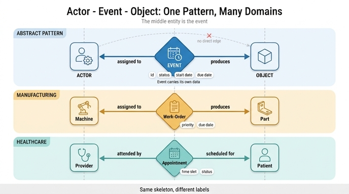

# Production chain — 이벤트 엔티티가 가운데 서는 패턴

## 카드 내용

- **Question**: `Machine ← Work-Order → Part` 체인이 나타내는 패턴은?
- **Answer**: **production chain**으로, 설비와 산출물을 스케줄링 엔티티를 통해 연결하는 패턴이다. Healthcare에서 Appointment가 Patient와 Provider를 잇는 것과 같이 가운데 엔티티가 **이벤트**를 나타낸다.

## 학습 자료 원문

Smart Manufacturing 경로의 "Production Tracking" 단계에 나오는 문장이다.

> **Production chain:** The chain `Machine ← Work-Order → Part` connects equipment to output through a scheduling entity. This is similar to how Appointment connects Patient and Provider in healthcare — the middle entity represents the event.

핵심 takeaway로도 반복된다: *"Production chains connect equipment to output through scheduling entities."*

## 화살표 방향부터 읽기

체인 표기가 `←`와 `→`로 갈라지는 이유는 **양쪽 관계가 모두 Work-Order에서 출발**하기 때문이다.

| 관계 | 방향 | 카디널리티 | 의미 |
|---|---|---|---|
| `assigned_to` | Work-Order → Machine | many-to-one | 작업 지시가 특정 설비에 배정된다 |
| `produces` | Work-Order → Part | one-to-many | 작업 지시가 하나 이상의 부품을 만든다 |

즉 Work-Order는 두 화살표의 **꼬리(tail)** 이자, 그래프상 두 실체를 잇는 **허브**다. 이런 모양을 fan-out 중심의 junction/associative entity라고 부른다.

참고로 자료에는 `has_part` — `Machine → Part` (one-to-many) 라는 **직접 간선도 함께** 존재한다. "출력 관점(the output perspective)"의 지름길이며, `Sensor → Machine → Part ← Quality-Check` 같은 질의를 짧게 쓰기 위한 것이다. 하지만 이 지름길만 남기고 Work-Order를 지우면 아래에서 설명할 정보가 통째로 사라진다.

## 왜 `Machine ↔ Part` 직접 연결로는 부족한가

### 1. 간선에는 속성을 매달 수 없다 (또는 매달아도 관리가 안 된다)

Work-Order는 그 자체로 풍부한 속성을 가진다.

| Property | Type | 이 속성이 답하는 질문 |
|---|---|---|
| `workOrderId` | string (identifier) | 이 생산 건을 어떻게 지목하는가 |
| `priority` | string | 어느 작업을 먼저 돌리는가 |
| `status` | string | 지금 대기·진행·완료 중 어디인가 |
| `startDate` | date | 언제 착수했는가 |
| `dueDate` | date | 납기를 지켰는가 |

`Machine → Part` 직접 간선에 이 다섯 개를 우겨넣으면, "우선순위가 높은 작업의 불량률"이나 "납기 지연 건수" 같은 질의가 간선 속성 탐색으로 밀려난다. 자료의 질의 표에 있는 **"What is the defect rate by work order priority?" → `Work-Order (priority) → Part ← Quality-Check`** 는 Work-Order가 **노드**여야만 자연스럽게 표현된다.

### 2. 이벤트에는 고유 정체성(identity)이 있다

`workOrderId`가 식별자라는 사실이 결정적이다. 같은 설비가 같은 부품 번호를 **여러 번, 서로 다른 시점에** 만들 수 있다. 직접 간선 모델에서 (CNC-01, Bracket-A)는 단 하나의 선이지만, 현실에서는 3월 배치와 5월 배치가 별개의 사건이다. Work-Order 노드는 이 배치들을 각각 독립된 개체로 붙잡아 준다.

### 3. 다대다를 분해한다

`assigned_to`는 many-to-one, `produces`는 one-to-many다. 두 개를 이으면 Machine과 Part 사이에는 결과적으로 **many-to-many**가 생긴다. 중간 엔티티는 이 다대다를 두 개의 깔끔한 일대다로 정규화하는 고전적 장치다.

### 4. 추적 경로(traceability)를 만든다

Quality-Check가 추가되면 자료가 말하는 feedback loop가 성립한다.

> `Quality-Check (passed=false) → Part → Work-Order → Machine`

불량이 났을 때 "어느 설비"뿐 아니라 **"어느 작업 지시, 어느 우선순위, 어느 납기 압박 아래에서"** 만들어졌는지까지 되짚을 수 있다. 중간 엔티티가 없으면 근본 원인 분석의 해상도가 설비 단위로 뭉개진다.

## 도메인을 가로지르는 동일 패턴

가운데 이벤트 엔티티는 이 리포지토리의 모든 학습 경로에서 반복된다. 라벨만 다를 뿐 골격은 같다.

| 도메인 | 왼쪽 (행위자/자원) | 가운데 (이벤트) | 오른쪽 (대상/산출물) | 이벤트가 나르는 속성 |
|---|---|---|---|---|
| Manufacturing | Machine | **Work-Order** | Part | priority, status, startDate, dueDate |
| Healthcare | Provider | **Appointment** | Patient | 일시, 진료 사유, 상태 |
| HR | Employee | **Assignment** | Department / Position | startDate, endDate |
| Commerce | Customer | **Order** | Product | 주문일, 금액, 배송 상태 |

추상화하면 이렇다.

```
Actor  ←  Event  →  Object
```

이 패턴을 알아보면 새 도메인을 모델링할 때 질문이 단순해진다. **"이 두 실체를 잇는 사건에 이름과 날짜와 상태가 있는가?"** 있다면 노드로 승격시킨다.

> 세부 어휘 정리: 관계 자체를 실체화한 것을 **reified relationship**, 다대다를 푸는 표를 **associative/junction entity**, 시간 위에 일어난 일을 강조할 때 **event entity**라고 부른다. Work-Order는 세 성격을 모두 가진다. 자료에서는 스케줄 정보를 담는다는 점을 강조해 **scheduling entity**라고 표현했다.

## 언제 중간 엔티티를 만들지 **않는가**

패턴을 알았다고 모든 간선을 노드로 바꾸면 그래프가 불필요하게 비대해진다. 다음 경우에는 직접 관계가 낫다.

- **속성이 없는 순수 소속 관계**. 같은 경로의 `monitors` — `Sensor → Machine`이 예다. 어떤 센서가 어떤 설비에 붙어 있다는 사실 외에 매달 정보가 없으므로 중간 엔티티가 필요 없다. IoT 계층은 그냥 부모-자식이다.
- **사건에 고유 식별자가 없을 때**. 두 실체의 쌍만으로 유일하게 결정되고 재발하지 않는다면, 노드로 만들 근거가 약하다.
- **시간에 따라 변하지 않는 관계**. 시작·종료 시점이나 상태 전이가 없다면 이벤트라 부를 것이 없다.
- **어떤 질의도 그 사건을 주어로 삼지 않을 때**. "완료된 작업 지시 수"처럼 사건 자체를 세거나 필터링하는 질의가 없다면 간선으로 충분하다.
- **이미 짧은 지름길 간선으로 충분한 조회**. `has_part` (`Machine → Part`)가 그 예다. 다만 이건 Work-Order를 **대체**하는 게 아니라 **보조**하는 파생 관계다. 자주 도는 경로를 짧게 쓰려고 남겨둔 것이며, 원본 사실은 여전히 Work-Order가 보유한다.

판단 기준을 한 줄로: **"이 관계가 언제·왜·어떤 상태로 일어났는지 물어볼 일이 있는가?"** 예이면 이벤트 엔티티, 아니면 간선.

## 이 카드가 요구하는 답의 요소

1. 패턴 이름 — **production chain**
2. 구조 — 설비(Machine)와 산출물(Part)을 **스케줄링 엔티티**(Work-Order)를 통해 연결
3. 일반화 — Healthcare의 Appointment(Patient ↔ Provider)와 동형이며, 가운데 엔티티가 **이벤트**를 표상한다

## 인포그래픽


