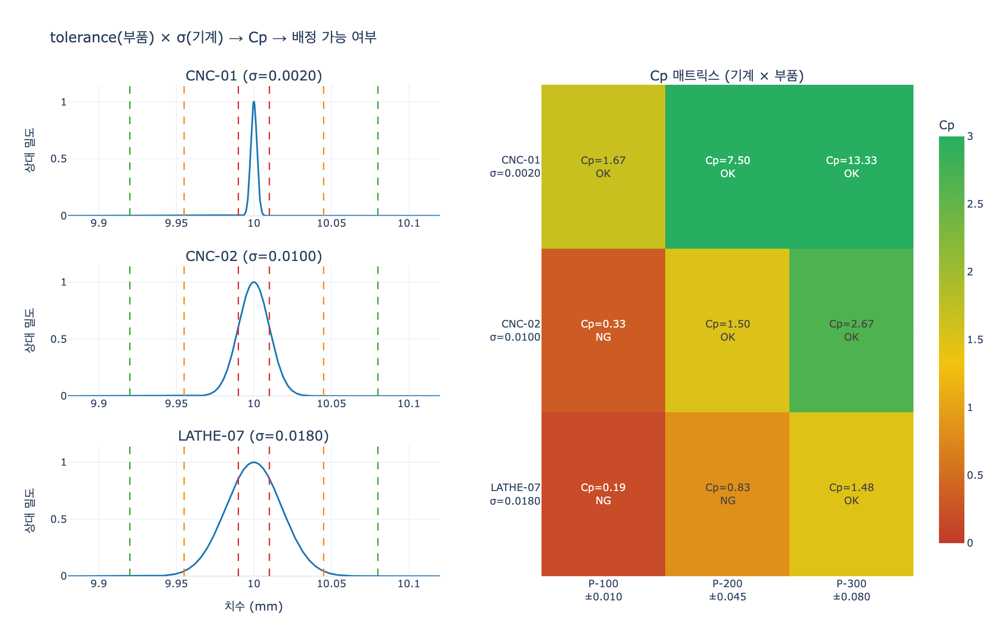

# tolerance가 생산 계획의 핵심 제약이 되는 이유

**Q.** tolerance가 생산 계획의 핵심 제약이 되는 이유는?

**A.** 공차가 더 좁은(tighter) 부품일수록 더 높은 정밀도의 기계가 필요하기 때문이다. 따라서 tolerance는 어떤 부품을 어떤 기계에 배정할지 결정하는 제약이 된다.

---

## 1. 원문에서의 위치

Smart Manufacturing 학습 경로의 **Production Tracking** 단계에서 `Part` 엔티티를 정의할 때 등장한다.

| Property | Type | Identifier? |
|---|---|---|
| `partId` | string | ✓ |
| `name` | string | |
| `material` | string | |
| `weight` | float | |
| `tolerance` | float | |

> The `tolerance` property defines acceptable manufacturing deviation. Parts with tighter tolerances need higher-precision machines — **a key production planning constraint.**

즉 `tolerance`는 "부품 설명용 메타데이터"가 아니라, 그 다음 단계에서 만들어질 관계인
`Work-Order --assigned_to--> Machine` 을 **어떻게 맺을 수 있는지 제한하는 값**이다.

---

## 2. tolerance란 무엇인가

`tolerance`(공차)는 **부품의 실제 치수가 설계 치수로부터 벗어나도 되는 허용 범위**다.

- 목표 치수(nominal) $\mu_0$, 허용 편차 $T$ 라면
- 규격 하한 $LSL = \mu_0 - T$, 규격 상한 $USL = \mu_0 + T$
- 예: `10.000 ± 0.010 mm` → 9.990 ~ 10.010 mm 안에 들어와야 합격

중요한 감각 하나: **tolerance가 "좁다(tight)"는 것은 숫자가 작다는 뜻이고, 그만큼 만들기 어렵다는 뜻**이다.
±0.080 mm 부품은 아무 선반으로도 만들 수 있지만, ±0.010 mm 부품은 그렇지 않다.

---

## 3. 왜 "좁은 공차 = 더 정밀한 기계"인가

기계는 완벽하게 같은 치수를 반복 생산하지 못한다. 공구 마모, 열변형, 진동, 클램핑 편차 때문에
실제 가공 치수는 목표값 주변으로 **산포(variation)** 를 가진다. 이를 정규분포로 근사한다.

$$X \sim \mathcal{N}(\mu_0,\ \sigma^2)$$

여기서 $\sigma$가 그 기계의 **공정 산포 = 정밀도 지표**다. $\sigma$가 작을수록 고정밀 기계다.

제조 현장에서는 "이 기계로 이 부품을 만들 수 있는가"를 **공정 능력 지수(Process Capability Index)** 로 판단한다.

$$C_p = \frac{USL - LSL}{6\sigma} = \frac{2T}{6\sigma} = \frac{T}{3\sigma}$$

이 식이 핵심이다. $C_p$는 **부품의 tolerance $T$ 와 기계의 정밀도 $\sigma$ 의 비율**이다.

- 분자 $T$가 절반이 되면 $C_p$도 절반이 된다.
- 같은 $C_p$를 유지하려면 $\sigma$도 절반이 되어야 한다. 즉 **더 정밀한 기계가 필요**하다.

이를 뒤집으면 배정 조건이 나온다. 업계 관례상 $C_p \ge 1.33$ (4-sigma 수준)을 "공정 능력 있음"으로 보므로,

$$\sigma_{\max} = \frac{T}{3 \times 1.33}$$

**부품의 공차가 정해지면, 그 부품을 만들 수 있는 기계의 정밀도 상한이 자동으로 정해진다.**

---

## 4. 어긋나면 어떻게 되는가 — 수율

$C_p$가 낮으면 단순히 "조금 나쁜" 정도가 아니라 불량률이 폭발한다. 합격 확률(수율)은

$$\text{yield} = \Phi\!\left(\frac{T}{\sigma}\right) - \Phi\!\left(\frac{-T}{\sigma}\right) = 2\Phi(3C_p) - 1$$

| $C_p$ | 수율 | 불량 (ppm) |
|---|---|---|
| 0.33 (1σ) | 68.3 % | 317,000 |
| 0.67 (2σ) | 95.4 % | 45,500 |
| 1.00 (3σ) | 99.73 % | 2,700 |
| 1.33 (4σ) | 99.9937 % | 63 |
| 1.67 (5σ) | 99.99994 % | 0.6 |

$C_p$ 1.00 → 0.33 처럼 조금만 내려가도 불량이 2,700 ppm에서 317,000 ppm으로 100배 넘게 뛴다.
그래서 "일단 아무 기계에나 배정하고 검사에서 걸러내자"는 전략이 성립하지 않는다.

---

## 5. 생산 계획 제약으로서의 의미

정리하면 tolerance는 스케줄링 문제에서 **하드 제약(hard constraint)** 으로 작동한다.

$$\text{assignable}(m, p) \iff \frac{T_p}{3\sigma_m} \ge C_{p,\min}$$

이것이 "핵심 제약"인 이유는 세 가지다.

1. **선택지를 좁힌다.**
   공차가 좁은 부품일수록 배정 가능한 기계 집합이 작아진다. 아래 실험에서
   ±0.080 부품은 3대 전부 가능하지만, ±0.010 부품은 최고 정밀 기계 1대만 가능하다.

2. **고정밀 기계가 병목이 된다.**
   5축 정밀 CNC 같은 장비는 비싸서 대수가 적다. 좁은 공차 부품들이 모두 그 한 대로 몰리면
   `Work-Order.dueDate` 준수가 어려워진다. 즉 tolerance는 **납기와 직접 충돌하는 자원 경합**을 만든다.

3. **위반하면 품질 루프로 되돌아온다.**
   제약을 무시하고 배정하면 `Quality-Check.passed = false`가 쏟아지고,
   `Quality-Check → Part → Work-Order → Machine` 피드백 경로로 "문제 기계"가 드러난다.
   재작업·폐기 비용은 정밀 기계를 기다린 비용보다 대개 훨씬 크다.

---

## 6. 온톨로지 관점 — 속성이 관계를 통제한다

이 카드의 진짜 교훈은 온톨로지 설계 원리에 있다.

```
Part.tolerance (속성)
        │  결정
        ▼
Machine.precision (σ) 요구 수준
        │  필터
        ▼
Work-Order --assigned_to--> Machine (관계)
```

- `tolerance`는 `Part`에 붙은 값이지만, 실제로는 **`Work-Order`와 `Machine` 사이 관계의 유효성**을 통제한다.
- 온톨로지에서 어떤 속성은 단순 서술이 아니라 **엣지를 만들 수 있는지 판정하는 술어(predicate)** 로 쓰인다.
  `Sensor.threshold`가 알람 발생 여부를 판정하는 것과 같은 패턴이다.
- 그래서 "이 부품을 지금 만들 수 있는 기계는?" 같은 생산 계획 질의가 그래프 탐색 한 번으로 풀린다.

```gql
MATCH (p:Part), (m:Machine)
WHERE p.tolerance / (3 * m.sigma) >= 1.33
RETURN p.partId, collect(m.machineId) AS feasibleMachines
```

---

## 7. 함께 보면 좋은 개념

| 개념 | 관계 |
|---|---|
| $C_{pk}$ | 공정 평균이 목표에서 치우쳤을 때(bias)까지 반영한 지수. $C_p$는 산포만, $C_{pk}$는 치우침까지 본다 |
| `Sensor.threshold` | 같은 "기준값이 판정을 만든다" 패턴. 임계 초과 시 알람 → 예지보전 |
| `Quality-Check.defectCode` | 공차 이탈이 실제 불량 코드로 기록되는 지점 |
| `Work-Order.priority` / `dueDate` | tolerance 제약과 충돌하며 스케줄링 최적화 문제를 만든다 |

---

## 8. 한 줄 요약

> **tolerance는 부품의 스펙이 아니라, 그 부품이 갈 수 있는 기계를 결정하는 필터다.**
> 좁을수록 $C_p = T / 3\sigma$ 를 만족시키는 기계가 줄어들고, 줄어든 선택지가 곧 생산 계획의 제약이 된다.

---

## 시각화

`expy.py`는 정밀도가 다른 기계 3대(σ = 0.0020 / 0.0100 / 0.0180 mm)와 공차가 다른 부품 3종(±0.010 / ±0.045 / ±0.080 mm)을
고정 시드로 시뮬레이션해 조합별 $C_p$·수율·불량 ppm을 계산하고, 배정 가능 조합을 판정한다.

주요 결과:

| 부품 | tolerance | 배정 가능 기계 |
|---|---|---|
| P-100 | ±0.010 | CNC-01 (1대) |
| P-200 | ±0.045 | CNC-01, CNC-02 (2대) |
| P-300 | ±0.080 | CNC-01, CNC-02, LATHE-07 (3대) |

공차가 좁아질수록 배정 가능한 기계가 3대 → 2대 → 1대로 줄어드는 것이 바로 생산 계획의 제약이다.


