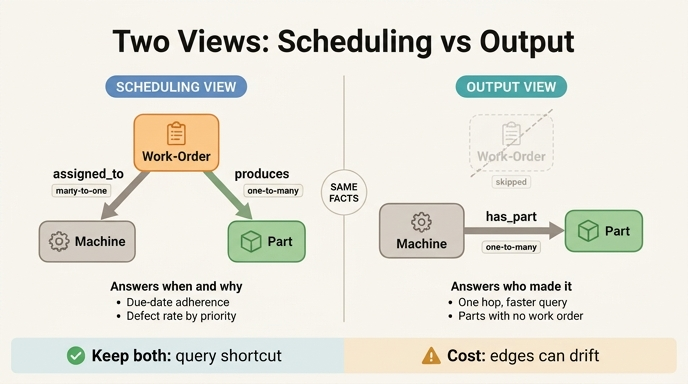

# assigned_to·produces vs has_part — 스케줄링 관점 vs 산출물 관점

## 질문

`assigned_to`·`produces`와 `has_part`는 무엇이 다른가?

## 한 줄 답

`assigned_to`와 `produces`는 **Work-Order를 중심으로 한 스케줄링 관점**의 연결이고, `has_part`는 기계에서 부품으로 바로 잇는 **산출물 관점**의 연결이다. 둘 다 두면 일정 기준 질의와 설비 기준 질의를 모두 지원한다.

---

## 1. 세 관계의 정확한 정의와 카디널리티

Smart Manufacturing 온톨로지의 Step 2에서 추가되는 세 관계는 다음과 같다.

| 관계 | 방향 | 카디널리티 | 의미 |
|---|---|---|---|
| `assigned_to` | `Work-Order` → `Machine` | **many-to-one** | 작업 지시가 특정 기계에 배정된다. 한 기계에 여러 작업 지시가 몰릴 수 있다. |
| `produces` | `Work-Order` → `Part` | **one-to-many** | 한 작업 지시가 하나 이상의 부품을 생산한다. |
| `has_part` | `Machine` → `Part` | **one-to-many** | 한 기계가 여러 부품을 생산한다(산출물 관점). |

카디널리티를 읽는 방향에 주의한다.

- `assigned_to`가 many-to-one인 이유: **작업 지시가 "다(many)" 쪽**이다. CNC-01 한 대에 오늘 배정된 작업 지시가 WO-1001, WO-1002, WO-1003처럼 여러 건일 수 있다. 반대로 하나의 작업 지시가 동시에 여러 기계에 배정되지는 않는다(이 모델 기준).
- `produces`가 one-to-many인 이유: **작업 지시가 "일(one)" 쪽**이다. "브래킷 500개 생산" 같은 작업 지시 하나가 부품 인스턴스 여러 개를 낳는다.
- `has_part`가 one-to-many인 이유: 기계가 "일" 쪽, 부품이 "다" 쪽. 기계 한 대의 누적 산출물이 여러 부품이다.

즉 `assigned_to`와 `produces`를 이으면 `Machine ← Work-Order → Part`라는 체인이 만들어지고, 이 체인의 양 끝을 직접 이은 것이 `has_part`다. 자산 문서의 표현대로 "**Machine ← Work-Order → Part 체인은 스케줄링 엔티티를 통해 설비와 산출물을 연결한다**". 이는 헬스케어 경로에서 Appointment가 Patient와 Provider를 잇는 것과 같은 패턴이다 — 가운데 엔티티가 **이벤트(사건)** 를 표현한다.

---

## 2. 두 관점의 차이 — 무엇을 "중심"에 두는가

### 스케줄링 관점 (`assigned_to` + `produces`)

중심 엔티티가 **Work-Order**다. Work-Order는 단순한 연결선이 아니라 자기 속성을 가진 1급 엔티티다.

| 속성 | 타입 |
|---|---|
| `workOrderId` | string (식별자) |
| `priority` | string |
| `status` | string |
| `startDate` | date |
| `dueDate` | date |

이 속성들이 있기 때문에 **"언제", "얼마나 급하게", "일정대로 되고 있는지"** 를 물을 수 있다. `startDate`/`dueDate` 두 날짜가 있어야 납기 준수율(schedule adherence)을 계산할 수 있고, `priority`와 조합하면 생산 계획 질의가 된다.

Work-Order를 거쳐야만 답할 수 있는 질문들:

- "납기가 지난 작업 지시는 몇 건인가?" — Work-Order 속성만으로 답
- "우선순위별 불량률은?" — `Work-Order(priority) → Part ← Quality-Check`
- "CNC-01에 지금 걸려 있는 작업 지시는?" — `Work-Order → Machine` 역방향
- "이 불량 부품은 어느 작업 지시에서 나왔고, 그때 어떤 조건이었나?" — 실패 역추적

자산 문서의 피드백 루프 설명도 이 경로를 쓴다: `Quality-Check(passed=false) → Part → Work-Order → Machine`. 불량의 원인을 **기계**뿐 아니라 **그때의 작업 조건**까지 짚으려면 반드시 Work-Order를 지나야 한다.

### 산출물 관점 (`has_part`)

중심이 **Machine**이고, "이 설비가 무엇을 만들어냈나"만 본다. 일정·우선순위·납기 정보는 이 경로에 없다.

`has_part`가 답하는 질문들:

- "검사에 실패한 부품을 만든 기계는?" — `Machine → Part ← Quality-Check(passed=false)`
- "센서가 비정상일 때 만들어진 부품은?" — `Sensor → Machine → Part ← Quality-Check`

자산 문서의 GQL 예제가 정확히 이 경로를 쓴다:

```gql
MATCH (s:Sensor)-[:monitors]->(m:Machine)-[:has_part]->(p:Part)<-[:inspects]-(qc:QualityCheck)
WHERE s.lastReading > s.threshold AND qc.passed = false
RETURN m.name, s.type, s.lastReading, p.name, qc.defectCode
```

여기서 `has_part`가 없다면 `(m:Machine)<-[:assigned_to]-(wo:WorkOrder)-[:produces]->(p:Part)`로 두 홉을 써야 한다. 센서-기계-부품-검사를 잇는 상관 분석 질의에서 작업 지시 정보는 필요 없는데 홉만 하나 더 늘어난다.

### 요약 대비

| 축 | `assigned_to` + `produces` | `has_part` |
|---|---|---|
| 중심 엔티티 | Work-Order (이벤트) | Machine (설비) |
| 관점 | 스케줄링 / 계획 | 산출물 / 실적 |
| 홉 수 (Machine↔Part) | 2 | 1 |
| 시간·우선순위 정보 | 있음 (`startDate`, `dueDate`, `priority`) | 없음 |
| 대표 질의 | 납기 준수, 우선순위별 불량률 | 설비별 불량, 센서 상관 분석 |
| 답 가능한 것 | "왜/언제 이렇게 만들어졌나" | "누가(어느 설비가) 만들었나" |

---

## 3. 중복(redundancy) 트레이드오프 — has_part는 유도 가능한데 왜 두는가

`has_part`는 원칙적으로 **유도 가능한(derivable) 간선**이다.

```
Machine -[has_part]-> Part
  ≡  Machine <-[assigned_to]- Work-Order -[produces]-> Part
```

정규화 관점에서 보면 지워야 할 중복이다. 그런데도 모델에 남겨 두는 이유는 두 가지다.

### (1) 질의 지름길 (query shortcut)

- **홉 수 감소**: 2홉이 1홉이 된다. 그래프 질의에서 홉 하나는 곧 조인 하나이고, Work-Order가 수천만 건 쌓인 공장에서는 이 중간 노드를 스캔하지 않는 것만으로 응답 시간이 크게 달라진다.
- **질의 가독성**: 위 GQL처럼 "센서 이상 ↔ 품질 불량" 상관 분석은 작업 지시와 무관한 질문이다. 무관한 엔티티를 경로에 끼워 넣지 않아도 되니 질의가 의도를 그대로 드러낸다.
- **팬아웃 억제**: `Machine → Work-Order`는 many 방향이라 중간 결과가 크게 부풀었다가 `produces`에서 다시 합쳐진다. 직접 간선은 이 중간 팽창을 건너뛴다.

### (2) 작업 지시가 없는 부품도 있다

유도 관계가 성립하려면 **모든 Part가 어떤 Work-Order에 속해야** 한다. 실제 공장에서는 그렇지 않은 경우가 흔하다.

- **시운전·시제품(trial run, prototype)**: 정식 작업 지시 없이 설비에서 뽑아 본 부품
- **셋업 부품(setup/scrap piece)**: 공정 조정 중 나온 초물, 폐기 예정이지만 추적은 해야 함
- **레거시·마이그레이션 데이터**: MES 도입 전 생산분이라 작업 지시 레코드가 없음
- **재작업(rework)로 나온 파생 부품**: 원 작업 지시와의 연결이 끊겼거나 모호한 경우
- **소스 시스템 차이**: 부품 추적은 MES에서, 작업 지시는 ERP에서 오는데 두 시스템의 조인 키가 항상 채워지지는 않는다

이런 부품들은 `assigned_to + produces` 경로로는 **영원히 도달할 수 없다**. `has_part`가 있으면 "이 기계가 낸 모든 산출물"이 하나도 빠짐없이 집계된다. 즉 `has_part`는 단순 캐시가 아니라, 스케줄링 경로보다 **커버리지가 넓은 관계**다. 이 점이 "그냥 지우면 되지 않나"에 대한 결정적인 반론이다.

---

## 4. 비정규화 간선의 정합성 리스크

같은 사실을 두 경로로 표현하면, 두 경로가 **어긋날 수 있다**는 비용을 진다.

| 리스크 | 구체적 상황 | 결과 |
|---|---|---|
| 갱신 누락 (update anomaly) | 작업 지시를 CNC-01에서 CNC-02로 재배정했는데 `assigned_to`만 고치고 `has_part`는 그대로 둠 | 부품이 두 기계에 동시에 매달림. 설비별 불량률이 왜곡됨 |
| 삽입 누락 | 새 Part를 `produces`로만 연결하고 `has_part`를 안 만듦 | 스케줄링 질의에는 나오는데 설비 질의에는 안 나옴 |
| 삭제 누락 | Work-Order 취소로 체인은 끊었는데 `has_part`가 남음 | 유령 산출물 |
| 질의 결과 불일치 | 같은 질문을 두 경로로 물었더니 답이 다름 | 대시보드 숫자가 안 맞고, 온톨로지 신뢰도가 무너짐 |
| 파이프라인 순서 | ERP(작업 지시)와 MES(부품) 적재 시점이 달라 일시적으로 한쪽만 존재 | 시점에 따라 답이 달라짐 |

### 완화 전략

1. **한쪽을 진실의 원천(source of truth)으로 정한다.** 보통 `assigned_to + produces`가 원본, `has_part`는 파생. 원본이 바뀌면 파생을 재계산한다.
2. **파생 간선을 손으로 쓰지 않는다.** 파이프라인/머티리얼라이즈드 뷰로 자동 생성해서, 사람이 두 곳을 고쳐야 하는 상황 자체를 없앤다.
3. **정합성 검사를 상시화한다.** "체인으로는 도달하는데 `has_part`가 없는 Part", "`has_part`는 있는데 체인 기계와 다른 Part"를 주기적으로 뽑아 본다. 후자는 진짜 불일치, 전자 중 일부는 3-(2)의 정상적인 작업 지시 없는 부품이므로 구분해서 다룬다.
4. **의미를 문서로 못 박는다.** `has_part`가 "체인의 축약"인지 "체인과 무관한 산출물 사실"인지 정의해 두어야, 위 검사에서 무엇이 오류이고 무엇이 정상인지 판정할 수 있다.
5. **읽기 전용으로 노출한다.** 애플리케이션이 `has_part`를 직접 쓰지 못하게 막으면 갱신 이상의 대부분이 사라진다.

---

## 5. 핵심 정리

1. `assigned_to`(Work-Order→Machine, many-to-one)와 `produces`(Work-Order→Part, one-to-many)는 **Work-Order라는 이벤트 엔티티를 경유**하는 스케줄링 관점 경로다. 시간·우선순위·납기를 물을 수 있다.
2. `has_part`(Machine→Part, one-to-many)는 설비에서 산출물로 **직행**하는 관점이다. 빠르고 단순하지만 일정 정보가 없다.
3. `has_part`는 체인에서 유도 가능하지만 (a) 질의 지름길, (b) 작업 지시 없는 부품 커버리지 때문에 남긴다.
4. 대가는 정합성 리스크다. 원본을 정하고 파생을 자동 생성하며 정합성 검사를 돌리는 것으로 관리한다.
5. 일반화하면: **이벤트 엔티티를 경유하는 경로는 "왜/언제"에 답하고, 직접 간선은 "무엇을"에 빠르게 답한다.** 둘 다 두는 것은 의도된 설계 선택이지 실수가 아니다.

## 인포그래픽


