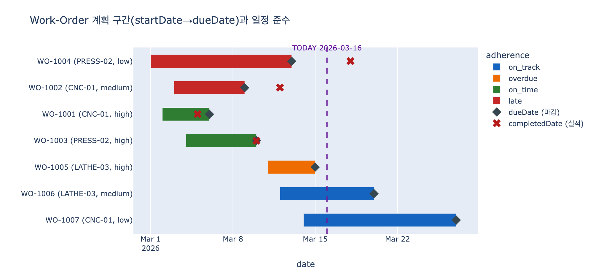

# Work-Order가 startDate와 dueDate를 둘 다 갖는 이유

**Q.** Work-Order가 `startDate`와 `dueDate`를 둘 다 갖는 이유는?

**A.** **일정 준수(schedule adherence)** 계산을 가능하게 하기 위해서다. `priority`와 결합하면 생산 계획 질의를 구동할 수 있다.

---

## 1. 어디서 나온 이야기인가

Smart Manufacturing 학습 경로의 2단계 "Production Tracking"에서 `Work-Order` 엔티티를 정의할 때 나온다.

| Property | Type | Identifier? |
|---|---|---|
| `workOrderId` | string | ✓ |
| `priority` | string | |
| `status` | string | |
| `startDate` | date | |
| `dueDate` | date | |

> Work orders have both `startDate` and `dueDate` — enabling schedule adherence calculations.
> Combined with `priority`, this powers production planning queries.

그리고 그 절의 정리(What we learned)에도 다음이 명시돼 있다.

> **Dual date properties** (startDate/dueDate) enable schedule adherence tracking

즉 날짜 두 개는 "혹시 몰라서" 넣은 여분 필드가 아니라, **파생 지표를 만들기 위한 최소 재료**다.

---

## 2. 핵심: 하나의 date는 시점, 두 개의 date는 구간

날짜 속성 하나는 **시점(point in time)** 밖에 표현하지 못한다.
두 개를 쌍으로 두면 **구간(interval)** 이 되고, 구간이 되는 순간 뺄셈이 가능해진다.

| 계산 | 정의 | 필요한 속성 |
|---|---|---|
| 계획 리드타임 `leadTime` | `dueDate - startDate` | **둘 다** |
| 여유 `slack` | `dueDate - today` | `dueDate` |
| 경과 `elapsed` | `today - startDate` | `startDate` |
| 진행률 `progressRatio` | `elapsed / leadTime` | **둘 다** |
| 지연 `lateness` | `completedDate - dueDate` | `dueDate` |
| 일정 준수율 `adherence` | 정시 완료 건수 / 완료 건수 | `dueDate` (+판정 기준으로 `startDate`) |

수식으로 쓰면:

$$\text{leadTime} = \text{dueDate} - \text{startDate}$$

$$\text{progressRatio} = \frac{\text{today} - \text{startDate}}{\text{dueDate} - \text{startDate}}$$

$$\text{adherence} = \frac{\#\{wo:\ \text{completedDate} \le \text{dueDate}\}}{\#\{wo:\ \text{status} = \text{completed}\}}$$

---

## 3. 날짜가 하나뿐이면 무엇을 잃는가

이 질문의 핵심은 "왜 하나로는 안 되는가"다. 반례로 보면 명확하다.

### `startDate`만 있는 경우
- 언제 착수했는지, 며칠 흘렀는지는 안다.
- 그러나 **기준선(baseline)이 없다.** "이 작업이 지금 늦은 건가?"에 답할 수 없다.
- `"How many work orders are behind schedule?"` 라는 학습 경로의 예시 질의가 아예 성립하지 않는다.

### `dueDate`만 있는 경우
- 완료일이 따로 기록돼 있다면 지연 여부는 판정할 수 있다.
- 그러나 **작업의 "무게"(설비 점유 기간)를 모른다.** 마감이 같은 두 작업이 반나절짜리인지 2주짜리인지 구분이 안 된다.
- 따라서 설비 부하(load) 계산, 캐파 계획, 간트 차트 렌더링이 불가능하다.

`expy.py`의 반례:

```
WO-1003: due=2026-03-10, leadTime=6일
WO-1004: due=2026-03-13, leadTime=12일
```

마감은 3일 차이지만 설비를 붙잡는 기간은 2배 차이다. `dueDate`만 봐서는 절대 알 수 없다.

---

## 4. `priority`와 결합 — 생산 계획 질의

두 날짜가 만들어낸 `slack`을 `priority`와 함께 쓰면 곧바로 **디스패칭 규칙(dispatching rule)** 이 된다.

- **Minimum Slack (MINSLACK)**: slack이 가장 작은 작업부터 처리
- **Critical Ratio (CR)**: $\text{CR} = \dfrac{\text{dueDate} - \text{today}}{\text{잔여 작업일}}$, CR < 1 이면 지연 위험
- **EDD (Earliest Due Date)**: 마감이 빠른 순
- 실무에서는 여기에 `priority`를 1차 정렬 키로 얹어 "우선순위 높고 마감 임박한 것부터" 처리한다.

`expy.py` 실행 결과:

```
디스패칭 순서 (priority → slack):
workOrderId priority  slack adherence
    WO-1005     high     -1   overdue
    WO-1006   medium      4  on_track
    WO-1007      low     11  on_track
```

또한 `priority`별로 준수율을 쪼개면 계획 품질 자체를 진단할 수 있다.

```
          n  adherence  avg_lead
priority
high      2        1.0       5.0
low       1        0.0      12.0
medium    1        0.0       6.0
```

→ high 우선순위는 100% 정시, low/medium은 0%. 우선순위 규칙이 실제로 작동하고 있다는 증거이자,
동시에 낮은 우선순위 작업의 리드타임 산정이 부실할 수 있다는 신호다.

이런 질의는 학습 경로가 예시로 든 질문들과 정확히 대응한다.

- "How many work orders are behind schedule?" → `slack < 0` 필터
- "Which machine is producing the most parts this shift?" → 기간 구간과 `assigned_to` 조인
- "What is the defect rate by work order priority?" → `priority` × `Quality-Check.passed`

---

## 5. 온톨로지 설계 관점의 일반화

이건 제조 도메인만의 특수 규칙이 아니라 **이벤트/일정 엔티티의 공통 패턴**이다.

- 학습 경로의 노트: *"The chain `Machine ← Work-Order → Part` connects equipment to output through a scheduling entity. This is similar to how Appointment connects Patient and Provider in healthcare — the middle entity represents the event."*
- 이런 **중간 이벤트 엔티티**는 거의 항상 시간 구간을 갖는다. Appointment의 시작/종료, Lease의 개시/만료, Project Task의 착수/기한.
- 표준 온톨로지에서도 동일하다. OWL-Time의 `hasBeginning` / `hasEnd`, schema.org의 `startDate` / `endDate`, ISA-95(IEC 62264)의 작업 일정 모델은 모두 구간을 쌍으로 표현한다.

정리하면:

> **계획(plan)과 실적(actual)을 대조해야 하는 엔티티에는 구간 속성을 쌍으로 둔다.**
> 한쪽만 두면 "얼마나 걸리는가"와 "약속을 지켰는가" 중 하나를 영구히 계산할 수 없게 된다.

`startDate`는 **기간**을, `dueDate`는 **약속**을 표현한다. 두 축 중 하나라도 빠지면 schedule adherence는 정의 자체가 불가능하다.

---

## 6. 헷갈리기 쉬운 오답

| 오답 | 왜 틀렸나 |
|---|---|
| "하나가 잘못됐을 때를 대비한 백업 값" | 두 날짜는 서로 다른 의미(착수 시점 vs 마감 약속)를 갖는 별개 속성이다. 중복이 아니다. |
| "날짜 형식 표준을 맞추기 위해" | 형식 문제가 아니라 파생 지표(기간·여유·준수율)를 만들기 위한 설계다. |
| "startDate는 정렬용, dueDate는 표시용" | 둘 다 계산에 쓰인다. 정렬은 부수 효과일 뿐이다. |
| "status만 있으면 충분하다" | `status`는 이산 상태(`in_progress`/`completed`)만 알려준다. 얼마나 늦었는지, 얼마나 남았는지는 수치로 표현하지 못한다. |

---

## 시각화

`expy.py`는 7건의 Work-Order를 만들어 `leadTime` · `slack` · `progressRatio` · `lateness`를 계산하고,
완료 4건 기준 **schedule adherence = 50%** 를 산출한 뒤 간트 차트로 그린다.

- 막대: `startDate` → `dueDate` 계획 구간 (색 = 준수 판정)
- ◆ 마커: `dueDate` (마감선)
- ✕ 마커: 실제 `completedDate` — 마감선 오른쪽에 찍히면 지연
- 보라색 점선: 고정된 기준 시점 `TODAY = 2026-03-16`


