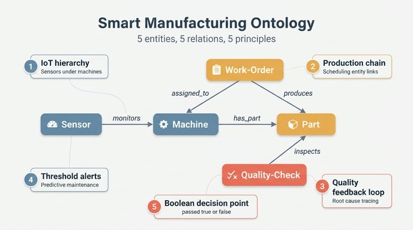

# Smart Manufacturing 경로의 핵심 정리 5가지

## 핵심 답

경로 마지막 "Key takeaways"에 정리된 다섯 문장이다.

| # | 핵심 정리 | 이를 구현하는 온톨로지 요소 |
|---|---|---|
| 1 | **IoT 계층**이 센서를 기계 아래로 조직해 텔레메트리를 집계한다 | `Sensor -monitors-> Machine` (다대일) |
| 2 | **생산 체인**이 스케줄링 엔티티를 통해 설비와 산출물을 잇는다 | `Machine <-assigned_to- Work-Order -produces-> Part` |
| 3 | **품질 피드백 루프**가 생산 체인 전반의 근본 원인 분석을 가능케 한다 | `Quality-Check -inspects-> Part` + 역방향 추적 |
| 4 | **임계값 기반 경보**가 예지 보전을 구동한다 | `Sensor.threshold` vs `Sensor.lastReading` |
| 5 | **boolean 속성**(passed)이 워크플로에 명확한 의사결정 지점을 만든다 | `Quality-Check.passed` (boolean) |

완성 모델은 **엔티티 5개, 관계 5개**다. 다섯 정리는 각각 "관계 방향", "중간 엔티티", "역방향 추적", "속성 쌍", "타입 선택"이라는 서로 다른 설계 레버를 하나씩 대표한다.

---

## 1. IoT 계층 — 센서는 기계에 속한다

### 무엇을 뜻하나

IoT 데이터는 그냥 흩뿌려진 측정값 스트림이 아니다. **어떤 장비가 보고했는가**로 묶여야 의미가 생긴다. 그래서 온톨로지는 `Sensor`와 `Machine`을 부모-자식 계층으로 만든다.

### 이 온톨로지에서

- 관계: **monitors** — `Sensor` → `Machine` (many-to-one)
- 하나의 기계에 온도 센서, 진동 센서, 압력 센서가 동시에 붙는다. 그래서 다대일이다.

> **방향이 중요하다.** 센서가 기계를 monitors 하는 것이지, 기계가 센서를 monitors 하는 게 아니다. 화살표를 반대로 그리면 "기계 하나당 센서 하나"라는 잘못된 카디널리티가 암시되고, 기계 단위로 텔레메트리를 롤업하는 쿼리가 어색해진다.

### 왜 "집계"인가

계층이 있으면 `Machine` 노드 하나에서 자식 센서들을 모아 **평균 온도**, **이상 센서 개수** 같은 기계 단위 지표를 만들 수 있다. 실제 IoT 플랫폼(AWS IoT SiteWise, Azure Digital Twins 등)이 asset hierarchy를 강제하는 이유가 이것이다.

### 다른 도메인으로의 전이

| 경로 | 같은 패턴 |
|---|---|
| HR | `Employee` → `Department` — 사람을 조직 단위 아래로 묶어 부서별 집계 |
| Healthcare | `Diagnosis` → `Patient` — 진단 기록을 환자 아래로 묶어 환자 단위 이력 |
| Ecommerce | `Review` → `Product` — 리뷰를 상품 아래로 묶어 상품 평점 집계 |

**일반 원칙**: 다수의 세부 기록(측정값·리뷰·진단)은 소수의 안정적 주체(기계·상품·환자) 아래에 다대일로 매단다. 그러면 집계 축이 자연스럽게 생긴다.

---

## 2. 생산 체인 — 스케줄링 엔티티가 설비와 산출물을 잇는다

### 무엇을 뜻하나

"기계가 부품을 만든다"를 `Machine → Part` 하나로 끝내면, **언제·어떤 우선순위로·누구 지시로** 만들었는지가 사라진다. 그래서 가운데에 **사건(event)을 표현하는 엔티티**인 `Work-Order`를 둔다.

### 이 온톨로지에서

- **assigned_to** — `Work-Order` → `Machine` (many-to-one): 작업지시가 특정 기계에 배정됨
- **produces** — `Work-Order` → `Part` (one-to-many): 하나의 작업지시가 여러 부품을 산출
- **has_part** — `Machine` → `Part` (one-to-many): 산출물 관점의 직결 경로

즉 체인은 `Machine ← Work-Order → Part`. 중간 엔티티가 자기 속성으로 맥락을 들고 있다.

- `priority`, `status` — 생산 계획 질의 ("납기 지연된 작업지시는?")
- `startDate` + `dueDate` — 이중 날짜 속성으로 **납기 준수(schedule adherence)** 계산 가능

`Part.tolerance`는 이 체인의 제약 조건이다. 공차가 빡빡한 부품은 더 정밀한 기계를 요구하므로, 작업지시를 어느 기계에 배정할지 결정하는 입력이 된다.

> 소스 문서가 직접 밝히듯, 이 구조는 **헬스케어 경로의 Appointment가 Patient와 Provider를 잇는 방식과 동일**하다. 가운데 엔티티가 "일어난 일"을 표현한다.

### 다른 도메인으로의 전이

| 경로 | 중간 엔티티 | 잇는 대상 |
|---|---|---|
| Healthcare | `Appointment` | Patient ↔ Provider |
| HR | `Assignment` | Employee ↔ Department/Position (시작·종료일로 이력 추적) |
| Ecommerce | `Order` | Buyer ↔ Product |

**일반 원칙**: 두 엔티티 사이 관계에 **시간·상태·수량** 같은 속성을 달아야 한다면, 그건 관계가 아니라 엔티티다. 이걸 junction entity 또는 event entity라고 부른다. HR 경로가 `Assignment`를 두는 이유도 동일하다 — 직원-부서 연결에 startDate/endDate를 달아야 시간에 따른 이력 분석이 가능해진다.

---

## 3. 품질 피드백 루프 — 근본 원인 분석

### 무엇을 뜻하나

제조는 부품이 나오면 끝나는 게 아니라 **검사되어야** 한다. `Quality-Check`는 생산 사이클을 닫아서, 결과에서 원인으로 거슬러 올라가는 경로를 만든다.

### 이 온톨로지에서

- **inspects** — `Quality-Check` → `Part` (many-to-one). 한 부품이 여러 번 검사받을 수 있다(최초 검사, 재작업 후 재검사).

관계 자체는 단방향이지만, 그래프에서는 **역방향 순회**가 가능하다. 검사가 실패하면:

```
Quality-Check (passed=false) → Part → Work-Order → Machine
```

이 역추적이 "어느 기계가 문제인가", "어느 작업지시 조건에서 불량이 몰리는가"에 답한다. `defectCode`가 실패를 유형화하므로 불량 유형별 집계까지 가능하다.

### 루프가 만들어내는 질의

| 질문 | 그래프 경로 |
|---|---|
| 검사 실패 부품을 만든 기계는? | `Machine → Part ← Quality-Check (passed=false)` |
| 불량 생산 시점에 이상했던 센서는? | `Sensor → Machine → Part ← Quality-Check (passed=false)` |
| 작업지시 우선순위별 불량률은? | `Work-Order (priority) → Part ← Quality-Check` |
| 재검사가 필요한 부품은? | `Part ← Quality-Check (passed=false, count > 1)` |

시나리오 도입부의 동기 질문 — **"지난주 이상 센서 값을 보인 기계 중 품질 검사에 실패한 부품을 생산한 기계는?"** — 이 한 줄 GQL로 떨어진다.

```gql
MATCH (s:Sensor)-[:monitors]->(m:Machine)-[:has_part]->(p:Part)<-[:inspects]-(qc:QualityCheck)
WHERE s.lastReading > s.threshold AND qc.passed = false
RETURN m.name, s.type, s.lastReading, p.name, qc.defectCode
```

IoT · MES · ERP · QMS 네 개 시스템을 가로지르는 질문이 그래프 경로 하나가 된다.

### 다른 도메인으로의 전이

| 경로 | 피드백 엔티티 | 역추적 경로 |
|---|---|---|
| Ecommerce | `Review` | Review(부정) → Product → Order → Buyer |
| HR | `PerformanceReview` | PerformanceReview(rating) → Employee → Assignment → Department |
| Healthcare | `Prescription` | Prescription → Diagnosis → Patient (치료 결과 추적) |

**일반 원칙**: "선형 체인"보다 **결과를 다시 원인 쪽에 붙이는 엔티티**가 질의 표현력을 훨씬 키운다. Ecommerce 경로의 takeaway "feedback loops create richer query paths than linear chains"와 정확히 같은 이야기다.

---

## 4. 임계값 기반 경보 — 예지 보전(predictive maintenance)

### 무엇을 뜻하나

센서가 값 하나(`lastReading`)만 들고 있으면, 그 값이 정상인지 이상인지 판단하려면 외부 규칙 테이블이 필요하다. 온톨로지에 `threshold`를 **함께** 두면, 판정이 데이터 모델 안에서 자기완결적으로 이뤄진다.

### 이 온톨로지에서

- `Sensor.lastReading` (float) — 현재 측정값
- `Sensor.threshold` (float) — 경보 경계선
- 판정 규칙: `lastReading > threshold` → 알람 발생

센서마다 threshold가 다르다는 점이 핵심이다. 온도 센서와 진동 센서의 경계값은 당연히 다르므로, 임계값은 센서 **인스턴스의 속성**이어야지 글로벌 상수가 될 수 없다.

`Machine.status`(`running` / `idle` / `maintenance` / `offline`)와 결합하면 완결된 정비 워크플로가 된다 — 이상 감지 → 정비 스케줄 → status 전환.

### 왜 "예지"인가

고장이 난 뒤 대응하는 게 아니라, **고장 전에 경계값을 넘는 순간**을 잡아낸다. 사후 정비(reactive)가 아니라 사전 정비(predictive)라 부르는 이유다.

### 다른 도메인으로의 전이

| 경로 | 값 속성 | 경계/기준 속성 |
|---|---|---|
| Healthcare | 검사 수치 | 정상 범위 — 범위 밖이면 진단 트리거 |
| HR | `PerformanceReview.rating` | 등급 enum — 특정 등급 이하면 개선 프로세스 |
| Ecommerce | 재고 수량 | 재주문 기준점 — 밑돌면 발주 |

**일반 원칙**: "관측값"과 "그 값을 해석할 기준"을 **같은 엔티티에 쌍으로** 둔다. 그러면 비즈니스 규칙이 애플리케이션 코드가 아니라 데이터에 살게 되고, 인스턴스마다 다른 기준을 줄 수 있다.

---

## 5. boolean 속성 — 명확한 의사결정 지점

### 무엇을 뜻하나

워크플로에는 **분기점**이 있어야 한다. `Quality-Check.passed`(boolean)가 바로 그 지점이다. 통과면 출하, 실패면 재작업 — 애매한 중간이 없다.

### 이 온톨로지에서

- `Quality-Check.passed` (boolean) — 출하 / 재작업을 가르는 결정적 속성
- `Quality-Check.defectCode` (string) — 실패한 경우 **왜** 실패했는지 분류

이 조합이 중요하다. boolean은 **분기**를, string 코드는 **분류**를 담당한다. boolean 하나만 있으면 불량 유형별 분석이 안 되고, defectCode만 있으면 "합격인가?"를 판정하려고 코드 목록을 뒤져야 한다.

### 왜 boolean인가

- 인덱싱·필터링이 값싸다: `WHERE qc.passed = false`
- 값의 집합이 닫혀 있다: 새로운 상태가 몰래 늘어나지 않는다
- 집계가 곧바로 비율이 된다: 불량률 = `count(passed=false) / count(*)`

반대로, 상태가 3개 이상 가능하면(예: `pending` / `pass` / `fail`) boolean은 잘못된 선택이다. **진짜 이분법일 때만** boolean을 쓴다.

### 다른 도메인으로의 전이

| 경로 | boolean 속성 | 만드는 분기 |
|---|---|---|
| Ecommerce | `Review.verified` | 실구매 리뷰인가 — 신뢰도 필터링 |
| HR | `Assignment.isPrimary` | 주 소속인가 — 겸직 중 대표 배치 선택 |
| Healthcare | 처방 활성 여부 | 복약 중인가 — 현재 투약 목록 산출 |

**일반 원칙**: 워크플로가 두 갈래로 갈리는 지점마다 boolean 속성을 심는다. Ecommerce 경로의 takeaway "boolean properties (verified) enable trust-based filtering"이 같은 원칙의 다른 표현이다.

---

## 다섯 정리를 관통하는 것

| 정리 | 설계 레버 |
|---|---|
| 1. IoT 계층 | **관계 방향과 카디널리티** — 집계 축을 만든다 |
| 2. 생산 체인 | **중간 엔티티** — 맥락을 담을 자리를 만든다 |
| 3. 피드백 루프 | **역방향 순회** — 결과에서 원인으로 간다 |
| 4. 임계값 경보 | **속성 쌍(값 + 기준)** — 규칙을 데이터에 담는다 |
| 5. boolean | **타입 선택** — 분기를 명시한다 |

앞의 3개는 **관계 설계**, 뒤의 2개는 **속성 설계**에 관한 것이다. 이렇게 3+2로 묶으면 외우기 쉽다.

---

## 암기 팁

- 순서대로 앞글자: **IoT — 생산 — 품질 — 임계값 — boolean**. 앞 3개는 경로의 3단계(1단계 IoT, 2단계 생산, 3단계 품질)와 그대로 대응하고, 뒤 2개는 각각 1단계와 3단계에서 나온 **속성** 이야기다.
- 한 문장으로: "센서를 기계 밑에 매달고(1), 작업지시로 산출물을 잇고(2), 검사로 되짚어 올라가되(3), 임계값으로 미리 알리고(4), passed로 딱 갈라라(5)."
- 엔티티 5 · 관계 5 · 정리 5 — 숫자 5가 세 번 반복된다.

## 인포그래픽


