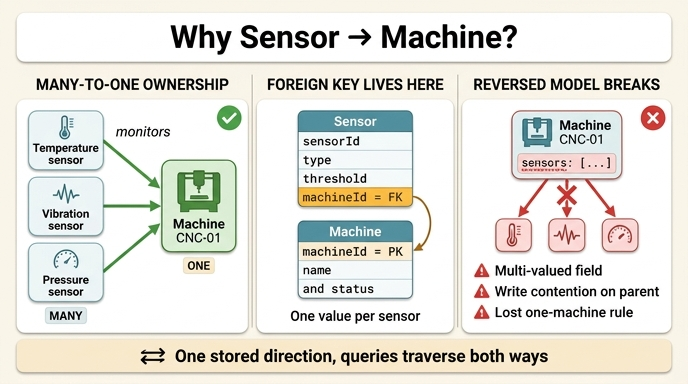

# IoT 온톨로지에서 관계 방향이 Sensor → Machine인 이유

## 질문

IoT 온톨로지에서 관계 방향이 `Sensor → Machine`인 이유는?

## 답

IoT 온톨로지에서 센서는 기계에 **속하기** 때문이다. 센서가 기계를 모니터링하는 것이지 그 반대가 아니며, 이 부모-자식 계층이 IoT 플랫폼이 텔레메트리 데이터를 조직하는 방식이다.

---

## 1. Smart Manufacturing 온톨로지에서의 정의

학습 경로 1단계에서 정의한 두 엔티티와 관계는 다음과 같다.

| 엔티티 | 주요 속성 | 식별자 |
|---|---|---|
| **Machine** | `machineId`, `name`, `type`, `status`, `installDate` | `machineId` |
| **Sensor** | `sensorId`, `type`, `unit`, `lastReading`, `threshold` | `sensorId` |

관계는 단 하나다.

- **monitors** — `Sensor` → `Machine` (**many-to-one**)

원문의 핵심 문장:

> **Ownership hierarchy:** In IoT ontologies, sensors belong to machines. The direction matters: sensors monitor machines, not the other way around. This parent-child hierarchy is how IoT platforms organize telemetry data.

즉 방향은 임의로 고른 게 아니라 **소유(ownership)의 방향**을 그대로 따른 것이다. 센서는 기계에 물리적으로 부착된 부품이고, 기계는 센서 없이도 존재하지만 센서는 붙을 대상 없이는 의미가 없다. 자식이 부모를 가리킨다.

---

## 2. 여기서 many-to-one이 뜻하는 것

"many-to-one"은 **한 방향으로 읽었을 때의 카디널리티(cardinality)** 를 말한다.

- **many 쪽 = Sensor**: 하나의 기계에 온도 센서, 진동 센서, 압력 센서 등 여러 개가 붙는다.
- **one 쪽 = Machine**: 하나의 센서는 **정확히 하나의** 기계만 모니터링한다.

원문 설명 그대로다.

> Multiple sensors monitor the same machine — one for temperature, another for vibration, etc.

구체적인 예:

```
Temperature sensor  TEMP-114  ┐
Vibration sensor    VIB-207   ├──[ monitors ]──▶  Machine  CNC-01
Pressure sensor     PRS-033   ┘
```

여기서 결정적인 비대칭이 있다. **"센서 하나가 기계 몇 개를 모니터링하는가?"에 대한 답은 항상 1이다.** 반면 "기계 하나에 센서가 몇 개 붙는가?"의 답은 0개일 수도, 12개일 수도, 나중에 20개로 늘어날 수도 있다. 상한이 정해지지 않은 쪽과 정확히 1로 고정된 쪽이 있다면, 관계 방향은 **1로 고정된 쪽에서 출발**하는 것이 자연스럽다.

이건 이 경로의 다른 관계들과도 일관된다.

| 관계 | 방향 | 카디널리티 |
|---|---|---|
| `monitors` | Sensor → Machine | many-to-one |
| `assigned_to` | Work-Order → Machine | many-to-one |
| `inspects` | Quality-Check → Part | many-to-one |

세 경우 모두 **"많은 쪽"이 출발점, "하나뿐인 쪽"이 도착점**이다. 자식이 부모를 가리키는 동일한 패턴이다.

---

## 3. 외래 키(foreign key)가 Sensor 쪽에 놓이는 이유

온톨로지 관계는 결국 저장소에서 어떤 식으로든 구현된다. 관계형 테이블로 구현한다고 하면 이렇게 된다.

```
Sensor 테이블
┌───────────┬─────────────┬──────┬───────────┬──────────────────┐
│ sensorId  │ type        │ unit │ threshold │ machineId  (FK)  │
├───────────┼─────────────┼──────┼───────────┼──────────────────┤
│ TEMP-114  │ temperature │ °C   │ 85.0      │ CNC-01           │
│ VIB-207   │ vibration   │ mm/s │ 4.5       │ CNC-01           │
│ PRS-033   │ pressure    │ bar  │ 12.0      │ CNC-01           │
└───────────┴─────────────┴──────┴───────────┴──────────────────┘

Machine 테이블
┌───────────┬────────────┬─────────┬─────────┐
│ machineId │ name       │ type    │ status  │
│ (PK)      │            │         │         │
├───────────┼────────────┼─────────┼─────────┤
│ CNC-01    │ CNC Mill 1 │ milling │ running │
└───────────┴────────────┴─────────┴─────────┘
```

외래 키가 Sensor에 있는 이유는 단순하다. **many 쪽 레코드만이 참조 값을 단일 스칼라로 담을 수 있기 때문이다.**

- Sensor 행 하나에 `machineId` 하나 → 컬럼 하나면 끝. 값이 하나뿐이므로 1정규형(1NF)을 만족한다.
- 반대로 Machine 행 하나에 센서들을 담으려면 `sensorIds = [TEMP-114, VIB-207, PRS-033, ...]` 같은 **다중값 필드**가 필요하다. 개수 상한이 없으니 컬럼으로 표현할 수 없고, 배열/JSON/콤마 문자열 같은 우회 수단을 써야 한다.

부수적인 이점들:

- **참조 무결성**: `Sensor.machineId`에 FK 제약을 걸면 존재하지 않는 기계를 가리키는 센서를 DB가 원천 차단한다.
- **삽입/삭제가 국소적**: 센서를 새로 달거나 떼는 작업이 Sensor 행 하나의 삽입/삭제로 끝난다. Machine 행은 건드리지 않는다.
- **경합 없음**: 12개 센서가 동시에 등록돼도 각자 자기 행만 쓴다. 부모 쪽 배열을 고치는 구조라면 같은 한 행을 12번 갱신하려고 다투게 된다.
- **"기계는 하나뿐" 규칙이 스키마로 표현됨**: `machineId`가 단일 컬럼이라는 사실 자체가 "센서 하나는 기계 하나"라는 제약이다. 애플리케이션 코드로 지킬 필요가 없다.

그래프 DB에서도 원리는 같다. 엣지 `(:Sensor)-[:monitors]->(:Machine)`는 소유하는 쪽(Sensor 노드)에 붙어 있고, 노드 추가가 곧 엣지 추가다.

---

## 4. 방향이 정해져 있어도 양방향 질의는 그대로 된다

가장 흔한 오해가 여기 있다. **관계에 방향이 있다는 것은 "그 방향으로만 조회할 수 있다"는 뜻이 아니다.** 저장 방향은 하나지만, 탐색은 양쪽 모두 가능하다.

**정방향 (센서에서 기계로)** — "이 센서는 어느 기계 것인가?"

```gql
MATCH (s:Sensor {sensorId: 'TEMP-114'})-[:monitors]->(m:Machine)
RETURN m.name, m.status
```

**역방향 (기계에서 센서로)** — "이 기계에 붙은 센서 전부"

```gql
MATCH (s:Sensor)-[:monitors]->(m:Machine {machineId: 'CNC-01'})
RETURN s.sensorId, s.type, s.lastReading
```

같은 엣지를 반대 방향으로 읽었을 뿐이다. SQL로 쓰면 조인 조건은 완전히 동일하고 `SELECT`와 `WHERE`만 바뀐다.

```sql
-- 정방향: 센서 → 기계
SELECT m.name, m.status
FROM Sensor s JOIN Machine m ON s.machineId = m.machineId
WHERE s.sensorId = 'TEMP-114';

-- 역방향: 기계 → 센서
SELECT s.sensorId, s.type, s.lastReading
FROM Sensor s JOIN Machine m ON s.machineId = m.machineId
WHERE m.machineId = 'CNC-01';
```

온톨로지 UI에서는 보통 역방향에도 이름을 준다 — `monitors`의 역은 `monitored_by`(또는 `has_sensors`)로 표시되며, 관계를 하나만 정의해도 양쪽 방향의 링크가 자동으로 생긴다. **저장은 한 번, 이름은 두 개**인 셈이다.

이 경로 마지막의 실제 질의도 방향을 자유롭게 넘나든다.

```gql
MATCH (s:Sensor)-[:monitors]->(m:Machine)-[:has_part]->(p:Part)<-[:inspects]-(qc:QualityCheck)
WHERE s.lastReading > s.threshold AND qc.passed = false
RETURN m.name, s.type, s.lastReading, p.name, qc.defectCode
```

`monitors`와 `has_part`는 화살표를 따라가고, `inspects`는 `<-`로 거슬러 올라간다. 방향 정의는 **의미를 고정**할 뿐 탐색을 막지 않는다.

---

## 5. Machine → Sensor (one-to-many) 로만 모델링하면 깨지는 것

방향을 뒤집어 "기계가 센서를 가진다"로만 정의하면 다음이 무너진다.

### (1) 다중값 필드 문제

Machine 쪽에 센서 목록을 들고 있어야 한다. `Machine.sensors = [TEMP-114, VIB-207, ...]`는 1NF 위반이다. 개수 상한이 없어 컬럼 설계가 불가능하고, "3번 센서를 떼라"는 작업이 배열 조작이 된다. 인덱스도 제대로 걸리지 않아 "sensorId로 그 센서가 속한 기계 찾기"가 전체 스캔이 된다.

### (2) 쓰기 경합과 갱신 비용

센서 하나를 추가/제거할 때마다 **부모인 Machine 행을 갱신**해야 한다. 수백 개 센서가 동시에 등록되는 IoT 온보딩 상황에서 같은 행에 락이 몰린다. 반면 Sensor → Machine이면 각 센서가 자기 행만 삽입한다.

### (3) "센서 하나 = 기계 하나" 제약의 상실

부모 쪽에 목록을 두면 같은 `sensorId`가 두 기계의 목록에 동시에 들어가는 것을 스키마가 막지 못한다. 데이터베이스는 "TEMP-114가 CNC-01과 CNC-02 양쪽에 있다"를 막을 수단이 없고, 애플리케이션 코드가 매번 검사해야 한다. FK가 Sensor에 있으면 컬럼이 하나뿐이라 **구조적으로 불가능**하다.

### (4) 텔레메트리 집계 방향과 어긋남

원문 표현대로 IoT의 데이터 흐름은 "readings flow upward" — 센서가 값을 생성하고 기계 단위로 **올라가며** 집계된다. 리딩은 항상 `sensorId`를 달고 도착하며, 시스템은 그 즉시 "이건 어느 기계 것인가?"를 알아야 한다. Sensor에 `machineId`가 있으면 조회 한 번이면 되지만, 부모 쪽 목록 구조라면 모든 기계의 배열을 뒤져야 한다. **핫 패스(hot path)가 정확히 Sensor → Machine 방향**이다.

### (5) 임계값 알람과 예지 정비의 근거 상실

`lastReading > threshold`로 알람이 뜨면 곧바로 "어느 기계를 멈춰야 하는가"로 이어져야 한다. 이 추적은 센서에서 기계로 가는 단일 홉이다. 방향이 반대면 이 가장 중요한 질의가 가장 비싼 질의가 된다.

### (6) 다중 홉 질의 체인이 끊김

앞서 본 상관 질의는 `Sensor → Machine → Part ← Quality-Check`로 이어진다. Sensor가 출발점이 되어야 "이상 리딩을 낸 센서 → 그 기계 → 그 기계가 만든 부품 → 불합격 검사"가 한 줄로 연결된다. 시작점의 방향이 어긋나면 체인 전체를 우회 표현해야 한다.

### (7) 확장성

기계에 센서를 나중에 추가하는 일은 일상적이다. Sensor → Machine 구조에서는 **새 Sensor 행 하나를 넣으면 끝이고 Machine 스키마도 데이터도 그대로**다. 이것이 many-to-one 방향이 "확장 가능한" 방향인 이유다.

---

## 6. 기억할 규칙

> **many 쪽에서 one 쪽으로 화살표를 그린다. 자식이 부모를 가리킨다.**

- 물리적 소유: 센서는 기계에 **붙어 있다** → 센서가 기계를 가리킨다.
- 카디널리티: 센서→기계는 항상 1, 기계→센서는 N → 1인 쪽이 출발점.
- 구현: FK는 값이 하나뿐인 쪽(Sensor)에 놓인다.
- 조회: 방향은 의미를 고정할 뿐, 양방향 탐색은 모두 가능하다.

같은 규칙이 이 경로 전체에 반복된다 — `Work-Order → Machine`, `Quality-Check → Part`. 방향 선택이 헷갈릴 땐 **"어느 쪽이 없으면 존재할 수 없는가?"** 를 물어보면 된다. 그쪽이 화살표의 출발점이다.

## 인포그래픽


</content>
