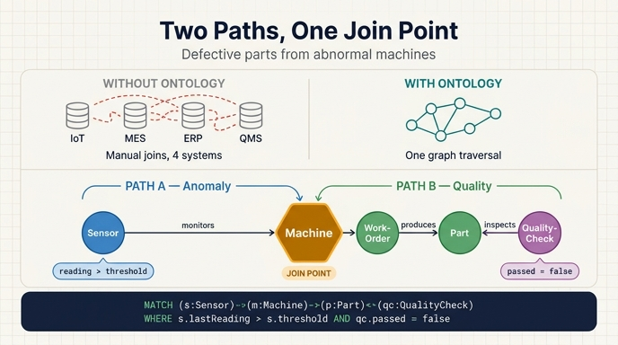

# "비정상 센서 판독값을 보인 기계가 만든 불량 부품" — 온톨로지 경로 매핑

## 한 줄 요약

이 질문은 **두 개의 독립된 그래프 경로**로 분해되고, 그 둘이 **`Machine`이라는 공통 노드에서 결합**된다.

```
경로 A (이상 탐지):  Machine → Sensor           where reading > threshold
경로 B (품질 추적):  Machine → Work-Order → Part → Quality-Check   where passed = false
                     └───────────── 두 경로의 조인 지점 ─────────────┘
```

결과적으로 "여러 시스템을 조인하는 문제"가 아니라 **하나의 그래프를 탐색(traversal)하는 문제**가 된다.

---

## 왜 이 질문이 어려운가 — 온톨로지가 없을 때

원문의 질문은 이렇다:

> "Which machines with abnormal sensor readings produced parts that failed quality checks last week?"
> (지난주에 비정상 센서 판독값을 보인 기계가 생산한 부품 중 품질 검사에 실패한 것은?)

이 한 문장은 **서로 다른 4개 시스템**을 가로지른다.

| 필요한 데이터 | 원천 시스템 |
|---|---|
| 센서 실시간 판독값 | IoT 텔레메트리 플랫폼 |
| 생산 일정 / 작업 지시 | MES (Manufacturing Execution System) |
| 부품 추적 | ERP |
| 검사 결과 | 품질 관리 DB (QMS) |

온톨로지가 없으면 엔지니어는 IoT 시계열 DB에서 이상치를 뽑고, MES에서 해당 시각의 작업 지시를 찾고, ERP에서 부품 ID를 매칭하고, QMS에서 검사 레코드를 붙이는 **4단계 수작업 ETL/조인**을 해야 한다. 각 시스템의 키 체계가 달라서 조인 자체가 프로젝트가 된다.

---

## 온톨로지가 있을 때 — 두 경로의 결합

Smart Manufacturing 온톨로지는 5개 엔티티와 5개 관계로 구성된다.

### 엔티티와 핵심 속성

| 엔티티 | 식별자 | 이 질문에서 결정적인 속성 |
|---|---|---|
| `Machine` | `machineId` | `status` (running / idle / maintenance / offline) |
| `Sensor` | `sensorId` | **`lastReading`, `threshold`** |
| `Work-Order` | `workOrderId` | `startDate`, `dueDate`, `priority` |
| `Part` | `partId` | `tolerance` |
| `Quality-Check` | `checkId` | **`passed` (boolean)**, `defectCode` |

### 관계 5개

| 관계 | 방향 | 카디널리티 |
|---|---|---|
| `monitors` | `Sensor` → `Machine` | many-to-one |
| `assigned_to` | `Work-Order` → `Machine` | many-to-one |
| `produces` | `Work-Order` → `Part` | one-to-many |
| `has_part` | `Machine` → `Part` | one-to-many |
| `inspects` | `Quality-Check` → `Part` | many-to-one |

---

## 경로 A — `Machine → Sensor (reading > threshold)`

"비정상 센서 판독값"을 정의하는 부분이다.

- 관계는 `Sensor --monitors--> Machine` (센서가 기계를 감시한다). 질문 문장에서는 기계 쪽에서 출발하므로 `Machine → Sensor`로 역방향 탐색한다. IoT 온톨로지에서 **소유 계층은 기계가 부모, 센서가 자식**이라는 점이 방향을 결정한다.
- 필터 조건 `lastReading > threshold`가 곧 **"비정상"의 조작적 정의**다. 임계값을 데이터가 아닌 **스키마 속성으로 모델링**했기 때문에, 센서 타입(온도·진동·압력)마다 서로 다른 기준을 별도 로직 없이 동일한 한 줄로 표현할 수 있다.
- 이 패턴이 예지 정비(predictive maintenance)의 기본형이다. 고장 이후가 아니라 임계 초과 시점에 경보가 발생한다.

## 경로 B — `Machine → Work-Order → Part → Quality-Check (passed=false)`

"그 기계가 만든 부품 중 불량"을 정의하는 부분이다.

- `Work-Order`는 기계와 산출물을 잇는 **중간 이벤트 엔티티**다. 원문은 이를 헬스케어 온톨로지의 `Appointment`(환자와 의료진을 잇는 이벤트)에 비유한다. 생산 체인 `Machine ← Work-Order → Part`가 그 구조다.
- 시간 조건("지난주")은 `Work-Order`의 `startDate` / `dueDate`에서 걸린다. 시간 필터를 걸 자리가 명확히 존재한다는 것 자체가 모델링의 성과다.
- `Quality-Check --inspects--> Part`이고, `passed = false`가 불량 판정이다. **boolean 속성이 워크플로의 명확한 분기점**을 만든다. `defectCode`를 함께 반환하면 근본 원인 분석까지 이어진다.
- 한 부품은 여러 번 검사될 수 있다(초기 검사 + 재작업 후 재검사) — 그래서 `inspects`가 many-to-one이다.

### 방향에 대한 주의

원문은 같은 논리를 **역방향 피드백 루프**로도 서술한다.

```
Quality-Check (passed=false) → Part → Work-Order → Machine
```

"불량이 발생했다, 어느 기계 탓인가?"라는 근본 원인 추적 방향이다. 카드의 답은 기계에서 출발하는 방향이고, 이것은 **같은 간선을 반대로 읽은 것**일 뿐 다른 모델이 아니다. 그래프에서는 어느 쪽 끝에서 출발하든 동일한 경로를 쓴다.

---

## 두 경로가 결합되는 지점

핵심은 **두 경로가 모두 `Machine`을 공유한다**는 것이다.

```
   Sensor ──monitors──▶ Machine ──has_part──▶ Part ◀──inspects── Quality-Check
   (lastReading                                                    (passed
    > threshold)                                                    = false)
                            ▲
                            │  ← 여기서 두 조건이 만난다
```

- 경로 A는 `Machine` 집합을 "센서 이상을 보인 기계"로 좁힌다.
- 경로 B는 같은 `Machine` 집합에서 출발해 "불량 판정 부품"에 도달한다.
- 두 조건을 동시에 만족시키는 것은 별도의 조인 로직이 아니라 **하나의 패턴 매치**다.

원문의 GQL 예시가 정확히 이 결합을 보여준다.

```gql
MATCH (s:Sensor)-[:monitors]->(m:Machine)-[:has_part]->(p:Part)<-[:inspects]-(qc:QualityCheck)
WHERE s.lastReading > s.threshold AND qc.passed = false
RETURN m.name, s.type, s.lastReading, p.name, qc.defectCode
```

`MATCH` 절 한 줄이 두 경로의 결합이고, `WHERE` 절 한 줄이 두 개의 필터 조건이다. 4개 시스템에 흩어져 있던 질문이 **두 줄**로 표현된다.

---

## "흩어진 시스템 조인" vs "그래프 탐색"

| | 시스템 조인 방식 | 그래프 탐색 방식 |
|---|---|---|
| 단위 | 테이블 / API 응답 | 노드와 간선 |
| 연결 근거 | 시스템마다 다른 키를 사람이 맞춤 | 온톨로지에 선언된 관계 |
| 새 질문 대응 | 새 ETL 파이프라인 작성 | 같은 그래프에서 다른 경로 탐색 |
| 질문 표현 | 수백 줄 SQL + 글루 코드 | `MATCH` 패턴 한 줄 |
| 시맨틱 | 코드 안에 암묵적으로 숨음 | 모델에 명시적으로 존재 |

**요점**: 온톨로지가 하는 일은 데이터를 옮기는 것이 아니라, 질문을 *어떻게 조인할까*에서 *어느 경로로 걸어갈까*로 바꾸는 것이다.

---

## 같은 모델이 답할 수 있는 다른 질문들

한 번 그래프를 만들면 다른 질문들도 경로 바꾸기만으로 풀린다.

| 질문 | 그래프 경로 |
|---|---|
| 검사에 실패하는 부품을 만드는 기계는? | `Machine → Part ← Quality-Check (passed=false)` |
| 불량품 생산 시점에 이상했던 센서는? | `Sensor → Machine → Part ← Quality-Check (passed=false)` |
| 작업 지시 우선순위별 불량률은? | `Work-Order (priority) → Part ← Quality-Check` |
| 재검사가 필요한 부품은? | `Part ← Quality-Check (passed=false, count > 1)` |

카드의 질문은 이 표의 두 번째 항목과 같은 것을, 기계 관점에서 서술한 형태다.

---

## 암기 포인트

1. **두 경로**: 이상 탐지(`Machine → Sensor`) + 품질 추적(`Machine → Work-Order → Part → Quality-Check`).
2. **두 필터**: `reading > threshold` / `passed = false`. 각각 "비정상"과 "불량"의 정의다.
3. **결합 지점**: 공통 노드 `Machine`.
4. **전환**: 4개 시스템 조인 문제 → 하나의 그래프 탐색 문제.

## 인포그래픽


