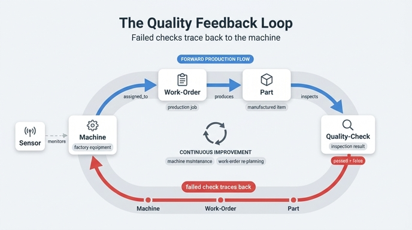

# Quality-Check 피드백 루프의 경로

## 한 줄 정답

```
Quality-Check (passed = false) → Part → Work-Order → Machine
```

검사가 **실패**하면 생산 체인을 **역방향**으로 되짚어 올라가 "이 불량품을 누가 만들었나"를 기계 단위까지 추적한다. 스마트 팩토리는 이 루프로 문제 있는 기계를 식별하고 품질을 개선한다.

---

## 1. 왜 "루프"인가

정방향 생산 흐름은 이렇게 흐른다.

```
Machine  →  Work-Order  →  Part  →  Quality-Check
(설비)      (생산 지시)     (제품)     (검사)
```

Quality-Check는 이 사슬의 **끝**이다. 그런데 `passed = false`가 찍히는 순간, 그 끝점이 다시 시작점(Machine)으로 되돌아가는 화살표를 만든다. 즉 선형 체인이 **닫힌 순환(closed loop)** 이 된다.

- 정방향: 계획 → 생산 → 검사 (실행)
- 역방향: 검사 결과 → 원인 설비 (학습·개선)

이 되돌아가는 화살표가 없으면 불량은 그냥 "폐기된 부품 1개"로 끝난다. 루프가 있어야 **근본 원인 분석(root cause analysis)** 과 **지속적 개선(continuous improvement)** 이 성립한다.

---

## 2. 각 홉(hop)과 실제로 뒤집히는 관계

온톨로지에 선언된 관계는 다음 5개다.

| 관계 | 방향 | 카디널리티 |
|---|---|---|
| `monitors` | Sensor → Machine | many-to-one |
| `assigned_to` | Work-Order → Machine | many-to-one |
| `produces` | Work-Order → Part | one-to-many |
| `has_part` | Machine → Part | one-to-many |
| `inspects` | Quality-Check → Part | many-to-one |

피드백 루프의 각 홉을 이 관계에 대응시키면 이렇게 된다.

### Hop 1. `Quality-Check → Part` — `inspects`

- 사용 관계: **`inspects`** (Quality-Check → Part)
- 화살표 자체는 **정방향**으로 따라간다. 그런데 *생산 흐름* 기준으로는 뒤로 가는 첫걸음이다.
- 시작점 필터가 핵심: `qc.passed = false`. 이 조건이 루프의 방아쇠(trigger)다.
- 카디널리티가 many-to-one이므로 "실패한 검사 N건 → 문제 부품 집합"으로 자연스럽게 좁혀진다.
- 참고: 한 Part는 여러 번 검사될 수 있다(초기 검사 + 재작업 후 재검사). 그래서 `Part ← Quality-Check (passed=false, count > 1)`처럼 **재검사가 필요한 부품**을 찾는 질의도 가능하다.

### Hop 2. `Part → Work-Order` — `produces`를 **역방향**으로

- 선언된 방향은 `Work-Order → Part` (produces, one-to-many).
- 루프에서는 이걸 **거꾸로** 탄다: "이 부품은 어떤 작업 지시에서 나왔나?"
- one-to-many를 역방향으로 타면 many-to-one이 되므로, 부품 여러 개가 **하나의 Work-Order로 수렴**한다. 여기서 처음으로 "개별 불량"이 "배치(batch) 단위 문제"로 집계된다.
- GQL에서는 `<-[:produces]-` 형태로 화살표를 뒤집어 쓴다.

### Hop 3. `Work-Order → Machine` — `assigned_to`

- 사용 관계: **`assigned_to`** (Work-Order → Machine, many-to-one)
- 화살표는 정방향이지만, 역시 생산 흐름 기준으로는 되돌아가는 마지막 걸음이다.
- 결론 지점: **어떤 설비가 이 불량을 만들어냈는가.**

### (지름길) `Part → Machine` — `has_part`를 **역방향**으로

- `has_part` (Machine → Part)는 Work-Order를 건너뛰는 **출력 관점(output perspective)** 의 지름길이다.
- Work-Order 층의 맥락(priority, dueDate, 담당 배치)이 필요 없고 "어떤 기계인가"만 알면 될 때 2홉으로 끝낼 수 있다.

```
Machine → Part ← Quality-Check (passed = false)
```

- 반대로 "우선순위 rush 작업에서 불량률이 높은가?" 같은 질문은 Work-Order를 반드시 거쳐야 한다:
  `Work-Order (priority) → Part ← Quality-Check`

> **요약**: 3홉 경로는 `inspects` → `produces`(역) → `assigned_to`. 2홉 지름길은 `inspects` → `has_part`(역).

---

## 3. `defectCode`가 분석을 묶는 방식

Quality-Check의 속성 중 두 개가 루프의 성격을 결정한다.

| 속성 | 역할 |
|---|---|
| `passed` (boolean) | 루프를 **발동시키는 스위치**. `false`일 때만 역추적이 시작된다. 명확한 의사결정 지점(출하 vs 재작업). |
| `defectCode` (string) | 루프의 **그룹핑 축**. 불량을 유형별로 분류해 근본 원인 분석을 가능하게 한다. |

`passed = false`만 있으면 "불량이 몇 개인가"밖에 못 센다. `defectCode`가 붙어야 다음이 가능해진다.

- **유형별 집계**: `defectCode = "DIM-OUT"`(치수 이탈)이 CNC-01에 몰려 있다 → 그 기계의 정밀도/공구 마모 문제.
- **원인 분리**: 같은 기계에서 나온 불량이라도 `SURF-SCR`(표면 흠집)과 `DIM-OUT`(치수 이탈)은 원인도 조치도 다르다. 코드가 없으면 두 문제가 뒤섞여 "CNC-01 불량률 12%"라는 뭉뚱그린 숫자만 남는다.
- **상관 분석의 키**: `(machine, defectCode)` 쌍으로 묶으면 어떤 설비-불량유형 조합이 지배적인지 파레토 분석이 된다.
- **Part의 `tolerance`와의 연결**: 치수 계열 defectCode는 부품의 `tolerance`가 타이트할수록 많이 나온다 → "정밀도 높은 기계로 재배정" 이라는 조치로 이어진다.

즉 **`passed`는 루프를 열고, `defectCode`는 루프의 결과를 의미 있는 묶음으로 만든다.**

---

## 4. Sensor 층이 합류하는 지점

Sensor는 생산 체인에 직접 붙어 있지 않다. `monitors` (Sensor → Machine)로 **Machine에만** 연결된다. 그래서 Sensor는 역추적의 **종착점(Machine)에서 합류**한다.

```
Sensor → Machine → Part ← Quality-Check (passed = false)
         ▲ 여기서 텔레메트리와 품질 데이터가 만난다
```

- Quality-Check 쪽에서 올라온 경로와 Sensor 쪽에서 내려온 경로가 **Machine(또는 Part)에서 조인**된다. 화살표 방향이 서로 마주보는 형태(`→ ... ←`)라는 점에 주목.
- Sensor의 판정 기준은 `lastReading > threshold` — 이상 징후(anomaly)를 나타내는 임계값 패턴이다.
- 결과적으로 "**센서가 이상치를 보이던 기계가 실제로 불량품을 만들었는가**"라는 상관관계를 검증할 수 있다. 이게 예지 보전(predictive maintenance)을 **사후 품질 데이터로 검증**하는 고리다.
- 원문 시나리오의 대표 질문이 정확히 이것이다: *"Which machines with abnormal sensor readings produced parts that failed quality checks last week?"*
  → `Machine → Sensor (reading > threshold)` **+** `Machine → Work-Order → Part → Quality-Check (passed=false)`

---

## 5. GQL 예제

### (a) 실패 검사에서 기계까지 3홉 역추적

```gql
MATCH (qc:QualityCheck)-[:inspects]->(p:Part)
      <-[:produces]-(wo:WorkOrder)-[:assigned_to]->(m:Machine)
WHERE qc.passed = false
RETURN m.machineId,
       m.name,
       wo.workOrderId,
       wo.priority,
       qc.defectCode,
       count(*) AS defectCount
ORDER BY defectCount DESC
```

`<-[:produces]-` 가 바로 **produces를 역방향으로 타는 홉**이다.

### (b) defectCode로 묶어 문제 기계 파레토 분석

```gql
MATCH (qc:QualityCheck)-[:inspects]->(p:Part)<-[:has_part]-(m:Machine)
WHERE qc.passed = false
RETURN m.name, qc.defectCode, count(qc) AS failures
ORDER BY failures DESC
```

### (c) Sensor 층 합류 — 센서 이상과 품질 불량의 상관 (원문 예제)

```gql
MATCH (s:Sensor)-[:monitors]->(m:Machine)-[:has_part]->(p:Part)<-[:inspects]-(qc:QualityCheck)
WHERE s.lastReading > s.threshold AND qc.passed = false
RETURN m.name, s.type, s.lastReading, p.name, qc.defectCode
```

### (d) 재검사가 필요한 부품

```gql
MATCH (p:Part)<-[:inspects]-(qc:QualityCheck)
WHERE qc.passed = false
WITH p, count(qc) AS failCount
WHERE failCount > 1
RETURN p.partId, p.name, failCount
```

---

## 6. 루프가 되먹이는 액션 (loop closes here)

역추적은 리포트를 뽑고 끝나는 게 아니라 **운영 조치로 되돌아간다.** 여기서 비로소 루프가 닫힌다.

| 되먹임 대상 | 트리거 | 실제 조치 |
|---|---|---|
| **Machine 정비** | 특정 기계에 불량이 집중 + 센서 `lastReading > threshold` | `status`를 `maintenance`로 전환, 정비 일정 배정, 공구 교체/캘리브레이션 |
| **Sensor 임계값 조정** | 불량은 났는데 센서는 정상이었다 | `threshold`가 너무 느슨함 → 임계값 재설정, 센서 추가 설치 |
| **Work-Order 재계획** | 특정 Work-Order 배치에 불량 집중 | 해당 작업 지시 중단/재발행, 다른 기계로 재배정, `dueDate`·`priority` 조정 |
| **Part 재작업 / 폐기** | 개별 부품 `passed = false` | 재작업 후 재검사(같은 Part에 Quality-Check 추가 생성) 또는 스크랩 |
| **공정 설계 개선** | `defectCode` 유형이 반복 | tolerance가 타이트한 부품은 고정밀 기계에만 배정하는 규칙 수립 |

정비가 끝나 `Machine.status = running`이 되면, 새 Work-Order가 나가고 새 Part가 만들어지고 다시 Quality-Check가 돈다 — **사이클이 다음 바퀴를 돈다.**

---

## 7. 기억 포인트

- 경로 암기: **검사 → 부품 → 작업지시 → 기계** (`Quality-Check → Part → Work-Order → Machine`)
- 방아쇠는 `passed = false`, 묶는 축은 `defectCode`.
- 실제로 **역방향으로 뒤집히는 관계는 `produces`** (그리고 지름길에서는 `has_part`). `inspects`와 `assigned_to`는 선언 방향 그대로 따라가는데도 생산 흐름 기준으로는 "거슬러 올라가는" 홉이다.
- Sensor는 `monitors`로 **Machine에서 합류**한다. 부품이나 검사에 직접 붙지 않는다.
- 오답 유형: "Quality-Check가 Machine에 직접 연결된다"(❌ — 반드시 Part를 경유), "Sensor로 되돌아간다"(❌ — Sensor는 별도 층에서 조인).
- 5 entities / 5 relationships. Quality-Check가 마지막 조각이자, 선형 체인을 순환 구조로 바꾸는 조각이다.

## 인포그래픽


