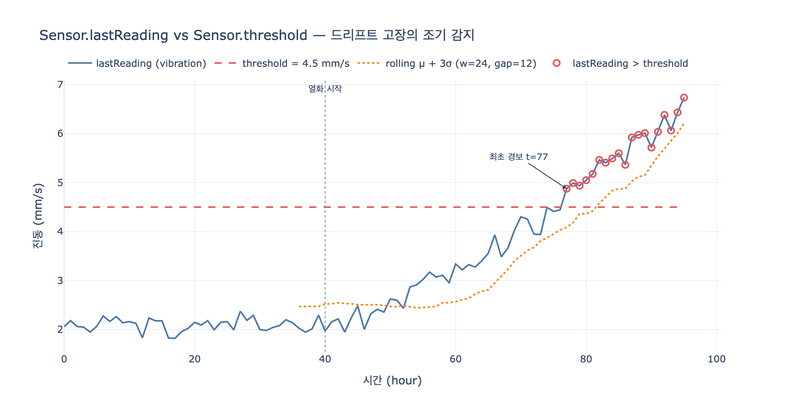

# Sensor에 `lastReading`과 `threshold`를 함께 두는 이유

## 핵심 답

**현재 판독값(`lastReading`)을 알려진 안전 경계(`threshold`)와 비교해 이상을 자동 감지하기 위해서다.**
이 패턴은 설비가 고장 나기 *전에* 운영자에게 경고하는 **예지 보전(predictive maintenance)** 의 가장 기본적인 형태다.

```
lastReading > threshold  →  알람 발생
```

---

## Sensor 엔티티 정의

| Property | Type | Identifier? | 의미 |
|---|---|---|---|
| `sensorId` | string | ✓ | 센서 고유 식별자 |
| `type` | string | | temperature / vibration / pressure 등 |
| `unit` | string | | °C, mm/s, bar 등 측정 단위 |
| `lastReading` | float | | **가장 최근 측정값** |
| `threshold` | float | | **경보 경계선** |

관계는 하나다.

- **monitors** — `Sensor` → `Machine` (many-to-one)
  하나의 기계를 여러 센서가 감시한다(온도 하나, 진동 하나, …).

---

## 왜 두 값이 *같은 엔티티에* 있어야 하는가

핵심은 "값 하나만으로는 아무 의미가 없다"는 점이다.

### 1. 측정값 단독으로는 판단 불가

`lastReading = 87.3`이라는 숫자는 그 자체로 정상인지 이상인지 말해주지 않는다.
온도 센서라면 87.3 °C는 위험할 수 있고, 압력 센서라면 정상일 수 있다.
**판단에는 반드시 기준이 필요하다.** 그 기준이 `threshold`다.

### 2. 기준은 센서마다 다르다

`threshold`를 전역 상수나 별도 설정 파일에 두면 안 되는 이유다.

| Sensor | type | unit | threshold |
|---|---|---|---|
| SEN-001 | temperature | °C | 85.0 |
| SEN-002 | vibration | mm/s | 4.5 |
| SEN-003 | pressure | bar | 12.0 |

같은 공장 안에서도 센서 종류·설치 위치·기계 사양에 따라 안전 경계가 전부 다르다.
따라서 임계값은 **센서 인스턴스의 속성**이어야 한다.

### 3. 이상 감지가 "그래프 속성 비교"로 환원된다

두 값이 같은 노드에 있으면 이상 감지 로직이 코드가 아니라 **쿼리 한 줄**이 된다.

```gql
MATCH (s:Sensor)-[:monitors]->(m:Machine)
WHERE s.lastReading > s.threshold
RETURN m.name, s.type, s.lastReading, s.threshold
```

만약 `threshold`가 다른 시스템(설정 DB, 하드코딩된 규칙 엔진)에 있었다면,
이 질문에 답하기 위해 조인·API 호출·룰 엔진 평가가 필요했을 것이다.
온톨로지의 목적은 **"질문이 그래프 경로로 직접 번역되게 만드는 것"** 이고,
`lastReading` + `threshold` 동거는 그 목적을 센서 레벨에서 달성한다.

### 4. 다른 도메인과 결합할 때 위력이 나온다

manufacturing-path의 최종 쿼리를 보자.

```gql
MATCH (s:Sensor)-[:monitors]->(m:Machine)-[:has_part]->(p:Part)<-[:inspects]-(qc:QualityCheck)
WHERE s.lastReading > s.threshold AND qc.passed = false
RETURN m.name, s.type, s.lastReading, p.name, qc.defectCode
```

> "지난주 센서 이상이 있었던 기계가 만든 부품 중 품질 검사에 실패한 것은?"

`s.lastReading > s.threshold`가 **인라인 술어(predicate)** 로 쓰일 수 있기 때문에,
IoT 텔레메트리 조건과 품질 검사 조건을 한 번의 그래프 순회에서 동시에 걸 수 있다.
이것이 온톨로지 설계에서 "판단에 필요한 값은 판단이 일어나는 곳에 둔다"는 원칙이다.

---

## 오답 정리 (퀴즈 선택지 기준)

| 선택지 | 왜 틀렸나 |
|---|---|
| 하나가 틀렸을 때를 대비한 백업 값 | 두 값은 성격이 완전히 다르다. 하나는 관측치, 하나는 정책값이다. 중복 저장이 아니다. |
| 모든 IoT 표준이 요구하는 필수값 | 표준 강제 사항이 아니라 **설계 선택**이다. 목적이 있어서 넣은 것이다. |
| 센서 정확도(accuracy) 계산용 | 정확도는 `lastReading`을 기준 참값과 비교해 얻는다. `threshold`는 참값이 아니라 **운영 안전 한계**다. |

---

## 예지 보전(Predictive Maintenance) 관점

정비 전략은 보통 세 단계로 구분한다.

| 전략 | 동작 시점 | 온톨로지에서의 표현 |
|---|---|---|
| **사후 보전** (Reactive) | 고장이 난 뒤 | `Machine.status = 'offline'` |
| **예방 보전** (Preventive) | 정해진 주기마다 | `Machine.installDate` + 정비 스케줄 |
| **예지 보전** (Predictive) | 고장 징후가 보일 때 | `Sensor.lastReading` vs `Sensor.threshold` |

`threshold` 패턴이 특별한 이유는, 고장이 대개 **점진적 드리프트**로 나타나기 때문이다.
베어링이 마모되면 진동값이 서서히 오른다. 값이 임계선을 넘는 순간을 잡아내면,
기계가 완전히 멈추기 전에 정비 창(maintenance window)을 확보할 수 있다.

### 고정 임계값의 한계

단순 고정 임계값은 두 가지 약점이 있다.

1. **노이즈에 의한 오탐(false positive)** — 스파이크 한 번에 알람이 울린다.
   → 연속 N회 초과 시에만 알람 발생시키는 디바운스(debounce)로 완화.
2. **개체차를 반영 못 함** — 같은 모델이라도 기계마다 정상 범위가 다르다.
   → 이동 통계 기반 임계값 $\mu + k\sigma$ 로 개별 기계에 적응.

다만 온톨로지 설계 레벨에서 중요한 건 "어떤 임계값 알고리즘을 쓰느냐"가 아니라
**"판단 기준이 센서 엔티티의 1급 속성으로 존재하느냐"** 이다.
동적 임계값을 쓰더라도 계산 결과를 다시 `threshold`에 써 넣으면
쿼리 형태(`lastReading > threshold`)는 그대로 유지된다.

---

## 한 줄 요약

`lastReading`은 **지금 값**, `threshold`는 **넘으면 안 되는 값**.
둘을 한 노드에 두는 순간, 이상 감지는 별도 시스템이 아니라 **속성 비교 한 줄**이 되고,
그것이 예지 보전의 출발점이다.

## 시각화


